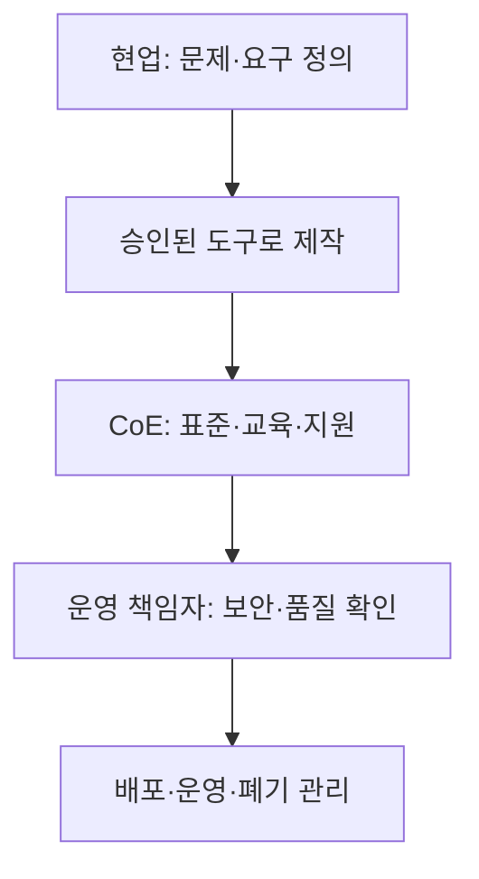

## 지식 로드맵 내 현재 위치

지식 위치: IT 전략·관리 → 현업 디지털 역량 → **전문성의 민주화**

## 30초 인출

- 본질: **전문성의 민주화** 는 전문 도구에 대한 접근을 넓혀 비전문가도 일부 전문 업무를 수행하게 하는 변화.
- 메커니즘: 현업의 플랫폼 기반 해결책 개발과 전문 조직의 데이터·보안·운영 기준 제공.

핵심 용어

- **전문성의 민주화** : 전문 도구·지식에 대한 접근을 넓혀 비전문가도 일부 전문 업무를 수행하게 하는 변화.
- **시민 개발자(Citizen Developer)** : 전문 개발자가 아니면서 승인된 도구로 업무용 앱·자동화를 만드는 현업 담당자.
- **LCNC(Low-Code/No-Code)** : 적은 코드 또는 코드 없이 앱·자동화를 만드는 개발 방식.
- **CoE(Center of Excellence)** : 현업의 도구 활용을 지원하는 표준·교육·보안·운영 지침을 마련하는 조직 역량.
- **Shadow IT** : 조직의 승인·관리 체계 밖에서 현업이 도입·운용하는 IT.
- **BI(Business Intelligence)** : 데이터 분석·시각화를 통해 의사결정을 돕는 방법과 도구.
- **AutoML(Automated Machine Learning)** : 일부 머신러닝 모델 개발 작업을 자동화하는 도구·방법.

---

## 1교시 예상문제 (10점)

> 전문성의 민주화에 관하여 설명하시오. (예상·10점)

---

## 1교시 10점 답안

### Ⅰ. 전문성의 민주화 개요

| 구분 | 핵심 |
|---|---|
| 정의 | **전문성의 민주화** 는 전문 도구·지식에 대한 접근을 넓혀 비전문가도 일부 전문 업무를 수행하게 하는 변화 |
| 목적 | 현업의 문제 해결 속도 향상과 전문 인력의 반복 작업 부담 경감 |

### Ⅱ. 적용 영역과 역할

| 현업의 활용 | 전문 조직의 지원 |
|---|---|
| **LCNC** 로 업무 앱·자동화 | 표준·배포·수명주기 관리 |
| **BI** 로 데이터 탐색·시각화 | 데이터 품질·접근 권한 관리 |
| **AutoML** 로 분석 실험 | 모델 검증·운영 기준 마련 |

### Ⅲ. 위험 수준별 관리

| 활용 범위 | 관리 기준 |
|---|---|
| 개인·부서 내부, 낮은 영향 | 승인된 도구와 데이터 범위에서 현업 운영 |
| 고객·전사·민감 데이터에 영향 | 보안·품질 검토 후 전문 조직과 공동 운영 |

**제언:** 제작 도구의 편의성과 운영 책임을 구분하고 영향 범위에 맞춘 검토 수준 설정.

---

## 2~4교시 예상문제 (25점)

> 전문성의 민주화의 개념·적용 영역·운영 방안을 설명하시오. (예상·25점)

---

## 2~4교시 25점 답안

## Ⅰ. 전문성의 민주화 개요

| 구분 | 핵심 |
|---|---|
| 정의 | **전문성의 민주화** 는 전문 도구·지식에 대한 접근을 넓혀 비전문가도 일부 전문 업무를 수행하게 하는 변화 |
| 목적 | 현업의 문제 해결 속도 향상과 전문 인력의 반복 작업 부담 경감 |

## Ⅱ. 적용 영역과 역할

| 현업의 활용 | 전문 조직의 지원 |
|---|---|
| **LCNC** 로 업무 앱·자동화 | 표준·배포·수명주기 관리 |
| **BI** 로 데이터 탐색·시각화 | 데이터 품질·접근 권한 관리 |
| **AutoML** 로 분석 실험 | 모델 검증·운영 기준 마련 |

전문성의 민주화와 전문 검토의 관계: 제작 장벽은 낮아져도 정확성·보안·운영 책임은 업무 영향도에 비례.

## Ⅲ. 시민 개발의 운영 구조

**CoE** 의 역할은 현업 제작 지원과 공통 기준 제공. 보안·개인정보·운영 책임은 해당 전문 조직과 서비스 책임자의 공동 판단 대상.

## Ⅳ. 주요 위험과 관리 기준

| 위험 | 드러나는 상황 | 통제 |
|---|---|---|
| **Shadow IT** | 승인되지 않은 앱·외부 연동 | 앱 목록·접근 권한·허용 커넥터 관리 |
| 데이터 오류 | 검증되지 않은 지표·모델 공유 | 데이터 출처·검증 책임 명시 |
| 담당자 의존 | 제작자 이탈 후 유지 불가 | 문서화·소유자 지정·인수인계 |
| 운영 확산 | 개인용 앱이 전사 서비스로 확대 | 중요도에 맞춘 정식 심사·운영 전환 |

## Ⅴ. 기술사적 제언 — 영향도에 따른 운영 이관

| 영향 범위 | 운영 주체 | 승격 기준 |
|---|---|---|
| 개인·소규모 실험 | 현업 | 승인된 데이터·도구 범위 준수 |
| 부서 공동 업무 | 현업 + CoE | 소유자·검증·변경 이력 확보 |
| 대외·전사·민감 업무 | 전문 IT·보안 조직 | 보안·성능·복구·지원 기준 충족 |

이용자 증가 또는 민감 정보 포함 시 우선 재평가할 항목은 운영 책임과 통제 수준.

## 출제 이력과 검증 출처

- 공식 문제지로 확인한 직접 기출 없음. 위 문항은 예상문제다.
- [Microsoft Learn, Power Platform Center of Excellence](https://learn.microsoft.com/en-us/power-platform/guidance/adoption/coe)
- [Microsoft Learn, Power Platform adoption guidance](https://learn.microsoft.com/en-us/power-platform/guidance/adoption/methodology)

## 연결 토픽

- 연계: [CoE](./082_coe.md), [기술수용모델](./092_technology_acceptance_model.md)
