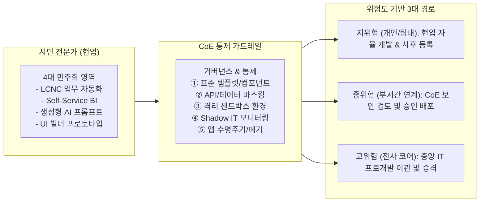
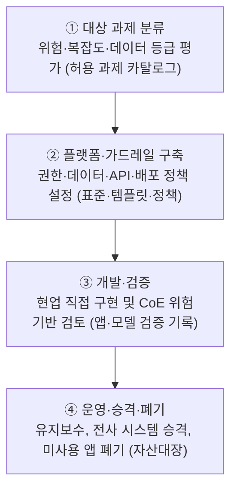
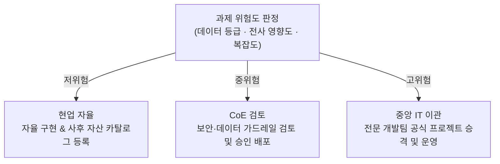

## 지식 로드맵 내 현재 위치

## 30초 인출

- 본질: LCNC, Self-Service BI, 생성형 AI 등 추상화 도구를 통해 비전문가(현업)의 전문 기술 활용 장벽을 완화하는 접근
- 메커니즘: 플랫폼 제공 → 현업 문제 직접 해결(시민 개발자) → CoE 통제 가드레일(표준·보안) → 위험도 기반 승격/폐기
- 판정 기준: 처리 데이터 등급(기밀/공개), 영향 범위(개인/부서/전사) 및 CoE 거버넌스 가드레일(Shadow IT 통제) 충족 여부

약어·전문용어

- **LCNC(Low-Code/No-Code)**: 최소 코드·무코드 방식의 애플리케이션 개발 도구
- **BI(Business Intelligence)**: 데이터를 분석해 의사결정을 지원하는 체계
- **AutoML(Automated Machine Learning)**: 기계학습 모델 개발 단계 일부를 자동화하는 기술
- **CoE(Center of Excellence)**: 표준·가드레일·재사용 자산·교육을 제공하는 전문 조직
- **Shadow IT**: 중앙 IT의 승인·통제 밖에서 사용하는 시스템·서비스

## 예상문제

> **(미출제 예상·25점)** 전문성의 민주화 개념과 적용 영역을 설명하고, 시민 개발 확산의 문제점과 거버넌스 방안을 제시하시오.

## Ⅰ. 전문성의 민주화 개요

> 전문 업무의 추상화·자동화로 현업의 문제 해결 범위를 넓히되 전문 검증 책임까지 없애는 것은 아님.

- **정의**: 전문 지식·기술을 추상화 도구와 플랫폼으로 제공해 비전문가도 업무에 활용하도록 하는 접근
- **목적**: 현업 자율성·업무 혁신 속도 향상, 전문인력 병목 완화

## Ⅱ. 적용 영역 및 CoE 거버넌스 아키텍처

> 현업 시민 개발자의 자율성을 극대화하면서 중앙 IT의 보안 가드레일을 결합하는 3계층 아키텍처를 운영함.

### 1. 시민 개발자 ↔ CoE 가드레일 상호작용 체계

### 2. 4대 적용 영역 및 역할분담

| 영역 | 지원 도구 | 현업 역할 | 전문조직 역할 |
|---|---|---|---|
| 데이터·분석 | Self-Service BI·AutoML | 분석·모델 활용 | 데이터 품질·모델 검증 |
| 개발 | LCNC·워크플로 | 업무 앱·자동화 | 아키텍처·보안·배포 |
| 설계 | UI 빌더·디자인 시스템 | 화면·서비스 프로토타입 | 접근성·일관성 검증 |
| 지식 | 검색·생성형 AI | 지식 탐색·초안 작성 | 출처·권한·정확성 통제 |

## Ⅲ. 추진 절차

> 도구 보급보다 과제 등급·가드레일·운영 책임을 먼저 정해야 확산 비용을 통제할 수 있음.

## Ⅳ. 문제점·대응책

> 승인서만 확인하면 무단 재하도급·수행주체 변경·대금 지연을 발견하기 어려움.

| 위험 | 대책 | 효과 |
|---|---|---|
| Shadow IT | 승인 플랫폼·자산대장 | 가시성 확보 |
| 데이터 유출 | 최소권한·마스킹·감사로그 | 오남용 추적 |
| 앱 난립·기술부채 | 표준 템플릿·수명주기 관리 | 유지비용 통제 |
| 전문 검증 부재 | 위험기반 CoE 검토 | 품질·규제 준수 |

## Ⅴ. 위험기반 거버넌스 확립을 위한 기술사적 제언

> 전문성의 민주화는 전문가를 없애는 전략이 아니라, 반복 구현은 현업에 위임하고 고위험 판단은 전문가에게 집중하는 운영모델임.

### 학습자 통찰 메모 — 답안 밖

- [핵심 통찰]: LCNC나 생성형 AI로 만든 앱이 확산된 후 작성자가 퇴사하면 유지보수 불능의 거대한 '좀비 앱(Shadow Debt)'으로 변질됨. 민주화의 핵심은 개발 자유를 주는 대신, 자산 등록 및 수명주기(Lifecycle) 만료 시 자동 회수하는 거버넌스 정책의 자동화임.
- 나라면: 과제 위험도에 따라 현업 자율·CoE 검토·중앙 IT 수행으로 경로를 나누고, 재사용 가치가 검증된 자산만 전사 플랫폼으로 승격하겠음.

### 실전 답안용 기술사적 제언

- **판정 기준**: 처리 데이터 등급(개인정보/영업비밀), 시스템 영향 범위(팀/부서/전사) 및 아키텍처 복잡도 판정
- **대응 방안**: 위험도 3단계 라우팅(저위험: 자율, 중위험: CoE 승인, 고위험: IT 이관) 및 CoE 샌드박스 가드레일 가동
- **검증 체계**: 전사 앱 자산대장(Catalog) 등록 감사, 정기 미사용 앱 자동 아카이빙/폐기 프로세스 운영
- **기대 효과**: Shadow IT 보안 사고 원천 예방, IT 개발 백로그 40% 이상 감축 및 현업 중심 디지털 혁신 체화

## 1교시 10점 답안 발췌

### 1. 정의·목적

- **정의**: 전문 지식·기술을 추상화 도구와 플랫폼으로 제공해 비전문가도 업무에 활용하도록 하는 접근
- **목적**: 현업 자율성·혁신 속도 향상, 전문인력 병목 완화

### 2. 전문성 민주화 아키텍처 및 위험도 거버넌스

### 3. 핵심 통제

| 통제 | 핵심 |
|---|---|
| **데이터·개발** | Self-Service BI·AutoML·LCNC |
| **설계·지식** | UI 빌더·검색·생성형 AI |
| **거버넌스** | CoE 가드레일·수명주기 관리 및 Shadow IT 통제 |

## 출제 이력과 검증 출처

- 공식 문제지 원문 확인 전까지 직접 기출로 단정하지 않음
- [Gartner, Generative AI Can Democratize Access to Knowledge and Skills](https://www.gartner.com/en/articles/generative-ai-can-democratize-access-to-knowledge-and-skills)
- [Microsoft, Power Platform adoption best practices](https://learn.microsoft.com/power-platform/guidance/adoption/)

## 학습 체크

- [ ] Ⅰ: 전문성의 민주화 정의·목적을 설명할 수 있는가?
- [ ] Ⅱ: 데이터·개발·설계·지식 영역의 역할분담을 비교할 수 있는가?
- [ ] Ⅲ: 대상 분류부터 운영·폐기까지 활동·산출을 연결할 수 있는가?
- [ ] Ⅳ: Shadow IT·데이터·기술부채 위험의 대책을 제시할 수 있는가?
- [ ] Ⅴ: 위험도별 현업·CoE·중앙 IT 처리 경로를 그릴 수 있는가?

## 연결 토픽

- 이전 토픽: [공공 SW 사업 하도급 제한](./097_software_industry_subcontracting_structure.md)
- 연관 토픽: [CoE](./082_coe.md), [AI 거버넌스 플랫폼](./050_ai_governance_platform.md)
- 다음 토픽: [지능정보기술 감리 실무 가이드](./102_intelligent_information_technology_audit_guide.md)
