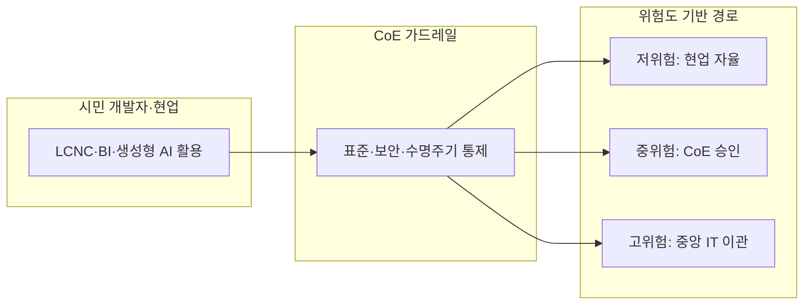
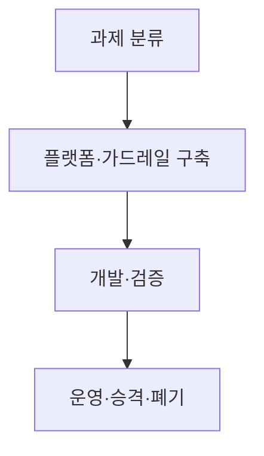
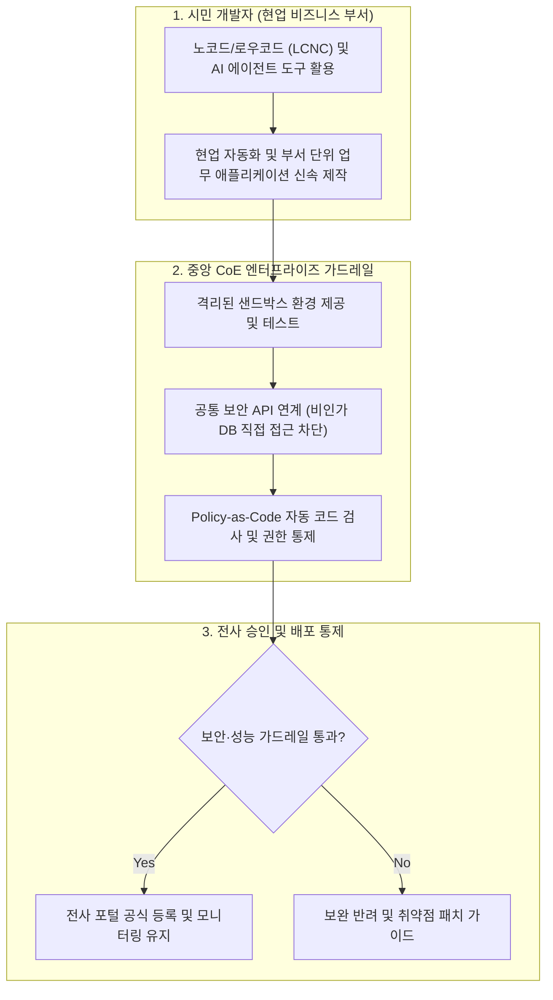

## 지식 로드맵 내 현재 위치
현재 위치: IT 전략·관리 → 전문성의 민주화

## 30초 인출

- 본질: 전문성의 민주화는 비전문가도 도구의 도움을 받아 전문 업무 일부를 직접 수행할 수 있게 되는 변화다.
- 메커니즘: 플랫폼 제공 → 현업 문제 직접 해결( **시민 개발자** ) → **CoE** 통제 가드레일(표준·보안) → 위험도 기반 승격/폐기한다.
- 판정 기준: 처리 데이터 등급(기밀/공개), 영향 범위(개인/부서/전사) 및 **CoE** 거버넌스 가드레일( **Shadow IT** 통제) 충족 여부를 확인한다.

핵심 용어

- **LCNC(Low-Code/No-Code)** : 시각적 도구와 사전 정의된 블록을 조합해 애플리케이션을 신속 제작하는 개발 플랫폼
- **BI(Business Intelligence)** : 기업 데이터를 정제·시각화하여 현업의 데이터 기반 의사결정을 지원하는 비즈니스 지능 체계
- **AutoML(Automated Machine Learning)** : 특징 추출·모델 탐색·하이퍼파라미터 튜닝 등 머신러닝 개발 과정을 자동화하는 기술
- **CoE(Center of Excellence)** : 시민 개발자를 위한 표준·가드레일·재사용 자산·교육을 총괄 지원하는 전사 역량 센터
- **Shadow IT** : 중앙 IT 부서의 승인과 통제 범위를 벗어나 현업이 독자적으로 도입·운용하는 비인가 정보시스템

---

## 1교시 예상문제 (10점)

> 전문성의 민주화 적용 구조와 시민 개발 위험 통제를 설명하시오. (예상·10점)

---

## 1교시 10점 답안

### 1. 정의·목적

- 정의: 노코드/로우코드(LCNC)와 생성형 AI 기술을 활용하여 고도의 IT 전문 지식 없이도 현업 실무자가 직접 소프트웨어를 개발하고 자동화할 수 있게 하는 패러다임 전환
- 목적: 현업 디지털 혁신 속도 극대화 · IT 개발 인력 부족 병목 해소 · CoE 가드레일을 통한 섀도우 IT 통제 및 보안 안전성 확보

- **정의** : 전문 지식·기술을 추상화 도구와 플랫폼으로 제공해 비전문가도 업무에 활용하도록 하는 접근.
- **목적** : 현업 자율성·혁신 속도 향상, 전문인력 병목 완화.

### 2. 전문성 민주화 아키텍처 및 위험도 거버넌스

### 3. 핵심 통제

| 통제 | 핵심 |
|---|---|
| **데이터·개발** | Self-Service BI·AutoML· **LCNC** |
| **설계·지식** | UI 빌더·검색·생성형 AI |
| **거버넌스** | **CoE** 가드레일·수명주기 관리 및 Shadow IT 통제 |

---

## 2~4교시 예상문제 (25점)

> **(미출제 예상·25점)** 전문성의 민주화 개념과 적용 영역을 설명하고, 시민 개발 확산의 문제점과 거버넌스 방안을 제시하시오.

---

## 2~4교시 25점 답안

## Ⅰ. 전문성의 민주화 개요

- 정의: **전문 지식·기술** 을 **추상화 도구** 와 **플랫폼** 으로 제공해 비전문가도 업무에 활용하도록 하는 접근
- 목적: 현업 자율성·업무 혁신 속도 향상, 전문인력 병목 완화

## Ⅱ. 적용 영역 및 CoE 거버넌스 아키텍처

> 현업 **시민 개발자** 의 자율성을 극대화하면서 중앙 IT의 보안 가드레일을 결합하는 3계층 아키텍처를 운영함.

### 1. 시민 개발자 ↔ CoE 가드레일 상호작용 체계

### 2. 4대 적용 영역 및 역할분담

| 영역 | 지원 도구 | 현업 역할 | 전문조직 역할 |
|---|---|---|---|
| 데이터·분석 | Self-Service BI·AutoML | 분석·모델 활용 | 데이터 품질·모델 검증 |
| 개발 | **LCNC** ·워크플로 | 업무 앱·자동화 | 아키텍처·보안·배포 |
| 설계 | UI 빌더·디자인 시스템 | 화면·서비스 프로토타입 | 접근성·일관성 검증 |
| 지식 | 검색·생성형 AI | 지식 탐색·초안 작성 | 출처·권한·정확성 통제 |

## Ⅲ. 추진 절차

> 도구 보급보다 과제 등급·가드레일·운영 책임을 먼저 정해야 확산 비용을 통제할 수 있음.

- 활동: 위험·복잡도·데이터 등급 평가 → 권한·데이터·API·배포 정책 설정 → 현업 구현· **CoE** 위험기반 검토 → 유지보수·전사 승격·미사용 앱 폐기
- 산출: 허용 과제 카탈로그 → 표준·템플릿·정책 → 검증 기록 → 자산대장

## Ⅳ. 문제점·대응책

> 승인 플랫폼 밖의 자유로운 개발은 Shadow IT·데이터 유출·기술부채로 이어지므로 가드레일과 자산 등록을 함께 운영해야 함.

| 위험 | 대책 | 효과 |
|---|---|---|
| Shadow IT | 승인 플랫폼·자산대장 | 가시성 확보 |
| 데이터 유출 | 최소권한·마스킹·감사로그 | 오남용 추적 |
| 앱 난립·기술부채 | 표준 템플릿·수명주기 관리 | 유지비용 통제 |
| 전문 검증 부재 | 위험기반 **CoE** 검토 | 품질·규제 준수 |

## Ⅴ. 위험기반 거버넌스 확립을 위한 기술사적 제언

> 전문성의 민주화는 전문가를 없애는 전략이 아니라, 반복 구현은 현업에 위임하고 고위험 판단은 전문가에게 집중하는 운영모델임.

### 실전 답안용 기술사적 제언

- 문제: 현업 부서의 노코드/로우코드(LCNC) 및 생성형 AI 도구 사용 확산으로 거버넌스 없는 섀도우 IT(Shadow IT)와 데이터 유출·보안 결함 위험이 폭증함.
- 해결 방안: 중앙 CoE 주도의 가드레일(보안 인증, API 표준, 샌드박스)을 확립하고, 시민 개발자(Citizen Developer)의 개발 권한을 단계화하며, 중앙 형상관리 및 배포 파이프라인(CI/CD)을 통한 자동 보안 검수를 의무화함.

## 출제 이력과 검증 출처

- 공식 문제지 원문 확인 전까지 직접 기출로 단정하지 않음
- [Gartner, Generative AI Can Democratize Access to Knowledge and Skills](https://www.gartner.com/en/articles/generative-ai-can-democratize-access-to-knowledge-and-skills)
- [Microsoft, Power Platform adoption best practices](https://learn.microsoft.com/power-platform/guidance/adoption/)

## 연결 토픽

- 이전 토픽: [공공 SW 사업 하도급 제한](./097_software_industry_subcontracting_structure.md)
- 연관 토픽: [CoE](./082_coe.md), [AI 거버넌스 플랫폼](./050_ai_governance_platform.md)
- 다음 토픽: [지능정보기술 감리 실무 가이드](./102_intelligent_information_technology_audit_guide.md)
