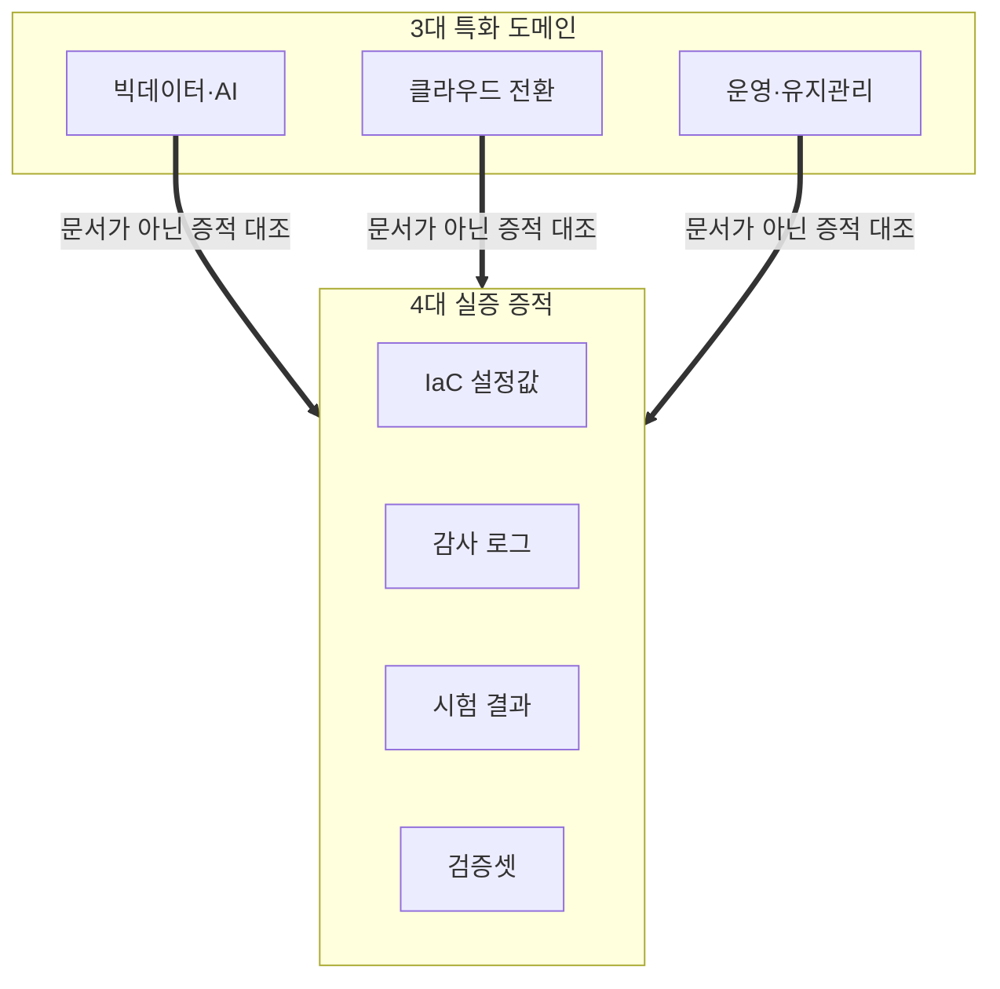
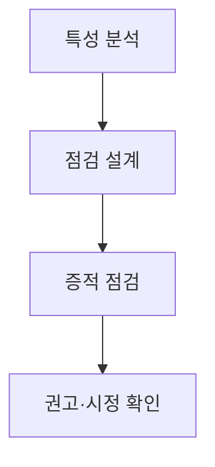
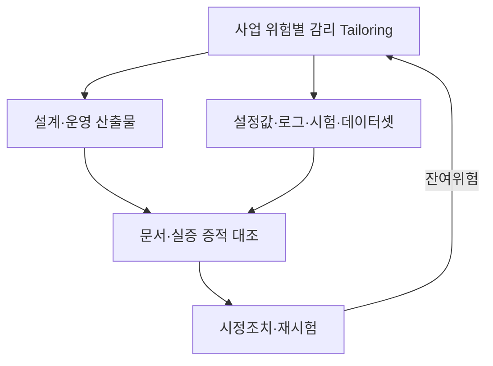

## 지식 로드맵 내 현재 위치
현재 위치: IT 전략·관리 → **지능정보기술 감리** 실무 가이드

## 30초 인출

- 본질: 기존 감리기준에 빅데이터·클라우드·운영·유지관리 등 신기술 사업의 **특화 점검항목**과 **실증 증적**을 보완한 실무 가이드이다.
- 메커니즘: 사업 특성 식별 → 특화 점검표 테일러링 → 4대 **실증 증적**(IaC·로그·시험·데이터셋) 점검 → 시정조치 폐루프 확인한다.
- 판정 기준: 사업 위험도 기반 테일러링 적정성 및 단순 종이문서가 아닌 시스템 설정(IaC/Log) 일치 여부를 확인한다.

핵심 용어

- **NIA(National Information Society Agency)**: 지능정보사회 정책과 사업을 지원하는 한국지능정보사회진흥원이다.
- **감리 점검항목**: 감리 대상이 기준에 맞게 계획·구축·운영되는지 확인하기 위해 적용하는 점검 기준이다.
- **개선권고**: 감리에서 확인한 문제의 원인과 필요한 보완조치를 제시하는 개선 요구이다.
- **시정조치**: 개선권고에 따라 사업자가 수행한 보완 활동과 결과이다.
- **IaC(Infrastructure as Code)**: 인프라 구성을 코드로 정의·관리하여 감리 증적이 되게 하는 방식이다.

## 예상문제

> **(미출제 예상·25점)** NIA **지능정보기술 감리** 실무 가이드의 목적·적용영역을 설명하고, 기존 정보시스템 감리와 연계한 수행방안과 문제점·대응책을 제시하시오.

## Ⅰ. 가이드 개요

- 정의: NIA가 **빅데이터**·**클라우드**·운영 사업의 **특화 감리 점검항목**을 제시한 실무 가이드
- 목적: 기술 특성을 반영한 감리 일관성·현장 적용성 확보

## Ⅱ. 3대 특화 영역 및 **실증 증적** 프레임워크

> 기존 감리의 절차적 형식주의를 탈피하여 신기술 환경의 3대 핵심 영역과 4대 **실증 증적**을 직접 교차 검증함.

### 1. **지능정보기술 감리** 3대 도메인 및 실증 점검 아키텍처

### 2. 3대 특화 도메인별 핵심 점검기준

| 영역 | 점검 대상 | 핵심 확인 |
|---|---|---|
| 빅데이터 | 수집·저장·처리·분석·활용 | 데이터 품질·보안·분석 적정성 |
| 클라우드 | 도입·전환·서비스·운영 | 아키텍처·이식성·보안·SLA |
| 운영·유지관리 | 서비스·변경·장애·성과 | 운영절차·형상·연속성·성과관리 |

## Ⅲ. 감리 적용 절차

> 기본점검표를 그대로 복제하지 않고 사업 특성에 맞는 점검항목과 증적을 선택함.

- 활동: 사업유형·신기술 스택·감리시점 식별 → 기본점검표+**특화 점검항목** 테일러링 → 4대 **실증 증적** 현장 실사 → 개선권고 제시·운영 증적 기반 시정 확인
- 산출: 범위·중점사항 → 감리계획서 → 실사 기록 → 감리보고서

## Ⅳ. 기존 감리와 연계

> 기존 감리기준의 공통 절차 위에 기술 특화 점검표를 결합하여 일관성을 확보함.

| 기준 | 기존 감리기준 | 실무 가이드 |
|---|---|---|
| 역할 | 공통 절차·점검체계 | 기술별 점검항목 보완 |
| 적용 | 사업유형·감리시점 | 빅데이터·클라우드·운영 특성 |
| 활용 | 기본점검표 구성 | 중점항목·증적 구체화 |

## Ⅴ. 문제점·대응책

| 위험 | 대책 | 효과 |
|---|---|---|
| 전 항목 기계 적용 | 사업 위험 기반 Tailoring | 핵심 위험 집중 |
| 문서 위주 확인 | 설정·로그·시험 증적 병행 | 실질 상태 검증 |
| 기술별 사일로 점검 | 데이터·서비스·운영 연계 추적 | 경계 누락 방지 |
| 권고 후 미조치 | 책임·기한·재확인 명시 | 개선 폐루프 확보 |

## Ⅵ. **실증 증적** 기반 감리 폐루프를 위한 기술사적 제언

> 특화 가이드의 가치는 점검항목 수가 아니라 사업 위험과 증적을 정확히 연결하는 데 있음.

### 학습자 통찰 메모 — 답안 밖

- [핵심 통찰]: 인공지능/클라우드 사업 감리는 종이 산출물 검토로 끝나선 안 됨. 감리원이 직접 클라우드 콘솔 설정(IAM 최소권한, VPC 피어링), MLOps 파이프라인(데이터 드리프트 모니터링), 부하 테스트 로그를 직접 교차 확인해야만 실제 서비스 장애를 차단할 수 있음.
- 나라면: 착수 단계에서 기술별 위험·점검항목·증적·책임자를 추적표로 확정하고, 종료 감리에서는 문서가 아닌 운영 증적으로 시정 완료를 판정하겠음.

### 실전 답안용 기술사적 제언

- **판정 기준**: 빅데이터/클라우드 특화 위험 식별 적정성, 문서 산출물과 실제 시스템 설정(IaC/Log) 간 일치 여부 판정.
- **대응 방안**: NIA 실무 가이드를 사업 위험에 맞게 Tailoring하고 설정값·로그·시험 결과·데이터셋을 문서 산출물과 대조.
- **검증 체계**: 감리 지적사항의 시정조치를 운영 증적으로 재시험하고 잔여위험의 담당자·조치기한·수용 여부 추적.
- **기대 효과**: 문서 확인에 머무는 감리를 줄이고 실제 시스템 설정과 운영행위에 근거한 품질·안전성 확보.

## 1교시 10점 답안 발췌

### 1. 정의·목적

- **정의**: NIA가 빅데이터·클라우드·운영·유지관리 사업의 기술적 특성을 반영하여 개발한 **신기술 특화 정보시스템 감리 실무 가이드**.
- **목적**: 신기술 사업 감리의 일관성 확보 및 실증적 증적 기반의 품질·안전성 검증.

### 2. 3대 특화 도메인 및 실증 점검 체계

### 3. 핵심 통제

| 영역 | 핵심 점검 |
|---|---|
| **빅데이터** | 데이터 품질·편향성·비식별화·AI 모델 설명가능성 |
| **클라우드** | IaC 아키텍처·CSP 이식성·보안 가드레일·FinOps |
| **운영·유지관리** | SLA 서비스 수준·CI/CD 무중단 배포·장애 DR 체계 |

## 출제 이력과 검증 출처

- 공식 문제지 원문 확인 전까지 직접 기출로 단정하지 않음
- [NIA, **지능정보기술 감리** 실무 가이드](https://www.nia.or.kr/site/nia_kor/ex/bbs/View.do?bcIdx=25211&cbIdx=99860&parentSeq=25211)

## 학습 체크

- [ ] Ⅰ: 가이드의 성격·목적을 설명할 수 있는가?
- [ ] Ⅱ: 빅데이터·클라우드·운영 영역의 점검 대상을 구분할 수 있는가?
- [ ] Ⅲ: 특성 분석부터 시정 확인까지 활동·산출을 연결할 수 있는가?
- [ ] Ⅳ: 기존 감리기준과 실무 가이드의 역할을 비교할 수 있는가?
- [ ] Ⅴ: 기계적 점검·문서 중심 감리의 대응책을 제시할 수 있는가?
- [ ] Ⅵ: 위험·증적·권고·시정을 폐루프로 제시할 수 있는가?

## 연결 토픽

- 이전 토픽: [전문성의 민주화](./098_democratization_of_expertise.md)
- 연관 토픽: [정보시스템 감리](./008_it_audit.md), [클라우드 전환사업 감리](./104_cloud_migration_project_audit.md)
- 다음 토픽: [차세대 시스템 오픈 리스크](./103_next_generation_system_open_risk.md)
