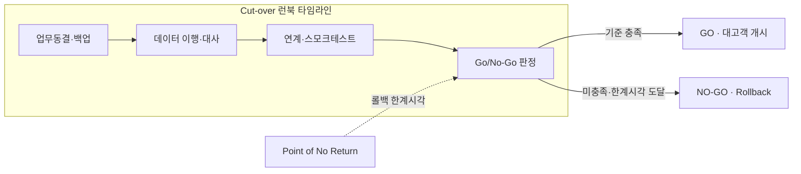
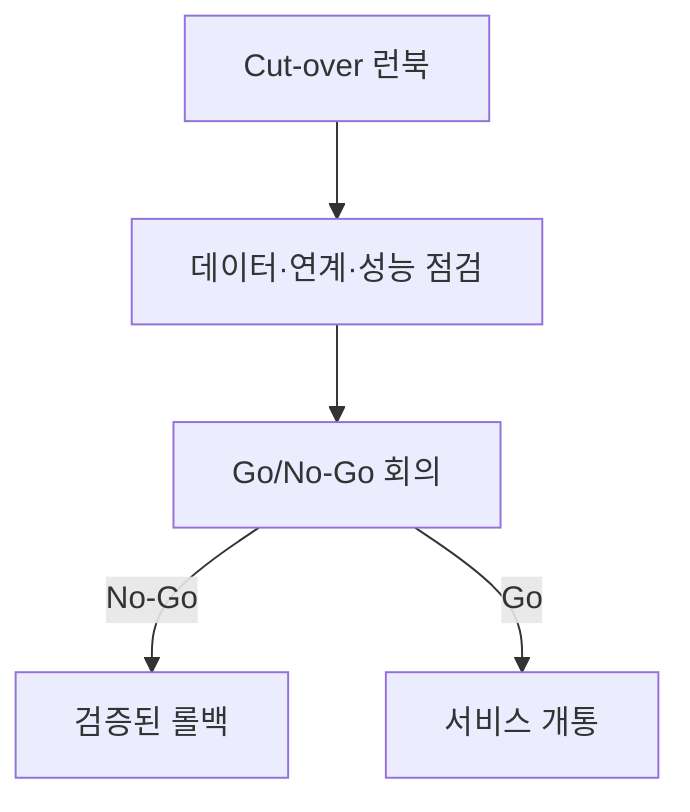

## 지식 로드맵 내 현재 위치
현재 위치: IT 전략·관리 → 차세대 시스템 오픈 리스크

## 30초 인출

- 본질: 차세대 시스템 **Cut-over** 과정에서 발생 가능한 데이터 유실·성능 저하·연계 단절 등 서비스 중단 위험을 통제하는 기법이다.
- 메커니즘: 사전 리허설(Dry Run) → **Cut-over** 타임라인 실행 → Point of No Return 이전 **Go/No-Go** 판정 → 롤백 또는 대고객 오픈한다.
- 판정 기준: 데이터 대사 결과, 연계 정상 여부, 부하 시험 결과, 현업 승인 및 롤백 한계시각 준수 여부를 확인한다.

핵심 용어

- **Cut-over**: 구 시스템에서 신 시스템으로 업무·데이터·연계를 전환하는 절차이다.
- **Dry Run**: 본 전환과 유사한 조건에서 수행하는 모의이행이다.
- **Go/No-Go**: 점검 결과를 근거로 신규 시스템의 가동을 계속할지 롤백할지 결정하는 의사결정 관문이다.
- **Rollback**: 전환 실패 시 검증된 이전 상태로 복구하는 활동이다.
- **ETL(Extract, Transform, Load)**: 데이터를 추출·변환·적재하는 처리이다.
- **BCP(Business Continuity Plan)**: 중단 상황에서도 핵심 업무를 지속·복구하기 위한 계획이다.

## 예상문제

> **(미출제 예상·25점)** 차세대 시스템 **Cut-over**의 주요 오픈 리스크를 설명하고, 단계별 통제와 **Go/No-Go**·**Rollback** 의사결정 방안을 제시하시오.

## Ⅰ. 차세대 시스템 오픈 리스크 개요

- 정의: **차세대 시스템**을 구 시스템에서 신 시스템으로 전환하는 과정의 위험을 식별하고 **데이터**·연계·성능 통제로 오픈 의사결정을 관리하는 전환 위험관리 체계
- 목적: **데이터** 무결성, 서비스 연속성, **롤백** 가능성을 확보해 전환 실패의 업무 영향을 제한한다.

## Ⅱ. **Cut-over** 단계별 통제 및 타임라인 아키텍처

> 업무 동결부터 롤백 한계시각(Point of No Return)과 종합 판정까지 시간 역산 타임라인을 통제함.

### 1. **Cut-over** 런북 타임라인 및 롤백 한계점(Point of No Return) 구조

- Point of No Return = 영업개시 시각 − 복구 소요시간(역산)

### 2. 단계별 통제 활동 및 산출물

| 단계 | 활동 | 산출 |
|---|---|---|
| 계획 | 범위·순서·의존성·책임 정의 | **Cut-over** 계획·RACI |
| 리허설 | 모의이행·대사·성능·복구 검증 | 리허설 결과·보완목록 |
| 실행 | 동결·백업·이행·절체·Smoke Test | 실행로그·대사결과 |
| 판정 | **Go/No-Go**·**Rollback** 결정 | 판정서·복구 승인 |
| 안정화 | 모니터링·장애·현업지원 | 상황보고·종료기준 |

## Ⅲ. 핵심 리스크·통제

| 위험 | 대책 | 효과 |
|---|---|---|
| 데이터 누락·불일치 | 건수·금액·참조무결성 대사 | 이행 무결성 확인 |
| 성능 저하 | 업무량 기반 부하·용량 시험 | 병목 사전 제거 |
| 대내외 연계 단절 | E2E(End-to-End) 합동 시험 | 인터페이스 연속성 확보 |
| 업무 절차 혼선 | 사용자 리허설·비상업무 절차 | 현업 대응력 확보 |
| 복구 실패 | 백업 복원·**Rollback** 리허설 | 복구 실행성 확보 |

## Ⅳ. Big-Bang vs Phased 전환 비교

| 기준 | Big-Bang | Phased |
|---|---|---|
| 전환 | 일괄 절체 | 업무·채널별 순차 절체 |
| 장점 | 이중운영·동기화 기간 최소화 | 영향 범위 분산 |
| 위험 | 실패 영향 집중 | 신·구 정합성·장기 이중운영 |
| 선택 | 강한 결합·단일 전환창 | 분리 가능한 도메인·점진 검증 |

## Ⅴ. 문제점·대응책

| 위험 | 대책 | 효과 |
|---|---|---|
| 일정 압박에 따른 강행 | 사전 승인된 판정기준·권한 | 의사결정 독립성 |
| 리허설과 운영환경 차이 | 운영 규모·순서·권한 재현 | 실행오차 축소 |
| 판정 증적 분산 | 통합 상황판·단일 승인기록 | 판단 근거 확보 |
| 롤백 시간 부족 | 역산 일정·중단시점 설정 | 복구 가능성 보호 |

## Ⅵ. 전환 통제 및 롤백 의사결정을 위한 기술사적 제언

> 성공적인 오픈은 장애가 없는 오픈이 아니라, 불확실성을 조기에 드러내고 되돌릴 수 있을 때 중단하는 오픈임.

### 학습자 통찰 메모 — 답안 밖

- [핵심 통찰]: 현업 경영진과 사업단은 수백억 원의 예산과 일정이 걸린 상태에서 'No-Go(롤백)' 버튼을 누르는 것을 극도로 두려워함. 따라서 주관적 판단을 배제하기 위해 'Point of No Return(롤백 한계시각)'을 사전에 못 박고, 4대 대사(데이터 건수/금액, E2E 연계, 스모크 테스트, 부하 임계치) 미충족 시 자동으로 롤백이 발동되는 독립적 의사결정 헌장을 제정해야 함.
- 나라면: 업무 중요도별 **Go/No-Go** 기준과 **Rollback** 결정시점을 사전 승인하고, 데이터·성능·연계·현업 증적이 한 화면에 모인 경우에만 가동을 승인하겠음.

### 실전 답안용 기술사적 제언

- **판정 기준**: 4대 무결성 지표(데이터 대사율 전수, E2E 거래 성공률, 목표 TPS 달성, 현업 승인) 및 롤백 한계시각 도달 여부.
- **대응 방안**: 업무 개시 시각 기준 롤백 소요시간 역산(Point of No Return), 반복 실전 Dry Run 모의훈련 실시.
- **검증 체계**: 단일 런북(Runbook) 기반 분 단위 실시간 상황실 관제, PMO·감리·현업 공동 참여 **Go/No-Go** 서명제 운영.
- **기대 효과**: 개통 초기 장애의 업무 영향을 줄이고 대고객 서비스 연속성을 확인.

## 1교시 10점 답안 발췌

### 1. 정의·목적

- **정의**: 차세대 시스템 가동(**Cut-over**) 과정에서 데이터 오류, 인터페이스 단절, 성능 지연을 통제하고 롤백 한계시점 내 **Go/No-Go**를 결정하는 **전환 위험관리 프레임워크**.
- **목적**: 대고객 서비스 연속성 보장 및 시스템 개통 실패에 따른 사회적·경제적 손실 예방.

### 2. **Cut-over** 타임라인 및 의사결정 체계

### 3. 핵심 통제

| 구간 | 통제 활동 |
|---|---|
| **오픈 전** | 3회 이상 Dry Run 모의훈련, 대사 스크립트 검증, Point of No Return 확정 |
| **오픈 중** | 분 단위 상황실 관제, 4대 무결성 증적 확인, **Go/No-Go** 독립적 판정 |
| **오픈 후** | 종합상황실 가동, 긴급 핫픽스 체계, 특별 안정화 모니터링 |

## 출제 이력과 검증 출처

- 공식 문제지 원문 확인 전까지 직접 기출로 단정하지 않음
- [NIST SP 800-34 Rev.1, Contingency Planning Guide for Federal Information Systems](https://csrc.nist.gov/pubs/sp/800/34/r1/final)
- [AWS Prescriptive Guidance, Cutover runbook](https://docs.aws.amazon.com/prescriptive-guidance/latest/cutover-runbook/)

## 학습 체크

- [ ] Ⅰ: 오픈 리스크의 정의·목적을 설명할 수 있는가?
- [ ] Ⅱ: 계획부터 안정화까지 활동·산출을 연결할 수 있는가?
- [ ] Ⅲ: 데이터·성능·연계·현업·복구 위험의 통제를 제시할 수 있는가?
- [ ] Ⅳ: Big-Bang·Phased 선택기준을 비교할 수 있는가?
- [ ] Ⅴ: 일정 압박·환경 차이·롤백 시간 부족의 대응책을 제시할 수 있는가?
- [ ] Ⅵ: 증적 기반 **Go/No-Go** 판정 구조를 그릴 수 있는가?

## 연결 토픽

- 이전 토픽: [지능정보기술 감리 실무 가이드](./102_intelligent_information_technology_audit_guide.md)
- 연관 토픽: [부정적 위험 대응](./040_negative_risk_response_strategy.md), [클라우드 전환사업 감리](./104_cloud_migration_project_audit.md)
- 다음 토픽: [클라우드 전환사업 감리](./104_cloud_migration_project_audit.md)
