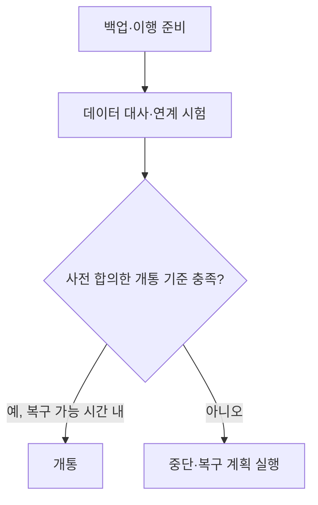

## 지식 로드맵 내 현재 위치
현재 위치: IT 전략·관리 → 차세대 시스템 오픈 리스크

## 30초 인출

- 본질: **차세대 시스템 오픈 리스크**는 구 시스템에서 신 시스템으로 전환할 때 데이터·연계·성능 문제로 업무가 중단될 위험이다.
- 메커니즘: 전환 절차를 사전 검증하고, 정한 기준과 복구 가능 시간을 고려해 개통을 진행하거나 중단한다.

핵심 용어

- **차세대 시스템 오픈 리스크** : 신 시스템 전환 중 업무 중단이나 데이터 불일치를 일으킬 수 있는 위험
- **Cut-over** : 기존 시스템을 신규 차세대 시스템으로 데이터·연계·트래픽을 최종 이관·가동하는 전환 절차
- **Go/No-Go** : 체크리스트 검증 결과를 바탕으로 신규 시스템 가동 지속 또는 중단·원복을 판정하는 의사결정 관문
- **Rollback** : 전환 실패 시 시스템과 데이터를 검증된 이전 정상 상태로 되돌리는 복원 절차

---

## 1교시 예상문제 (10점)

> 차세대 시스템 오픈의 Cut-over 절차와 Go/No-Go 판정을 설명하시오. (예상·10점)

---

## 1교시 10점 답안

### Ⅰ. 개요

| 구분 | 핵심 |
|---|---|
| 정의 | **차세대 시스템 오픈 리스크**는 신 시스템 전환 중 데이터·연계·성능 문제로 업무가 중단될 위험이다. |
| 목적 | 전환 실패가 업무에 미치는 영향을 줄이고, 안전한 개통 또는 중단을 결정한다. |

### Ⅱ. 전환 판단 흐름

### 3. 핵심 통제

| 구간 | 통제 활동 |
|---|---|
| **오픈 전** | 실행순서·책임자·판정 기준을 정하고 리허설 결과로 보완 |
| **오픈 중** | 데이터 대사·연계·핵심 업무 결과를 확인하고 권한자가 개통 여부 결정 |
| **오픈 후** | 정한 안정화 기준에 따라 장애·성능·업무 이상을 감시 |

제언: 복구에 필요한 시간과 데이터 변경 가능성을 함께 검토해 개통 중단 시점을 미리 정한다.

---

## 2~4교시 예상문제 (25점)

> **(미출제 예상·25점)** 차세대 시스템 **Cut-over** 의 주요 오픈 리스크를 설명하고, 단계별 통제와 **Go/No-Go** · **Rollback** 의사결정 방안을 제시하시오.

---

## 2~4교시 25점 답안

## Ⅰ. 차세대 시스템 오픈 리스크 개요

| 구분 | 핵심 |
|---|---|
| 정의 | **차세대 시스템 오픈 리스크**는 신 시스템 전환 중 데이터·연계·성능 문제로 업무가 중단될 위험이다. |
| 목적 | 전환 실패가 업무에 미치는 영향을 줄이고, 안전한 개통 또는 중단을 결정한다. |

## Ⅱ. Cut-over 단계별 통제 및 타임라인 아키텍처

> 업무 동결부터 롤백 한계시각(Point of No Return)과 종합 판정까지 시간 역산 타임라인을 통제함.

### 1. Cut-over 런북 타임라인 및 롤백 한계점(Point of No Return) 구조

복구 가능 시점은 사업별 데이터 변경 방식·업무 영향·복구시간을 바탕으로 정한다. 특정한 단일 산식으로 고정하지 않는다.

### 2. 단계별 통제 활동 및 산출물

| 단계 | 활동 | 산출 |
|---|---|---|
| 계획 | 범위·순서·의존성·책임 정의 | **Cut-over** 계획·RACI |
| 리허설 | 모의이행·대사·성능·복구 검증 | 리허설 결과·보완목록 |
| 실행 | 동결·백업·이행·절체·Smoke Test | 실행로그·대사결과 |
| 판정 | **Go/No-Go** · **Rollback** 결정 | 판정서·복구 승인 |
| 안정화 | 모니터링·장애·현업지원 | 상황보고·종료기준 |

## Ⅲ. 핵심 리스크·통제

| 위험 | 대책 | 효과 |
|---|---|---|
| 데이터 누락·불일치 | 건수·금액·참조무결성 대사 | 이행 무결성 확인 |
| 성능 저하 | 업무량 기반 부하·용량 시험 | 병목 사전 제거 |
| 대내외 연계 단절 | E2E(End-to-End) 합동 시험 | 인터페이스 연속성 확보 |
| 업무 절차 혼선 | 사용자 리허설·비상업무 절차 | 현업 대응력 확보 |
| 복구 실패 | 백업 복원· **Rollback** 리허설 | 복구 실행성 확보 |

## Ⅳ. Big-Bang vs Phased 전환 비교

| 기준 | Big-Bang | Phased |
|---|---|---|
| 전환 | 일괄 절체 | 업무·채널별 순차 절체 |
| 장점 | 이중운영·동기화 기간 최소화 | 영향 범위 분산 |
| 위험 | 실패 영향 집중 | 신·구 정합성·장기 이중운영 |
| 선택 | 강한 결합·단일 전환창 | 분리 가능한 도메인·점진 검증 |

## Ⅴ. 문제점·대응책

| 위험 | 대책 | 효과 |
|---|---|---|
| 일정 압박에 따른 강행 | 사전 승인된 판정기준·권한 | 의사결정 독립성 |
| 리허설과 운영환경 차이 | 운영 규모·순서·권한 재현 | 실행오차 축소 |
| 판정 증적 분산 | 통합 상황판·단일 승인기록 | 판단 근거 확보 |
| 롤백 시간 부족 | 역산 일정·중단시점 설정 | 복구 가능성 보호 |

## Ⅵ. 기술사적 제언

| 문제 | 해결 방안 |
|---|---|
| 오픈 판정은 통과했지만 이전 시스템으로 돌아갈 때 최신 거래가 반영되지 않을 수 있음 | 컷오버 설계 단계에서 데이터 변경분 처리 방식을 정하고, 복구 리허설에서 실제 복원·대사를 확인 |

## 출제 이력과 검증 출처

- 공식 문제지 원문 확인 전까지 직접 기출로 단정하지 않음
- [NIST SP 800-34 Rev.1 Update 1, Contingency Planning Guide](https://csrc.nist.gov/pubs/sp/800/34/r1/upd1/final)
- [AWS Prescriptive Guidance, Cutover stage](https://docs.aws.amazon.com/prescriptive-guidance/latest/best-practices-migration-cutover/cutover-stage.html)
- [AWS Prescriptive Guidance, Pre-cutover stage](https://docs.aws.amazon.com/prescriptive-guidance/latest/best-practices-migration-cutover/pre-cutover-stage.html)

## 연결 토픽

- 이전 토픽: [지능정보기술 감리 실무 가이드](./102_intelligent_information_technology_audit_guide.md)
- 연관 토픽: [부정적 위험 대응](./040_negative_risk_response_strategy.md), [클라우드 전환사업 감리](./104_cloud_migration_project_audit.md)
- 다음 토픽: [클라우드 전환사업 감리](./104_cloud_migration_project_audit.md)
