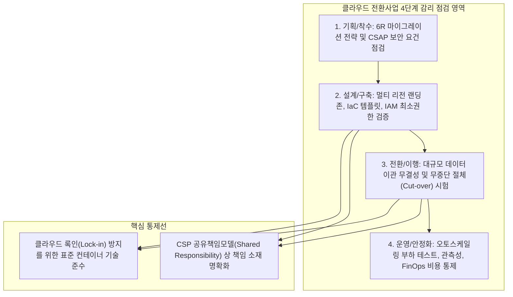

## 지식 로드맵 내 현재 위치
현재 위치: IT 전략·관리 → 클라우드 전환사업 감리

## 30초 인출

- 본질: 클라우드 전환사업 감리는 시스템을 클라우드로 옮기는 계획·설계·이행·운영이 적정한지 독립적으로 점검하는 활동이다.
- 메커니즘: **6R** 전환전략 수립 → 랜딩존/ **공유책임** 설계 → 데이터 CDC 및 Cut-over/Dry Run 이행 → **FinOps** 및 **SLA** 운영한다.
- 판정 기준: **6R** 전략 적합성, CSP **공유책임** (RACI) 명확성, 데이터 대사 결과 및 **FinOps** 태깅 준수 여부를 확인한다.

핵심 용어

- **TCO(Total Cost of Ownership)** : 도입·이행·운영·폐기 등 클라우드 수명주기 전반에 걸친 총소유비용
- **IAM(Identity and Access Management)** : 클라우드 사용자 및 시스템의 신원을 확인하고 접근 권한을 통제하는 식별·인증 체계
- **IaC(Infrastructure as Code)** : 클라우드 인프라 구성을 코드로 정의하여 자동 프로비저닝하는 기술
- **SLA(Service Level Agreement)** : 서비스 제공자와 이용자 간 가용성 및 성능 목표를 합의한 서비스 수준 협약
- **FinOps(Financial Operations)** : 엔지니어링·재무·사업 부서가 협력하여 클라우드 비용과 비즈니스 가치를 최적화하는 운영 체계
- **DR(Disaster Recovery)** : 시스템 장애나 센터 재해 발생 시 비즈니스 연속성을 확보하는 재해복구 체계
- **CSAP(Cloud Security Assurance Program)** : 공공 부문 클라우드 서비스의 보안성과 신뢰성을 검증하는 보안인증 제도

---

## 1교시 예상문제 (10점)

> 클라우드 전환사업의 단계별 감리 영역과 핵심 점검 사항을 설명하시오. (예상·10점)

---

## 1교시 10점 답안

### 1. 정의·목적

- 정의: 정보시스템을 클라우드 환경으로 이전하거나 전환 구축하는 전 과정에서 클라우드 아키텍처의 적합성, 보안성(CSAP), 상호운용성 및 비용 효율성을 독립적으로 점검·평가하는 전문 감리 체계
- 목적: 클라우드 전환 실패 및 서비스 장애 예방 · 클라우드 보안 및 컴플라이언스 완결 · 예산 누수 방지 및 성공적인 클라우드 현대화 달성

- **정의** : 온프레미스 시스템의 클라우드 전환 시 전략, 아키텍처, 이행 무결성, 운영/비용의 적정성을 독립적으로 점검하는 **신기술 전문 정보시스템 감리 프레임워크** .
- **목적** : CSP 종속 탈피, 전환 실패 및 보안 공백 예방, **FinOps** 기반 총소유비용(TCO) 최적화.

### 2. 4단계 수명주기별 감리 아키텍처

### 3. 핵심 통제

| 단계 | 점검 중점사항 |
|---|---|
| **전략·설계** | **6R** 전략, 랜딩존 IaC, CSAP 인증, **공유책임** RACI, Exit Plan |
| **이행** | 데이터 대사, Dry Run 증적, Rollback 한계시점 통제 |
| **운영** | **FinOps** 자원 태깅, SLA 및 Multi-AZ 이중화, 이상과금 경보 |

---

## 2~4교시 예상문제 (25점)

> **(미출제 예상·25점)** 클라우드 전환사업 감리의 필요성과 단계별 점검사항을 설명하고, 주요 문제점과 대응책을 제시하시오.

---

## 2~4교시 25점 답안

## Ⅰ. 클라우드 전환사업 감리 개요

- 정의: **온프레미스** 시스템을 **클라우드** 로 전환하는 사업의 전략·아키텍처·이행·운영을 독립 검증하고 **공유책임** 과 통제 증적을 확인하는 감리 활동
- 목적: 전환 실패, 보안책임 누락, 데이터 오류, 비용 통제 실패를 조기에 발견하고 시정한다.

## Ⅱ. 4단계 수명주기별 감리 프레임워크

> 전략 수립에서 아키텍처 설계, 실데이터 이행, 운영/ **FinOps** 통제까지 4단계 품질 게이트를 운영함.

### 1. 클라우드 전환 4단계 감리 점검 아키텍처

### 2. 단계별 주요 활동 및 감리 증적

| 단계 | 주요 활동 | 감리 증적 |
|---|---|---|
| 전략 | 대상분류·전환방식·규제·TCO 분석 | 전환계획·타당성 분석 |
| 설계 | 가용성·IAM·네트워크·암호화·백업 | 목표 Architecture·권한표 |
| 이행 | 데이터 복제·대사·Cut-over·Rollback | 이행로그·대사·리허설 결과 |
| 운영 | SLA·관측성·DR· **FinOps** ·Exit Plan | 운영계획·시험·비용보고 |

## Ⅲ. 6R 전환 전략 점검

> Rehost·Replatform·Refactor 중 하나를 우월한 방식으로 정하지 않고 업무 가치와 제약으로 선택함.

| 전략 | 핵심 | 점검 기준 |
|---|---|---|
| Rehost | 구조 변경 없이 이전 | 속도·호환성·비용효과 |
| Replatform | 일부 관리형 서비스 전환 | 기능호환·운영책임 변화 |
| Refactor | Cloud Native 재설계 | 복잡도·분산구조·운영역량 |
| Repurchase | SaaS 등으로 대체 | Fit-Gap·데이터 이동·종속성 |
| Retain | 현행 유지 | 규제·기술제약·연계 |
| Retire | 시스템 종료 | 의존성·보존·폐기 절차 |

## Ⅳ. 온프레미스 vs 클라우드 감리 비교

| 기준 | 온프레미스 | 클라우드 |
|---|---|---|
| 자원 | 물리·가상 장비 | API 기반 가상자원·IaC |
| 보안 | 기관 중심 책임 | CSP·이용자 **공유책임** |
| 가용성 | 장비·센터 이중화 | Zone·Region·서비스 조합 |
| 비용 | 구매·감가상각 | 사용량·약정·태그·단가 |

## Ⅴ. 문제점·대응책

| 위험 | 대책 | 효과 |
|---|---|---|
| 전략 없는 일괄 이전 | 업무별 전환전략·Exit 조건 | 부적합 이전 방지 |
| **공유책임** 공백 | 서비스모델별 RACI·통제 매핑 | 보안책임 명확화 |
| 데이터 불일치 | 원천·목표 대사·복구 리허설 | 이행 무결성 확보 |
| 비용 가시성 부족 | 태깅·예산·이상비용 경보 | 비용 책임성 강화 |
| 특정 CSP 종속 | 표준 API·데이터 반출·Exit Plan | 전환 선택권 확보 |

## Ⅵ. 클라우드 전환 품질 게이트를 위한 기술사적 제언

> 클라우드 전환 감리는 자원 존재 여부가 아니라 전환 후 책임·복구·비용을 지속 관리할 수 있는지를 검증해야 함.

### 실전 답안용 기술사적 제언

- 문제: 기존 온프레미스 감리 방식을 답습하여 클라우드 특화 위험(CSP 공유책임모델, 멀티테넌트 보안 취약성, FinOps 비용 폭증)을 걸러내지 못함.
- 해결 방안: 클라우드 전환 생애주기(기획-설계-전환-안정화) 특화 감리 기준을 적용하여 랜딩존 아키텍처, CSAP 보안 인증, 클라우드 네이티브 이식성, 실시간 비용 거버넌스를 집중 점검함.

## 출제 이력과 검증 출처

- 공식 문제지 원문 확인 전까지 직접 기출로 단정하지 않음
- [NIA, 지능정보기술 감리 실무 가이드](https://www.nia.or.kr/site/nia_kor/ex/bbs/View.do?bcIdx=25211&cbIdx=99860&parentSeq=25211)
- [NIST SP 800-146, Cloud Computing Synopsis and Recommendations](https://csrc.nist.gov/pubs/sp/800/146/final)
- [FinOps Foundation, FinOps Framework](https://www.finops.org/framework/)

## 연결 토픽

- 이전 토픽: [차세대 시스템 오픈 리스크](./103_next_generation_system_open_risk.md)
- 연관 토픽: [지능정보기술 감리 실무 가이드](./102_intelligent_information_technology_audit_guide.md), [FinOps](./012_finops.md)
- 다음 토픽: [품질비용(CoQ)](./106_cost_of_quality_coq.md)
