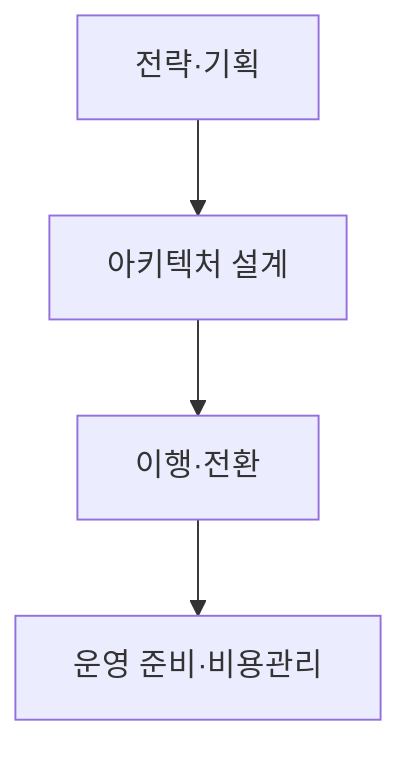

## 지식 로드맵 내 현재 위치
현재 위치: IT 전략·관리 → 클라우드 전환사업 감리

## 30초 인출

- 본질: **클라우드 전환사업 감리** 는 시스템의 클라우드 이전·구축 과정과 결과를 요구사항과 독립적으로 대조하는 활동
- 메커니즘: 시스템별 **7 Rs of Migration** 전환전략 선택과 목표구성·이행결과·운영준비의 사업 요구 부합 여부 확인

핵심 용어

- **클라우드 전환사업 감리** : 클라우드 전환사업의 계획·설계·이행·운영 준비가 요구사항에 맞는지 독립적으로 확인하는 활동
- **TCO(Total Cost of Ownership)** : 도입·이행·운영·폐기 등 클라우드 수명주기 전반에 걸친 총소유비용
- **IAM(Identity and Access Management)** : 클라우드 사용자 및 시스템의 신원을 확인하고 접근 권한을 통제하는 식별·인증 체계
- **IaC(Infrastructure as Code)** : 클라우드 인프라 구성을 코드로 정의하여 자동 프로비저닝하는 기술
- **SLA(Service Level Agreement)** : 서비스 제공자와 이용자 간 가용성 및 성능 목표를 합의한 서비스 수준 협약
- **FinOps(Financial Operations)** : 엔지니어링·재무·사업 부서가 협력하여 클라우드 비용과 비즈니스 가치를 최적화하는 운영 체계
- **DR(Disaster Recovery)** : 시스템 장애나 센터 재해 발생 시 비즈니스 연속성을 확보하는 재해복구 체계
- **CSP(Cloud Service Provider)** : 클라우드 컴퓨팅 자원과 서비스를 제공하는 사업자
- **RACI(Responsible, Accountable, Consulted, Informed)** : 활동별 수행·최종책임·협의·공유 역할을 구분하는 책임 배정표
- **7 Rs of Migration** : 클라우드 전환을 위한 Retire·Retain·Rehost·Relocate·Repurchase·Replatform·Refactor 전략 분류

---

## 1교시 예상문제 (10점)

> 클라우드 전환사업 감리에 관하여 설명하시오. (예상·10점)

---

## 1교시 10점 답안

### Ⅰ. 개요

| 구분 | 핵심 |
|---|---|
| 정의 | **클라우드 전환사업 감리** 는 시스템의 클라우드 이전·구축 과정과 결과를 요구사항과 독립적으로 대조하는 활동 |
| 목적 | 전환 위험·운영 공백의 조기 발견과 사업 요구에 맞는 서비스 확보 |

### Ⅱ. 전환 생애주기별 점검

### Ⅲ. 핵심 통제

| 단계 | 점검 중점사항 |
|---|---|
| **전략·기획** | 업무별 전환 방식·범위·의존성·적용 보안요건 |
| **아키텍처 설계** | 목표 구성·접근통제·복구·운영 책임분담 |
| **이행·전환** | 데이터 대사·절체시험·복구계획 |
| **운영 준비** | 서비스 수준·운영절차·비용 가시성 |

제언: 시스템별 전환 방식과 보안·운영 책임의 사전 결정 및 개통 전 검증

---

## 2~4교시 예상문제 (25점)

> **(미출제 예상·25점)** 클라우드 전환사업 감리의 필요성과 단계별 점검사항을 설명하고, 주요 문제점과 대응책을 제시하시오.

---

## 2~4교시 25점 답안

## Ⅰ. 클라우드 전환사업 감리 개요

| 구분 | 핵심 |
|---|---|
| 정의 | **클라우드 전환사업 감리** 는 시스템의 클라우드 이전·구축 과정과 결과를 요구사항과 독립적으로 대조하는 활동 |
| 목적 | 전환 위험·운영 공백의 조기 발견과 사업 요구에 맞는 서비스 확보 |

## Ⅱ. 4단계 수명주기별 감리 프레임워크

> 감리 내용을 정리하기 위한 네 단계의 생애주기 구분

### 1. 클라우드 전환 4단계 감리 점검 아키텍처

### 2. 단계별 주요 활동 및 감리 증적

| 단계 | 주요 활동 | 감리 증적 |
|---|---|---|
| 전략 | 대상분류·전환방식·규제· **TCO** 분석 | 전환계획·타당성 분석 |
| 설계 | 가용성· **IAM** ·네트워크·암호화·백업 | 목표 Architecture·권한표 |
| 이행 | 데이터 복제·대사·Cut-over·Rollback | 이행로그·대사·리허설 결과 |
| 운영 | **SLA** ·관측성· **DR** · **FinOps** ·Exit Plan | 운영계획·시험·비용보고 |

## Ⅲ. 클라우드 전환 전략

> 자료마다 차이가 있는 전환전략 분류. **7 Rs of Migration** 은 AWS 가이드의 사례 분류이며 보편적 법정 분류와는 구분.

| 전략 | 핵심 | 점검 기준 |
|---|---|---|
| Rehost | 구조 변경 없이 이전 | 속도·호환성·비용효과 |
| Relocate | 가상화 환경 등을 통째로 이동 | 플랫폼 호환성·전환 범위 |
| Replatform | 일부 관리형 서비스 전환 | 기능호환·운영책임 변화 |
| Refactor | Cloud Native 재설계 | 복잡도·분산구조·운영역량 |
| Repurchase | SaaS 등으로 대체 | Fit-Gap·데이터 이동·종속성 |
| Retain | 현행 유지 | 규제·기술제약·연계 |
| Retire | 시스템 종료 | 의존성·보존·폐기 절차 |

## Ⅳ. 온프레미스 vs 클라우드 감리 비교

| 기준 | 온프레미스 | 클라우드 |
|---|---|---|
| 자원 | 물리·가상 장비 | API 기반 가상자원· **IaC** |
| 보안 | 기관 중심 책임 | CSP·이용자 **공유책임** |
| 가용성 | 장비·센터 이중화 | Zone·Region·서비스 조합 |
| 비용 | 구매·감가상각 | 사용량·약정·태그·단가 |

## Ⅴ. 문제점·대응책

| 위험 | 대책 | 효과 |
|---|---|---|
| 전략 없는 일괄 이전 | 업무별 전환전략·Exit 조건 | 부적합 이전 방지 |
| **공유책임** 공백 | 서비스모델별 RACI·통제 매핑 | 보안책임 명확화 |
| 데이터 불일치 | 원천·목표 대사·복구 리허설 | 이행 무결성 확보 |
| 비용 가시성 부족 | 태깅·예산·이상비용 경보 | 비용 책임성 강화 |
| 특정 CSP 종속 | 표준 API·데이터 반출·Exit Plan | 전환 선택권 확보 |

## Ⅵ. 기술사적 제언

| 문제 | 해결 방안 |
|---|---|
| 업무별 중요도와 의존성을 무시하고 전환 순서를 정하면 초기 장애가 연쇄적으로 번질 수 있음 | 전환 전에 업무 영향도와 시스템 의존성을 확인해 우선순위를 정하고, 의존성이 낮은 범위부터 검증한 뒤 확대 |

## 출제 이력과 검증 출처

- 공식 문제지 원문 확인 전까지 직접 기출로 단정하지 않음
- [NIA, 지능정보기술 감리 실무 가이드](https://www.nia.or.kr/site/nia_kor/ex/bbs/View.do?bcIdx=25211&cbIdx=99860&parentSeq=25211)
- [AWS Prescriptive Guidance, Migration strategies for large migrations (7 Rs)](https://docs.aws.amazon.com/prescriptive-guidance/latest/large-migration-guide/migration-strategies.html)
- [NIST SP 800-146, Cloud Computing Synopsis and Recommendations](https://csrc.nist.gov/pubs/sp/800/146/final)
- [FinOps Foundation, FinOps Framework](https://www.finops.org/framework/)

## 연결 토픽

- 이전 토픽: [차세대 시스템 오픈 리스크](./103_next_generation_system_open_risk.md)
- 연관 토픽: [지능정보기술 감리 실무 가이드](./102_intelligent_information_technology_audit_guide.md), [FinOps](./012_finops.md)
- 다음 토픽: [품질비용(CoQ)](./106_cost_of_quality_coq.md)
