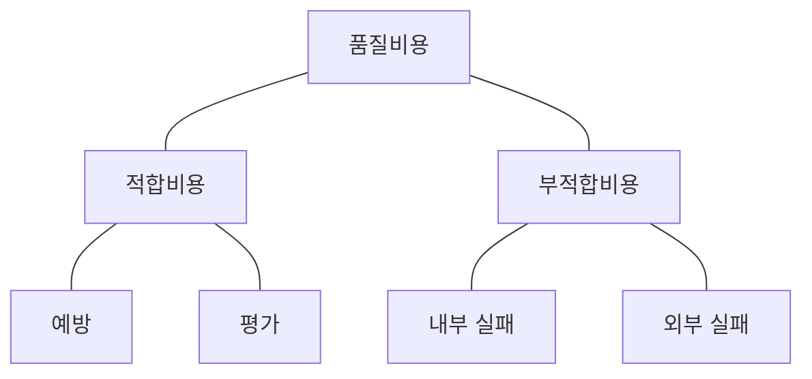
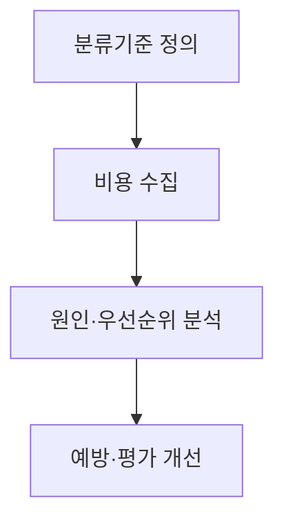

## 지식 로드맵 내 현재 위치
현재 위치: IT 전략·관리 → **품질비용** (COQ)

## 30초 인출

- 본질: **품질비용(COQ)** 은 품질 확보 활동의 비용과 품질 실패로 발생한 비용을 함께 다루는 개념
- 메커니즘: 예방·평가 비용과 내부·외부 실패비용의 일관된 분류 및 개선 우선순위 결정

핵심 용어

- **품질비용(COQ, Cost of Quality)** : 요구 품질을 확보하는 활동의 비용과 요구 미달로 생긴 손실을 함께 분류·관리하는 개념
- **PAF(Prevention, Appraisal, Failure)** : 품질비용을 예방·평가·실패(내부/외부) 3개 영역으로 체계화한 분류 모델
- **COPQ(Cost of Poor Quality)** : 결함 발생 및 재작업, 대외 장애로 초래되는 내부·외부 저품질 비용
- **TDD(Test-Driven Development)** : 실패하는 테스트를 먼저 작성한 뒤 이를 통과시키는 코드를 구현하는 개발 방식
- **CI/CD(Continuous Integration/Continuous Delivery or Deployment)** : 변경 코드를 자주 통합하고 검증된 변경을 전달·배포하는 자동화 방식
- **Shift-Left** : 요구사항 및 설계 등 개발 초기 단계로 검증 활동을 앞당겨 결함 비용을 낮추는 엔지니어링 실무
- **Quality Gate** : 사전 정의된 품질 측정 기준을 충족해야 다음 단계 진행을 승인하는 품질 통제 관문

---

## 1교시 예상문제 (10점)

> 품질비용의 개념과 구성 및 활용에 관하여 설명하시오. (예상·10점)

---

## 1교시 10점 답안

### Ⅰ. 개요

| 구분 | 핵심 |
|---|---|
| 정의 | **품질비용(COQ)** 은 품질 확보 활동의 비용과 품질 실패로 발생한 비용을 함께 다루는 개념 |
| 목적 | 고비용 실패 원인의 식별과 예방·평가 활동의 개선 우선순위 결정 |

### Ⅱ. PAF 구성

### Ⅲ. 핵심 통제 및 최적화

| 구분 | 핵심 통제 |
|---|---|
| **적합비용** | TDD, 정적분석, 코드리뷰 등 개발 초기 예방·평가 투자 확대( **Shift-Left** ) |
| **부적합비용** | 파레토 분석 기반 고비용 결함 원인 차단, 배포 후 외부 실패비용 최소화 |

제언: 실패비용이 큰 결함 유형부터 원인을 확인하고 예방·평가 활동에 우선 투자

---

## 2~4교시 예상문제 (25점)

> (미출제 예상·25점) 품질비용의 개념과 PAF 구성요소를 설명하고, 소프트웨어 사업에서 품질비용을 측정·개선하는 방안을 제시하시오.

---

## 2~4교시 25점 답안

## Ⅰ. 품질비용 개요

| 구분 | 핵심 |
|---|---|
| 정의 | **품질비용(COQ)** 은 품질 확보 활동의 비용과 품질 실패로 발생한 비용을 함께 다루는 개념 |
| 목적 | 고비용 실패 원인의 식별과 예방·평가 활동의 개선 우선순위 결정 |

## Ⅱ. PAF 구성체계

| 구분 | 의미 | 소프트웨어 예시 |
|---|---|---|
| 예방 | 결함 발생 방지 | 표준·교육·Architecture Review |
| 평가 | 적합성 확인 | Review·Test·정적분석·감리 |
| 내부실패 | 배포 전 발견 결함 | 수정·재시험·빌드 실패 |
| 외부실패 | 배포 후 발견 결함 | 장애·보상·긴급패치·신뢰손실 |

## Ⅲ. 측정·개선 절차

> 비용 분류 자체보다 반복되는 실패비용을 어떤 예방활동으로 전환할지가 핵심임.

- 활동: 예방·평가·내부실패·외부실패 계정 정립 → 공수·라이선스·장애복구·보상비용 집계 → 결함 원인 파레토 분석 → 코드리뷰·TDD·CI/CD 자동시험·Quality Gate 적용
- 산출: 분류기준 → 비용 집계표 → 개선 우선순위 → **Shift-Left** 개선안·재측정 결과

## Ⅳ. 적합비용과 부적합비용의 관계

> 예방·평가 활동과 실패 손실의 통합 검토. 특정 비용 곡선이나 보편적 최적점을 전제하지 않는 판단.

### 비용 분류에 따른 개선 판단

| 기준 | 적합비용 중심 | 부적합비용 중심 |
|---|---|---|
| 시점 | 결함 전·배포 전 | 결함 발생·배포 후 |
| 성격 | 계획 가능한 투자 | 변동성 큰 손실 |
| 관리 | 예방·자동화·검증 | 복구·보상·원인제거 |
| 판단 | 투자 대비 실패감소 | 손실 규모·재발 위험 |

예방·평가 투자 효과는 제품·도메인·결함 유형에 따라 차이. 고정 배수나 일률적 최적점의 적용은 배제.

## Ⅴ. 한계·대응책

| 위험 | 대책 | 효과 |
|---|---|---|
| **품질비용** 누락 | 공수·장애·보상 계정 연계 | 숨은 비용 가시화 |
| 분류 중복 | 사건별 주비용 분류·기준 명시 | 이중계상 방지 |
| 지표 목표화 | 비용·결함·고객영향 함께 평가 | 숫자 맞추기 방지 |
| 예방투자 효과 불명 | 전후 추세·재발률 검증 | 투자 근거 확보 |

## Ⅵ. 기술사적 제언

| 한계 | 해결 방안 |
|---|---|
| 비용 자료가 회계 계정·장애 기록·개발 공수에 흩어져 있어 개선효과를 비교하기 어려움 | 공통 분류 기준과 비용 산정 책임자를 정하고, 분류별 자료를 같은 기간·범위로 집계 |

## 출제 이력과 검증 출처

- 공식 문제지 원문 확인 전까지 직접 기출로 단정하지 않음
- [ASQ, Cost of Quality](https://asq.org/quality-resources/cost-of-quality)

## 연결 토픽

- 이전 토픽: [클라우드 전환사업 감리](./104_cloud_migration_project_audit.md)
- 연관 토픽: [Six Sigma DMAIC](./111_six_sigma_dmaic.md), [소프트웨어 비용 산정](./113_software_cost_estimation.md)
- 다음 토픽: [EA·ITA](./107_ea_ita.md)
