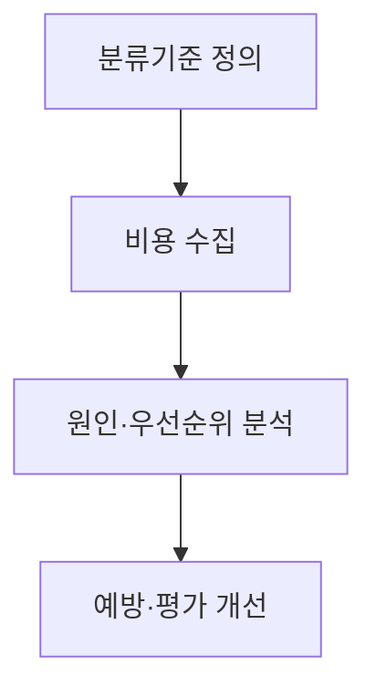
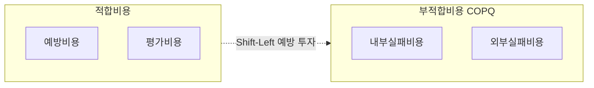
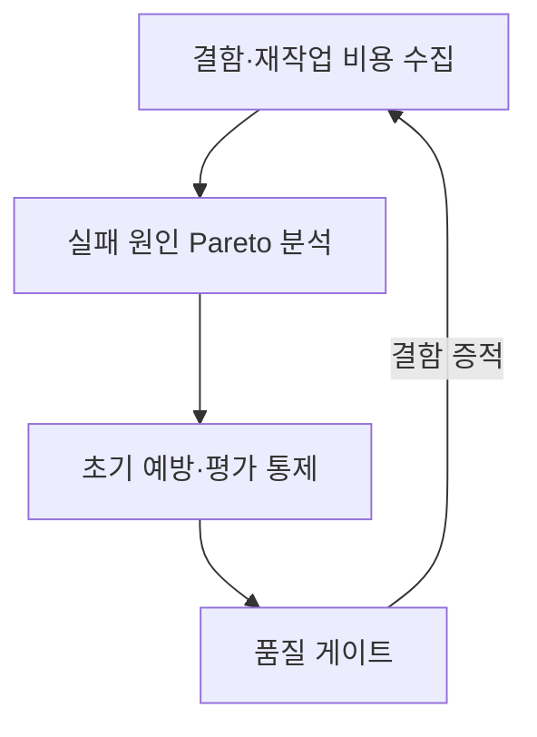

## 지식 로드맵 내 현재 위치
현재 위치: IT 전략·관리 → **품질비용**(COQ)

## 30초 인출

- 본질: 품질을 확보하기 위한 적합비용(예방·평가)과 품질 미달로 발생하는 부적합비용(내부·외부 실패)의 총합을 측정·최적화하는 기법이다.
- 메커니즘: 계정 정의 → 결함 비용 수집 → 파레토 원인 분석 → **Shift-Left**(예방/평가 투자 확대) → 총 **품질비용** 최소화한다.
- 판정 기준: 부적합비용(COPQ) 비중 감소 추이 및 예방 투자에 따른 외부 장애/재작업 비용 절감액 타당성이다.

핵심 용어

- **COQ(Cost of Quality)**: 품질을 예방·평가하는 데 드는 비용과 품질 실패로 발생하는 내부·외부 비용을 합산한 관리 지표이다.
- **PAF(Prevention, Appraisal, Failure)**: 예방·평가·실패로 **품질비용**을 분류하는 모델이다.
- **COPQ(Cost of Poor Quality)**: 내부·외부 실패로 발생하는 부적합 비용이다.
- **Shift-Left**: 검토·시험·보안활동을 개발 초기로 이동하는 접근이다.
- **Quality Gate**: 정의된 품질기준을 충족해야 다음 단계로 진행하게 하는 통제이다.

## 예상문제

> **(미출제 예상·25점)** **품질비용**의 개념과 **PAF** 구성요소를 설명하고, 소프트웨어 사업에서 **품질비용**을 측정·최적화하는 방안을 제시하시오.

## Ⅰ. **품질비용** 개요

- 정의: 소프트웨어 품질을 예방·평가하는 **적합비용**과 내부·외부 실패로 발생하는 부**적합비용**을 **PAF** 기준으로 분류해 관리하는 비용 측정 기법
- 목적: 숨은 실패비용을 가시화하고 예방·평가 투자와 실패비용의 균형을 판단한다.

## Ⅱ. **PAF** 구성체계

| 구분 | 의미 | 소프트웨어 예시 |
|---|---|---|
| 예방 | 결함 발생 방지 | 표준·교육·Architecture Review |
| 평가 | 적합성 확인 | Review·Test·정적분석·감리 |
| 내부실패 | 배포 전 발견 결함 | 수정·재시험·빌드 실패 |
| 외부실패 | 배포 후 발견 결함 | 장애·보상·긴급패치·신뢰손실 |

## Ⅲ. 측정·개선 절차

> 비용 분류 자체보다 반복되는 실패비용을 어떤 예방활동으로 전환할지가 핵심임.

- 활동: 예방·평가·내부실패·외부실패 계정 정립 → 공수·라이선스·장애복구·보상비용 집계 → 결함 원인 파레토 분석 → 코드리뷰·TDD·CI/CD 자동시험·Quality Gate 적용
- 산출: 분류기준 → 비용 집계표 → 개선 우선순위 → **Shift-Left** 개선안·재측정 결과

## Ⅳ. 적합비용 vs 부적합비용 상충 곡선 및 최적화

> 예방 투자를 선제 집행하여(**Shift-Left**) 기하급수적으로 폭증하는 외부 실패비용을 차단하고 총 **품질비용**을 최소화함.

### 1. **PAF** 구성 그룹 및 **Shift-Left** 전환 관계

### 2. 적합비용과 부적합비용 비교

| 기준 | 적합비용 중심 | 부적합비용 중심 |
|---|---|---|
| 시점 | 결함 전·배포 전 | 결함 발생·배포 후 |
| 성격 | 계획 가능한 투자 | 변동성 큰 손실 |
| 관리 | 예방·자동화·검증 | 복구·보상·원인제거 |
| 판단 | 투자 대비 실패감소 | 손실 규모·재발 위험 |

초기 품질활동의 효과는 제품·도메인·결함 유형에 따라 달라지므로 고정 배수나 일률적 최적점을 적용하지 않음.

## Ⅴ. 문제점·대응책

| 위험 | 대책 | 효과 |
|---|---|---|
| **품질비용** 누락 | 공수·장애·보상 계정 연계 | 숨은 비용 가시화 |
| 분류 중복 | 사건별 주비용 분류·기준 명시 | 이중계상 방지 |
| 지표 목표화 | 비용·결함·고객영향 함께 평가 | 숫자 맞추기 방지 |
| 예방투자 효과 불명 | 전후 추세·재발률 검증 | 투자 근거 확보 |

## Ⅵ. **Shift-Left** 품질 최적화를 위한 기술사적 제언

> **품질비용**의 목적은 테스트 예산을 늘리는 것이 아니라 가장 큰 실패손실을 가장 경제적인 예방 통제로 바꾸는 것임.

### 학습자 통찰 메모 — 답안 밖

- [핵심 통찰]: '배포 후 버그 수정 비용은 요구사항 단계 대비 100배'라는 보잉/IBM의 전통적 소프트웨어 공학 법칙은 현대 클라우드/마이크로서비스 환경에서도 유효함. 외부 실패 비용 1건(대형 금융 전산 마비)은 기업의 생존을 위협하므로, CI/CD 파이프라인에 정적 분석 및 보안 취약점 점검을 자동화하는 **Shift-Left** 체계가 가장 ROI가 높은 예방 투자임.
- 나라면: 장애·재작업 비용을 원인별로 집계하고, 상위 원인에만 Review·자동시험·Quality Gate를 적용한 뒤 실패비용 감소로 투자를 재평가하겠음.

### 실전 답안용 기술사적 제언

- **판정 기준**: 총 **품질비용** 중 부적합비용(COPQ) 비중, 릴리스 단계별 결함 유입률 및 재작업 공수 추이 판정.
- **대응 방안**: 데브옵스 CI/CD 내 정적분석·단위테스트 자동화 등 **Shift-Left** 예방 투자 확대, Quality Gate 단계별 강제.
- **검증 체계**: 결함 원인 파레토(Pareto) 분석, 예방비용 집행 전·후 운영 장애 건수 및 복구비용 절감액 추적.
- **기대 효과**: 예방·평가 활동을 결함 유입 단계에 배치해 외부 실패비용과 반복 재작업을 줄인다.

## 1교시 10점 답안 발췌

### 1. 정의·목적

- **정의**: 품질을 보장하기 위한 적합비용(예방·평가)과 품질 미달로 인한 부적합비용(내부·외부 실패)을 화폐 단위로 측정·통제하는 **품질 경제성 관리 모델**.
- **목적**: 숨은 실패비용(COPQ) 가시화 및 **Shift-Left** 예방 투자를 통한 총 **품질비용** 최소화.

### 2. **품질비용**(COQ) 구성체계

### 3. 핵심 통제 및 최적화

| 구분 | 핵심 통제 |
|---|---|
| **적합비용** | TDD, 정적분석, 코드리뷰 등 개발 초기 예방·평가 투자 확대(**Shift-Left**) |
| **부적합비용** | 파레토 분석 기반 고비용 결함 원인 차단, 배포 후 외부 실패비용 최소화 |

## 출제 이력과 검증 출처

- 공식 문제지 원문 확인 전까지 직접 기출로 단정하지 않음
- [ASQ, Cost of Quality](https://asq.org/quality-resources/cost-of-quality)

## 학습 체크

- [ ] Ⅰ: COQ 정의·목적을 설명할 수 있는가?
- [ ] Ⅱ: 예방·평가·내부실패·외부실패를 예시와 분류할 수 있는가?
- [ ] Ⅲ: 분류부터 개선 검증까지 활동·산출을 연결할 수 있는가?
- [ ] Ⅳ: 적합비용·부적합비용의 관리 차이를 비교할 수 있는가?
- [ ] Ⅴ: 누락·중복·지표 목표화의 대응책을 제시할 수 있는가?
- [ ] Ⅵ: 실패비용을 예방통제로 전환하는 폐루프를 그릴 수 있는가?

## 연결 토픽

- 이전 토픽: [클라우드 전환사업 감리](./104_cloud_migration_project_audit.md)
- 연관 토픽: [Six Sigma DMAIC](./111_six_sigma_dmaic.md), [소프트웨어 비용 산정](./113_software_cost_estimation.md)
- 다음 토픽: [EA·ITA](./107_ea_ita.md)
