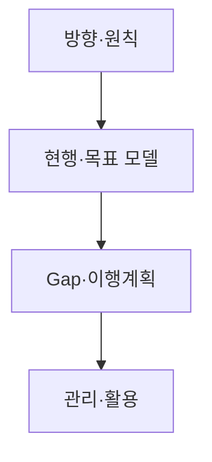
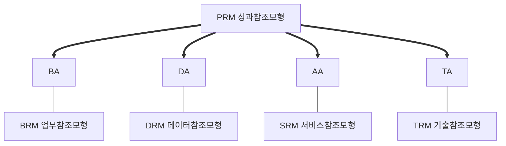

## 지식 로드맵 내 현재 위치

  IT 전략·관리
  전사 Architecture·거버넌스
  <strong>EA·ITA</strong>

## 30초 인출

- 본질: 경영전략과 업무(BA)·데이터(DA)·응용(AA)·기술(TA)의 관계를 전사 관점에서 조망하고 통제하는 관리체계
- 메커니즘: 방향/원칙 수립 → As-Is/To-Be 4대 아키텍처 모델링 → Gap 분석 및 Transition Plan → EAMS 적합성 검토
- 판정 기준: 범정부 EA 5대 참조모형(PRM/BRM/SRM/DRM/TRM) 준수율(95% 이상) 및 공통 컴포넌트 재사용 적합성

약어·전문용어

- **EA(Enterprise Architecture)**: 조직의 전략·업무와 정보기술 구조·관계를 전사 관점에서 관리하는 체계
- **ITA(Information Technology Architecture)**: 전자정부법에서 사용하는 정보기술아키텍처
- **EAMS(Enterprise Architecture Management System)**: Architecture 정보를 등록·관리·활용하는 시스템
- **Gap Analysis**: 현행과 목표 상태의 차이와 전환과제를 식별하는 분석
- **Reference Model**: 기관 간 공통 분류·표준·재사용을 지원하는 참조모형

## 예상문제

> **(미출제 예상·25점)** EA·ITA의 개념·구성체계와 범정부 EA 참조모형을 설명하고, 실효성 확보를 위한 문제점·대응책을 제시하시오.

## Ⅰ. EA·ITA 개요

> Architecture 산출물을 만드는 활동이 아니라 정보화 의사결정에 지속 활용하는 관리체계임.

- **정의**: 조직의 전략·업무와 데이터·응용·기술의 현행·목표 구조 및 이행계획을 전사적으로 관리하는 체계
- **목적**: 전략 정렬·중복 방지·상호운용성·정보자원 투자 효율성 확보

## Ⅱ. 구성체계·수립절차

| 구성 | 핵심 | 산출 |
|---|---|---|
| 방향 | 비전·원칙·범위·Framework | EA 원칙·메타모델 |
| Architecture | 업무·데이터·응용·기술의 As-Is·To-Be | 현행·목표 모델 |
| 이행 | Gap·과제·우선순위·의존성 | Transition Plan |
| 관리 | 조직·절차·EAMS·성과 | 적합성 검토·현행화 기록 |

## Ⅲ. 범정부 EA 참조모형 및 4대 아키텍처 연계

| 모형 | 역할 |
|---|---|
| **PRM**(Performance Reference Model) | 정보화 성과 분류·측정 |
| **BRM**(Business Reference Model) | 조직 독립적 업무기능 분류 |
| **SRM**(Service Reference Model) | 응용서비스·컴포넌트 분류·재사용 |
| **DRM**(Data Reference Model) | 데이터 분류·구조·교환·관리 |
| **TRM**(Technical Reference Model) | 기술·표준 분류 |

## Ⅳ. EA·Solution Architecture 비교

| 기준 | EA | Solution Architecture |
|---|---|---|
| 범위 | 전사·기관 | 단위 사업·시스템 |
| 관심 | 전략정렬·표준·포트폴리오 | 요구사항·구조·품질속성 |
| 산출 | 원칙·Reference Model·Roadmap | Solution 구조·Interface·기술선택 |
| 관계 | 원칙·표준·예외 통제 제공 | EA 준수·예외 요청·구현 피드백 |

## Ⅴ. 문제점·대응책

| 위험 | 대책 | 효과 |
|---|---|---|
| 문서화 자체가 목적 | 투자·사업·평가 Gate와 연계 | 활용성 확보 |
| 현행정보 노후화 | 변경절차·자산정보 자동연계 | 최신성 향상 |
| 상세도 과다 | 의사결정별 최소 산출물 | 관리비용 절감 |
| 표준 경직성 | 예외 승인·기한·회수 절차 | 혁신·통제 균형 |

## Ⅵ. 결론·기술사적 제언

### 학습자 통찰 메모 — 답안 밖

- [핵심 통찰]: EA의 품질은 모델 개수나 장표 분량이 아니라, 실제 예산 배정·신규 사업 심의·변경 의사결정을 얼마나 일관되고 구속력 있게 통제하는가로 평가되어야 함.
- 나라면: EAMS를 정적인 문서 저장소가 아닌 '실시간 자산 카탈로그(CI/CD 파이프라인 및 CMDB 연동)'로 전환하여 형상 변경 시 메타데이터가 자동 갱신되도록 구성하고, 아키텍처 적합성 검토를 전자정부 사전협의 필수 게이트로 묶어 무단 표준 위반을 차단하겠음.

### 실전 답안용 기술사적 제언

- **판정 기준**: 정보화 사업 기획 및 예산 편성 시 범정부 EA 5대 참조모형(PRM/BRM/SRM/DRM/TRM) 준수율 95% 이상 달성 여부 및 공통 컴포넌트 재사용 타당성 검토 의무화
- **대응 방안**: EAMS 기반 아키텍처 적합성 검토(Review Gate) 제도화, 예외 승인 시 일몰제(최장 2년) 적용 및 기술부채 대장 등록
- **검증 체계**: 단위 프로젝트 검수 단계 감리 시 As-Is/To-Be 산출물과 형상관리(CMDB/EAMS) 동기화 일치율 전수 실사
- **기대 효과**: 범부처 시스템 중복 투자 방지(연간 예산 15% 절감), 데이터 상호운용성 보장 및 전자정부 서비스 무중단 연계 가속화

## 1교시 10점 답안 발췌

### 1. 정의·목적

- **정의**: 경영 전략에 맞춰 업무(BA), 데이터(DA), 응용(AA), 기술(TA)의 현행과 목표 구조를 정의하고 이행을 통제하는 **전사 정보기술 아키텍처 관리체계**
- **목적**: 정보화 투자 중복 방지, 시스템 간 상호운용성 보장 및 IT 거버넌스 실효성 확보

### 2. 범정부 EA 5대 참조모형 및 4대 뷰 연계

### 3. 핵심 통제

| 축 | 핵심 통제 방안 |
|---|---|
| **Architecture** | BA·DA·AA·TA 4대 도메인 현행(As-Is) 및 목표(To-Be) 모델링 |
| **Transition** | Gap 분석 기반 전환 과제 우선순위 도출 및 실행 로드맵 수립 |
| **Governance** | EAMS 기반 아키텍처 적합성 검토(Review Gate) 및 메타데이터 자동 현행화 |

## 출제 이력과 검증 출처

- 공식 문제지 원문 확인 전까지 직접 기출로 단정하지 않음
- [전자정부법 제46조, 기관별 정보기술아키텍처 도입·운영](https://www.law.go.kr/법령/전자정부법/제46조)
- [행정안전부, 범정부 EA 참조모형 개정안](https://www.mois.go.kr/frt/bbs/type001/commonSelectBoardArticle.do?bbsId=BBSMSTR_000000000045&nttId=34410)
- [The Open Group, TOGAF Standard](https://www.opengroup.org/togaf)

## 학습 체크

- [ ] Ⅰ: EA·ITA의 정의·목적을 설명할 수 있는가?
- [ ] Ⅱ: 방향부터 관리·활용까지 구성·산출을 연결할 수 있는가?
- [ ] Ⅲ: PRM·BRM·SRM·DRM·TRM의 역할을 구분할 수 있는가?
- [ ] Ⅳ: EA와 Solution Architecture의 역할 관계를 비교할 수 있는가?
- [ ] Ⅴ: 문서화·노후화·과다 상세·경직성의 대응책을 제시할 수 있는가?
- [ ] Ⅵ: Review부터 EAMS 현행화까지 폐루프를 그릴 수 있는가?

## 연결 토픽

- 이전: [106. 품질비용](./106_cost_of_quality_coq.md)
- 관련: [003. ISP](./003_isp.md) · [001. ISMP](./001_ismp.md)
- 다음: [110. Programmable Money·AI Agent](./110_programmable_money_ai_agents.md)
