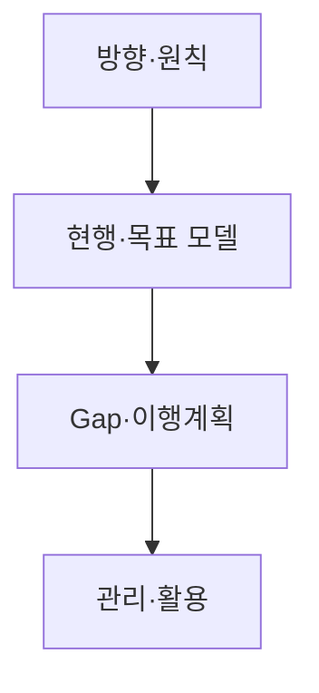
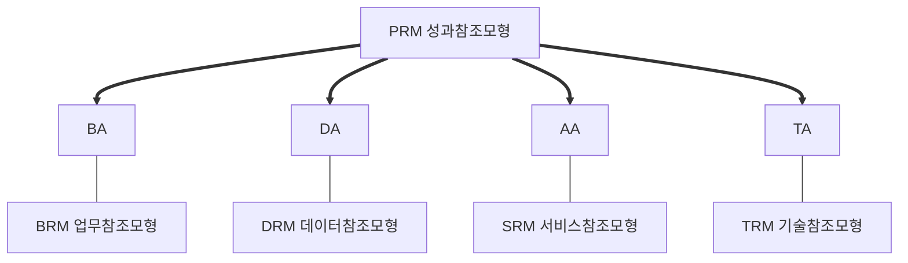
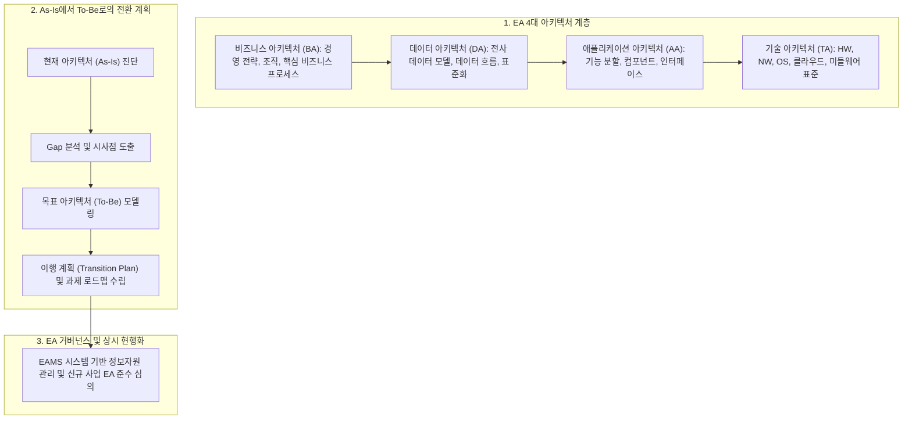

## 지식 로드맵 내 현재 위치
현재 위치: IT 전략·관리 → **EA**·ITA

## 30초 인출

- 본질: 경영전략과 업무(BA)·데이터(DA)·응용(AA)·기술(TA)의 관계를 전사 관점에서 조망하고 통제하는 관리체계이다.
- 메커니즘: 방향/원칙 수립 → As-Is/To-Be **4대 아키텍처** 모델링 → **Gap 분석** 및 Transition Plan → **EA**MS 적합성 검토한다.
- 판정 기준: 범정부 **EA** 5대 참조모형(PRM/BRM/SRM/DRM/TRM) 반영 여부와 공통 컴포넌트 재사용 적합성이다.

핵심 용어

- **EA(Enterprise Architecture)**: 조직의 전략·업무와 데이터·응용·기술 구조의 관계를 전사 관점에서 설계·관리하는 체계이다.
- **ITA(Information Technology Architecture)**: 공공기관의 정보기술 자원을 업무와 연계해 관리하기 위한 정보기술 아키텍처이다.
- **EAMS(Enterprise Architecture Management System)**: Architecture 정보를 등록·관리·활용하는 시스템이다.
- **Gap Analysis**: 현행과 목표 상태의 차이와 전환과제를 식별하는 분석이다.
- **Reference Model**: 기관 간 공통 분류·표준·재사용을 지원하는 참조모형이다.

## 예상문제

> **(미출제 예상·25점)** **EA**·ITA의 개념·구성체계와 범정부 **EA** 참조모형을 설명하고, 실효성 확보를 위한 문제점·대응책을 제시하시오.

## Ⅰ. **EA**·ITA 개요

- 정의: 조직의 **경영전략**을 업무·데이터·응용·기술 **아키텍처**로 연결하고 현행과 목표의 차이를 **이행계획**으로 통제하는 전사 **아키텍처** 관리체계
- 목적: 전략과 정보자원의 정렬, 중복 투자 방지, 상호운용성 확보를 지원한다.

## Ⅱ. 구성체계·수립절차

| 구성 | 핵심 | 산출 |
|---|---|---|
| 방향 | 비전·원칙·범위·Framework | **EA** 원칙·메타모델 |
| Architecture | 업무·데이터·응용·기술의 As-Is·To-Be | 현행·목표 모델 |
| 이행 | Gap·과제·우선순위·의존성 | Transition Plan |
| 관리 | 조직·절차·**EA**MS·성과 | 적합성 검토·현행화 기록 |

## Ⅲ. 범정부 **EA** 참조모형 및 **4대 아키텍처** 연계

| 모형 | 역할 |
|---|---|
| **PRM**(Performance Reference Model) | 정보화 성과 분류·측정 |
| **BRM**(Business Reference Model) | 조직 독립적 업무기능 분류 |
| **SRM**(Service Reference Model) | 응용서비스·컴포넌트 분류·재사용 |
| **DRM**(Data Reference Model) | 데이터 분류·구조·교환·관리 |
| **TRM**(Technical Reference Model) | 기술·표준 분류 |

## Ⅳ. **EA**·Solution Architecture 비교

| 기준 | **EA** | Solution Architecture |
|---|---|---|
| 범위 | 전사·기관 | 단위 사업·시스템 |
| 관심 | 전략정렬·표준·포트폴리오 | 요구사항·구조·품질속성 |
| 산출 | 원칙·Reference Model·Roadmap | Solution 구조·Interface·기술선택 |
| 관계 | 원칙·표준·예외 통제 제공 | **EA** 준수·예외 요청·구현 피드백 |

## Ⅴ. 문제점·대응책

| 위험 | 대책 | 효과 |
|---|---|---|
| 문서화 자체가 목적 | 투자·사업·평가 Gate와 연계 | 활용성 확보 |
| 현행정보 노후화 | 변경절차·자산정보 자동연계 | 최신성 향상 |
| 상세도 과다 | 의사결정별 최소 산출물 | 관리비용 절감 |
| 표준 경직성 | 예외 승인·기한·회수 절차 | 혁신·통제 균형 |

## Ⅵ. 결론·기술사적 제언

### 실전 답안용 기술사적 제언

- 문제: 전사 정보화 투자가 부서별로 분절 추진되어 시스템 간 인터페이스가 복잡해지고 데이터 사일로가 심화되며 중복 투자로 인한 비효율 발생.
- 해결 방안: 전사 관점에서 비즈니스(BA), 데이터(DA), 애플리케이션(AA), 기술(TA) 아키텍처를 유기적으로 모델링하고, As-Is에서 To-Be로의 전환 로드맵을 상시 현행화하는 엔터프라이즈 아키텍처 거버넌스를 구축함.

## 1교시 10점 답안 발췌

### 1. 정의·목적

- 정의: 조직의 비즈니스 전략과 정보화 자원을 총체적으로 파악하고, 비즈니스·데이터·애플리케이션·기술 구조를 체계적으로 상호 연계하여 To-Be 목표 모델을 달성하는 전사 정보기술 청사진
- 목적: 전사 IT 자원의 가시성 및 상호운용성 확보 · 시스템 중복 투자 방지 · 경영 전략과 IT 인프라의 완전한 일체화 달성

- **정의**: 경영 전략에 맞춰 업무(BA), 데이터(DA), 응용(AA), 기술(TA)의 현행과 목표 구조를 정의하고 이행을 통제하는 **전사 정보기술 아키텍처 관리체계**.
- **목적**: 정보화 투자 중복 방지, 시스템 간 상호운용성 보장 및 IT 거버넌스 실효성 확보.

### 2. 범정부 **EA** 5대 참조모형 및 4대 뷰 연계

### 3. 핵심 통제

| 축 | 핵심 통제 방안 |
|---|---|
| **Architecture** | BA·DA·AA·TA 4대 도메인 현행(As-Is) 및 목표(To-Be) 모델링 |
| **Transition** | **Gap 분석** 기반 전환 과제 우선순위 도출 및 실행 로드맵 수립 |
| **Governance** | **EA**MS 기반 아키텍처 적합성 검토(Review Gate) 및 메타데이터 자동 현행화 |

## 출제 이력과 검증 출처

- 공식 문제지 원문 확인 전까지 직접 기출로 단정하지 않음
- [전자정부법 제46조, 기관별 정보기술아키텍처 도입·운영](https://www.law.go.kr/법령/전자정부법/제46조)
- [행정안전부, 범정부 **EA** 참조모형 개정안](https://www.mois.go.kr/frt/bbs/type001/commonSelectBoardArticle.do?bbsId=BBSMSTR_000000000045&nttId=34410)
- [The Open Group, TOGAF Standard](https://www.opengroup.org/togaf)

## 학습 체크

- [ ] Ⅰ: **EA**·ITA의 정의·목적을 설명할 수 있는가?
- [ ] Ⅱ: 방향부터 관리·활용까지 구성·산출을 연결할 수 있는가?
- [ ] Ⅲ: PRM·BRM·SRM·DRM·TRM의 역할을 구분할 수 있는가?
- [ ] Ⅳ: **EA**와 Solution Architecture의 역할 관계를 비교할 수 있는가?
- [ ] Ⅴ: 문서화·노후화·과다 상세·경직성의 대응책을 제시할 수 있는가?
- [ ] Ⅵ: Review부터 **EA**MS 현행화까지 폐루프를 그릴 수 있는가?

## 연결 토픽

- 이전: [106. 품질비용](./106_cost_of_quality_coq.md)
- 관련: [003. ISP](./003_isp.md) · [001. ISMP](./001_ismp.md)
- 다음: [110. Programmable Money·AI Agent](./110_programmable_money_ai_agents.md)
