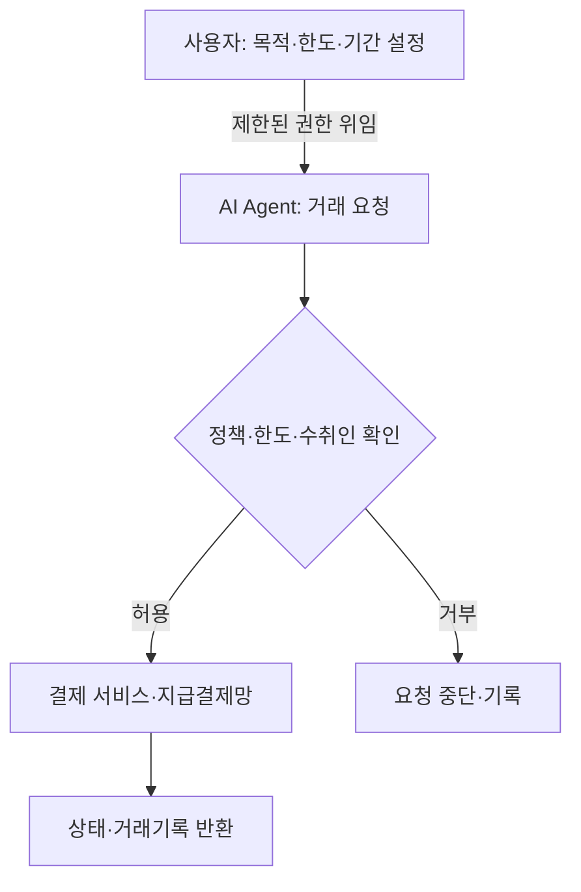

## 지식 로드맵 내 현재 위치
현재 위치: IT 전략·관리 → Programmable Money·AI Agent 결제

## 30초 인출

- 본질: Programmable Money·AI Agent 결제는 정해 둔 규칙으로 결제 조건을 자동 처리하고, AI 에이전트의 거래 권한을 통제하는 방식이다.
- 메커니즘: 사용자가 목적·한도를 정해 권한을 위임하고, 에이전트의 결제 요청을 정책·한도 확인 뒤 지급결제 절차로 전달한다.

핵심 용어

- **Programmable Money·AI Agent 결제**: 결제 조건을 자동 처리하고 에이전트의 거래 권한을 통제하는 지급 방식.
- **Programmable Money**: 사용 목적·시점·상대방 등에 제약을 둔 디지털 화폐.
- **Programmable Payment**: 정한 조건이 충족될 때 결제 지시가 자동 실행되는 지급 방식.
- **AI Agent**: 목표를 받아 도구를 선택·호출하고, 설정된 권한 안에서 여러 작업을 수행하는 소프트웨어 시스템.
- **PSP(Payment Service Provider)**: 이용자·가맹점에 지급결제 서비스를 제공하거나 결제망을 연결하는 사업자.
- **Conditional Payment**: 상품 인도나 서비스 조건 확인 뒤 대금을 지급하도록 설계한 조건부 결제.

---

## 1교시 예상문제 (10점)

> AI Agent 조건부 결제 구조와 결제 통제 계층을 설명하시오. (예상·10점)

---

## 1교시 10점 답안

### Ⅰ. 개요

| 구분 | 핵심 |
|---|---|
| 정의 | **Programmable Money·AI Agent 결제**는 결제 조건을 자동 처리하고 에이전트의 거래 권한을 통제하는 지급 방식이다. |
| 목적 | 반복·조건부 거래의 자동화를 지원하고, 위임된 권한 안에서 결제를 실행한다. |

### Ⅱ. 결제 권한과 실행 흐름

### Ⅲ. 권한 통제

| 통제층 | 핵심 통제 내용 |
|---|---|
| 통제 지점 | 설계 기준 |
|---|---|
| 위임 권한 | 거래 목적·금액 한도·유효기간·취소 방법을 사전에 설정 |
| 요청 검증 | 수취인·중복 요청·잔액·위험 신호를 지급 전에 확인 |
| 실패 처리 | 거부·시간초과·외부 시스템 오류 때 자동 재시도 범위와 사람 승인 조건을 정함 |

---

## 2~4교시 예상문제 (25점)

> Programmable Money와 Programmable Payment의 차이를 설명하고, AI Agent 결제의 권한 위임 구조와 주요 위험·통제방안을 제시하시오. (예상·25점)

---

## 2~4교시 25점 답안

## Ⅰ. 개요

| 구분 | 핵심 |
|---|---|
| 정의 | **Programmable Money·AI Agent 결제**는 결제 조건을 자동 처리하고 에이전트의 거래 권한을 통제하는 지급 방식이다. |
| 목적 | 반복·조건부 거래의 자동화를 지원하고, 위임된 권한 안에서 결제를 실행한다. |

## Ⅱ. Money·Payment 비교

| 구분 | Programmable Money | Programmable Payment |
|---|---|---|
| 규칙이 적용되는 곳 | 화폐 자체의 사용 가능 목적·조건 | 결제 지시와 이체가 실행되는 조건 |
| 예 | 사용처·기간이 제한된 바우처 | 배송 확인 뒤 대금을 지급하는 조건부 결제 |
| 주의점 | 제한된 용도의 화폐가 범용 화폐와 혼동되지 않도록 설계 | 조건 확인·분쟁·환급 절차를 설계 |

중앙은행 디지털화폐처럼 디지털 형태의 화폐라고 해서 곧바로 용도가 제한된 Programmable Money가 되는 것은 아니다. ECB는 디지털 유로를 제한된 용도의 돈과 구분하면서 조건부 결제 지원은 별도로 설명한다.

## Ⅲ. 에이전트 권한 위임과 결제 요청

사용자는 거래 목적·한도·기간과 중지 방법을 먼저 정한다. 에이전트가 만든 요청은 지급 서비스의 인증·사기방지 절차를 거쳐야 하며, 결제 완료 여부와 실패 사유를 사용자에게 돌려준다. 이 그림은 제안 아키텍처이며 특정 표준이나 단일 결제망을 뜻하지 않는다.

## Ⅳ. 결제 실행 전후의 책임 구분

| 참여자 | 책임 |
|---|---|---|
| 사용자·기관 | 위임할 목적과 한도 설정, 계정·권한 회수 |
| 에이전트 운영자 | 모델·도구 접근 통제, 요청·결과 기록 |
| PSP·결제 서비스 | 본인확인·거래 승인·정산·분쟁 절차 수행 |

## Ⅴ. 문제점·대응책

| 위험 | 대책 |
|---|---|---|
| 에이전트 오류·중복 요청 | 금액·빈도 제한, 요청 식별자와 중복 검사 |
| 자격정보 탈취 | 최소 권한, 안전한 자격정보 저장, 즉시 회수 절차 |
| 수취인·조건 오류 | 승인된 수취인 목록, 독립된 조건 확인, 중요 거래 사람 승인 |
| 분쟁·오결제 | 취소·환급 가능 범위와 이의제기 창구 사전 안내 |

## Ⅵ. 권한 회수와 사람 승인 기준을 먼저 정하는 기술사적 제언

| 문제 | 해결 방안 |
|---|---|
| 위임 권한이 포괄적이거나 만료·회수 절차가 없으면 에이전트 오류가 반복 결제로 이어질 수 있다. | 시범 적용은 허용 목적·수취인·건별 한도·유효기간을 좁혀 시작하고, 한도 초과·조건 불일치 때 요청을 멈춰 사람이 확인하게 한다. 거래 취소·권한 회수와 책임자를 운영 절차에 명시한 뒤 범위를 단계적으로 넓힌다. |

## 출제 이력과 검증 출처

- 공식 문제지 원문 확인 전까지 직접 기출로 단정하지 않음
- European Central Bank, [FAQs on the digital euro, Q20: Would the digital euro be programmable money?](https://www.ecb.europa.eu/euro/digital_euro/faqs/html/ecb.faq_digital_euro.en.html)
- European Central Bank, [Preparation phase of a digital euro: Closing report](https://www.ecb.europa.eu/euro/digital_euro/progress/html/ecb.deprp202510.en.html)
- Bank for International Settlements, [AI agents for cash management in payment systems](https://www.bis.org/publ/work1310.pdf)

## 연결 토픽

- 이전: [107. EA·ITA](./107_ea_ita.md)
- 관련: [050. AI 거버넌스 플랫폼](./050_ai_governance_platform.md) · [036. NIST AI RMF](./036_nist_ai_rmf.md)
- 다음: [111. Six Sigma DMAIC](./111_six_sigma_dmaic.md)
