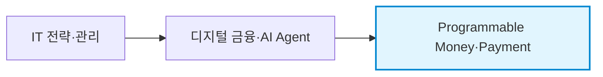
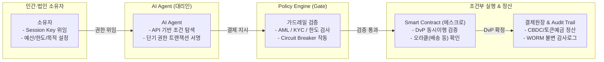
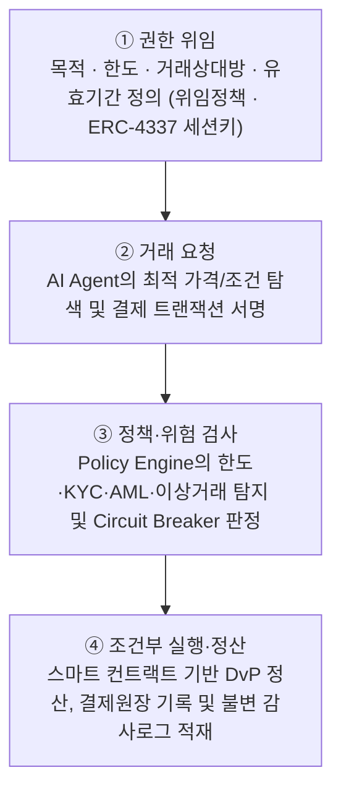
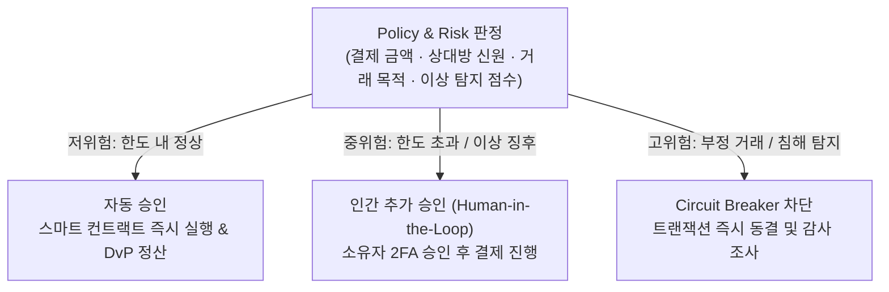

## 지식 로드맵 내 현재 위치

## 30초 인출

- 본질: 화폐 자체에 사용 조건이 부여된 Programmable Money와 결제 실행 조건이 자동화된 Programmable Payment를 AI Agent 거래에 적용하는 메커니즘
- 메커니즘: 소유자 세션키 위임 → AI Agent 결제 요청 → Policy Engine(한도/AML) 검증 → 스마트 컨트랙트 DvP 정산 및 불변 감사로그
- 판정 기준: ERC-4337 기반 계정 추상화/단기 세션키 적용 여부, 이상 거래 시 Circuit Breaker 작동 및 불가역 WORM 감사 추적성

약어·전문용어

- **Programmable Money**: 화폐 단위 자체의 사용처·기간·지역 등에 조건이 부여된 디지털 화폐
- **Programmable Payment**: 조건 충족 시 결제지시를 자동 실행하는 기능
- **AI(Artificial Intelligence) Agent**: 목표와 권한 범위에서 도구를 사용해 과업을 수행하는 인공지능 시스템
- **CBDC(Central Bank Digital Currency)**: 중앙은행이 발행하는 디지털 형태의 중앙은행 화폐
- **DvP(Delivery versus Payment)**: 자산 인도와 대금 지급을 조건부로 연계하는 결제 방식
- **KYC(Know Your Customer)**: 고객 신원 확인 절차
- **AML(Anti-Money Laundering)**: 자금세탁 방지 통제
- **PSP(Payment Service Provider)**: 지급결제 서비스를 제공하는 사업자
- **RACI(Responsible, Accountable, Consulted, Informed)**: 역할별 수행·책임·협의·통보 관계를 정한 표

## 예상문제

> **(미출제 예상·25점)** Programmable Money와 Programmable Payment의 차이를 설명하고, AI Agent 결제 구조와 위험·통제방안을 제시하시오.

## Ⅰ. 개요

> AI Agent는 독립적 법적 주체라기보다 인간·법인이 정한 권한 안에서 결제 요청을 실행하는 대리 시스템으로 설계해야 함.

- **정의**: Programmable Money는 화폐의 사용조건을, Programmable Payment는 결제지시의 실행조건을 코드로 통제하는 방식
- **목적**: 조건부 거래 자동화·정산 효율화·기계 간 소액거래 지원

## Ⅱ. Money·Payment 비교

| 기준 | Programmable Money | Programmable Payment |
|---|---|---|
| 조건 대상 | 화폐 단위 | 결제지시·업무규칙 |
| 제약 | 사용처·기간·지역 등 | 지급시점·검수·승인 등 |
| 쟁점 | 화폐 단일성·범용성 | 오류·취소·분쟁·책임 |
| 예시 | 목적 제한형 Voucher | Pay-on-delivery·Escrow |

CBDC·토큰화 예금·Stablecoin은 구현 가능한 결제자산의 유형이며, 그 자체만으로 Programmable Money라고 단정하지 않음.

## Ⅲ. AI Agent 결제 아키텍처 및 절차

## Ⅳ. 결제수단별 특성

| 수단 | 강점 | 주요 위험 |
|---|---|---|
| Tokenised Deposit | 은행 예금 기반·액면 상환 | 은행 간 상호운용성 |
| Stablecoin | 개방형 네트워크 활용 | 준비자산·가격·규제 |
| Wholesale CBDC | 중앙은행 화폐 결제 | 접근범위·시스템 연계 |
| 기존 지급결제망 | 법·운영체계 성숙 | API·소액거래 제약 |

## Ⅴ. 문제점·대응책

| 위험 | 대책 | 효과 |
|---|---|---|
| Agent 오판·반복 결제 | 한도·속도제한·Circuit Breaker | 손실 범위 제한 |
| 권한 탈취 | 단기자격·키 격리·거래서명 | 자금 접근 보호 |
| 상대방·서비스 사기 | Allowlist·평판·Escrow | 거래위험 감소 |
| 책임 불명확 | 소유자·운영자·PSP의 RACI | 분쟁 책임 명확화 |
| 취소 불가·오라클 오류 | 보류·취소·이의제기 절차 | 소비자·기업 보호 |

## Ⅵ. 결론·기술사적 제언

### 학습자 통찰 메모 — 답안 밖

- [핵심 통찰]: Agent의 자율성은 자체 지갑 보유가 아니라, 책임주체(Principal)가 부여한 정책 범위 안에서 실시간 차단·취소·감사가 가능한 통제 거버넌스 위에서만 성립함.
- 나라면: AI Agent에 Master Key를 절대 위임하지 않고 ERC-4337 기반의 계정 추상화(Smart Account)와 세션 키(Session Key)를 적용하겠음. 이를 통해 건당 $50 미만 반복 결제는 허용하되 이상 패턴 탐지 시 서킷 브레이커로 자동 동결하는 안전망을 구축하겠다.

### 실전 답안용 기술사적 제언

- **판정 기준**: AI Agent 결제 시스템 구축 시 1건당 결제액 $100 초과 또는 이상 탐지 점수 70점 이상 시 인간 승인(Human-in-the-Loop) 필수 전환
- **대응 방안**: ERC-4337 계정 추상화 기반 권한 위임, 화이트리스트(Allowlist) 가맹점 한정 결제 허용 및 자동 서킷 브레이커(Circuit Breaker) 탑재
- **검증 체계**: 스마트 컨트랙트 보안 감사(Audit) 3중 교차 검증 및 트랜잭션 단위 불가역 WORM 감사로그 정합성 실시간 검증
- **기대 효과**: 기계 간(M2M) 초소액 결제(Micro-payment) 자동화 효율 90% 달성 및 비정상 오발주·금융 사고 리스크 제로화

## 1교시 10점 답안 발췌

### 1. 정의·목적

- **정의**: 화폐 사용 조건(Programmable Money)과 결제 실행 규칙(Programmable Payment)을 코드로 통제하여 AI Agent의 자율 거래를 안전하게 실행하는 **차세대 디지털 금융 아키텍처**
- **목적**: 기계 간(M2M) 초소액 결제 자동화, 거래 신뢰성 확보 및 에이전트 오동작·자금 탈취 방지

### 2. AI Agent 조건부 결제 아키텍처

### 3. 핵심 통제 계층

| 통제층 | 핵심 통제 내용 |
|---|---|
| **권한 계층** | ERC-4337 계정 추상화, 단기 세션키, 화이트리스트 가맹점 한정 |
| **위험 계층** | 실시간 Policy Engine, 이상 거래 탐지 시 Circuit Breaker 자동 차단 |
| **정산 계층** | 스마트 컨트랙트 기반 DvP 조건부 정산 및 WORM 불변 감사 추적성 |

## 출제 이력과 검증 출처

- 공식 문제지 원문 확인 전까지 직접 기출로 단정하지 않음
- [ECB, Progress on the investigation phase of a digital euro](https://www.ecb.europa.eu/euro/digital_euro/timeline/profuse/shared/pdf/ecb.degov230424_progress.en.pdf)
- [BIS, Pushing the monetary frontier: stablecoins and tokenised deposits](https://www.bis.org/speeches/20260828-pushing-monetary-frontier-stablecoins-and-tokenised-deposits)
- [Ethereum, ERC-4337](https://eips.ethereum.org/EIPS/eip-4337)

## 학습 체크

- [ ] Ⅰ: Programmable Money·Payment의 정의·목적을 설명할 수 있는가?
- [ ] Ⅱ: Money와 Payment의 조건 대상·쟁점을 비교할 수 있는가?
- [ ] Ⅲ: 권한 위임부터 정산까지 활동·산출을 연결할 수 있는가?
- [ ] Ⅳ: 결제수단별 강점·위험을 비교할 수 있는가?
- [ ] Ⅴ: 오판·탈취·사기·책임·취소 위험의 대응책을 제시할 수 있는가?
- [ ] Ⅵ: 위험도별 승인 분기를 그릴 수 있는가?

## 연결 토픽

- 이전: [107. EA·ITA](./107_ea_ita.md)
- 관련: [050. AI 거버넌스 플랫폼](./050_ai_governance_platform.md) · [036. NIST AI RMF](./036_nist_ai_rmf.md)
- 다음: [111. Six Sigma DMAIC](./111_six_sigma_dmaic.md)
