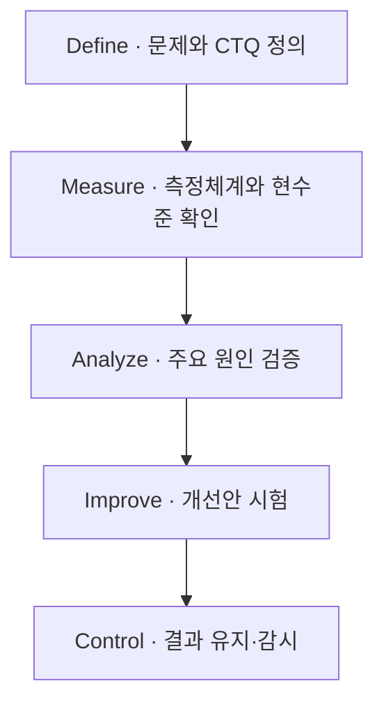

## 지식 로드맵 내 현재 위치
현재 위치: IT 전략·관리 → Six Sigma DMAIC

## 30초 인출

- 본질: Six Sigma DMAIC는 이미 운영 중인 프로세스의 문제 원인을 찾아 개선하고, 성과가 유지되도록 관리하는 방법이다.
- 메커니즘: Define 문제 규정 → Measure 현수준 측정 → Analyze 원인 검증 → Improve 대안 시험 → Control 개선 결과 유지.

핵심 용어

- **DMAIC(Define, Measure, Analyze, Improve, Control)** : 프로세스 결함과 산포를 축소하기 위한 6시그마 5단계 문제해결 절차
- **Six Sigma DMAIC**: 프로세스 문제를 데이터로 분석·개선하고 개선 결과를 관리하는 다섯 단계 방법.
- **VOC(Voice of Customer)** : 설문·인터뷰 등을 통해 수집된 고객의 직접적인 요구와 피드백 정보
- **CTQ(Critical to Quality)** : VOC를 측정 가능한 정량적 목표치로 전환한 핵심 품질특성
- **DPMO(Defects Per Million Opportunities)** : 결함 기회 100만 건당 실제 발생한 결함 수를 나타내는 통계적 품질 척도
- **MSA(Measurement System Analysis)** : 데이터 측정 오차와 시스템 신뢰성을 검증하는 측정시스템 분석(Gage R&R)
- **SPC(Statistical Process Control)** : 관리도를 활용해 프로세스의 비정상적 변동을 감시·통제하는 통계적 공정관리 기법
- **SIPOC(Supplier, Input, Process, Output, Customer)** : 공급자부터 고객까지 프로세스 전반의 경계와 흐름을 조망하는 요약 도식
- **DOE(Design of Experiments)** : 프로세스 인자들의 주효과와 상호작용을 검증해 최적 조건을 도출하는 실험계획법
- **FMEA(Failure Mode and Effects Analysis)** : 잠재 고장 형태의 심각도·발생도·검출도를 평가해 위험 우선순위를 도출하는 분석 기법
- **SOP(Standard Operating Procedure)** : 개선된 프로세스의 재발 방지와 현장 안착을 위해 정의한 표준운영절차서
- **SLI(Service Level Indicator)** : 가용성·지연시간 등 IT 서비스 수준의 현 상태를 정량 측정한 지표

---

## 1교시 예상문제 (10점)

> Six Sigma의 DMAIC 단계와 단계별 핵심 통제를 설명하시오. (예상·10점)

---

## 1교시 10점 답안

### Ⅰ. 개요

| 구분 | 핵심 |
|---|---|
| 정의 | **Six Sigma DMAIC**는 기존 프로세스의 문제를 데이터로 분석·개선하고 그 성과를 관리하는 다섯 단계 방법이다. |
| 목적 | 고객이 중요하게 여기는 품질 요구를 충족하고 결함·변동을 줄인다. |

### Ⅱ. DMAIC 단계 흐름

### Ⅲ. 단계별 핵심 통제

| 단계 | 핵심 활동 및 산출물 |
|---|---|
| Define·Measure | 고객 요구를 **CTQ** 로 구체화하고, **MSA** 로 측정자료의 신뢰성을 점검한 뒤 현재 성과를 기록 |
| Analyze·Improve | 자료와 분석을 통해 원인을 검증하고, 개선안을 시험해 결과를 비교 |
| Control | **SPC** 등 적절한 감시방법·책임자·대응 기준을 정해 성과 변화를 관리 |

---

## 2~4교시 예상문제 (25점)

> Six Sigma의 DMAIC 단계별 활동과 주요 도구를 설명하고, Lean과 비교해 적용 시 유의점을 제시하시오. (예상·25점)

---

## 2~4교시 25점 답안

## Ⅰ. Six Sigma·DMAIC 개요

| 구분 | 핵심 |
|---|---|
| 정의 | **Six Sigma DMAIC**는 기존 프로세스의 문제를 데이터로 분석·개선하고 그 성과를 관리하는 다섯 단계 방법이다. |
| 목적 | 고객이 중요하게 여기는 품질 요구를 충족하고 결함·변동을 줄인다. |

## Ⅱ. DMAIC 단계별 활동·산출

| 단계 | 활동 | 주요 도구 | 산출 |
|---|---|---|---|
| Define | 문제·고객·범위·목표 정의 | VOC· **CTQ** ·SIPOC | Project Charter |
| Measure | 측정체계 검증·Baseline 측정 | MSA·DPMO·Process Capability | 측정계획·현수준 |
| Analyze | 근본원인 검증 | Pareto·가설검정·회귀 | Vital Few 원인 |
| Improve | 대안 설계·Pilot 검증 | DOE·FMEA·Pilot | 개선안·검증결과 |
| Control | 표준화·감시·대응 | SPC·Control Plan·SOP | 관리계획·표준 |

## Ⅲ. 6시그마 통계적 메커니즘과 DMAIC 파이프라인

수치 기준은 업종·특성·고객 요구와 목표에 따라 정한다. 흔히 제시되는 3.4 DPMO는 1.5σ 평균 이동 가정을 둔 장기 시그마 수준의 관례이며, 모든 개선 과제에 강제되는 DMAIC 합격선은 아니다.

## Ⅳ. Six Sigma·Lean 비교

| 기준 | **Six Sigma** | Lean |
|---|---|---|
| 초점 | 결함·변동 감소 | 낭비·대기·흐름 개선 |
| 접근 | 통계적 분석· **DMAIC** | Value Stream·Kaizen |
| 도구 | MSA·가설검정·DOE·SPC | VSM·Kanban·5S |
| 결합 | 복잡한 원인 검증 | 병목 제거·Flow 개선 |

## Ⅴ. 문제점·대응책

| 위험 | 대책 | 효과 |
|---|---|---|
| 도구 중심 과잉분석 | **CTQ** ·Business Case 우선 | 문제 중심 개선 |
| 측정데이터 불신 | MSA·수집정의·결측 점검 | 분석 신뢰성 확보 |
| 상관관계를 원인으로 오인 | 가설검정·실험·Pilot | 인과 근거 강화 |
| 개선 후 회귀 | Control Plan·Owner·반응계획 | 성과 지속 |

## Ⅵ. 측정 가능한 개선목표와 유지 책임을 함께 정하는 기술사적 제언

| 문제 | 해결 방안 |
|---|---|
| 개선 활동이 분석 도구 사용에 치우치면 고객이 체감하는 품질과 성과 유지 책임이 흐려질 수 있다. | 착수 때 고객 요구를 측정 가능한 CTQ와 기준선으로 정하고, 개선 뒤에는 프로세스 책임자·감시 지표·이상 시 대응을 Control Plan에 명시한다. 결과가 유지되는지 정한 기간 동안 검토한다. |

## 출제 이력과 검증 출처

- 공식 문제지 원문 확인 전까지 직접 기출로 단정하지 않음
- [ASQ, DMAIC Process](https://asq.org/quality-resources/dmaic)
- [ASQ, **Six Sigma** ](https://asq.org/quality-resources/six-sigma)
- ASQ, [What Is 3.4 per Million?](https://asq.org/quality-progress/articles/what-is-34-per-million?id=d3d31b31c1da4f60b281025df9ccd057)

## 연결 토픽

- 이전: [110. Programmable Money·AI Agent 결제](./110_programmable_money_ai_agents.md)
- 관련: [106. 품질비용](./106_cost_of_quality_coq.md) · [113. SW 비용 산정](./113_software_cost_estimation.md)
- 다음: [112. CCPM·TOC](./112_critical_chain_toc.md)
