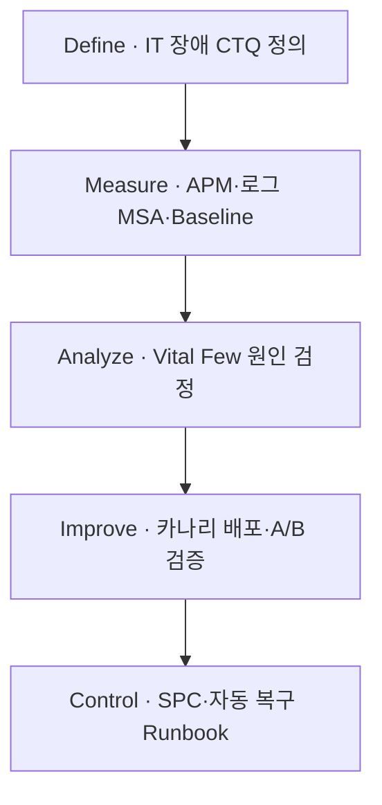
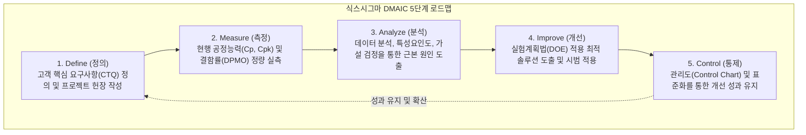

## 지식 로드맵 내 현재 위치
현재 위치: IT 전략·관리 → **Six Sigma** **DMAIC**

## 30초 인출

- 본질: Six Sigma DMAIC는 결함과 변동을 줄이기 위해 문제를 정의하고 측정·분석·개선·관리하는 다섯 단계 방법이다.
- 메커니즘: Define( **CTQ** 정의) → Measure(현수준/ **MSA** ) → Analyze(Vital Few 규명) → Improve(최적화/Pilot) → Control( **SPC** / **SOP** 표준화)한다.
- 판정 기준: 1.5σ Shift 감안 3.4 **DPMO** (높은 수준) 달성 여부, 공정능력지수(Cp ≥ 2.0, Cpk ≥ 1.5) 및 성과 회귀 방지 Control Plan이다.

핵심 용어

- **DMAIC(Define, Measure, Analyze, Improve, Control)** : 프로세스 결함과 산포를 축소하기 위한 6시그마 5단계 문제해결 절차
- **VOC(Voice of Customer)** : 설문·인터뷰 등을 통해 수집된 고객의 직접적인 요구와 피드백 정보
- **CTQ(Critical to Quality)** : VOC를 측정 가능한 정량적 목표치로 전환한 핵심 품질특성
- **DPMO(Defects Per Million Opportunities)** : 결함 기회 100만 건당 실제 발생한 결함 수를 나타내는 통계적 품질 척도
- **MSA(Measurement System Analysis)** : 데이터 측정 오차와 시스템 신뢰성을 검증하는 측정시스템 분석(Gage R&R)
- **SPC(Statistical Process Control)** : 관리도를 활용해 프로세스의 비정상적 변동을 감시·통제하는 통계적 공정관리 기법
- **SIPOC(Supplier, Input, Process, Output, Customer)** : 공급자부터 고객까지 프로세스 전반의 경계와 흐름을 조망하는 요약 도식
- **DOE(Design of Experiments)** : 프로세스 인자들의 주효과와 상호작용을 검증해 최적 조건을 도출하는 실험계획법
- **FMEA(Failure Mode and Effects Analysis)** : 잠재 고장 형태의 심각도·발생도·검출도를 평가해 위험 우선순위를 도출하는 분석 기법
- **SOP(Standard Operating Procedure)** : 개선된 프로세스의 재발 방지와 현장 안착을 위해 정의한 표준운영절차서
- **SLI(Service Level Indicator)** : 가용성·지연시간 등 IT 서비스 수준의 현 상태를 정량 측정한 지표

---

## 1교시 예상문제 (10점)

> Six Sigma의 DMAIC 단계와 단계별 핵심 통제를 설명하시오. (예상·10점)

---

## 1교시 10점 답안

### 1. 정의·목적

- 정의: 모든 프로세스의 변동(Variation)을 통계적으로 측정·분석하여 100만 번의 기회 중 3.4개의 결함(3.4 DPMO)만을 허용하는 무결점 품질 혁신 방법론
- 목적: 데이터 기반의 통계적 결함 원인 규명 · 프로세스 변동성 최소화 · 비용 절감 및 고객 만족 극대화

- **정의** : 고객 관점의 핵심 품질특성( **CTQ** )을 기준으로 기존 프로세스의 결함과 변동을 통계적 데이터로 분석·개선·통제하는 **5단계 품질혁신 방법론** .
- **목적** : 3.4 DPMO 수준의 결함 최소화, 프로세스 산포 감소 및 개선 성과의 영속적 유지.

### 2. 6시그마 통계 기준 및 DMAIC 로드맵

### 3. 단계별 핵심 통제

| 단계 | 핵심 활동 및 산출물 |
|---|---|
| **D·M** | VOC 기반 **CTQ** 정의, MSA 측정시스템 신뢰성 확보, DPMO Baseline 산출 |
| **A·I** | 파레토·회귀분석 기반 Vital Few 규명, DOE 최적화 및 카나리 Pilot 검증 |
| **C** | SPC X-bar 관리도, SOP 표준운영절차 수립, 모니터링 무인 자동화 |

---

## 2~4교시 예상문제 (25점)

> **(미출제 예상·25점)** **Six Sigma** 의 개념과 **DMAIC** 단계별 활동·도구·산출물을 설명하고, Lean과의 차이 및 IT 서비스 적용방안을 제시하시오.

---

## 2~4교시 25점 답안

## Ⅰ. Six Sigma·DMAIC 개요

| 구분 | 핵심 |
|---|---|
| 정의 | 고객의 **CTQ** 를 기준으로 **프로세스 변동** 과 결함 원인을 데이터로 분석하고 **DMAIC** 단계에 따라 개선을 관리하는 품질혁신 방법론 |
| 목적 | 원인에 근거한 개선으로 프로세스 성능을 안정화하고 재발을 통제한다. |

## Ⅱ. DMAIC 단계별 활동·산출

| 단계 | 활동 | 주요 도구 | 산출 |
|---|---|---|---|
| Define | 문제·고객·범위·목표 정의 | VOC· **CTQ** ·SIPOC | Project Charter |
| Measure | 측정체계 검증·Baseline 측정 | MSA·DPMO·Process Capability | 측정계획·현수준 |
| Analyze | 근본원인 검증 | Pareto·가설검정·회귀 | Vital Few 원인 |
| Improve | 대안 설계·Pilot 검증 | DOE·FMEA·Pilot | 개선안·검증결과 |
| Control | 표준화·감시·대응 | SPC·Control Plan·SOP | 관리계획·표준 |

## Ⅲ. 6시그마 통계적 메커니즘과 DMAIC 파이프라인

- **DMAIC** 5단계 공식 활동·도구·산출은 Ⅱ 표와 같으며, 통계 기준은 1.5σ Shift 감안 3.4 DPMO(높은 수준), 단기 공정능력 Cp ≥ 2.0·Cpk ≥ 1.5임.

## Ⅳ. Six Sigma·Lean 비교

| 기준 | **Six Sigma** | Lean |
|---|---|---|
| 초점 | 결함·변동 감소 | 낭비·대기·흐름 개선 |
| 접근 | 통계적 분석· **DMAIC** | Value Stream·Kaizen |
| 도구 | MSA·가설검정·DOE·SPC | VSM·Kanban·5S |
| 결합 | 복잡한 원인 검증 | 병목 제거·Flow 개선 |

## Ⅴ. 문제점·대응책

| 위험 | 대책 | 효과 |
|---|---|---|
| 도구 중심 과잉분석 | **CTQ** ·Business Case 우선 | 문제 중심 개선 |
| 측정데이터 불신 | MSA·수집정의·결측 점검 | 분석 신뢰성 확보 |
| 상관관계를 원인으로 오인 | 가설검정·실험·Pilot | 인과 근거 강화 |
| 개선 후 회귀 | Control Plan·Owner·반응계획 | 성과 지속 |

## Ⅵ. 결론·기술사적 제언

### 실전 답안용 기술사적 제언

- 문제: IT 공정 및 SW 개발 결함의 근본 원인을 통계적으로 분석하지 않고 직관적 땜질 처방에 의존하여 동일 결함이 반복 재발함.
- 해결 방안: DMAIC(정의-측정-분석-개선-통제)의 5단계 정량 방법론을 적용하여 고객 핵심 요구(CTQ)를 도출하고, 공정능력지수(Cp, Cpk) 실측 및 가설 검정을 통해 결함 원인을 규명하며 3.4 DPMO 수준의 통제 상태를 유지함.

## 출제 이력과 검증 출처

- 공식 문제지 원문 확인 전까지 직접 기출로 단정하지 않음
- [ASQ, DMAIC Process](https://asq.org/quality-resources/dmaic)
- [ASQ, **Six Sigma** ](https://asq.org/quality-resources/six-sigma)

## 연결 토픽

- 이전: [110. Programmable Money·AI Agent 결제](./110_programmable_money_ai_agents.md)
- 관련: [106. 품질비용](./106_cost_of_quality_coq.md) · [113. SW 비용 산정](./113_software_cost_estimation.md)
- 다음: [112. CCPM·TOC](./112_critical_chain_toc.md)
