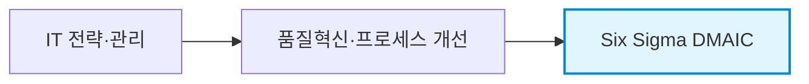
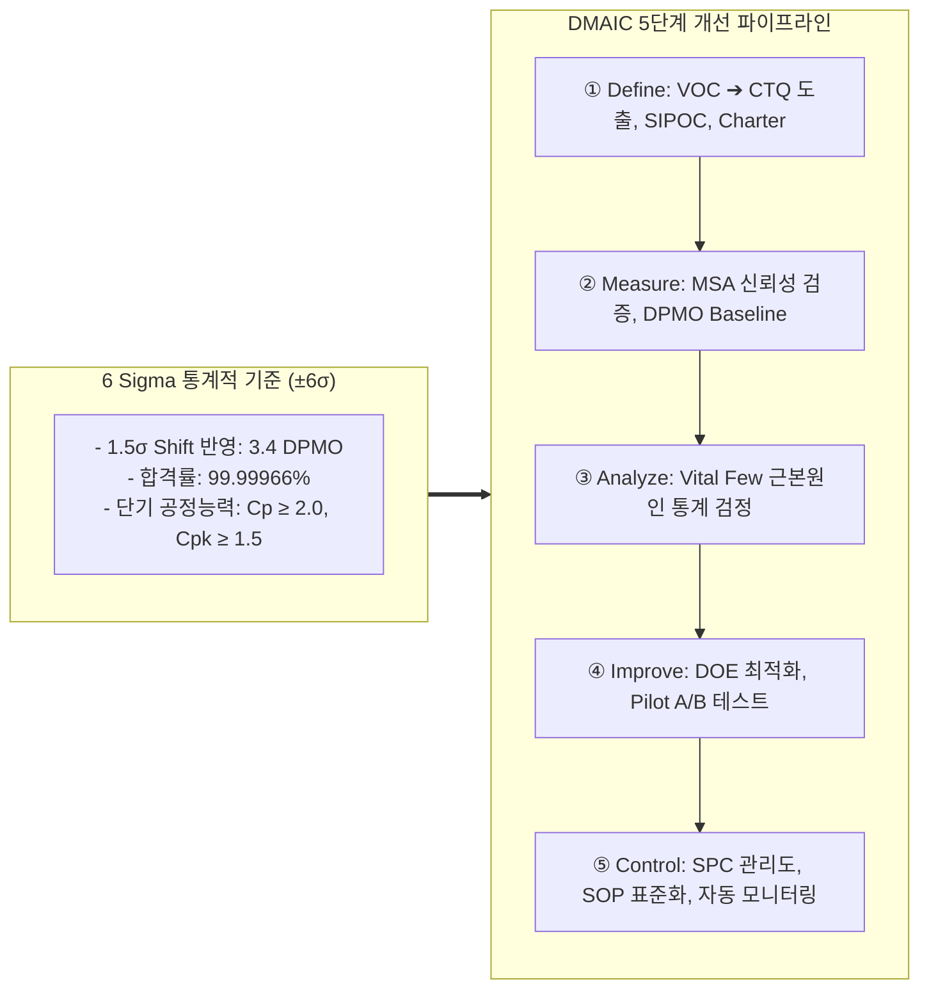
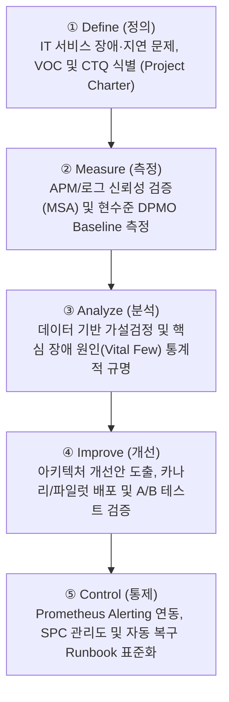
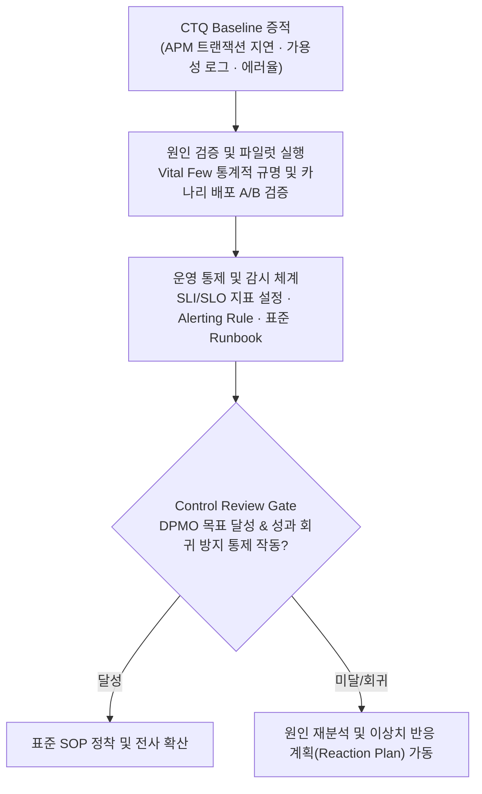

## 지식 로드맵 내 현재 위치

## 30초 인출

- 본질: 고객 관점의 핵심 품질특성(CTQ)을 기준으로 기존 프로세스의 결함과 변동을 데이터 기반으로 축소하는 5단계 품질혁신 방법론
- 메커니즘: Define(CTQ 정의) → Measure(현수준/MSA) → Analyze(Vital Few 규명) → Improve(최적화/Pilot) → Control(SPC/SOP 표준화)
- 판정 기준: 1.5σ Shift 감안 3.4 DPMO(99.99966%) 달성 여부, 공정능력지수(Cp ≥ 2.0, Cpk ≥ 1.5) 및 성과 회귀 방지 Control Plan

약어·전문용어

- **DMAIC(Define, Measure, Analyze, Improve, Control)**: 기존 프로세스 개선을 위한 5단계 문제해결 절차
- **VOC(Voice of Customer)**: 고객 요구·불만·기대
- **CTQ(Critical to Quality)**: 고객 관점에서 중요한 측정 가능한 품질특성
- **DPMO(Defects Per Million Opportunities)**: 백만 결함기회당 결함 수
- **MSA(Measurement System Analysis)**: 측정시스템의 변동·신뢰성을 평가하는 분석
- **SPC(Statistical Process Control)**: 관리도로 프로세스 변동을 감시·통제하는 기법
- **SIPOC(Supplier, Input, Process, Output, Customer)**: 프로세스 범위와 이해관계를 요약하는 도식
- **DOE(Design of Experiments)**: 여러 요인의 효과와 상호작용을 검증하는 실험계획법
- **FMEA(Failure Mode and Effects Analysis)**: 잠재 고장형태와 영향을 분석해 위험을 우선순위화하는 기법
- **SOP(Standard Operating Procedure)**: 표준운영절차
- **SLI(Service Level Indicator)**: 서비스 수준을 측정하는 지표

## 예상문제

> **(미출제 예상·25점)** Six Sigma의 개념과 DMAIC 단계별 활동·도구·산출물을 설명하고, Lean과의 차이 및 IT 서비스 적용방안을 제시하시오.

## Ⅰ. Six Sigma·DMAIC 개요

> DMAIC는 직관적 처방이 아니라 측정 가능한 CTQ와 검증된 원인에 기반해 기존 프로세스를 개선함.

- **정의**: 고객 요구에 미달하는 기존 프로세스의 결함·변동을 데이터로 분석·개선·통제하는 방법론
- **목적**: CTQ 개선·변동 감소·개선성과의 지속

Six Sigma의 3.4 DPMO는 장기 공정 이동(1.5σ Shift)을 가정한 대표적 품질수준(99.99966%)이며, 모든 IT 서비스에 일률 적용하는 의무 기준은 아님.

## Ⅱ. DMAIC 단계별 활동·산출

| 단계 | 활동 | 주요 도구 | 산출 |
|---|---|---|---|
| Define | 문제·고객·범위·목표 정의 | VOC·CTQ·SIPOC | Project Charter |
| Measure | 측정체계 검증·Baseline 측정 | MSA·DPMO·Process Capability | 측정계획·현수준 |
| Analyze | 근본원인 검증 | Pareto·가설검정·회귀 | Vital Few 원인 |
| Improve | 대안 설계·Pilot 검증 | DOE·FMEA·Pilot | 개선안·검증결과 |
| Control | 표준화·감시·대응 | SPC·Control Plan·SOP | 관리계획·표준 |

## Ⅲ. 6시그마 통계적 메커니즘과 DMAIC 파이프라인

## Ⅳ. Six Sigma·Lean 비교

| 기준 | Six Sigma | Lean |
|---|---|---|
| 초점 | 결함·변동 감소 | 낭비·대기·흐름 개선 |
| 접근 | 통계적 분석·DMAIC | Value Stream·Kaizen |
| 도구 | MSA·가설검정·DOE·SPC | VSM·Kanban·5S |
| 결합 | 복잡한 원인 검증 | 병목 제거·Flow 개선 |

## Ⅴ. 문제점·대응책

| 위험 | 대책 | 효과 |
|---|---|---|
| 도구 중심 과잉분석 | CTQ·Business Case 우선 | 문제 중심 개선 |
| 측정데이터 불신 | MSA·수집정의·결측 점검 | 분석 신뢰성 확보 |
| 상관관계를 원인으로 오인 | 가설검정·실험·Pilot | 인과 근거 강화 |
| 개선 후 회귀 | Control Plan·Owner·반응계획 | 성과 지속 |

## Ⅵ. 결론·기술사적 제언

### 학습자 통찰 메모 — 답안 밖

- [핵심 통찰]: DMAIC의 성패는 복잡한 통계 기법 구사가 아니라, 고객 관점의 CTQ를 시스템 로그 및 APM 지표와 정확히 연계(MSA)하고, 개선 이후 성과가 원래 상태로 회귀하지 않도록 차단하는 Control Plan의 제도화에 달려 있음.
- 나라면: 현업 VOC와 결제/트랜잭션 지연을 CTQ로 정의하고, APM 분산 추적 로그로 MSA를 수행하겠음. 이후 개선안은 Canary 배포를 통해 통계적 가설 검증(A/B Test)을 진행하고, Control 단계에서는 Prometheus Alerting Rule 및 자동 복구 Runbook과 연동해 모니터링을 무인 자동화하겠다.

### 실전 답안용 기술사적 제언

- **판정 기준**: 프로세스 품질 개선 착수 시 단기 공정능력지수 $C_p \ge 2.0$, $C_{pk} \ge 1.5$ 달성 여부 및 DPMO 3.4 수준 목표 타당성 검토
- **대응 방안**: Lean의 낭비 제거(Lead-time 단축)와 6 Sigma의 변동 제거(Defect 최소화)를 결합한 Lean Six Sigma 체계 구축
- **검증 체계**: 통계적 공정관리(SPC) X-bar 관리도를 통한 이상 원인 조기 감지 및 분기별 MSA 재검증
- **기대 효과**: 대고객 트랜잭션 오류율 99.999% 무결성 유지, SLA 위반 패널티 제로화 및 연간 재작업 품질비용 40% 이상 절감

## 1교시 10점 답안 발췌

### 1. 정의·목적

- **정의**: 고객 관점의 핵심 품질특성(CTQ)을 기준으로 기존 프로세스의 결함과 변동을 통계적 데이터로 분석·개선·통제하는 **5단계 품질혁신 방법론**
- **목적**: 3.4 DPMO 수준의 결함 최소화, 프로세스 산포 감소 및 개선 성과의 영속적 유지

### 2. 6시그마 통계 기준 및 DMAIC 로드맵

### 3. 단계별 핵심 통제

| 단계 | 핵심 활동 및 산출물 |
|---|---|
| **D·M** | VOC 기반 CTQ 정의, MSA 측정시스템 신뢰성 확보, DPMO Baseline 산출 |
| **A·I** | 파레토·회귀분석 기반 Vital Few 규명, DOE 최적화 및 카나리 Pilot 검증 |
| **C** | SPC X-bar 관리도, SOP 표준운영절차 수립, 모니터링 무인 자동화 |

## 출제 이력과 검증 출처

- 공식 문제지 원문 확인 전까지 직접 기출로 단정하지 않음
- [ASQ, DMAIC Process](https://asq.org/quality-resources/dmaic)
- [ASQ, Six Sigma](https://asq.org/quality-resources/six-sigma)

## 학습 체크

- [ ] Ⅰ: Six Sigma·DMAIC의 정의·목적을 설명할 수 있는가?
- [ ] Ⅱ: DMAIC 단계별 활동·도구·산출을 연결할 수 있는가?
- [ ] Ⅲ: IT 서비스에 DMAIC를 적용할 수 있는가?
- [ ] Ⅳ: Six Sigma와 Lean의 초점·도구를 비교할 수 있는가?
- [ ] Ⅴ: 과잉분석·측정오류·인과오인·회귀의 대응책을 제시할 수 있는가?
- [ ] Ⅵ: SLI·Alert·Runbook 기반 Control 폐루프를 그릴 수 있는가?

## 연결 토픽

- 이전: [110. Programmable Money·AI Agent 결제](./110_programmable_money_ai_agents.md)
- 관련: [106. 품질비용](./106_cost_of_quality_coq.md) · [113. SW 비용 산정](./113_software_cost_estimation.md)
- 다음: [112. CCPM·TOC](./112_critical_chain_toc.md)
