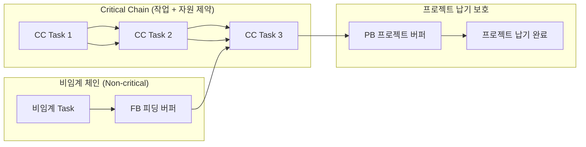
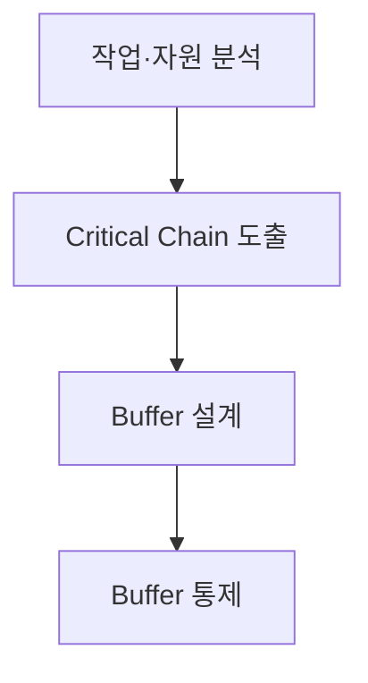

## 지식 로드맵 내 현재 위치
현재 위치: IT 전략·관리 → CCPM·TOC

## 30초 인출

- 본질: CCPM·TOC는 프로젝트의 완료일을 좌우하는 작업 의존성과 자원 제약을 함께 고려해 일정을 관리하는 방식이다.
- 메커니즘: 자원 경합을 반영해 Critical Chain을 정하고, 프로젝트·피딩 버퍼로 지연 위험을 모아 관리한다.

핵심 용어

- **CCPM·TOC**: 제약이론을 일정관리에 적용해 자원 제약과 작업 순서를 함께 다루는 관리 방식.
- **TOC(Theory of Constraints)** : 전체 시스템 성과를 제약하는 병목 요인을 식별·집중 개선하는 제약이론
- **CCPM(Critical Chain Project Management)** : 작업 선후행과 자원 제약을 통합 반영하고 프로젝트 통합 버퍼로 공기를 통제하는 일정 관리 기법
- **PB(Project Buffer)** : Critical Chain 맨 끝에 배치하여 전체 프로젝트 납기를 보호하는 프로젝트 버퍼
- **FB(Feeding Buffer)** : 비임계 경로가 Critical Chain으로 합류하는 지점에 배치하여 지연 전이를 방지하는 공급 버퍼
- **RB(Resource Buffer)** : Critical Chain 착수 전 제약 자원이 적시에 투입되도록 준비를 통보하는 자원 버퍼
- **Fever Chart** : 체인 공정률과 버퍼 소진율을 3개 구역(녹·황·적)으로 시각화한 버퍼 통제 관리도
- **CPM(Critical Path Method)** : 자원 제약을 배제하고 작업 선후행 의존성만을 기준으로 최장 경로를 도출하는 공정관리 기법
- **WIP(Work in Progress)** : 비효율적 멀티태스킹을 방지하기 위해 제한하는 진행 중인 작업 수량
- **EVM(Earned Value Management)** : 계획·획득가치와 실제원가를 결합해 프로젝트 성과를 측정하는 진도 관리 기법

---

## 1교시 예상문제 (10점)

> CCPM의 Critical Chain과 프로젝트·피딩 버퍼의 역할을 설명하시오. (예상·10점)

---

## 1교시 10점 답안

### Ⅰ. 개요

| 구분 | 핵심 |
|---|---|
| 정의 | **CCPM·TOC**는 작업 순서와 자원 제약을 함께 고려해 프로젝트의 완료일과 지연 위험을 관리하는 일정 방식이다. |
| 목적 | 자원 경합과 작업 지연이 전체 납기에 미치는 영향을 줄인다. |

### Ⅱ. Critical Chain 및 버퍼 배치 구조

### Ⅲ. 버퍼별 역할

| **버퍼** 유형 | 설치 위치 | 핵심 역할 |
|---|---|---|
| **PB (Project Buffer)** | **Critical Chain** 끝 | 프로젝트 전체 납기 보호 (개별 안전여유의 통합) |
| **FB (Feeding Buffer)** | 비임계 체인 합류점 | 비임계 작업 지연이 주공정으로 전파되는 것 차단 |
| **RB (Resource Buffer)** | 제약 자원 투입 직전 | 핵심 자원의 대기 및 적시 투입 사전 알림 |

---

## 2~4교시 예상문제 (25점)

> CCPM의 개념과 Critical Chain 도출·버퍼 관리방식을 설명하고, CPM과 비교해 적용 시 유의점을 제시하시오. (예상·25점)

---

## 2~4교시 25점 답안

## Ⅰ. CCPM 개요

| 구분 | 핵심 |
|---|---|
| 정의 | **CCPM·TOC**는 작업 순서와 자원 제약을 함께 고려해 프로젝트의 완료일과 지연 위험을 관리하는 일정 방식이다. |
| 목적 | 자원 경합과 작업 지연이 전체 납기에 미치는 영향을 줄인다. |

## Ⅱ. Critical Chain 및 버퍼 관리 체계

| 요소 | 위치 | 역할 |
|---|---|---|
| **Critical Chain** | 선후행 관계와 자원 제약을 반영한 작업 연결 | 프로젝트 완료일을 좌우 |
| PB | **Critical Chain** 끝 | 체인 전체의 지연을 흡수 |
| FB | 비임계 경로가 **Critical Chain** 에 합류하는 지점 | 합류 작업으로 지연이 번지는 것을 완화 |
| RB | 중요 자원 투입 전에 알림 | 필요한 자원이 제때 준비되도록 함 |

Buffer 크기는 작업 불확실성·추정방식·위험 데이터를 반영해 정하며 일률적인 절반 규칙을 강제하지 않음.

## Ⅲ. CCPM 적용 절차

- 활동: 선후행 의존성 및 제약 자원 가용성·경합 식별 → 자원 평준화(Leveling)·다중작업 제거 후 최장 체인 확정 → PB·FB·RB 안전여유 통합 배치 → Fever Chart로 진척률 대비 소진율 모니터링 및 Red Zone 긴급 자원 집중
- 산출: 자원제약 네트워크 → **Critical Chain** → Buffer 일정 → 통제 기록·긴급 조치

## Ⅳ. CPM·CCPM 비교

| 기준 | CPM | CCPM |
|---|---|---|
| 제약 | 작업 선후행 중심 | 작업·자원 의존성 |
| 여유 | 작업별 Float | PB·FB 통합 Buffer |
| 진척 | 작업 일정·Critical Path | Chain 진척·Buffer 소진 |
| 강점 | 논리적 일정 분석 | 자원경합·행동요인 통제 |

## Ⅴ. 문제점·대응책

| 위험 | 대책 |
|---|---|---|
| 지나치게 공격적인 작업 기간 | 작업 근거와 불확실성을 팀이 검토 | 실현 가능한 일정 확보 |
| 버퍼 소진 원인 불명 | 소진 이유와 복구조치를 기록 | 지연 원인을 추적 |
| 공유 자원 경합 | 여러 프로젝트의 착수 순서와 자원 가용성 조정 | 동시작업·대기 감소 |
| 신호 구간을 기계적으로 적용 | 남은 작업량·소진 추세·복구안을 함께 검토 | 대응 우선순위 개선 |

## Ⅵ. 버퍼 크기와 대응 기준을 프로젝트 위험에 맞추는 기술사적 제언

| 문제 | 해결 방안 |
|---|---|
| 버퍼를 일률적인 비율로 정하면 프로젝트별 불확실성과 납기 신뢰수준을 반영하지 못한다. | 시범 일정에서 작업기간의 불확실성과 의존관계를 근거로 버퍼를 정하고, 착수 전에 남은 작업량과 버퍼 소진에 따른 점검·복구 기준을 합의한다. 실행 자료를 검토해 다음 일정의 크기와 기준을 조정한다. |

## 출제 이력과 검증 출처

- 공식 문제지 원문 확인 전까지 직접 기출로 단정하지 않음
- Eliyahu M. Goldratt, *Critical Chain*.
- PMI, [Improving focus and predictability with critical chain project management](https://www.pmi.org/learning/library/critical-chain-project-management-5852).
- PMI, [Analysis of resource buffer management in critical chain scheduling](https://www.pmi.org/learning/library/resource-buffer-management-critical-chain-scheduling-8027).

## 연결 토픽

- 이전: [111. Six Sigma DMAIC](./111_six_sigma_dmaic.md)
- 관련: [081. CPM](./081_cpm.md) · [032. EVM](./032_evm.md)
- 다음: [113. SW 비용 산정](./113_software_cost_estimation.md)
