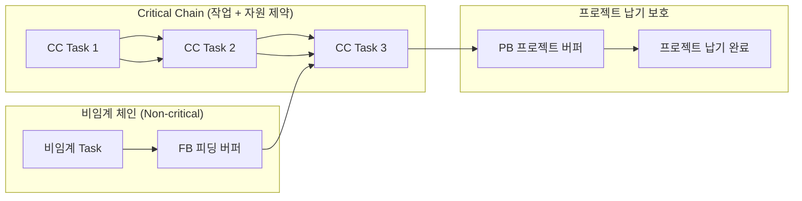
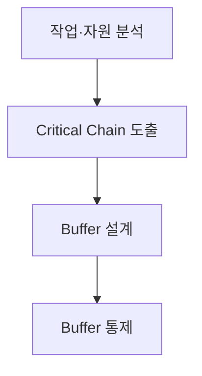
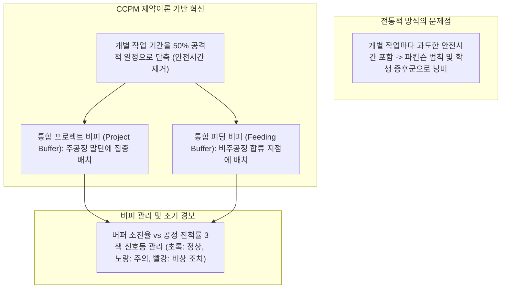

## 지식 로드맵 내 현재 위치
현재 위치: IT 전략·관리 → CCPM· **TOC**

## 30초 인출

- 본질: CCPM은 작업 순서와 자원 제약을 함께 고려해 핵심 경로를 찾고 통합 버퍼로 납기를 관리하는 일정 기법이다.
- 메커니즘: 개별 작업의 안전여유를 통합해 **Critical Chain** 을 도출하고 **PB** · **FB** · **RB** **버퍼** 와 **Fever Chart** 로 통제한다.
- 판정 기준: 작업자 안전여유 회수 및 통합 배치 여부, **Fever Chart** 상 진척 대비 **버퍼** 소진율(Green/Yellow/Red) 및 제약자원 **WIP** 상한 준수한다.

핵심 용어

- **TOC(Theory of Constraints)** : 전체 시스템 성과를 제약하는 병목 요인을 식별·집중 개선하는 제약이론
- **CCPM(Critical Chain Project Management)** : 작업 선후행과 자원 제약을 통합 반영하고 프로젝트 통합 버퍼로 공기를 통제하는 일정 관리 기법
- **PB(Project Buffer)** : Critical Chain 맨 끝에 배치하여 전체 프로젝트 납기를 보호하는 프로젝트 버퍼
- **FB(Feeding Buffer)** : 비임계 경로가 Critical Chain으로 합류하는 지점에 배치하여 지연 전이를 방지하는 공급 버퍼
- **RB(Resource Buffer)** : Critical Chain 착수 전 제약 자원이 적시에 투입되도록 준비를 통보하는 자원 버퍼
- **Fever Chart** : 체인 공정률과 버퍼 소진율을 3개 구역(녹·황·적)으로 시각화한 버퍼 통제 관리도
- **CPM(Critical Path Method)** : 자원 제약을 배제하고 작업 선후행 의존성만을 기준으로 최장 경로를 도출하는 공정관리 기법
- **WIP(Work in Progress)** : 비효율적 멀티태스킹을 방지하기 위해 제한하는 진행 중인 작업 수량
- **EVM(Earned Value Management)** : 계획·획득가치와 실제원가를 결합해 프로젝트 성과를 측정하는 진도 관리 기법

---

## 1교시 예상문제 (10점)

> CCPM의 Critical Chain과 프로젝트·피딩 버퍼의 역할을 설명하시오. (예상·10점)

---

## 1교시 10점 답안

### 1. 정의·목적

- 정의: 엘리 골드렛의 제약이론(TOC)을 프로젝트 일정 관리에 적용하여, 개별 작업의 안전 여유를 제거하고 프로젝트 및 합류 지점에 집중 버퍼를 배치하여 납기 준수율을 극대화하는 관리 기법
- 목적: 파킨슨 법칙 및 학생 증후군 타파 · 자원 제약을 반영한 현실적 주공정 관리 · 집중 버퍼 관리를 통한 납기 단축

- **정의** : 제약이론( **TOC** )을 바탕으로 작업 선후행 관계뿐만 아니라 자원 제약을 함께 고려해 **Critical Chain** 을 도출하고, 통합 **버퍼** (PB, FB, RB)로 프로젝트를 통제하는 **일정관리 기법** .
- **목적** : 파킨슨 법칙, 학생 증후군, 멀티태스킹으로 인한 일정 지연 방지 및 납기 준수율 극대화.

### 2. Critical Chain 및 버퍼 배치 구조

### 3. 3대 버퍼 및 관리 통제

| **버퍼** 유형 | 설치 위치 | 핵심 역할 |
|---|---|---|
| **PB (Project Buffer)** | **Critical Chain** 끝 | 프로젝트 전체 납기 보호 (개별 안전여유의 통합) |
| **FB (Feeding Buffer)** | 비임계 체인 합류점 | 비임계 작업 지연이 주공정으로 전파되는 것 차단 |
| **RB (Resource Buffer)** | 제약 자원 투입 직전 | 핵심 자원의 대기 및 적시 투입 사전 알림 |

---

## 2~4교시 예상문제 (25점)

> **(미출제 예상·25점)** CCPM의 개념과 **Critical Chain** 도출·Buffer 관리방식을 설명하고, CPM과 비교하여 문제점·대응책을 제시하시오.

---

## 2~4교시 25점 답안

## Ⅰ. CCPM 개요

| 구분 | 핵심 |
|---|---|
| 정의 | **TOC** 의 제약 관리 원리를 프로젝트 일정에 적용해 **작업 의존성** 과 **자원 제약** 을 함께 반영한 **Critical Chain** 을 도출하고 **버퍼** 소비로 납기를 통제하는 기법 |
| 목적 | 자원 충돌과 작업 지연의 전파를 관리해 프로젝트 납기 예측 가능성을 높인다. |

## Ⅱ. Critical Chain 및 버퍼 관리 체계

| 요소 | 위치 | 역할 |
|---|---|---|
| **Critical Chain** | 작업·자원 제약 반영 핵심 Chain | 프로젝트 완료일 결정 |
| PB | **Critical Chain** 끝 | 전체 납기 보호 |
| FB | 비임계 Chain 합류점 | 합류 지연 전파 차단 |
| RB | 핵심자원 투입 전 | 자원 준비 알림 |

Buffer 크기는 작업 불확실성·추정방식·위험 데이터를 반영해 정하며 일률적인 절반 규칙을 강제하지 않음.

## Ⅲ. CCPM 적용 절차

- 활동: 선후행 의존성 및 제약 자원 가용성·경합 식별 → 자원 평준화(Leveling)·다중작업 제거 후 최장 체인 확정 → PB·FB·RB 안전여유 통합 배치 → Fever Chart로 진척률 대비 소진율 모니터링 및 Red Zone 긴급 자원 집중
- 산출: 자원제약 네트워크 → **Critical Chain** → Buffer 일정 → 통제 기록·긴급 조치

## Ⅳ. CPM·CCPM 비교

| 기준 | CPM | CCPM |
|---|---|---|
| 제약 | 작업 선후행 중심 | 작업·자원 의존성 |
| 여유 | 작업별 Float | PB·FB 통합 Buffer |
| 진척 | 작업 일정·Critical Path | Chain 진척·Buffer 소진 |
| 강점 | 논리적 일정 분석 | 자원경합·행동요인 통제 |

## Ⅴ. 문제점·대응책

| 위험 | 대책 | 효과 |
|---|---|---|
| 공격적 추정 강요 | 추정 근거·범위·위험 합의 | 일정 신뢰 확보 |
| Buffer를 예비시간으로 소진 | 변경승인·소진원인 기록 | Buffer 목적 보호 |
| 다중 프로젝트 자원경합 | Portfolio 우선순위·WIP 제한 | Multitasking 감소 |
| 신호등 임계치 기계 적용 | 추세·잔여위험·복구계획 병행 | 오판 방지 |

## Ⅵ. 결론·기술사적 제언

### 실전 답안용 기술사적 제언

- 문제: 파킨슨 법칙과 학생 증후군으로 인해 개별 작업마다 숨겨둔 안전 여유(Safety Buffer)가 낭비되고 프로젝트 납기가 지연됨.
- 해결 방안: 제약이론(TOC) 기반 CCPM을 도입하여 개별 작업 안전 여유를 50% 축소하고, 회수된 여유시간을 프로젝트 버퍼(PB)와 피딩 버퍼(FB)로 통합 집중 배치하여 버퍼 소진율 신호등(Green/Yellow/Red)으로 공정을 통제함.

## 출제 이력과 검증 출처

- 공식 문제지 원문 확인 전까지 직접 기출로 단정하지 않음
- Eliyahu M. Goldratt, * **Critical Chain** *
- [PMI, **Critical Chain** Method](https://www.pmi.org/learning/library/critical-chain-project-management-7986)

## 연결 토픽

- 이전: [111. Six Sigma DMAIC](./111_six_sigma_dmaic.md)
- 관련: [081. CPM](./081_cpm.md) · [032. EVM](./032_evm.md)
- 다음: [113. SW 비용 산정](./113_software_cost_estimation.md)
