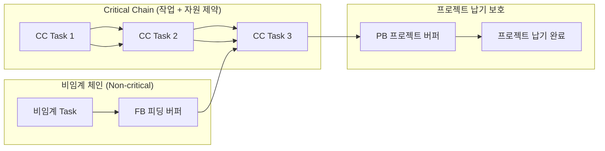
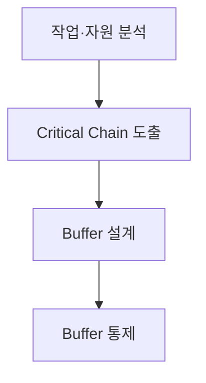

## 지식 로드맵 내 현재 위치

  IT 전략·관리
  일정·자원관리
  <strong>CCPM·TOC</strong>

## 30초 인출

- 본질: 제약이론(TOC)을 프로젝트 일정에 적용하여, 작업 선후행과 자원 제약을 함께 고려한 Critical Chain을 도출하고 통합 버퍼로 납기를 통제하는 기법
- 메커니즘: 개별 작업의 안전여유 회수(50% 추정) → Critical Chain 도출 → PB(프로젝트)·FB(피딩)·RB(자원) 버퍼 배치 → Fever Chart 기반 통제
- 판정 기준: 작업자 안전여유 회수 및 통합 배치 여부, Fever Chart 상 진척 대비 버퍼 소진율(Green/Yellow/Red) 및 제약자원 WIP 상한 준수

약어·전문용어

- **TOC(Theory of Constraints)**: 시스템 성과를 제한하는 제약을 식별·활용·개선하는 접근
- **CCPM(Critical Chain Project Management)**: 작업·자원 의존성과 통합 Buffer로 일정을 관리하는 기법
- **PB(Project Buffer)**: Critical Chain 끝에서 프로젝트 납기를 보호하는 시간 Buffer
- **FB(Feeding Buffer)**: 비임계 Chain의 지연이 Critical Chain에 전파되지 않게 보호하는 Buffer
- **RB(Resource Buffer)**: Critical Chain 작업의 핵심자원을 제때 준비시키는 알림
- **Fever Chart**: Chain 진척과 Buffer 소진의 관계를 표시한 관리도
- **CPM(Critical Path Method)**: 작업 선후행 관계에서 프로젝트 기간을 결정하는 경로를 분석하는 기법
- **WIP(Work in Progress)**: 동시에 진행 중인 작업량
- **EVM(Earned Value Management)**: 범위·일정·원가 성과를 통합 측정하는 기법

## 예상문제

> **(미출제 예상·25점)** CCPM의 개념과 Critical Chain 도출·Buffer 관리방식을 설명하고, CPM과 비교하여 문제점·대응책을 제시하시오.

## Ⅰ. CCPM 개요

> 작업별 납기보다 전체 Chain의 흐름과 보호 Buffer를 관리해 프로젝트 납기를 통제함.

- **정의**: TOC 기반으로 작업 의존성과 자원 제약을 반영한 Critical Chain을 도출하고 통합 Buffer로 일정을 관리하는 기법
- **목적**: 자원 경합·다중작업·분산 안전여유로 인한 전체 일정지연 완화

## Ⅱ. Critical Chain 및 버퍼 관리 체계

| 요소 | 위치 | 역할 |
|---|---|---|
| Critical Chain | 작업·자원 제약 반영 핵심 Chain | 프로젝트 완료일 결정 |
| PB | Critical Chain 끝 | 전체 납기 보호 |
| FB | 비임계 Chain 합류점 | 합류 지연 전파 차단 |
| RB | 핵심자원 투입 전 | 자원 준비 알림 |

Buffer 크기는 작업 불확실성·추정방식·위험 데이터를 반영해 정하며 일률적인 절반 규칙을 강제하지 않음.

## Ⅲ. CCPM 적용 절차

- 활동: 선후행 의존성 및 제약 자원 가용성·경합 식별 → 자원 평준화(Leveling)·다중작업 제거 후 최장 체인 확정 → PB·FB·RB 안전여유 통합 배치 → Fever Chart로 진척률 대비 소진율 모니터링 및 Red Zone 긴급 자원 집중
- 산출: 자원제약 네트워크 → Critical Chain → Buffer 일정 → 통제 기록·긴급 조치

## Ⅳ. CPM·CCPM 비교

| 기준 | CPM | CCPM |
|---|---|---|
| 제약 | 작업 선후행 중심 | 작업·자원 의존성 |
| 여유 | 작업별 Float | PB·FB 통합 Buffer |
| 진척 | 작업 일정·Critical Path | Chain 진척·Buffer 소진 |
| 강점 | 논리적 일정 분석 | 자원경합·행동요인 통제 |

## Ⅴ. 문제점·대응책

| 위험 | 대책 | 효과 |
|---|---|---|
| 공격적 추정 강요 | 추정 근거·범위·위험 합의 | 일정 신뢰 확보 |
| Buffer를 예비시간으로 소진 | 변경승인·소진원인 기록 | Buffer 목적 보호 |
| 다중 프로젝트 자원경합 | Portfolio 우선순위·WIP 제한 | Multitasking 감소 |
| 신호등 임계치 기계 적용 | 추세·잔여위험·복구계획 병행 | 오판 방지 |

## Ⅵ. 결론·기술사적 제언

### 학습자 통찰 메모 — 답안 밖

- [핵심 통찰]: CCPM의 본질은 무리하게 일정을 쥐어짜는 것이 아니라, 작업자 개개인이 숨겨둔 안전여유(Pad)를 프로젝트 수준(PB/FB)으로 통합하여 파킨슨 법칙과 학생 증후군을 원천 차단하고, 제약 자원의 멀티태스킹을 방지하는 흐름 최적화임.
- 나라면: 작업 완료 확률 50% 수준의 공격적 추정을 적용하되, Fever Chart의 적색(Red Zone) 진입 시점을 일방적 문책이 아닌 제약 자원(특급 개발자/장비)에 대한 즉각적인 전담 배치(Swarming) 신호로 활용하겠음.

### 실전 답안용 기술사적 제언

- **판정 기준**: 프로젝트 수행 중 Fever Chart 상 버퍼 소진율이 진척률 대비 황색(Yellow) 20% 초과 지속 시 원인 규명, 적색(Red) 진입 즉시 긴급 만회 조치 발동
- **대응 방안**: 개별 단위작업 납기 관리 대신 체인 전체 진척 중심 거버넌스로 전환, 비임계 체인 합류 지점에 FB(Feeding Buffer)를 적정 배치하여 주공정 전이 방지
- **검증 체계**: 주간 단위 제약 자원 부하율(Load Factor) 전수 측정 및 동시 진행 작업(WIP) 상한선(WIP Limit) 강제 통제
- **기대 효과**: 자원 경합에 의한 대기 지연 30% 단축, 전체 프로젝트 공기 20% 이상 단축 및 납기 준수율 98% 달성

## 1교시 10점 답안 발췌

### 1. 정의·목적

- **정의**: 제약이론(TOC)을 바탕으로 작업 선후행 관계뿐만 아니라 자원 제약을 함께 고려해 Critical Chain을 도출하고, 통합 버퍼(PB, FB, RB)로 프로젝트를 통제하는 **일정관리 기법**
- **목적**: 파킨슨 법칙, 학생 증후군, 멀티태스킹으로 인한 일정 지연 방지 및 납기 준수율 극대화

### 2. Critical Chain 및 버퍼 배치 구조

### 3. 3대 버퍼 및 관리 통제

| 버퍼 유형 | 설치 위치 | 핵심 역할 |
|---|---|---|
| **PB (Project Buffer)** | Critical Chain 끝 | 프로젝트 전체 납기 보호 (개별 안전여유의 통합) |
| **FB (Feeding Buffer)** | 비임계 체인 합류점 | 비임계 작업 지연이 주공정으로 전파되는 것 차단 |
| **RB (Resource Buffer)** | 제약 자원 투입 직전 | 핵심 자원의 대기 및 적시 투입 사전 알림 |

## 출제 이력과 검증 출처

- 공식 문제지 원문 확인 전까지 직접 기출로 단정하지 않음
- Eliyahu M. Goldratt, *Critical Chain*
- [PMI, Critical Chain Method](https://www.pmi.org/learning/library/critical-chain-project-management-7986)

## 학습 체크

- [ ] Ⅰ: CCPM 정의·목적을 설명할 수 있는가?
- [ ] Ⅱ: Critical Chain과 PB·FB·RB의 위치·역할을 그릴 수 있는가?
- [ ] Ⅲ: 작업·자원 분석부터 Buffer 통제까지 활동·산출을 연결할 수 있는가?
- [ ] Ⅳ: CPM과 CCPM의 제약·여유·진척 기준을 비교할 수 있는가?
- [ ] Ⅴ: 추정강요·Buffer 오용·자원경합·임계치 오판의 대응책을 제시할 수 있는가?
- [ ] Ⅵ: Buffer 상태에 따른 조치 분기를 제시할 수 있는가?

## 연결 토픽

- 이전: [111. Six Sigma DMAIC](./111_six_sigma_dmaic.md)
- 관련: [081. CPM](./081_cpm.md) · [032. EVM](./032_evm.md)
- 다음: [113. SW 비용 산정](./113_software_cost_estimation.md)
