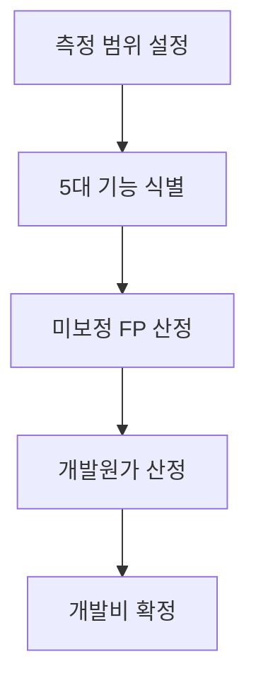
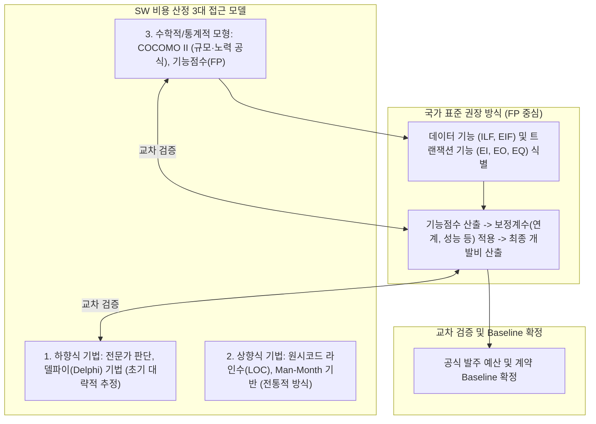

## 지식 로드맵 내 현재 위치
현재 위치: IT 전략·관리 → 소프트웨어 **비용** 산정(Software Cost Estimation)


## 30초 인출

- 본질: 기능점수 기반 SW 비용 산정은 사용자에게 제공하는 기능의 규모를 측정해 개발비를 계산하는 방법이다.
- 메커니즘: 애플리케이션 경계 설정 → 5대 기능( **ILF** / **EIF** / **EI** / **EO** / **EQ** ) 측정 → 5대 보정계수 적용 → 개발원가 산출 → SW 개발비 확정한다.
- 판정 기준: 2025 개정 단가(605,784원/ **FP** ) 적용, 5대 보정계수 객관적 증적 확보 및 요구 변경 시 RTM 연동 증분 **FP** 재산정한다.

<details>
<summary>핵심 용어</summary>

- **FP(Function Point)** : 사용자 관점의 논리적 기능 규모를 수치화한 소프트웨어 규모 측정 단위
- **ILF(Internal Logical File)** : 애플리케이션 경계 내부에서 직접 유지·관리되는 논리적 데이터 파일
- **EIF(External Interface File)** : 타 시스템에 의해 유지되며 대상 애플리케이션이 참조만 하는 외부 연계 데이터 파일
- **EI(External Input)** : 경계 외부에서 유입되어 내부 논리 파일(ILF)을 갱신하는 트랜잭션 기능
- **EO(External Output)** : 계산 로직이나 데이터 처리를 거쳐 경계 외부로 정보를 제공하는 트랜잭션 기능
- **EQ(External Inquiry)** : 가공이나 연산 없이 단순 검색을 통해 데이터를 표출하는 조회 트랜잭션 기능

</details>

---

## 1교시 예상문제 (10점)

> 기능점수 기반 SW 개발비 산출 구조와 주요 산식의 역할을 설명하시오. (예상·10점)

---

## 1교시 10점 답안

### 1. 정의·목적

- 정의: 소프트웨어 개발에 소요되는 규모, 투입 공수, 개발 기간, 투입 인력 및 제반 경비를 공학적 산식과 경험적 데이터를 바탕으로 과학적으로 예측하는 원가 산정 엔지니어링 활동
- 목적: 개발 예산의 객관적 타당성 확보 · 부당한 저가 수주 및 덤핑 방지 · 발주자-수주자 간 신뢰성 있는 계약 기준선 확립

- **정의** : 소프트웨어의 규모(기능)를 사용자 관점의 **기능점수** (FP)로 측정하여 적정 **공수** 와 개발비를 산출하는 **소프트웨어 공학적 대가산정 기법** .
- **목적** : 공공 SW 적정 예산 확보, 무상 과업 추가 방지 및 계약 대가의 객관성·신뢰성 보장.

### 2. 기능점수(FP) 기반 SW 개발비 산출 구조도



### 3. 핵심 산식 및 통제 고려사항

- **개발원가 산식** : $\text{개발원가} = \text{보정 **기능점수** } \times 605,784\text{원/FP (2025년 기준)}$.
- **총 SW 개발비** : $\text{개발원가} + \text{이윤(최대 25\%)} + \text{직접경비}$.
- **핵심 통제** : 시스템 경계 정의 합의, 5대 보정계수 정량 증적 확보, 과업 변경 시 RTM 연계 증분 FP 재산정.

---

## 2~4교시 예상문제 (25점)

> **(미출제 예상·25점)** SW **비용** 산정 접근법을 비교하고, **기능점수** 방식의 측정 절차·개발비 구성·산정 위험과 대응책을 설명하시오.

---

## 2~4교시 25점 답안

## Ⅰ. SW 비용 산정의 개요

> 요구사항을 측정 가능한 규모와 **비용** 으로 변환해야 예산·계약·변경관리의 기준이 성립한다.

| 구분 | 핵심 |
|---|---|
| 정의 | **SW 규모** · **공수** · **기간** 을 추정하여 개발·운영에 필요한 **비용** 을 산정하는 활동 |
| 목적 | **적정 예산** ·계약대가 확보 · **변경비용** 산정 · **사업 타당성** 판단 |

## Ⅱ. 비용 산정 접근법과 FP 산정 체계

> 초기에는 유사사례로 범위를 잡고, 요구사항이 구체화되면 작업분해·모형 기반 추정으로 정밀화한다.

### 1. 비용 산정 접근법

| 접근법 | 기준 | 적용 |
|---|---|---|
| 하향식 | 전문가 판단 · 유사사례 | 초기 개략 견적 |
| 상향식 | **WBS(Work Breakdown Structure)** 작업별 **공수** | 상세 범위 확정 후 |
| 모형식 | FP · **COCOMO(Constructive Cost Model)** | 데이터 기반 검증 |

### 2. FP 측정·대가 산정 메커니즘


- 활동: 사용자 관점 애플리케이션 경계 확정 → 데이터 기능(ILF·EIF)·트랜잭션 기능(EI·EO·EQ) 식별·분류 → 정통법 복잡도 매트릭스 또는 간이법 평균 가중치로 미보정 FP 산출 → 5대 보정계수 적용 후 2025년 단가(605,784원/FP) 곱산출 → 개발원가에 이윤(최대 25%)·직접경비 실비 합산
- 산출: 경계 정의 → 기능 목록 → 미보정 FP(UFP) → 보정 FP(AFP)·개발원가 → SW 개발비 산정서

### 3. 현행 기능점수 방식의 핵심 식

```text
개발원가 = 기능점수(FP) × 기능점수당 단가 × 5대 보정계수
SW 개발비 = 개발원가 + 이윤 + 직접경비
```

- 5대 보정계수: **규모 · 연계복잡성 · 성능요구수준 · 다중사이트 운영성 · 보안성**
- 2025년 개정판 **기능점수** 당 단가: **605,784원**

## Ⅲ. 주요 산정 모형 비교

> 모형의 우열보다 산정 시점에 확보 가능한 입력과 추정 목적의 일치가 중요하다.

| 기준 | FP | LOC | COCOMO |
|---|---|---|---|
| 입력 | 사용자 기능 | 코드 라인 | 코드 규모 · **비용** 동인 |
| 장점 | 언어 독립 · 조기 측정 | 측정 단순 | **공수** ·기간 추정 |
| 한계 | 경계·기능 판정 편차 | 언어·구현 종속 | 보정 데이터 필요 |

## Ⅳ. 문제점·대응책

> 산식보다 측정 경계·기능 식별·변경 추적의 일관성이 견적 신뢰도를 결정한다.

| 위험 | 대책 | 효과 |
|---|---|---|
| 경계 불일치 | 애플리케이션 경계 합의 · 검토 | 중복·누락 방지 |
| 기능 분류 편차 | 측정 규칙 · 교차검증 적용 | 산정 재현성 확보 |
| 비기능 **비용** 누락 | 5대 보정계수 근거 기록 | 사업 특성 반영 |
| 범위 변경 미정산 | **RTM(Requirements Traceability Matrix)** 과 증분 FP 연계 | 변경대가 근거 확보 |

## Ⅴ. 결론·기술사적 제언

### 실전 답안용 기술사적 제언

- 문제: 개발 초기의 모호한 요구사항으로 인해 SW 규모가 과소 산정되거나 주관적 투입공수(M/M) 관행에 의해 사업비가 부당 삭감됨.
- 해결 방안: 국제 표준 기능점수(FP) 간이법/정규법을 주산정 기법으로 적용하고, COCOMO II 및 델파이 전문가 기법을 교차 검증 도구로 활용하여 공학적이고 신뢰할 수 있는 SW 개발 예산을 도출함.



## 출제 이력과 검증 출처

- 공식 문제지 원문 확인 전까지 직접 기출로 단정하지 않음
- [한국인공지능·소프트웨어산업협회, SW사업 대가산정 가이드(2025년 개정판)](https://www.sw.or.kr/site/sw/ex/board/View.do?bcIdx=63607&cbIdx=276)
- [ISO, ISO/IEC 14143-1:2007 Functional size measurement](https://www.iso.org/standard/42188.html)

## 연결 토픽

- 이전: [112. CCPM·TOC](./112_critical_chain_toc.md)
- 관련: [026. SW 사업 대가산정](./026_software_cost_estimation.md) · [091. 과업심의](./091_public_sw_cost_and_scope_change_criteria.md)
- 다음: [114. 개방형 혁신](./114_open_innovation.md)
