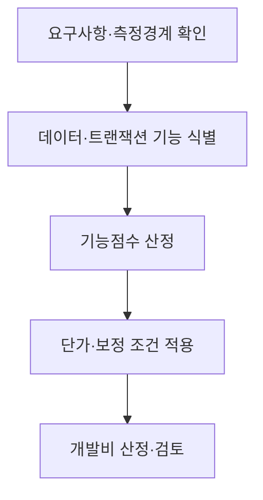

## 지식 로드맵 내 현재 위치
현재 위치: IT 전략·관리 → 소프트웨어 비용 산정(Software Cost Estimation)

## 30초 인출

- 본질: 소프트웨어 비용 산정은 요구사항과 개발 범위를 바탕으로 필요한 노력과 사업비를 추정하는 활동
- 메커니즘: 기능·규모 정의 → 산정 방식·근거자료에 따른 노력·비용 계산 → 예산·계약 기준 반영

핵심 용어

- **소프트웨어 비용 산정(Software Cost Estimation)** : 요구사항과 범위에 맞춰 소프트웨어 개발에 필요한 노력과 비용을 추정하는 활동
- **FP(Function Point)** : 사용자 요구에서 도출한 소프트웨어 기능 규모를 측정하는 단위
- **ILF(Internal Logical File)** : 측정 대상 애플리케이션이 유지하는 사용자 인식 논리 데이터 그룹
- **EIF(External Interface File)** : 다른 애플리케이션이 유지하고 측정 대상은 참조하는 사용자 인식 논리 데이터 그룹
- **EI(External Input)** : 애플리케이션 경계 밖에서 데이터를 받아 내부 논리 데이터를 갱신하는 트랜잭션 기능
- **EO(External Output)** : 계산·파생 처리 등을 거쳐 경계 밖으로 정보를 제공하는 트랜잭션 기능
- **EQ(External Inquiry)** : 큰 파생 처리 없이 데이터를 조회해 경계 밖으로 제공하는 트랜잭션 기능
- **COCOMO(Constructive Cost Model)** : 소프트웨어 규모와 프로젝트 특성을 입력해 개발 노력 등을 추정하는 모형
- **WBS(Work Breakdown Structure)** : 프로젝트 범위를 산출물 중심으로 계층 분해한 작업 구조

---

## 1교시 예상문제 (10점)

> 소프트웨어 비용 산정의 개념과 주요 접근법을 설명하시오. (예상·10점)

---

## 1교시 10점 답안

### Ⅰ. 개요

| 구분 | 핵심 |
|---|---|
| 정의 | **소프트웨어 비용 산정(Software Cost Estimation)**은 요구사항과 범위에 맞춰 개발 노력과 비용을 추정하는 활동 |
| 목적 | 현실적인 예산·계약 기준의 마련과 범위 변경의 비용 영향 판단 |

### Ⅱ. 비용 산정 접근법

| 접근법 | 산정 근거 | 적용 시점·한계 |
|---|---|---|
| 하향식 | 전문가 판단·유사사례 | 초기 개략 산정, 전제와 유사성 확인 필요 |
| 상향식 | **WBS(Work Breakdown Structure)** 작업별 노력·기간 | 범위가 구체화된 뒤 합산, 누락·중복 점검 필요 |
| 규모·모형 기반 | **FP** 또는 **COCOMO** 등 | 입력자료 품질·모형 보정자료에 따라 오차 발생 |

- 한 줄 제언: 산정 방식에 관계없이 요구사항·범위·가정과 적용한 단가·보정 근거의 기록

---

## 2~4교시 예상문제 (25점)

> 소프트웨어 비용 산정 접근법을 비교하고, 기능점수 방식의 측정절차·개발비 구성·산정 위험과 대응책을 설명하시오. (예상·25점)

---

## 2~4교시 25점 답안

## Ⅰ. 소프트웨어 비용 산정의 개요

| 구분 | 핵심 |
|---|---|
| 정의 | **소프트웨어 비용 산정(Software Cost Estimation)**은 요구사항과 범위에 맞춰 개발 노력과 비용을 추정하는 활동 |
| 목적 | 현실적인 예산·계약 기준의 마련과 범위 변경의 비용 영향 판단 |

## Ⅱ. 비용 산정 접근법

| 접근법 | 산정 근거 | 적용 시점·한계 |
|---|---|---|
| 하향식 | 전문가 판단·유사사례 | 초기 개략 산정, 전제와 유사성 확인 필요 |
| 상향식 | **WBS(Work Breakdown Structure)** 작업별 노력·기간 | 범위가 구체화된 뒤 합산, 누락·중복 점검 필요 |
| 규모·모형 기반 | **FP** 또는 **COCOMO** 등 | 입력자료 품질·모형 보정자료에 따라 오차 발생 |

## Ⅲ. 기능점수 측정·개발비 산정 흐름

기능점수 측정의 출발점은 사용자 관점의 애플리케이션 경계 정의. 이후 **ILF**·**EIF** 데이터 기능과 **EI**·**EO**·**EQ** 트랜잭션 기능의 분류 및 적용 규칙에 따른 기능점수 산출.

## Ⅳ. 산정비용 구성과 기준자료

| 항목 | 산정 근거·점검사항 |
|---|---|
| 기능 규모 | 경계 정의, 사용자 요구, 기능별 산정기록 |
| 개발원가 | 계약에 적용하는 가이드 판본의 기능점수 단가와 보정 기준 |
| 총 사업대가 | 직접경비·이윤·세금 등 해당 계약에 적용되는 비용 항목 |
| 범위 변경 | 승인된 변경요청, 영향 기능, 재산정·계약변경 이력 |

산식과 단가·보정항목은 해당 사업에 적용되는 가이드 판본과 계약 조건을 기준으로 선택. 모든 사업에 고정 숫자를 적용하는 방식은 배제. 규모·복잡성·성능·운영환경·보안성 등 보정 검토 항목은 적용 근거 확인.

## Ⅴ. 주요 산정 위험과 대응

| 위험 | 대응 |
|---|---|
| 경계 정의 차이로 기능 누락·중복 | 발주자·수행자가 측정경계와 제외범위를 사전 합의 |
| 기능분류·복잡도 판정 편차 | 산정 근거를 남기고 독립 검토자가 표본 재산정 |
| 비기능 요구 비용 누락 | 적용 가이드의 보정 항목과 별도 요구 비용을 확인 |
| 요구 변경 미반영 | 요구사항 추적과 기능점수 재산정·계약변경을 연계 |

## Ⅵ. 측정 근거와 변경 이력을 계약 기준에 연결하는 기술사적 제언

| 문제 | 해결 방안 |
|---|---|
| 요구사항·측정경계·가이드 판본 누락으로 인한 견적 재현과 변경분 검증의 어려움 | 기준선에 요구사항 식별자·측정경계·기능별 산정근거·단가·보정기준 판본을 기록하고, 변경요청의 영향 기능·승인 이력을 증분 산정과 계약절차에 연결 |

## 출제 이력과 검증 출처

- 공식 문제지 원문 확인 전까지 직접 기출로 단정하지 않음.
- 한국인공지능·소프트웨어산업협회, [SW사업 대가산정 가이드(2025년 개정판)](https://www.sw.or.kr/site/sw/ex/board/View.do?bcIdx=63607&cbIdx=276) — 2025년 8월 공표. 적용 기준과 예외는 안내문 및 해당 사업 조건을 확인.
- 한국인공지능·소프트웨어산업협회, [2026년도 SW사업대가 산정 방식별 엑셀 템플릿](https://www.sw.or.kr/site/sw/ex/board/View.do?bcIdx=65004&cbIdx=276) — 가이드 기반 참고용 산정양식.
- ISO, [ISO/IEC 20926:2009 IFPUG functional size measurement method](https://www.iso.org/standard/51717.html) — 2024년 재확인, 현행 판.

## 연결 토픽

- 이전: [112. CCPM·TOC](./112_critical_chain_toc.md)
- 관련: [026. SW 사업 대가산정](./026_software_cost_estimation.md) · [091. 과업심의](./091_public_sw_cost_and_scope_change_criteria.md)
- 다음: [114. 개방형 혁신](./114_open_innovation.md)
