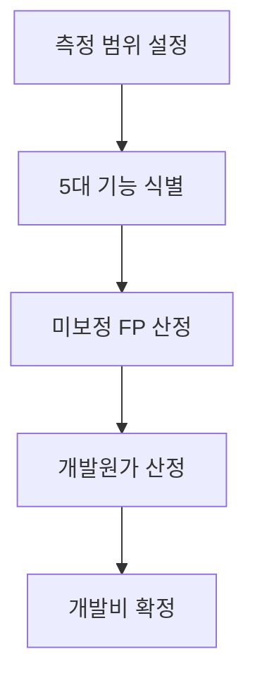
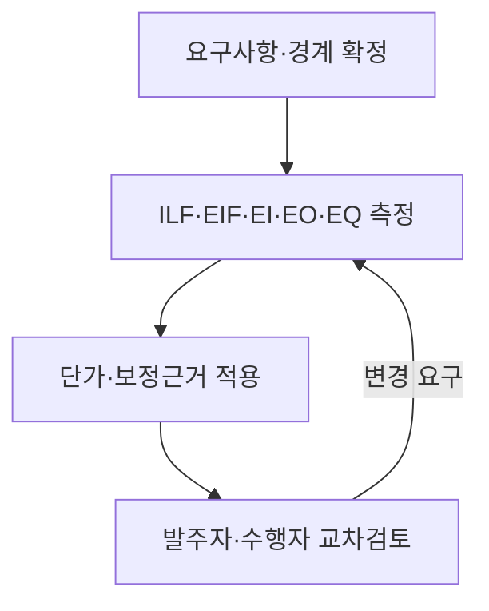

## 지식 로드맵 내 현재 위치
현재 위치: IT 전략·관리 → 소프트웨어 **비용** 산정(Software Cost Estimation)


## 30초 인출

- 본질: 개발 기능을 **기능점수**(FP)로 수량화하여 예산 편성 및 공정한 계약 대가 산정의 공통 기준을 마련하는 기법이다.
- 메커니즘: 애플리케이션 경계 설정 → 5대 기능(ILF/EIF/EI/EO/EQ) 측정 → 5대 보정계수 적용 → 개발원가 산출 → SW 개발비 확정한다.
- 판정 기준: 2025 개정 단가(605,784원/FP) 적용, 5대 보정계수 객관적 증적 확보 및 요구 변경 시 RTM 연동 증분 FP 재산정한다.

<details>
<summary>핵심 용어</summary>

- **FP(Function Point)**: 사용자가 요구하는 논리적 기능의 규모를 수치로 나타내는 측정 단위이다.
- **ILF(Internal Logical File)**: 애플리케이션 경계 안에서 해당 애플리케이션이 식별·유지하는 논리적 데이터 집합이다.
- **EIF(External Interface File)**: 다른 애플리케이션이 유지하고 측정 대상 애플리케이션이 참조하는 논리적 데이터 집합이다.
- **EI(External Input)**: 경계 밖에서 들어와 내부 데이터·동작을 변경하는 트랜잭션 기능이다.
- **EO(External Output)**: 처리·계산을 포함해 경계 밖으로 정보를 제공하는 트랜잭션 기능이다.
- **EQ(External Inquiry)**: 중요한 처리 없이 입력에 대응한 정보를 조회하는 트랜잭션 기능이다.

</details>

## 예상문제

> **(미출제 예상·25점)** SW **비용** 산정 접근법을 비교하고, **기능점수** 방식의 측정 절차·개발비 구성·산정 위험과 대응책을 설명하시오.

## Ⅰ. SW **비용** 산정의 개요

> 요구사항을 측정 가능한 규모와 **비용**으로 변환해야 예산·계약·변경관리의 기준이 성립한다.

- 정의: **SW 규모**·**공수**·**기간**을 추정하여 개발·운영에 필요한 **비용**을 산정하는 활동
- 목적: **적정 예산**·계약대가 확보 · **변경비용** 산정 · **사업 타당성** 판단

## Ⅱ. **비용** 산정 접근법과 FP 산정 체계

> 초기에는 유사사례로 범위를 잡고, 요구사항이 구체화되면 작업분해·모형 기반 추정으로 정밀화한다.

### 1. **비용** 산정 접근법

| 접근법 | 기준 | 적용 |
|---|---|---|
| 하향식 | 전문가 판단 · 유사사례 | 초기 개략 견적 |
| 상향식 | **WBS(Work Breakdown Structure)** 작업별 **공수** | 상세 범위 확정 후 |
| 모형식 | FP · **COCOMO(Constructive Cost Model)** | 데이터 기반 검증 |

### 2. FP 측정·대가 산정 메커니즘



- 활동: 사용자 관점 애플리케이션 경계 확정 → 데이터 기능(ILF·EIF)·트랜잭션 기능(EI·EO·EQ) 식별·분류 → 정통법 복잡도 매트릭스 또는 간이법 평균 가중치로 미보정 FP 산출 → 5대 보정계수 적용 후 2025년 단가(605,784원/FP) 곱산출 → 개발원가에 이윤(최대 25%)·직접경비 실비 합산
- 산출: 경계 정의 → 기능 목록 → 미보정 FP(UFP) → 보정 FP(AFP)·개발원가 → SW 개발비 산정서

### 3. 현행 **기능점수** 방식의 핵심 식

```text
개발원가 = **기능점수** × **기능점수**당 단가 × 5대 보정계수
SW 개발비 = 개발원가 + 이윤 + 직접경비
```

- 5대 보정계수: **규모 · 연계복잡성 · 성능요구수준 · 다중사이트 운영성 · 보안성**
- 2025년 개정판 **기능점수**당 단가: **605,784원**

## Ⅲ. 주요 산정 모형 비교

> 모형의 우열보다 산정 시점에 확보 가능한 입력과 추정 목적의 일치가 중요하다.

| 기준 | FP | LOC | COCOMO |
|---|---|---|---|
| 입력 | 사용자 기능 | 코드 라인 | 코드 규모 · **비용**동인 |
| 장점 | 언어 독립 · 조기 측정 | 측정 단순 | **공수**·기간 추정 |
| 한계 | 경계·기능 판정 편차 | 언어·구현 종속 | 보정 데이터 필요 |

## Ⅳ. 문제점·대응책

> 산식보다 측정 경계·기능 식별·변경 추적의 일관성이 견적 신뢰도를 결정한다.

| 위험 | 대책 | 효과 |
|---|---|---|
| 경계 불일치 | 애플리케이션 경계 합의 · 검토 | 중복·누락 방지 |
| 기능 분류 편차 | 측정 규칙 · 교차검증 적용 | 산정 재현성 확보 |
| 비기능 **비용** 누락 | 5대 보정계수 근거 기록 | 사업 특성 반영 |
| 범위 변경 미정산 | **RTM(Requirements Traceability Matrix)**과 증분 FP 연계 | 변경대가 근거 확보 |

## Ⅴ. 결론·기술사적 제언

### 학습자 통찰 메모 — 답안 밖

- [핵심 통찰]: 아무리 정밀한 공학적 FP 산식도 불명확한 시스템 경계와 과업 변경을 흡수하지 못함. 견적의 신뢰성은 초기 산정의 정확도보다, 개발 생애주기 동안 발생하는 요구사항 변경을 RTM과 증분 FP로 추적하여 대가로 연결하는 과업심의 연계성에 달려 있음.
- 나라면: RFP 기획 단계에서는 간이법 FP로 예산을 편성하되, 분석·설계 완료 단계에서 정통법 FP로 전수 재측정하여 과업 Baseline을 확정하고, 변경 발생 시 10% 이상 규모 증감에 대해 과업심의위원회를 즉각 소집하여 계약금액 조정을 신청하겠음.

### 실전 답안용 기술사적 제언

- **판정 기준**: 분석·설계로 구체화한 기능점수와 보정 근거가 기준 산정 내역을 벗어나면 계약·과업 변경 절차 적용 여부를 검토한다.
- **대응 방안**: 5대 보정계수(규모, 연계, 성능, 사이트, 보안) 적용 시 객관적 정량 증적(연계 인터페이스 명세서, 보안성 검토 결과 등) 첨부 제도화.
- **검증 체계**: 전문 감리법인 및 공공 SW 대가 전문위원회의 교차 검증(Cross-Check)을 통한 기능 분류(ILF/EIF/EI/EO/EQ) 왜곡 방지.
- **기대 효과**: 공공 SW 사업 제값 받기 정착, 잦은 과업 추가에 따른 개발사 적자 리스크 사전 통제 및 납기 품질 보장.



## 1교시 10점 답안 발췌

### 1. 정의·목적

- **정의**: 소프트웨어의 규모(기능)를 사용자 관점의 **기능점수**(FP)로 측정하여 적정 **공수**와 개발비를 산출하는 **소프트웨어 공학적 대가산정 기법**.
- **목적**: 공공 SW 적정 예산 확보, 무상 과업 추가 방지 및 계약 대가의 객관성·신뢰성 보장.

### 2. **기능점수**(FP) 기반 SW 개발비 산출 구조도


### 3. 핵심 산식 및 통제 고려사항

- **개발원가 산식**: $\text{개발원가} = \text{보정 **기능점수**} \times 605,784\text{원/FP (2025년 기준)}$.
- **총 SW 개발비**: $\text{개발원가} + \text{이윤(최대 25\%)} + \text{직접경비}$.
- **핵심 통제**: 시스템 경계 정의 합의, 5대 보정계수 정량 증적 확보, 과업 변경 시 RTM 연계 증분 FP 재산정.

## 출제 이력과 검증 출처

- 공식 문제지 원문 확인 전까지 직접 기출로 단정하지 않음
- [한국인공지능·소프트웨어산업협회, SW사업 대가산정 가이드(2025년 개정판)](https://www.sw.or.kr/site/sw/ex/board/View.do?bcIdx=63607&cbIdx=276)
- [ISO, ISO/IEC 14143-1:2007 Functional size measurement](https://www.iso.org/standard/42188.html)

## 학습 체크

- [ ] Ⅰ: SW **비용** 산정의 정의·목적을 구분해 쓸 수 있는가?
- [ ] Ⅱ: FP 5대 기능과 5대 보정계수를 각각 재현할 수 있는가?
- [ ] Ⅱ: 개발원가와 SW 개발비의 구성을 식으로 설명할 수 있는가?
- [ ] Ⅲ: FP·LOC·COCOMO를 입력·장점·한계로 비교할 수 있는가?
- [ ] Ⅳ~Ⅴ: 산정 위험 4개와 재산정·변경통제 방안을 연결할 수 있는가?

## 연결 토픽

- 이전: [112. CCPM·TOC](./112_critical_chain_toc.md)
- 관련: [026. SW 사업 대가산정](./026_software_cost_estimation.md) · [091. 과업심의](./091_public_sw_cost_and_scope_change_criteria.md)
- 다음: [114. 개방형 혁신](./114_open_innovation.md)
