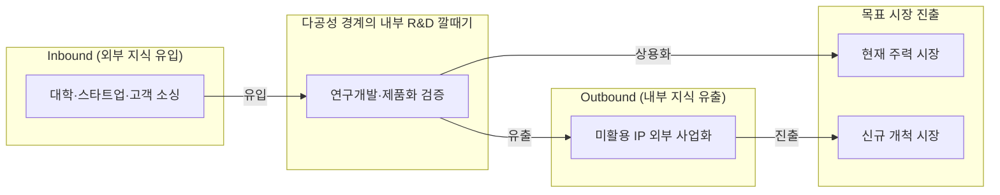
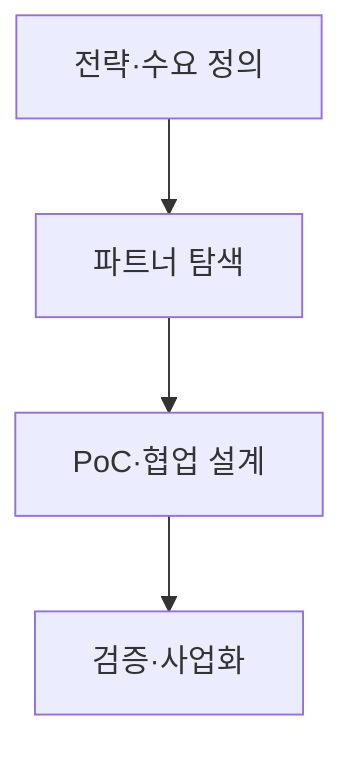
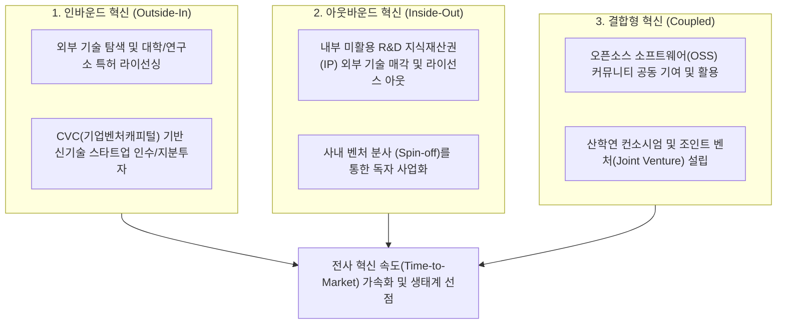

## 지식 로드맵 내 현재 위치
현재 위치: IT 전략·관리 → **개방형 혁신** (Open Innovation)

## 30초 인출

- 본질: 개방형 혁신은 기업 밖의 지식·기술을 받아들이거나 내부 성과를 외부에 활용해 혁신하는 전략이다.
- 메커니즘: Inbound(외부 소싱) · Outbound(스핀오프/라이선스) · Coupled(공동개발) 3대 흐름과 **IP** 권리 분리 통제한다.
- 판정 기준: **PoC** 의 기술·사업성 검증 결과와 Background **IP** ·Foreground **IP** 귀속의 명문화 여부를 확인한다.

핵심 용어

- **Open Innovation** : 기업 내외부 경계를 넘어 지식과 기술을 유입·유출하여 혁신을 가속하는 전략
- **Inbound Innovation** : 외부 기술과 아이디어를 내부 R&D 및 제품 개발에 결합하는 유입형 혁신
- **Outbound Innovation** : 내부 유휴 지식과 기술을 라이선스·스핀오프 등을 통해 외부에 사업화하는 유출형 혁신
- **Coupled Innovation** : 협력 파트너와 지식을 상호 교환하며 공동 R&D와 사업화를 추진하는 결합형 혁신
- **PoC(Proof of Concept)** : 기술적 구현 가능성과 사업 가설의 타당성을 소규모로 사전 검증하는 개념 검증 활동
- **IP(Intellectual Property)** : 특허·영업비밀 등 혁신 협업 과정에서 권리 귀속을 관리해야 하는 지식재산권

---

## 1교시 예상문제 (10점)

> 개방형 혁신의 지식 흐름과 외부 협력 통제를 설명하시오. (예상·10점)

---

## 1교시 10점 답안

### 1. 정의·목적

- 정의: 기업이 연구개발의 전 과정을 독자 수행하지 않고, 외부의 우수한 기술·아이디어·인재를 적극 도입하고 내부 자원을 외부와 공유하여 혁신 성과를 극대화하는 경영 전략
- 목적: R&D 기간 및 비용의 획기적 단축 · 시장 진입 속도(Time-to-Market) 가속화 · 개방형 디지털 비즈니스 생태계 주도권 확보

- **정의** : 조직 경계를 넘어 외부 기술을 유입(Inbound)하고 내부 미활용 지식을 유출(Outbound)하여 혁신 속도를 극대화하는 **개방형 R&D 및 사업화 전략** .
- **목적** : R&D 비용 절감, 타임투마켓 단축 및 미활용 지식재산권( **IP** )의 다각적 사업화.

### 2. 체스브로의 개방형 혁신 깔때기 구조도

### 3. 핵심 유형 및 거버넌스 통제

| 유형 | 지식 흐름 | 실행 방식 및 통제 |
|---|---|---|
| **Inbound** | 외부 → 내부 | 기술도입, 오픈 스타트업 협업, Background **IP** 보호 |
| **Outbound** | 내부 → 외부 | 라이선스 아웃, Spin-off 분사, 신규 시장 진출 |
| **Coupled** | 상호 교환 | 조인트벤처(JV), 오픈 플랫폼 생태계 구축, 성과 공정 배분 |

---

## 2~4교시 예상문제 (25점)

> **(미출제 예상·25점)** **개방형 혁신** 의 개념과 3대 지식 흐름을 설명하고, 폐쇄형 혁신과의 차이·추진절차·위험 대응방안을 제시하시오.

---

## 2~4교시 25점 답안

## Ⅰ. 개방형 혁신의 개요

> 개방은 무상 공개가 아니라 조직 밖 지식과 **사업화** 경로를 선택적으로 활용하는 경영전략이다.

| 구분 | 핵심 |
|---|---|
| 정의 | **조직 경계** 를 넘어 **지식·기술** 을 **유입·유출** 하여 혁신을 가속하고 시장 활용경로를 확대하는 방식 |
| 목적 | 탐색 범위 확대 · 개발위험 분담 · **사업화** 속도 향상 · 미활용 **IP** 가치화 |

## Ⅱ. 3대 지식 흐름과 추진체계

> 기술의 방향과 권리·가치의 귀속을 함께 설계해야 협업이 사업성과로 연결된다.

### 1. 3대 지식 흐름

| 유형 | 방향 | 실행 방식 |
|---|---|---|
| **Inbound** | 외부 → 내부 | 기술도입 · 공동연구 · 스타트업 협업 |
| **Outbound** | 내부 → 외부 | 라이선스 · Spin-off · 기술이전 |
| **Coupled** | 상호 교환 | 공동개발 · 합작 · 플랫폼 생태계 |

### 2. 체스브로의 개방형 혁신 깔때기(Innovation Funnel) 메커니즘

### 3. 추진절차

- 활동: 내부 핵심역량·기술 Gap 분석과 개방 범위 결정 → 대학·스타트업·전문 공급사 소싱 및 협업 후보군 평가 → 가설 수립·데이터 범위 확정·Background/Foreground **IP** 계약 체결 → 기술성·사업성·통합성 평가로 본 시스템 도입 또는 라이선스 결정
- 산출: 기술수요서 → 협업 후보군 → PoC 설계· **IP** 계약 → 도입·라이선스 결정

## Ⅲ. 폐쇄형·개방형 혁신 비교

> 선택 기준은 개방 여부가 아니라 핵심역량 보호와 외부 지식 활용의 균형이다.

| 기준 | 폐쇄형 | 개방형 |
|---|---|---|
| 지식원천 | 내부 R&D 중심 | 내·외부 지식 결합 |
| 사업화 | 내부 시장경로 | 내부·외부 경로 |
| 통제 | 조직 내부 소유 | 계약· **IP** ·거버넌스 |

## Ⅳ. 문제점·대응책

> 협업 실패는 기술 부족보다 목표· **IP** ·데이터·성과배분의 불명확성에서 발생한다.

| 위험 | 대책 | 효과 |
|---|---|---|
| 전략과 무관한 기술수집 | 기술수요·사업가설 선확정 | 탐색비용 절감 |
| **IP** ·성과 귀속 분쟁 | Background·Foreground **IP** 구분 | 권리관계 명확화 |
| 기술·영업비밀 유출 | 단계별 정보공개 · NDA · 접근통제 | 핵심자산 보호 |
| PoC 이후 단절 | 사업부 Owner · 도입 Gate 지정 | Scale-up 연결 |

## Ⅴ. 결론·기술사적 제언

### 실전 답안용 기술사적 제언

- 문제: 내부 R&D만 고집하는 폐쇄형 혁신(NIH 증후군)으로 인해 파괴적 기술 혁신 속도를 따라가지 못하고 시장 도태 위험에 직면함.
- 해결 방안: 헨리 체스브로의 개방형 혁신 모델을 바탕으로 외부 기술을 신속 도입하는 인바운드(Outside-In), 내부 미활용 자산을 사업화하는 아웃바운드(Inside-Out), 오픈소스 및 스타트업 협력을 결합하는 결합형(Coupled) 파이프라인을 구축함.

## 출제 이력과 검증 출처

- 공식 문제지 원문 확인 전까지 직접 기출로 단정하지 않음
- [European Commission, What is Open Innovation?](https://digital-strategy.ec.europa.eu/en/news/what-open-innovation)
- [Eurostat, Oslo Manual 2018 — Business Innovation and Knowledge Flows](https://ec.europa.eu/eurostat/documents/3859598/9718996/KS-01-18-852-EN-N.pdf/7817c566-ef37-498a-8786-a25c200318ae)

## 연결 토픽

- 이전: [113. SW 비용 산정](./113_software_cost_estimation.md)
- 관련: [047. 디자인 씽킹](./047_design_thinking.md) · [089. TAM·SAM·SOM](./089_tam_sam_som.md)
- 다음: [116. 인과루프다이어그램](./116_causal_loop_diagram.md)
