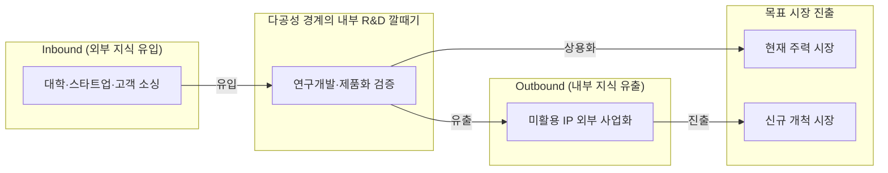

## 지식 로드맵 내 현재 위치
현재 위치: IT 전략·관리 → 개방형 혁신(Open Innovation)

## 30초 인출

- 본질: 개방형 혁신은 조직 안팎의 지식과 사업화 경로를 활용해 혁신하는 전략이다.
- 메커니즘: 외부 지식을 내부로 받아들이고, 내부 지식을 외부 경로로 사업화하며, 파트너와 공동개발한다.

핵심 용어

- **개방형 혁신(Open Innovation)**: 조직 안팎의 지식 유입·유출 경로를 활용해 혁신을 추진하는 전략.
- **Inbound Innovation** : 외부 기술과 아이디어를 내부 R&D 및 제품 개발에 결합하는 유입형 혁신
- **Outbound Innovation** : 내부 유휴 지식과 기술을 라이선스·스핀오프 등을 통해 외부에 사업화하는 유출형 혁신
- **Coupled Innovation** : 협력 파트너와 지식을 상호 교환하며 공동 R&D와 사업화를 추진하는 결합형 혁신
- **PoC(Proof of Concept)** : 기술적 구현 가능성과 사업 가설의 타당성을 소규모로 사전 검증하는 개념 검증 활동
- **IP(Intellectual Property)** : 특허·영업비밀 등 혁신 협업 과정에서 권리 귀속을 관리해야 하는 지식재산권

---

## 1교시 예상문제 (10점)

> 개방형 혁신의 지식 흐름과 외부 협력 통제를 설명하시오. (예상·10점)

---

## 1교시 10점 답안

### Ⅰ. 개요

| 구분 | 핵심 |
|---|---|
| 정의 | **개방형 혁신(Open Innovation)**은 조직 안팎의 지식과 사업화 경로를 활용해 혁신을 추진하는 전략이다. |
| 목적 | 외부 지식을 활용하고 내부 성과의 사업화 경로를 넓힌다. |

### Ⅱ. 지식 유입·유출 구조

### Ⅲ. 세 가지 지식 흐름

| 유형 | 지식 흐름 | 대표 실행 방식 |
|---|---|---|
| **Inbound** | 외부 지식 → 내부 혁신 | 기술도입·공동연구 |
| **Outbound** | 내부 지식 → 외부 사업화 | 라이선스·기술이전·Spin-off |
| **Coupled** | 외부와 내부 간 상호 교환 | 파트너 공동개발·합작 |

---

## 2~4교시 예상문제 (25점)

> 개방형 혁신의 개념과 세 가지 지식 흐름을 설명하고, 폐쇄형 혁신과의 차이·추진절차·위험 대응방안을 제시하시오. (예상·25점)

---

## 2~4교시 25점 답안

## Ⅰ. 개방형 혁신의 개요

> 개방은 무상 공개가 아니라 조직 밖 지식과 **사업화** 경로를 선택적으로 활용하는 경영전략이다.

| 구분 | 핵심 |
|---|---|
| 정의 | **개방형 혁신(Open Innovation)**은 조직 안팎의 지식과 사업화 경로를 활용해 혁신을 추진하는 전략이다. |
| 목적 | 외부 지식을 활용하고 내부 성과의 사업화 경로를 넓힌다. |

## Ⅱ. 3대 지식 흐름과 추진체계

> 기술의 방향과 권리·가치의 귀속을 함께 설계해야 협업이 사업성과로 연결된다.

### 1. 3대 지식 흐름

| 유형 | 방향 | 실행 방식 |
|---|---|---|
| **Inbound** | 외부 → 내부 | 기술도입 · 공동연구 · 스타트업 협업 |
| **Outbound** | 내부 → 외부 | 라이선스 · Spin-off · 기술이전 |
| **Coupled** | 상호 교환 | 공동개발 · 합작 · 플랫폼 생태계 |

### 2. 지식 유입·유출 구조

### 3. 추진 단계와 산출

| 단계 | 핵심 활동 | 산출 |
|---|---|---|
| 수요·목표 정의 | 해결할 문제와 필요한 지식·역량 지정 | 협업 과제·선정 기준 |
| 파트너·조건 협의 | 파트너 적합성, 정보공개 범위, IP·비밀유지 조건 합의 | 협업 범위·계약 조건 |
| 검증·활용 결정 | PoC 결과와 사업성 검토, 도입·공동개발·라이선스 선택 | 활용·사업화 결정 |

- 활동: 내부 핵심역량·기술 Gap 분석과 개방 범위 결정 → 대학·스타트업·전문 공급사 소싱 및 협업 후보군 평가 → 가설 수립·데이터 범위 확정·Background/Foreground **IP** 계약 체결 → 기술성·사업성·통합성 평가로 본 시스템 도입 또는 라이선스 결정
- 산출: 기술수요서 → 협업 후보군 → PoC 설계· **IP** 계약 → 도입·라이선스 결정

## Ⅲ. 폐쇄형·개방형 혁신 비교

> 선택 기준은 개방 여부가 아니라 핵심역량 보호와 외부 지식 활용의 균형이다.

| 기준 | 폐쇄형 | 개방형 |
|---|---|---|
| 지식원천 | 내부 R&D 중심 | 내·외부 지식 결합 |
| 사업화 | 내부 시장경로 | 내부·외부 경로 |
| 통제 | 조직 내부 소유 | 계약· **IP** ·거버넌스 |

## Ⅳ. 문제점·대응책

> 협업 실패는 기술 부족보다 목표· **IP** ·데이터·성과배분의 불명확성에서 발생한다.

| 위험 | 대책 | 효과 |
|---|---|---|
| 전략과 무관한 기술수집 | 기술수요·사업가설 선확정 | 탐색비용 절감 |
| **IP** ·성과 귀속 분쟁 | Background·Foreground **IP** 구분 | 권리관계 명확화 |
| 기술·영업비밀 유출 | 단계별 정보공개 · NDA · 접근통제 | 핵심자산 보호 |
| PoC 이후 단절 | 사업부 Owner · 도입 Gate 지정 | Scale-up 연결 |

## Ⅴ. 한정된 협업자원을 사업성과가 확인되는 과제에 집중하는 기술사적 제언

| 문제 | 해결 방안 |
|---|---|
| 협업 주제와 성과기준을 정하지 않고 다수의 외부 제안을 동시에 추진하면 내부 검토자원이 분산되고 도입 결정이 늦어질 수 있다. | 우선순위가 높은 사업문제 하나를 협업 과제로 정하고, PoC 시작 전에 기술 적합성·사용자 가치·도입비용의 확인 기준을 합의한다. 기준을 충족한 과제에만 후속 자원을 배정한다. |

## 출제 이력과 검증 출처

- 공식 문제지 원문 확인 전까지 직접 기출로 단정하지 않음
- [European Commission, What is Open Innovation?](https://digital-strategy.ec.europa.eu/en/news/what-open-innovation)
- European Commission, [Open innovation and knowledge flows](https://research-and-innovation.ec.europa.eu/document/download/92922492-eb49-48a3-ac1a-509b31b3805e_en?filename=ec_rtd_srip-2022-report-chapter-7.pdf)
- [Eurostat, Oslo Manual 2018 — Business Innovation and Knowledge Flows](https://ec.europa.eu/eurostat/documents/3859598/9718996/KS-01-18-852-EN-N.pdf/7817c566-ef37-498a-8786-a25c200318ae)

## 연결 토픽

- 이전: [113. SW 비용 산정](./113_software_cost_estimation.md)
- 관련: [047. 디자인 씽킹](./047_design_thinking.md) · [089. TAM·SAM·SOM](./089_tam_sam_som.md)
- 다음: [116. 인과루프다이어그램](./116_causal_loop_diagram.md)
