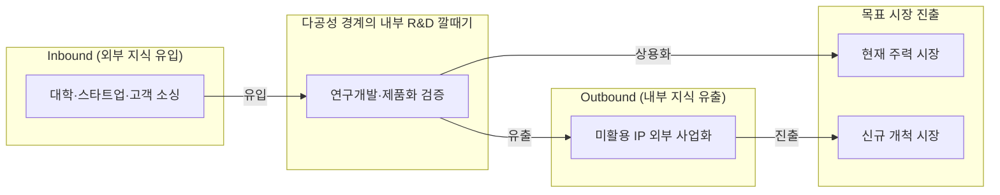
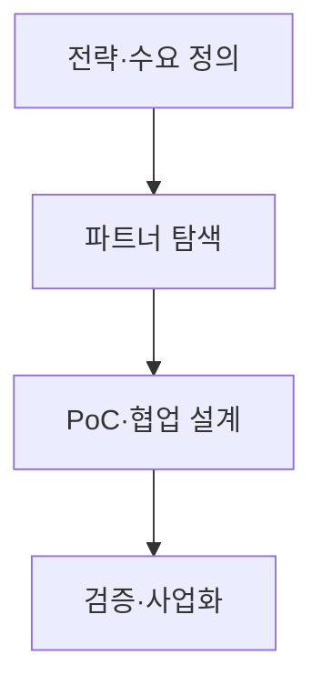

## 지식 로드맵 내 현재 위치

  IT 전략·관리
  혁신관리
  <strong>개방형 혁신</strong>

## 30초 인출

- 본질: 기업 내부의 경계를 넘어 지식과 기술을 의도적으로 유입·유출함으로써 내부 혁신을 가속하고 외부 사업화 경로를 확장하는 경영 전략
- 메커니즘: Inbound(외부 소싱) · Outbound(스핀오프/라이선스) · Coupled(공동개발) 3대 흐름과 IP 권리 분리 통제
- 판정 기준: PoC 후 상용화 전환율(40% 이상) 달성 여부 및 Background IP(기존 권리)와 Foreground IP(신규 창출 권리)의 명문화

핵심 용어

- **Open Innovation**: 의도적인 지식 유입·유출로 내부 혁신을 가속하고 외부 사업화 경로를 확장하는 혁신 방식
- **Inbound Innovation**: 외부 기술·아이디어를 내부 R&D·제품에 결합하는 흐름
- **Outbound Innovation**: 내부 지식·기술을 라이선스·분사 등 외부 경로로 사업화하는 흐름
- **Coupled Innovation**: 파트너와 지식을 상호 교환하며 공동개발·사업화를 수행하는 흐름
- **PoC(Proof of Concept)**: 기술·사업 가설의 실현 가능성을 제한된 범위에서 검증하는 활동
- **IP(Intellectual Property)**: 특허·저작권·영업비밀 등 혁신 성과의 권리 자산

## 예상문제

> **(미출제 예상·25점)** 개방형 혁신의 개념과 3대 지식 흐름을 설명하고, 폐쇄형 혁신과의 차이·추진절차·위험 대응방안을 제시하시오.

## Ⅰ. 개방형 혁신의 개요

> 개방은 무상 공개가 아니라 조직 밖 지식과 사업화 경로를 선택적으로 활용하는 경영전략이다.

- 정의: 조직 경계를 넘어 지식·기술을 **유입·유출**하여 혁신을 가속하고 시장 활용경로를 확대하는 방식
- 목적: 탐색 범위 확대 · 개발위험 분담 · 사업화 속도 향상 · 미활용 IP 가치화

## Ⅱ. 3대 지식 흐름과 추진체계

> 기술의 방향과 권리·가치의 귀속을 함께 설계해야 협업이 사업성과로 연결된다.

### 1. 3대 지식 흐름

| 유형 | 방향 | 실행 방식 |
|---|---|---|
| **Inbound** | 외부 → 내부 | 기술도입 · 공동연구 · 스타트업 협업 |
| **Outbound** | 내부 → 외부 | 라이선스 · Spin-off · 기술이전 |
| **Coupled** | 상호 교환 | 공동개발 · 합작 · 플랫폼 생태계 |

### 2. 체스브로의 개방형 혁신 깔때기(Innovation Funnel) 메커니즘

### 3. 추진절차

- 활동: 내부 핵심역량·기술 Gap 분석과 개방 범위 결정 → 대학·스타트업·전문 공급사 소싱 및 협업 후보군 평가 → 가설 수립·데이터 범위 확정·Background/Foreground IP 계약 체결 → 기술성·사업성·통합성 평가로 본 시스템 도입 또는 라이선스 결정
- 산출: 기술수요서 → 협업 후보군 → PoC 설계·IP 계약 → 도입·라이선스 결정

## Ⅲ. 폐쇄형·개방형 혁신 비교

> 선택 기준은 개방 여부가 아니라 핵심역량 보호와 외부 지식 활용의 균형이다.

| 기준 | 폐쇄형 | 개방형 |
|---|---|---|
| 지식원천 | 내부 R&D 중심 | 내·외부 지식 결합 |
| 사업화 | 내부 시장경로 | 내부·외부 경로 |
| 통제 | 조직 내부 소유 | 계약·IP·거버넌스 |

## Ⅳ. 문제점·대응책

> 협업 실패는 기술 부족보다 목표·IP·데이터·성과배분의 불명확성에서 발생한다.

| 위험 | 대책 | 효과 |
|---|---|---|
| 전략과 무관한 기술수집 | 기술수요·사업가설 선확정 | 탐색비용 절감 |
| IP·성과 귀속 분쟁 | Background·Foreground IP 구분 | 권리관계 명확화 |
| 기술·영업비밀 유출 | 단계별 정보공개 · NDA · 접근통제 | 핵심자산 보호 |
| PoC 이후 단절 | 사업부 Owner · 도입 Gate 지정 | Scale-up 연결 |

## Ⅴ. 결론·기술사적 제언

### 학습자 통찰 메모 — 답안 밖

- [핵심 통찰]: 개방형 혁신의 성패는 외부 파트너 수나 PoC 과제 건수가 아니라, 외부 지식을 내부 핵심 파이프라인으로 흡수(Absorptive Capacity)하여 실제 사업화 매출로 연결하고, 기존 배경지식(Background IP)과 창출성과(Foreground IP)를 계약적으로 분리 방어하는 능력에 달려 있음.
- 나라면: 핵심 알고리즘·데이터는 강력히 은닉·보호하고, API 및 인터페이스 계층은 오픈형 샌드박스로 개방하는 '경계형 IP 거버넌스'를 수립하며, PoC 단계부터 현업 사업부 담당자를 공동 PM으로 지정해 PoC 종료 즉시 본 시스템에 탑재되도록 통제하겠다.

### 실전 답안용 기술사적 제언

- **판정 기준**: 파트너십 체결 전 PoC 종료 후 6개월 이내 상용화 전환율(Conversion Rate) 40% 이상 목표 설정 및 사전 IP 귀속 합의 완료 여부 판정
- **대응 방안**: 계약 단계에서 Background IP(기존 권리)와 Foreground IP(신규 창출 권리)의 귀속을 명문화하고, 기여도 기반 공정 배분 계약(Tiered Royalty) 제도화
- **검증 체계**: PoC Quality Gate(기술성·사업성·IP 침해·레거시 통합성) 4단계 다면 심사제 운영
- **기대 효과**: R&D 비용 30% 절감, 타임투마켓(Time-to-Market) 50% 단축 및 글로벌 오픈 플랫폼 생태계 선점

## 1교시 10점 답안 발췌

### 1. 정의·목적

- **정의**: 조직 경계를 넘어 외부 기술을 유입(Inbound)하고 내부 미활용 지식을 유출(Outbound)하여 혁신 속도를 극대화하는 **개방형 R&D 및 사업화 전략**
- **목적**: R&D 비용 절감, 타임투마켓 단축 및 미활용 지식재산권(IP)의 다각적 사업화

### 2. 체스브로의 개방형 혁신 깔때기 구조도

### 3. 핵심 유형 및 거버넌스 통제

| 유형 | 지식 흐름 | 실행 방식 및 통제 |
|---|---|---|
| **Inbound** | 외부 → 내부 | 기술도입, 오픈 스타트업 협업, Background IP 보호 |
| **Outbound** | 내부 → 외부 | 라이선스 아웃, Spin-off 분사, 신규 시장 진출 |
| **Coupled** | 상호 교환 | 조인트벤처(JV), 오픈 플랫폼 생태계 구축, 성과 공정 배분 |

## 출제 이력과 검증 출처

- 공식 문제지 원문 확인 전까지 직접 기출로 단정하지 않음
- [European Commission, What is Open Innovation?](https://digital-strategy.ec.europa.eu/en/news/what-open-innovation)
- [Eurostat, Oslo Manual 2018 — Business Innovation and Knowledge Flows](https://ec.europa.eu/eurostat/documents/3859598/9718996/KS-01-18-852-EN-N.pdf/7817c566-ef37-498a-8786-a25c200318ae)

## 학습 체크

- [ ] Ⅰ: 개방형 혁신의 정의·목적을 두 줄로 재현할 수 있는가?
- [ ] Ⅱ: Inbound·Outbound·Coupled의 방향과 실행 방식을 구분할 수 있는가?
- [ ] Ⅱ: 4단계의 활동·산출물을 연결할 수 있는가?
- [ ] Ⅲ: 폐쇄형·개방형을 지식원천·사업화·통제로 비교할 수 있는가?
- [ ] Ⅳ~Ⅴ: 위험 4개와 경계형 IP 거버넌스를 설명할 수 있는가?

## 연결 토픽

- 이전: [113. SW 비용 산정](./113_software_cost_estimation.md)
- 관련: [047. 디자인 씽킹](./047_design_thinking.md) · [089. TAM·SAM·SOM](./089_tam_sam_som.md)
- 다음: [116. 인과루프다이어그램](./116_causal_loop_diagram.md)
