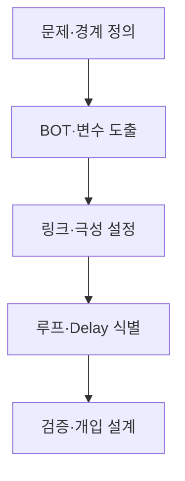
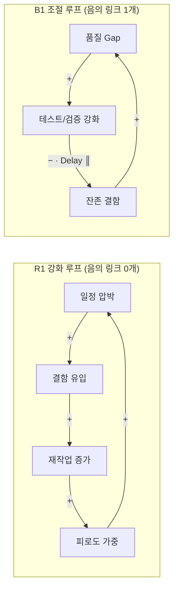

## 지식 로드맵 내 현재 위치
현재 위치: IT 전략·관리 → 인과루프다이어그램(Causal Loop Diagram)


## 30초 인출

- 본질: 변수 간 **인과관계**를 닫힌 피드백 루프(**Feedback Loop**)와 시간 지연(**Delay**)으로 연결해 시스템의 구조적 행동 원인을 설명하는 모델이다.
- 메커니즘: 변수 식별 → 극성(+/-) 링크 연결 → 강화 루프(R)/조절 루프(B) 판정 → **Delay** 표시 → 레버리지 포인트(**Leverage Point**) 도출한다.
- 판정 기준: 폐쇄 루프 내 음(-)의 링크 개수(0/짝수=R, 홀수=B) 및 가설 검증을 통한 Stock-Flow 정량 모델 전환 필요성이다.

<details>
<summary>핵심 용어</summary>

- **CLD(Causal Loop Diagram)**: 변수·인과 링크·극성·**Feedback Loop**를 표현하는 정성적 시스템 모델이다.
- **R(Reinforcing Loop)**: 초기 변화를 같은 방향으로 증폭하는 강화 루프이다.
- **B(Balancing Loop)**: 초기 변화에 맞서 목표·균형으로 접근하는 조절 루프이다.
- **Delay**: 원인 변화와 결과 발현 사이의 시간 지연이다.
- **BOT(Behavior Over Time)**: 주요 변수의 시간에 따른 변화 패턴이다.
- **Leverage Point**: 작은 개입으로 시스템 행동을 크게 바꾸는 구조적 지점이다.

</details>

## 예상문제

> **(미출제 예상·25점)** CLD의 구성요소와 작성절차를 설명하고, 강화·조절 루프의 판정방법·활용 한계·IT 프로젝트 적용방안을 제시하시오.

## Ⅰ. CLD의 개요

> 사건을 나열하지 않고 사건을 반복 생성하는 Feedback 구조를 가설로 표현한다.

- 정의: 시스템 변수의 **인과관계**·**극성**·**Feedback Loop**·**Delay**를 표현하는 정성적 모델
- 목적: 순환 인과구조 이해 · 의도하지 않은 정책효과 탐색 · Leverage Point 도출

## Ⅱ. 구성요소·작성절차

> 좋은 CLD는 변수명·극성·루프 경계가 명확하고 관찰 자료로 검증 가능한 가설이어야 한다.

### 1. 구성요소

| 요소 | 표기 | 판정 |
|---|---|---|
| 변수 | 명사구 | 시간에 따라 증감 가능 |
| 인과 링크 | →, +/− | 같은 방향 `+` · 반대 방향 `−` |
| **Feedback Loop** | R/B | 닫힌 경로의 전체 극성 |
| **Delay** | ║ | 효과 발현 시차 |

### 2. 작성절차



- 활동: 시스템 현상·관찰 기간·이해관계자 범위 설정 → BOT 패턴 분석 및 증감 가능 변수 명사화 → 인과 방향·극성(+/-) 설정 → 폐쇄 경로 극성(R/B) 판정 및 **Delay**(║) 명시 → 데이터·인터뷰 교차 검증 및 Leverage Point 개입 계획 수립
- 산출: 문제 정의서 → 변수 목록 → 인과 링크 근거 → R/B 루프·**Delay** 표기 → 개입 계획

## Ⅲ. 강화·조절 루프 판정 및 IT 프로젝트 CLD 아키텍처

> 링크 수가 아니라 폐쇄 루프 안의 음의 링크 개수로 전체 극성을 판정한다. (음의 부호가 짝수/0개면 R, 홀수면 B)



| 기준 | 강화 루프 R | 조절 루프 B |
|---|---|---|
| 음의 링크 | 0개 또는 짝수 | 홀수 |
| 행동 | 변화 증폭 | 변화 억제·목표 추구 |
| 형태 | 성장·쇠퇴 | 수렴·진동 가능 |

## Ⅳ. 문제점·대응책

> CLD는 인과 가설을 공유하는 도구이지 관계의 진실이나 정량 예측을 자동 보장하지 않는다.

| 위험 | 대책 | 효과 |
|---|---|---|
| 상관관계를 인과로 오인 | 데이터·현업 인터뷰 교차검증 | 인과 근거 강화 |
| 변수·경계 과다 | 핵심 루프별 분리 · 경계 명시 | 가독성 확보 |
| **Delay** 누락 | 정책효과 발현시점 별도 표시 | 과잉 대응 방지 |
| 정량 예측으로 오용 | Stock·Flow 모델로 확장 | 시뮬레이션 가능 |

## Ⅴ. 결론·기술사적 제언

### 실전 답안용 기술사적 제언

- 문제: 복잡한 비즈니스 및 IT 시스템 문제를 단순한 1차원적 인과관계로만 판단하여, 조치 후 예기치 못한 부작용(워터멜론 효과, 시스템 마비)과 정책 저항에 직면함.
- 해결 방안: 시스템 다이내믹스의 인과루프다이어그램(CLD)을 적용하여 원인과 결과의 피드백 루프(강화 루프 R, 균형 루프 B)와 시간 지연(Delay)을 종합 모델링함으로써 근본적 시스템 레버리지(Leverage Point)를 도출함.

```mermaid
flowchart TD
    subgraph Loops["인과루프다이어그램(CLD) 2대 핵심 피드백 구조"]
        subgraph Reinforcing["강화 루프 (Reinforcing Loop, R) - 눈덩이 효과"]
            R_A["신규 기능 배포 속도"] -->|양(+)의 영향| R_B["사용자 유입 증가"]
            R_B -->|양(+)의 영향| R_C["매출 및 개발 투자 확대"]
            R_C -->|양(+)의 영향| R_A
        end
        subgraph Balancing["균형 루프 (Balancing Loop, B) - 자기 조절"]
            B_A["시스템 부하 증가"] -->|양(+)의 영향| B_B["장애 발생률"]
            B_B -->|음(-)의 영향| B_C["안정성 조치 및 기능 동결"]
            B_C -->|음(-)의 영향| B_A
        end
    end
    subgraph DelayImpact["시간 지연 (Delay)의 영향"]
        DEL["원인 조치와 결과 발현 사이의 시간 지연(||) 식별 -> 정책 저항 예측"]
    end
    Loops --- DelayImpact
```

## 1교시 10점 답안 발췌

### 1. 정의·목적

- 정의: 복잡한 시스템 내부 구성요소 간의 상호 인과관계, 피드백 루프(강화·균형), 시간 지연(Delay)을 화살표와 기호(+/-)로 시각화하여 동적 거동을 분석하는 시스템 다이내믹스 모델링 도구
- 목적: 단선적 사고 탈피 및 시스템 전체론적 조망 · 정책 실행 시 예상치 못한 부작용 및 정책 저항 사전 예측 · 근본적 문제 해결 레버리지(Leverage Point) 도출

- **정의**: 복잡한 시스템 내부의 변수 간 **인과관계**, 피드백 루프(**Feedback Loop**), 시간 지연(**Delay**)을 시각화하여 동적 거동을 설명하는 **정성적 시스템 다이내믹스 모델링 도구**.
- **목적**: 문제의 근본 구조 규명, 정책 저항 및 부작용(Fixes that Fail) 사전 예방, 최적의 레버리지 포인트(Leverage Point) 도출.

### 2. 강화 루프(R) 및 조절 루프(B) 구조도


### 3. 핵심 판정 기준 및 구성요소

| 구성요소 | 표기 | 판정 및 의미 |
|---|---|---|
| **변수** | 명사구 | 시간에 따라 증감 가능한 시스템 상태 |
| **인과 링크** | → (+, -) | 원인 변화 시 결과의 동반 변화 방향 |
| **루프 극성** | R (강화), B (조절) | 음(-)의 링크 개수 기준 (0/짝수=R, 홀수=B) |
| **시간 지연** | ║ (**Delay**) | 원인 개입 후 결과 발현까지의 시차 |

## 출제 이력과 검증 출처

- 공식 문제지 원문 확인 전까지 직접 기출로 단정하지 않음
- [MIT OpenCourseWare, Introduction to Project Dynamics](https://ocw.mit.edu/courses/esd-36-system-project-management-fall-2012/800ceb204ef03177b61e1288533446c1_MITESD_36F12_Lec06.pdf)
- [MIT OpenCourseWare, Introduction to Engineering Systems — Causal Loop Diagrams](https://ocw.mit.edu/courses/esd-00-introduction-to-engineering-systems-spring-2011/816df198baedb3b544ab4148ce86927d_MITESD_00S11_lec02.pdf)

## 학습 체크

- [ ] Ⅰ: CLD의 정의·목적을 두 줄로 재현할 수 있는가?
- [ ] Ⅱ: 변수·링크·루프·**Delay**의 표기와 판정 기준을 설명할 수 있는가?
- [ ] Ⅱ: 5단계 활동·산출물을 연결할 수 있는가?
- [ ] Ⅲ: 음의 링크 개수로 R/B를 판정하고 IT 예시를 작도할 수 있는가?
- [ ] Ⅳ~Ⅴ: CLD의 4대 위험과 정량 모델 전환 기준을 제시할 수 있는가?

## 연결 토픽

- 이전: [113. SW 비용 산정](./113_software_cost_estimation.md)
- 관련: [112. CCPM·TOC](./112_critical_chain_toc.md) · [040. 부정적 위험 대응](./040_negative_risk_response_strategy.md)
- 다음: [2과목 SW 공학](../02-software-engineering/)
