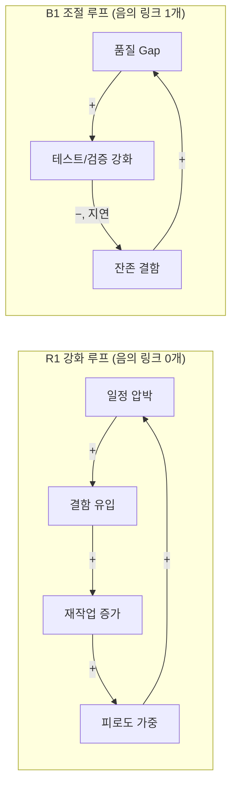
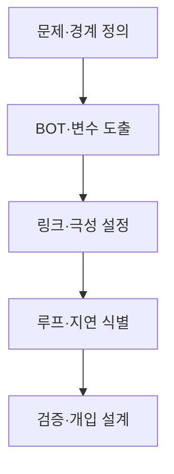

## 지식 로드맵 내 현재 위치
현재 위치: IT 전략·관리 → 인과루프다이어그램(Causal Loop Diagram)

## 30초 인출

- 본질: 인과루프다이어그램은 변수 간 인과관계와 되먹임을 그린 정성적 모델
- 메커니즘: 변수·인과 방향·연결 극성(+/−)의 표시와 폐쇄 루프의 전체 극성에 따른 강화(R)·조절(B) 구분

핵심 용어

- **인과루프다이어그램(Causal Loop Diagram)** : 변수 사이 인과관계와 되먹임을 나타내는 정성적 시스템 모델
- **R(Reinforcing Loop)** : 루프를 한 바퀴 돈 뒤 변화가 원래 방향으로 커지는 강화 피드백
- **B(Balancing Loop)** : 루프를 한 바퀴 돈 뒤 변화가 억제되거나 목표와의 차이가 줄어드는 조절 피드백
- **Delay** : 원인 변화가 결과 변수에 반영되기까지의 시간 지연
- **BOT(Behavior Over Time)** : 변수가 시간에 따라 어떻게 변하는지 나타내는 추세
- **Leverage Point** : 시스템 행동에 큰 변화를 줄 수 있는 개입 지점

---

## 1교시 예상문제 (10점)

> 인과루프다이어그램의 강화·조절 루프와 판정 방법을 설명하시오. (예상·10점)

---

## 1교시 10점 답안

### Ⅰ. 개요

| 구분 | 핵심 |
|---|---|
| 정의 | **인과루프다이어그램(Causal Loop Diagram)**은 변수 간 인과관계와 되먹임을 나타내는 정성적 시스템 모델 |
| 목적 | 반복되는 문제 구조의 파악과 개입이 시스템에 미칠 영향의 탐색 |

### Ⅱ. 강화 루프(R) 및 조절 루프(B)

### Ⅲ. 핵심 판정 기준

| 구성요소 | 표기 | 판정 및 의미 |
|---|---|---|
| **변수** | 명사구 | 시간에 따라 증감 가능한 시스템 상태 |
| **인과 링크** | → (+, -) | 원인 변화 시 결과의 동반 변화 방향 |
| **루프 극성** | R (강화), B (조절) | 음(-)의 링크 개수 기준 (0/짝수=R, 홀수=B) |
| **시간 지연** | 지연 표기 | 원인 개입 후 결과 발현까지의 시차 |

제언: 루프의 극성만으로 대응을 결정하지 말고 인과관계와 효과 지연을 관찰 자료로 확인

---

## 2~4교시 예상문제 (25점)

> CLD의 구성요소와 작성 절차, 강화·조절 루프의 판정 방법 및 IT 프로젝트 적용 시 유의점을 설명하시오. (예상·25점)

---

## 2~4교시 25점 답안

## Ⅰ. CLD의 개요

> 개별 사건보다 사건을 반복 생성하는 Feedback 구조의 가설 표현

| 구분 | 핵심 |
|---|---|
| 정의 | **인과루프다이어그램(Causal Loop Diagram)**은 변수 간 인과관계와 되먹임을 나타내는 정성적 시스템 모델 |
| 목적 | 반복되는 문제 구조의 파악과 개입이 시스템에 미칠 영향의 탐색 |

## Ⅱ. 구성요소·작성절차

> 검증 가능한 CLD의 조건은 명확한 변수명·극성·루프 경계와 관찰 자료로 확인할 수 있는 인과 가설

### 1. 구성요소

| 요소 | 표기 | 판정 |
|---|---|---|
| 변수 | 명사구 | 시간에 따라 증감 가능 |
| 인과 링크 | →, +/− | 같은 방향 `+` · 반대 방향 `−` |
| **Feedback Loop** | R/B | 닫힌 경로의 전체 극성 |
| **Delay** | 지연 표기 | 효과 발현 시차 |

### 2. 작성절차

- 활동: 시스템 현상·관찰 기간·이해관계자 범위 설정 → BOT 패턴 분석 및 증감 가능 변수 명사화 → 인과 방향·극성(+/−) 설정 → 폐쇄 경로 극성(R/B) 판정 및 지연 표시 → 자료·인터뷰 교차 검증 및 개입 계획 수립
- 산출: 문제 정의서 → 변수 목록 → 인과 링크 근거 → R/B 루프·지연 표시 → 개입 계획

## Ⅲ. 강화·조절 루프 판정

> 전체 극성의 판정 기준은 링크 총수가 아닌 폐쇄 루프 안의 음의 링크 개수(짝수·0개는 R, 홀수는 B)

| 기준 | 강화 루프 R | 조절 루프 B |
|---|---|---|
| 음의 링크 | 0개 또는 짝수 | 홀수 |
| 행동 | 변화 증폭 | 변화 억제·목표 추구 |
| 형태 | 성장·쇠퇴 | 수렴·진동 가능 |

## Ⅳ. 문제점·대응책

> CLD는 인과 가설을 공유하는 도구이며 관계의 참·거짓이나 정량 예측을 보증하는 모델과는 구분

| 위험 | 대책 | 효과 |
|---|---|---|
| 상관관계를 인과로 오인 | 데이터·현업 인터뷰 교차검증 | 인과 근거 강화 |
| 변수·경계 과다 | 핵심 루프별 분리 · 경계 명시 | 가독성 확보 |
| **Delay** 누락 | 정책효과 발현시점 별도 표시 | 과잉 대응 방지 |
| 정량 예측으로 오용 | Stock·Flow 모델로 확장 | 시뮬레이션 가능 |

## Ⅴ. 기술사적 제언

| 문제 | 해결 방안 |
|---|---|
| 효과 지연 중 같은 조치를 반복해 발생하는 과잉 대응 위험 | 예상 지연 기간에 맞춘 검토 시점 설정과 선행·결과 변수의 동시 관찰, 차이 지속 시 인과 가설·개입 지점 재검토 |

## 출제 이력과 검증 출처

- 공식 문제지 원문 확인 전까지 직접 기출로 단정하지 않음
- [MIT OpenCourseWare, Introduction to Project Dynamics](https://ocw.mit.edu/courses/esd-36-system-project-management-fall-2012/800ceb204ef03177b61e1288533446c1_MITESD_36F12_Lec06.pdf)
- [MIT OpenCourseWare, Introduction to Engineering Systems — Causal Loop Diagrams](https://ocw.mit.edu/courses/esd-00-introduction-to-engineering-systems-spring-2011/816df198baedb3b544ab4148ce86927d_MITESD_00S11_lec02.pdf)

## 연결 토픽

- 이전: [113. SW 비용 산정](./113_software_cost_estimation.md)
- 관련: [112. CCPM·TOC](./112_critical_chain_toc.md) · [040. 부정적 위험 대응](./040_negative_risk_response_strategy.md)
- 다음: [2과목 SW 공학](../02-software-engineering/)
