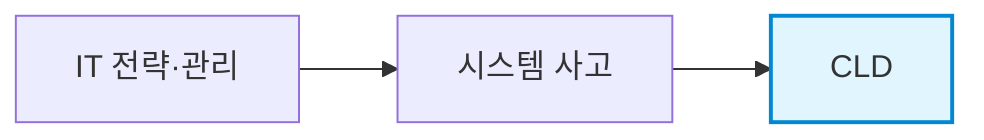
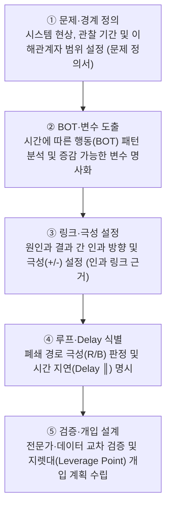
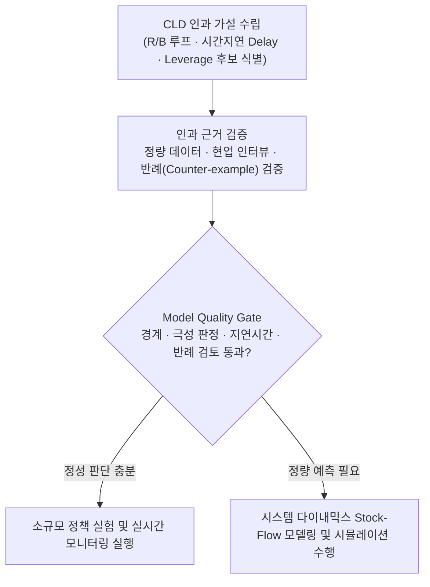

## 지식 로드맵 내 현재 위치



## 30초 인출

- 본질: 변수 간 인과관계를 닫힌 피드백 루프(Feedback Loop)와 시간 지연(Delay)으로 연결해 시스템의 구조적 행동 원인을 설명하는 모델
- 메커니즘: 변수 식별 → 극성(+/-) 링크 연결 → 강화 루프(R)/조절 루프(B) 판정 → Delay 표시 → 레버리지 포인트(Leverage Point) 도출
- 판정 기준: 폐쇄 루프 내 음(-)의 링크 개수(0/짝수=R, 홀수=B) 및 가설 검증을 통한 Stock-Flow 정량 모델 전환 필요성

<details>
<summary>핵심 용어</summary>

- **CLD(Causal Loop Diagram)**: 변수·인과 링크·극성·Feedback Loop를 표현하는 정성적 시스템 모델
- **R(Reinforcing Loop)**: 초기 변화를 같은 방향으로 증폭하는 강화 루프
- **B(Balancing Loop)**: 초기 변화에 맞서 목표·균형으로 접근하는 조절 루프
- **Delay**: 원인 변화와 결과 발현 사이의 시간 지연
- **BOT(Behavior Over Time)**: 주요 변수의 시간에 따른 변화 패턴
- **Leverage Point**: 작은 개입으로 시스템 행동을 크게 바꾸는 구조적 지점

</details>

## 예상문제

> **(미출제 예상·25점)** CLD의 구성요소와 작성절차를 설명하고, 강화·조절 루프의 판정방법·활용 한계·IT 프로젝트 적용방안을 제시하시오.

## Ⅰ. CLD의 개요

> 사건을 나열하지 않고 사건을 반복 생성하는 Feedback 구조를 가설로 표현한다.

- 정의: 시스템 변수의 **인과관계·극성·Feedback Loop·Delay**를 표현하는 정성적 모델
- 목적: 순환 인과구조 이해 · 의도하지 않은 정책효과 탐색 · Leverage Point 도출

## Ⅱ. 구성요소·작성절차

> 좋은 CLD는 변수명·극성·루프 경계가 명확하고 관찰 자료로 검증 가능한 가설이어야 한다.

### 1. 구성요소

| 요소 | 표기 | 판정 |
|---|---|---|
| 변수 | 명사구 | 시간에 따라 증감 가능 |
| 인과 링크 | →, +/− | 같은 방향 `+` · 반대 방향 `−` |
| Feedback Loop | R/B | 닫힌 경로의 전체 극성 |
| Delay | ║ | 효과 발현 시차 |

### 2. 작성절차



## Ⅲ. 강화·조절 루프 판정 및 IT 프로젝트 CLD 아키텍처

> 링크 수가 아니라 폐쇄 루프 안의 음의 링크 개수로 전체 극성을 판정한다. (음의 부호가 짝수/0개면 R, 홀수면 B)

```mermaid
flowchart LR
    subgraph R_LOOP["R1 강화 악순환 루프 (음의 부호 0개: 파멸적 증폭)"]
        P_PRESS["일정 압박"] -->|+(증가)| DEFECTS["결함 유입"]
        DEFECTS -->|+(증가)| REWORK["재작업 증가"]
        REWORK -->|+(증가)| FATIGUE["피로도 가중"]
        FATIGUE -->|+(증가)| P_PRESS
    end
    subgraph B_LOOP["B1 조절 루프 (음의 부호 1개: 목표 지향 수렴)"]
        Q_GAP["품질 Gap"] -->|+(증가)| TEST["테스트/검증 강화"]
        TEST -->|"- (감소, Delay ║)"| RESIDUAL["잔존 결함"]
        RESIDUAL -->|+(증가)| Q_GAP
    end
```

| 기준 | 강화 루프 R | 조절 루프 B |
|---|---|---|
| 음의 링크 | 0개 또는 짝수 | 홀수 |
| 행동 | 변화 증폭 | 변화 억제·목표 추구 |
| 형태 | 성장·쇠퇴 | 수렴·진동 가능 |

### IT 프로젝트 예시

```text
R1 재작업 악순환
결함 +→ 재작업 +→ 일정 압박 +→ 결함

B1 품질 조절
품질 Gap +→ 테스트 강화 −→ 잔존 결함 +→ 품질 Gap
                         ║ Delay
```

## Ⅳ. 문제점·대응책

> CLD는 인과 가설을 공유하는 도구이지 관계의 진실이나 정량 예측을 자동 보장하지 않는다.

| 위험 | 대책 | 효과 |
|---|---|---|
| 상관관계를 인과로 오인 | 데이터·현업 인터뷰 교차검증 | 인과 근거 강화 |
| 변수·경계 과다 | 핵심 루프별 분리 · 경계 명시 | 가독성 확보 |
| Delay 누락 | 정책효과 발현시점 별도 표시 | 과잉 대응 방지 |
| 정량 예측으로 오용 | Stock·Flow 모델로 확장 | 시뮬레이션 가능 |

## Ⅴ. 결론·기술사적 제언

### 학습자 통찰 메모 — 답안 밖

- [핵심 통찰]: IT 프로젝트에서 반복되는 실패는 사람의 태만 때문이 아니라, '일정 지연 → 압박 → 테스트 생략 → 결함 증가 → 재작업 → 추가 지연'이라는 악순환 피드백 루프(R1) 구조 자체에 원인이 있음. 개입의 핵심은 증상을 땜질하는 것이 아니라 루프의 연결고리를 끊는 레버리지 포인트(Leverage Point)를 타격하는 것임.
- 나라면: 일정 지연 시 투입 인력을 무리하게 늘려 소통 비용을 가중시키는 브룩스의 법칙(Brooks's Law)을 피하고, CI/CD 자동화 파이프라인과 TDD를 레버리지 포인트로 설정하여 '테스트 피드백의 시간 지연(Delay ║)'을 0에 가깝게 단축하겠음.

### 실전 답안용 기술사적 제언

- **판정 기준**: 프로젝트 병목 분석 시 폐쇄 루프 내 음(-)의 링크 개수를 전수 검증하여 양의 피드백(R)에 의한 파멸적 발산 여부 조기 판정
- **대응 방안**: 브룩스의 법칙 차단을 위해 지연 시 인력 추가 투입 대신 비핵심 요구사항 범위(Scope) 조정 및 병목 자원 집중 투입
- **검증 체계**: 정성적 CLD 인과 가설을 시스템 다이내믹스 Stock-Flow(저류량-유량) 모델로 정량 수치화하여 시뮬레이션 검증 수행
- **기대 효과**: 단기 처방에 의한 부작용(Fixes that Fail) 원천 차단 및 시스템 전반의 리드타임 35% 단축



## 1교시 10점 답안 발췌

### 1. 정의·목적

- **정의**: 복잡한 시스템 내부의 변수 간 인과관계, 피드백 루프(Feedback Loop), 시간 지연(Delay)을 시각화하여 동적 거동을 설명하는 **정성적 시스템 다이내믹스 모델링 도구**
- **목적**: 문제의 근본 구조 규명, 정책 저항 및 부작용(Fixes that Fail) 사전 예방, 최적의 레버리지 포인트(Leverage Point) 도출

### 2. 강화 루프(R) 및 조절 루프(B) 구조도

```mermaid
flowchart LR
    subgraph R_LOOP["R1 강화 악순환 루프 (음의 부호 0개: 파멸적 증폭)"]
        P_PRESS["일정 압박"] -->|+(증가)| DEFECTS["결함 유입"]
        DEFECTS -->|+(증가)| REWORK["재작업 증가"]
        REWORK -->|+(증가)| FATIGUE["피로도 가중"]
        FATIGUE -->|+(증가)| P_PRESS
    end
    subgraph B_LOOP["B1 조절 루프 (음의 부호 1개: 목표 지향 수렴)"]
        Q_GAP["품질 Gap"] -->|+(증가)| TEST["테스트/검증 강화"]
        TEST -->|"- (감소, Delay ║)"| RESIDUAL["잔존 결함"]
        RESIDUAL -->|+(증가)| Q_GAP
    end
```

### 3. 핵심 판정 기준 및 구성요소

| 구성요소 | 표기 | 판정 및 의미 |
|---|---|---|
| **변수** | 명사구 | 시간에 따라 증감 가능한 시스템 상태 |
| **인과 링크** | → (+, -) | 원인 변화 시 결과의 동반 변화 방향 |
| **루프 극성** | R (강화), B (조절) | 음(-)의 링크 개수 기준 (0/짝수=R, 홀수=B) |
| **시간 지연** | ║ (Delay) | 원인 개입 후 결과 발현까지의 시차 |

## 출제 이력과 검증 출처

- 공식 문제지 원문 확인 전까지 직접 기출로 단정하지 않음
- [MIT OpenCourseWare, Introduction to Project Dynamics](https://ocw.mit.edu/courses/esd-36-system-project-management-fall-2012/800ceb204ef03177b61e1288533446c1_MITESD_36F12_Lec06.pdf)
- [MIT OpenCourseWare, Introduction to Engineering Systems — Causal Loop Diagrams](https://ocw.mit.edu/courses/esd-00-introduction-to-engineering-systems-spring-2011/816df198baedb3b544ab4148ce86927d_MITESD_00S11_lec02.pdf)

## 학습 체크

- [ ] Ⅰ: CLD의 정의·목적을 두 줄로 재현할 수 있는가?
- [ ] Ⅱ: 변수·링크·루프·Delay의 표기와 판정 기준을 설명할 수 있는가?
- [ ] Ⅱ: 5단계 활동·산출물을 연결할 수 있는가?
- [ ] Ⅲ: 음의 링크 개수로 R/B를 판정하고 IT 예시를 작도할 수 있는가?
- [ ] Ⅳ~Ⅴ: CLD의 4대 위험과 정량 모델 전환 기준을 제시할 수 있는가?

## 연결 토픽

- 이전: [113. SW 비용 산정](./113_software_cost_estimation.md)
- 관련: [112. CCPM·TOC](./112_critical_chain_toc.md) · [040. 부정적 위험 대응](./040_negative_risk_response_strategy.md)
- 다음: [2과목 SW 공학](../02-software-engineering/)
