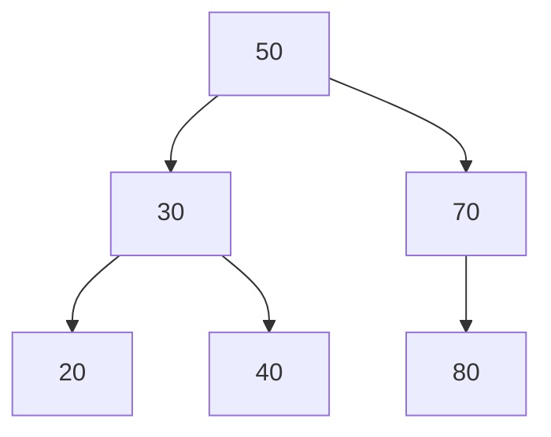

## 지식 로드맵 내 현재 위치

지식 위치: 소프트웨어 공학 → 알고리즘·자료구조 → **BST(Binary Search Tree)**

## 30초 인출

- 본질: **BST(Binary Search Tree)**는 모든 노드가 `Left < Node < Right` 정렬 불변식을 유지하여 평균 **O(log N)** 탐색을 제공하는 트리
- 메커니즘: 키 비교 → 좌/우 서브트리 분기 → 탐색 범위 1/2 축소, **중위 순회(In-order Traversal)** 시 오름차순 정렬
- 효과: 동적 데이터 인덱싱 · 탐색 가속, 편향 발생 시 **자가 균형 트리(AVL·Red-Black Tree)** 전환으로 성능 보장

핵심 용어

- **BST(Binary Search Tree)**: 왼쪽 자식 < 부모 < 오른쪽 자식 순서 관계를 유지하는 이진트리
- **In-order Traversal(중위 순회)**: `Left → Root → Right` 순으로 노드를 방문하여 오름차순 키를 추출하는 기법
- **Skewed Tree(편향 트리)**: 정렬된 데이터 연속 삽입으로 트리가 선형 리스트화되어 높이가 N이 된 상태
- **AVL Tree**: 좌우 서브트리의 높이 차(Balance Factor)를 1 이하로 엄격히 제한하는 자가 균형 트리
- **Red-Black Tree**: 노드 색상과 5가지 규칙으로 완화된 균형을 유지하며 O(log N)을 보장하는 트리

---

## 1교시 예상문제 (10점)

> BST의 정의와 순서 불변식, 중위 순회의 결과를 설명하시오. (예상)
---

## 1교시 10점 답안

### 1. 정의·목적

- 정의: **BST(Binary Search Tree)**는 `Left < Node < Right` 순서 규칙을 유지하는 이진트리 자료구조
- 목적: 동적 데이터 집합에 대해 탐색·삽입·삭제 연산을 평균 **O(log N)** 비용으로 수행

### 2. 핵심 메커니즘 및 구조

- 중위 순회는 `Left → Root → Right`로 방문하여 키를 오름차순으로 출력한다.

### 3. 핵심 통제

- **편향 방지**: 정렬 키 연속 유입 시 AVL 또는 **Red-Black Tree**의 균형 조정으로 높이를 제한
- 삭제 무결성: 자식 2개 노드 삭제 시 **In-order Successor** 승계로 불변식 보존
---

## 2~4교시 예상문제 (25점)

> 이진 탐색 트리(BST)의 정의 및 순서 불변식을 설명하고, 탐색·삽입·삭제 연산 메커니즘, 편향 트리 발생 원인과 자가 균형 트리(AVL, Red-Black)를 활용한 실무 대응방안을 제시하시오. (25점, 예상)
---

## 2~4교시 25점 답안

### Ⅰ. 정렬 불변식 기반의 고속 탐색, BST의 개요

> BST의 연산 시간은 트리 높이에 비례하며, 균형 시 평균 O(log n), 편향 시 O(n)까지 저하됨.

- 정의: 각 노드의 좌측에는 더 작은 키, 우측에는 더 큰 키를 배치하는 **순서 불변식(`Left < Node < Right`)**을 유지하여 동적 데이터를 관리하는 **이진트리 자료구조**
- 목적: 연결 리스트의 느린 탐색(O(N))을 극복하고 정렬 배열의 비싼 갱신 비용을 해결하여 **평균 O(log N)** 동적 탐색 및 갱신 달성

### Ⅱ. BST 구조 및 주요 연산 메커니즘

> 삽입·삭제 후에도 `Left < Node < Right` 규칙이 보존되어야 하며, 자식 2개 노드 삭제 시의 대체자 선정이 무결성의 핵심이다.

- 중위 순회 시 `20 → 30 → 40 → 50 → 70 → 80` 오름차순 출력

| 연산 | 평균 복잡도 | 최악 복잡도 | 핵심 통제 요소 |
|---|---|---|---|
| **Search** | O(log N) | O(N) | 키 비교 연산 일관성 유지 |
| **Insert** | O(log N) | O(N) | 중복 키 정책(불허/카운팅/덮어쓰기) |
| **Delete** | O(log N) | O(N) | **In-order Successor**(우측 서브트리 최솟값) 대체 무결성 |

### Ⅲ. BST, AVL Tree, Red-Black Tree의 다각적 비교

> 기본 BST는 편향 취약성이 치명적이므로, 실무 인덱스 엔진에서는 회전 비용을 통제하는 자가 균형 트리가 필수적이다.

| 비교 항목 | 기본 BST | AVL Tree | Red-Black Tree |
|---|---|---|---|
| **균형 조건** | 균형 보장 메커니즘 없음 | `|Left Height - Right Height| ≤ 1` | 루트/리프 Black, Red 연속 불가 등 5규칙 |
| **최악 탐색 비용** | O(N) (선형 퇴보) | **O(log N)** (엄격한 균형) | **O(log N)** (완화된 균형) |
| **삽입/삭제 회전** | 회전 없음 | 빈번한 회전 (최대 O(log N) 회전) | 최대 2회 회전(삽입), 최대 3회 회전(삭제) |
| **주요 적합 영역** | 키 입력이 무작위인 기초 실습 | 탐색 연산 비중이 압도적인 읽기 중심 뷰 | 삽입·삭제·탐색이 균등한 프로덕션 컨테이너(C++ map) |

### Ⅳ. 편향 트리 문제점·대응책

> 시계열 ID나 정렬 로그가 연속 인입되면 트리가 단일 연결 리스트화되므로, 데이터 유입 특성에 맞춘 구조적 방어가 요구된다.

| 위험 | 대책 | 효과 |
|---|---|---|
| **Skewed Tree (편향 트리)** | **Red-Black Tree** 적용 또는 대량 적재 시 중간값 분할 빌드 | 최악 시간복잡도 O(log N) 보장 |
| **메모리 단편화** | 노드 풀링(Node Pooling) 기법 또는 블록 단위 B-Tree 전환 | 포인터 오버헤드 감소 및 캐시 지역성 향상 |
| **동시성 충돌** | 노드 단위 세밀한 잠금(Fine-grained Lock) 또는 Lock-free 적용 | 멀티스레드 환경 트리 포인터 오염 방지 |

### Ⅴ. 결론 — 균형 통제 중심의 기술사적 제언

> 정렬 편의성만 보고 기본 BST를 프로덕션에 배포하면 안 되며, 자가 균형 보장과 유입 키 전처리 체계를 확보해야 한다.

### 학습자 통찰 메모 — 답안 밖

- `[핵심 통찰]`: BST의 성능은 데이터 개수 N이 아니라 트리의 높이 H에 전적으로 종속된다. 정렬된 식별자가 유입되는 순간 BST의 모든 성능적 장점이 소멸하므로 자가 균형 구조는 선택이 아닌 필수이다.
- `나라면`: 실무 인메모리 색인 설계 시 표준 자가 균형 컨테이너(Red-Black 기반 `std::map`, `TreeMap`)를 기본 채택하고, 정적 대량 데이터 로딩 시에는 정렬 배열에서 중앙값을 루트로 삼는 이진 분할 빌드로 O(N log N) 초기 구성을 강제하겠다.

### 실전 답안용 기술사적 제언

- **판정 기준**: 유입되는 데이터의 정렬성 여부와 워크로드의 읽기/쓰기 비율을 측정하여, 순차 증가 키(Auto-increment ID 등) 인입 환경에서 기본 BST 적용을 엄격히 금지함
- **대응 방안**: 삽입/삭제가 빈번한 실시간 워크로드에는 회전 횟수가 적은 **Red-Black Tree**를 적용하고, 읽기 중심 참조 테이블에는 **AVL Tree**, 대규모 디스크 I/O 환경에는 **B-Tree/B+Tree**로 전환함
- **검증 체계**: APM 기반 인메모리 인덱스 깊이(Tree Depth) 실시간 모니터링, 최대 허용 높이($H \le 2 \log_2 N$) 초과 감지 임계치 설정 및 P99 탐색 지연시간(Latency)을 지속 측정함
- **기대 효과**: 최악의 정렬 키 편향 시나리오에서도 $O(\log N)$ 성능 한계선을 철저히 보장하고, 메모리 캐시 미스 및 스레드 락 경합을 최소화하여 시스템 응답 안정성을 극대화함

## 출제 이력과 검증 출처

- 제137회 정보관리기술사 1교시: 이진 탐색 트리(BST)
- 제139회 정보관리기술사 3교시: BST와 라우팅 테이블 탐색 알고리즘 상관관계
- Thomas H. Cormen, Introduction to Algorithms (CLRS), Chapter 12 Binary Search Trees

## 연결 토픽

- 이전 토픽: [소프트웨어 공학 개요](./index.md)
- 연관 토픽: [스택 자료구조](./009_stack.md), [정렬 알고리즘](./043_sort_algorithm.md)
- 다음 토픽: [DevOps](./002_devops.md)
