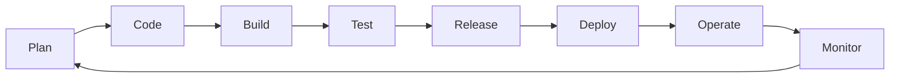

## 지식 로드맵 내 현재 위치

지식 위치: 소프트웨어 공학 → 빌드·배포·DevOps → **DevOps**

## 30초 인출

- 본질: **DevOps**는 개발(Dev)과 운영(Ops)의 단절을 극복하고, 자동화 파이프라인과 협업 문화로 소프트웨어를 신속·안정적으로 지속 전달하는 체계
- 메커니즘: Plan → Code → Build → Test → Release → Deploy → Operate → Monitor 무한 루프 피드백
- 효과: 리드타임 단축 · 배포 빈도 극대화 · 장애 복구 시간(MTTR) 단축 · 고객 가치 조기 실현

핵심 용어

- **DevOps**: 소프트웨어 개발과 IT 운영 간의 소통, 협업, 통합을 강조하는 조직 문화이자 방법론
- **CI/CD(Continuous Integration/Continuous Delivery)**: 코드 통합, 테스트, 빌드, 배포 전 과정을 자동화하는 파이프라인
- **IaC(Infrastructure as Code)**: 인프라 구성을 코드로 정의·버전 관리하여 프로비저닝을 자동화하는 기술
- **CALMS**: Culture(문화), Automation(자동화), Lean(린), Measurement(측정), Sharing(공유)의 DevOps 성공 프레임워크
- **SRE(Site Reliability Engineering)**: 소프트웨어 공학적 접근법을 적용해 시스템 신뢰성과 운영 가용성을 관리하는 실천 모델

---

## 1교시 예상문제 (10점)

> DevOps의 개념과 목적, 지속적 전달의 핵심 메커니즘을 설명하시오. (예상)
---

## 1교시 10점 답안

### 1. 정의·목적

- 정의: **DevOps**는 개발(Development)과 운영(Operations)을 통합하여 **CI/CD** 파이프라인으로 소프트웨어를 지속 전달하는 문화이자 공학 체계
- 목적: 리드타임 단축 및 배포 주기 가속화 → 고품질 서비스의 시장 적시 출시

### 2. 구성체계 및 방법론

### 3. 핵심 통제

- **CALMS 실천**: 문화 혁신 및 DORA 4대 지표 기반 성능 측정
- SRE 연계: **Error Budget(에러 예산)**을 통한 혁신 속도와 서비스 신뢰성의 정량적 통제
---

## 2~4교시 예상문제 (25점)

> DevOps의 개념 및 등장 배경을 설명하고, CALMS 프레임워크의 핵심 요소, CI/CD 및 IaC 기반 기술 구성요소, 전통적 운영 모델과의 비교 및 조직 도입 시 성패 요인을 제시하시오. (25점, 예상)
---

## 2~4교시 25점 답안

### Ⅰ. 개발과 운영 장벽을 극복하는 DevOps의 개요

> DevOps는 사일로(Silo)화된 개발과 운영 조직의 이해관계를 일치시키며, 성패는 자동화 파이프라인과 실패 수용 문화로 판정된다.

- 정의: 개발(Development)과 운영(Operations) 간 사일로를 제거하고 **CI/CD(지속적 통합/배포)**와 **IaC(코드형 인프라)**를 실현하는 협업 문화이자 소프트웨어 공학 체계
- 목적: 기능 출시 리드타임 단축, 배포 빈도 극대화 및 장애 복구 시간(**MTTR**) 최소화를 통한 비즈니스 가치 조기 실현

### Ⅱ. CALMS 프레임워크와 기술 구성요소

> DevOps는 단순한 도구 도입이 아니라 CALMS 5대 축과 엔지니어링 툴체인이 유기적으로 결합할 때 완성된다.

- 개발 영역(Plan~Test)은 **지속적 통합(CI)**, 운영 영역(Release~Monitor)은 **지속적 배포(CD)**·**SRE** 관측성이 담당하며 Monitor 결과가 다음 Plan으로 환류됨

| 구성요소 | 핵심 기술 및 프레임워크 | 달성 목표 |
|---|---|---|
| **Culture** | Blameless Postmortem, 원팀(One-team) | 심리적 안전감 확보, 책임 전가 방지 |
| **Automation** | Jenkins, GitHub Actions, ArgoCD, Terraform(**IaC**) | 수작업 휴먼 에러 원천 차단 |
| **Lean** | Wip(재공) 제한, 스몰 배치(Small Batch) | 배포 단위 축소로 변경 위험 통제 |
| **Measurement** | DORA 4대 지표(배포빈도, 리드타임, 변경실패율, MTTR) | 객관적 데이터 기반 엔지니어링 개선 |
| **Sharing** | 내부 지식 포털, 엔지니어링 커뮤니티 | 성공/실패 사례 전사 전파 |

### Ⅲ. 전통적 운영 모델 vs DevOps 모델 비교

> 전통적 모델은 변경 통제와 안정성을 위해 출시를 지연시키나, DevOps는 작은 배치를 자주 배포함으로써 안정성을 획득한다.

| 비교 항목 | 전통적 분리 모델 (Waterfall/Silo) | DevOps 협업 모델 |
|---|---|---|
| **조직 구조** | 개발팀과 운영팀의 엄격한 분리 | 크로스 펑셔널 팀(Cross-functional Team), SRE |
| **배포 주기** | 분기·월 단위 대규모 빅뱅 배포 | 일 단위 다회 지속 배포(Micro Batch) |
| **책임 소재** | "개발은 기능 개발, 운영은 가용성 유지" | "You build it, you run it" 전 주기 공동 책임 |
| **인프라 관리** | 엔지니어 수작업 GUI/CLI 구성 | Git 기반 선언적 **IaC** 및 GitOps |
| **장애 대응** | 장애 발생 시 원인 규명 및 문책 중심 | 비난 없는 사후 분석(Blameless) 및 시스템 보완 |

### Ⅳ. DevOps 도입 문제점·대응책

> 도구만 도입하고 조직 문화와 평가 체계를 바꾸지 않으면 '도구 사일로'가 심화되므로 체계적인 거버넌스가 필요하다.

| 위험 | 대책 | 효과 |
|---|---|---|
| **배포 막바지 보안 병목** | SAST/DAST 자동화를 CI/CD 파이프라인에 내재화하는 **DevSecOps** 전환 | 보안 결함 조기 식별 및 배포 지연 차단 |
| **조직 KPI 상충 및 저항** | 개발-운영 간 갈등을 중재하는 **에러 예산(Error Budget)** 제도화 | 변경 속도와 서비스 신뢰성의 수학적 균형 확보 |
| **인프라 구성 불일치 (Drift)** | 콘솔 직접 수정을 금지하고 Git PR 기반 선언적 **IaC(GitOps)** 강제 | 환경 간 불일치 제거 및 배포 멱등성 보장 |

### Ⅴ. 결론 — 지속 개선 중심의 기술사적 제언

> DevOps의 최종 목표는 배포 속도가 아니라 지속적인 비즈니스 민첩성이며, 이를 위해 플랫폼 엔지니어링 체계로 진화해야 한다.

### 학습자 통찰 메모 — 답안 밖

- `[핵심 통찰]`: DevOps를 도구 체인(Jenkins, Docker 등)의 나열로 이해하면 실패한다. 핵심은 조직 내 '피드백 루프의 속도'와 '신뢰 문화'이다. SRE의 에러 예산처럼 개발과 운영의 충돌을 수학적으로 중재하는 통제 기제가 수반되어야 한다.
- `나라면`: 개발팀이 인프라를 직접 신경 쓰지 않도록 내부 개발자 플랫폼(IDP)을 구축하는 플랫폼 엔지니어링(Platform Engineering)을 도입하여 DevOps 인지 부하를 줄이겠다.

### 실전 답안용 기술사적 제언

- **판정 기준**: 단순 CI/CD 도구 도입 여부가 아니라, DORA 4대 지표(배포 빈도, 변경 리드타임, 변경 실패율, 서비스 복구 시간 MTTR)의 객관적 성숙도 등급(Elite/High) 도달 여부로 엔지니어링 경쟁력을 판정함
- **대응 방안**: 개발-운영 간 갈등을 수학적으로 중재하는 SRE 에러 예산(Error Budget)을 제도화하고, 보안 검증을 좌측으로 전진 배치한 **DevSecOps** 및 셀프서비스 인프라를 제공하는 **플랫폼 엔지니어링(IDP)**으로 고도화함
- **검증 체계**: Git PR 기반 선언적 GitOps 멱등성 감사, SAST/DAST 정적·동적 보안 취약점 제로 게이트 통과율, 무비난 회고(Blameless Postmortem) 보고서의 정기 발행 여부를 점검함
- **기대 효과**: 변경 위험을 분산시켜 출시 리드타임을 1시간 이내로 단축하고, 프로덕션 장애 발생 시 자동 롤백 및 신속 복구를 통해 서비스 고가용성(99.99%)을 확고히 보장함
---

## 출제 이력과 검증 출처

- 제136회 정보관리기술사 2교시: DevOps와 SRE, DevSecOps 연계 방안
- DORA(DevOps Research and Assessment), State of DevOps Report
- Google SRE Book, Site Reliability Engineering: How Google Runs Production Systems

## 연결 토픽

- 이전 토픽: [BST](./001_bst.md)
- 연관 토픽: [무중단 배포](./007_zero_downtime_deployment.md), [CI/CD](./095_ci_cd.md)
- 다음 토픽: [소프트웨어 테스트 종류·레벨](./003_sw_test_types_and_levels.md)
