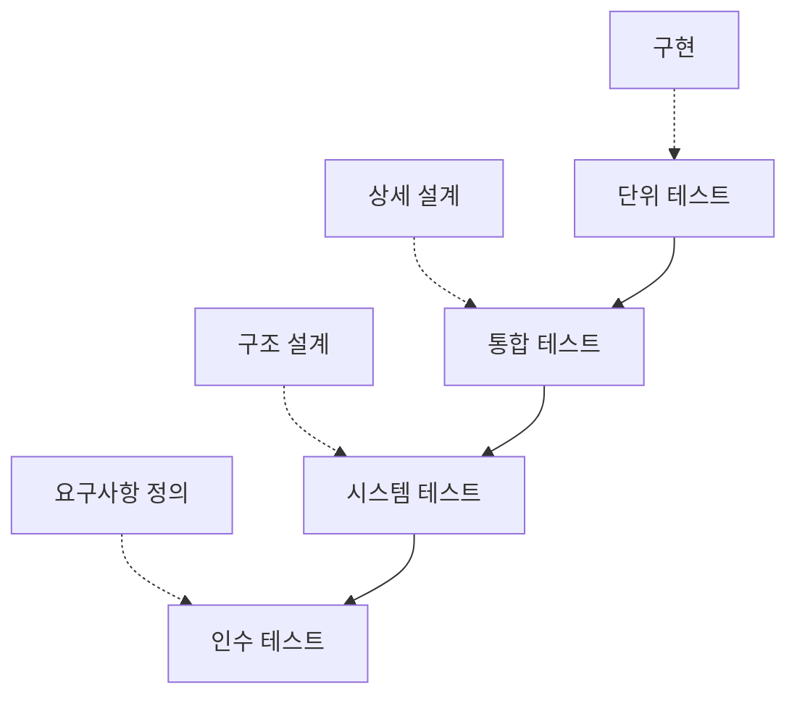

## 지식 로드맵 내 현재 위치

지식 위치: 소프트웨어 공학 → 테스트·검증 → **소프트웨어 테스트 종류·레벨**

## 30초 인출

- 본질: **소프트웨어 테스트 레벨 및 종류**는 V-모델의 생명주기 단계별 개발 산출물과 품질속성을 다각도로 검증(Verification & Validation)하는 체계
- 메커니즘: V-모델 대응 검증(단위→통합→시스템→인수) + 품질속성별 검증(기능, 성능, 보안, **신뢰성**, **이식성**)
- 효과: 결함 조기 격리 · 품질 결함 수정 비용 최소화 · 비즈니스 릴리스 위험 통제

핵심 용어

- **V&V(Verification & Validation)**: 검증(개발 규격 준수 여부)과 확인(사용자 요구 만족 여부)의 테스트 활동
- **Test Level(테스트 레벨)**: 개발 단계에 대응하여 체계적으로 조직된 테스트 계층(단위, 통합, 시스템, 인수)
- **신뢰성 테스트(Reliability Testing)**: 규정된 조건에서 명시된 기간 동안 결함 없이 정상 동작하는지 검증
- **이식성 테스트(Portability Testing)**: 소프트웨어가 다양한 하드웨어, OS, 브라우저 환경으로 전이 가능한지 검증
- **ISO/IEC 25010**: 기능적 적합성, 성능 효율성, 호환성, 사용성, 신뢰성, 보안성, 유지보수성, 이식성의 8대 품질 모델

---

## 1교시 예상문제 (10점)

> 소프트웨어 테스트의 정의와 목적, V-모델에 대응하는 테스트 레벨을 설명하시오. (예상)
---

## 1교시 10점 답안

### 1. 정의·목적

- 정의: **소프트웨어 테스트 레벨**은 개발 단계에 대응하여 단위, 통합, 시스템, 인수로 체계화된 검증 계층 구조
- 목적: 결함 유입 단계를 조기 격리하고 요구사항 및 품질속성 충족 여부를 객관적으로 증명

### 2. 구성체계 및 레벨별 특징

### 3. 핵심 통제

- **신뢰성/이식성 통제**: ISO/IEC 25010 기준 결함 허용성, 복구성 및 다중 플랫폼 호환성 검증
- 테스트 피라미드: 단위 테스트 자동화 비중 70% 이상 유지로 피드백 루프 극대화
---

## 2~4교시 예상문제 (25점)

> 소프트웨어 테스트의 4단계 테스트 레벨(단위, 통합, 시스템, 인수)을 V-모델과 연계하여 설명하고, 비기능 테스트 중 신뢰성(Reliability) 및 이식성(Portability) 테스트의 핵심 검증 기법과 테스트 자동화 방안을 제시하시오. (25점, 예상)
---

## 2~4교시 25점 답안

### Ⅰ. 체계적 결함 격리를 위한 테스트 레벨과 종류의 개요

> 테스트는 개발 후반부에 일괄 수행하는 것이 아니며, 단계별 결함 유입을 즉시 차단하는 결함 격리 체계로 판정된다.

- 정의: 소프트웨어 개발 생명주기(SDLC)의 각 단계 산출물을 대응하는 개발 레벨에서 검증하고 기능 및 비기능 품질특성을 측정하는 **체계적 품질 검증 활동**
- 목적: 소프트웨어 결함을 조기에 발견하여 **품질비용(Cost of Quality)**을 최소화하고 요구사항 일치성을 보증

### Ⅱ. V-모델 기반 4단계 테스트 레벨 체계

> 각 테스트 레벨은 검증 기준선(Baseline)과 대상이 명확히 분리되며, 상위 레벨로 갈수록 시스템 전반의 동작을 검증한다.

- 개발 단계 산출물이 검증 기준선, 대응 테스트 레벨이 검증 활동이며 **Shift-Left**(테스트 계획을 설계 시점에 동시 수립)로 결함을 조기 격리함

| 테스트 레벨 | 기준 산출물 | 주요 기법 및 통제점 | 주 담당자 |
|---|---|---|---|
| **단위 테스트** | 상세설계서, 컴포넌트 명세 | 단위 테스트 프레임워크(JUnit), Mocking, 코드 커버리지 | 개발자 |
| **통합 테스트** | 시스템 아키텍처, 인터페이스 정의서 | 인터페이스 결함, 데이터 흐름 검증, 드라이버/스텁 활용 | 개발자·테스터 |
| **시스템 테스트** | 요구사항정의서(SRS), 아키텍처 | 기능/비기능 요구사항 전수 검증, 성능 부하 시험 | 독립 QA팀 |
| **인수 테스트** | 제안요청서(RFP), 계약서, 사용자 요구사항 | 비즈니스 시나리오 검증, 알파/베타 테스트 | 발주자·사용자 |

### Ⅲ. 주요 비기능 테스트: 신뢰성 및 이식성 테스트

> 기능 정상 동작을 넘어 극한 환경에서의 연속 운영성과 이기종 환경 적응성을 보장해야 상용화가 가능하다.

### 1. 신뢰성 테스트(Reliability Testing)

- **성숙성(Maturity) 검증**: 정상 운영 상태에서 시스템 결함 발생 빈도 측정 (MTBF, MTTF 산출)
- **장애 허용성(Fault Tolerance) 검증**: 하드웨어 고장, 네트워크 단절 시 예비 시스템 절체(Failover) 검증
- **회복성(Recoverability) 검증**: 장애 발생 후 데이터 복구 및 서비스 재개 시간(RTO, RPO) 측정

### 2. 이식성 테스트(Portability Testing)

- **적응성(Adaptability) 검증**: 다양한 OS, CPU 아키텍처, 브라우저 환경에서 별도 수정 없이 실행 여부 검증
- **설치성(Installability) 검증**: 타깃 환경에서 설치/제거 성공률 및 자원 요구조건 준수 검증
- **대체성(Replaceability) 검증**: 동일 환경에서 기존 소프트웨어를 대체하여 정상 동작하는지 호환성 검증

### Ⅳ. 테스트 수행 문제점·대응책

> 상위 레벨로 갈수록 자동화 비용이 급증하므로, 테스트 피라미드 전략에 따른 비중 조절이 필수적이다.

| 위험 | 대책 | 효과 |
|---|---|---|
| **수작업 E2E 테스트 병목** | **테스트 피라미드**(단위 70%, 통합 20%, E2E 10%) 전략 수립 및 단위 자동화 | 테스트 실행 속도 단축 및 빠른 피드백 확보 |
| **테스트-운영 환경 불일치** | Docker 컨테이너 및 **IaC** 기반 테스트 환경 표준화 | 환경 차이로 인한 배포 후 결함 사전 차단 |
| **코드 변경 시 회귀 결함 누출** | CI 파이프라인 내 스모크/회귀 테스트 자동화 강제 | 기존 정상 기능의 파괴 방지 및 릴리스 신뢰성 보장 |

### Ⅴ. 결론 — 품질 속성 확보 중심의 기술사적 제언

> 테스트는 단순한 버그 잡기가 아니며, 아키텍처 결함과 품질 위험을 조기에 가시화하는 거버넌스 수단이어야 한다.

### 학습자 통찰 메모 — 답안 밖

- `[핵심 통찰]`: 테스트를 개발 완료 후 진행되는 후행 단계로 취급하면 결함 조치 비용이 10~100배로 폭증한다. V-모델의 핵심은 '요구사항을 정의할 때 인수 테스트를 함께 설계하고, 상세설계를 할 때 단위 테스트를 설계하는' 시프트 레프트(Shift-Left) 실천이다.
- `나라면`: CI/CD 파이프라인에 Quality Gate를 설정하여 단위 테스트 커버리지 80% 이상, 주요 신뢰성·보안 정적 분석 통과 시에만 통합 단계로 승급하도록 자동화하겠다.

### 실전 답안용 기술사적 제언

- **판정 기준**: 후반부 E2E 수작업 테스트 비중(소프트웨어 테스트 아이스크림 안티패턴)이 아니라, 테스트 피라미드 원칙 준수율(단위 70% 이상) 및 V-모델 개발 산출물과의 **요구사항 추적표(RTM)** 1:1 매핑 여부로 테스트 효과성을 판정함
- **대응 방안**: 설계 단계부터 테스트 케이스를 병행 도출하는 **Shift-Left 테스팅**을 체계화하고, 신뢰성(MTBF/MTTR, 카오스 엔지니어링) 및 이식성(멀티 플랫폼 컨테이너 테스트 매트릭스) 비기능 검증을 파이프라인에 통합함
- **검증 체계**: CI 단계별 자동 빌드 시 구문/분기 커버리지(C0/C1 $\ge$ 80%), SonarQube 정적 분석 Quality Gate 통과, 그리고 회귀 테스트(Regression Test) 스위트 자동 실행 결과를 검증함
- **기대 효과**: 배포 직전 또는 운영 이관 후 치명적 결함 유출율을 90% 이상 절감하고, 결함 수정 비용(Cost of Defect)을 최소화하여 안정적인 비즈니스 릴리스 거버넌스를 확립함

## 출제 이력과 검증 출처

- 제133회 정보관리기술사 1교시: 소프트웨어 테스트 레벨 및 V&V
- 제134회 정보관리기술사 2교시: 소프트웨어 비기능 테스트(신뢰성, 이식성)
- 제139회 정보관리기술사 1교시: 통합 테스트 기법(상향식, 하향식)
- ISO/IEC/IEEE 29119 Software Testing Standards

## 연결 토픽

- 이전 토픽: [DevOps](./002_devops.md)
- 연관 토픽: [블랙박스 테스트](./008_black_box_test.md), [화이트박스 테스트](./013_white_box_test.md)
- 다음 토픽: [디자인 패턴](./005_design_pattern.md)
