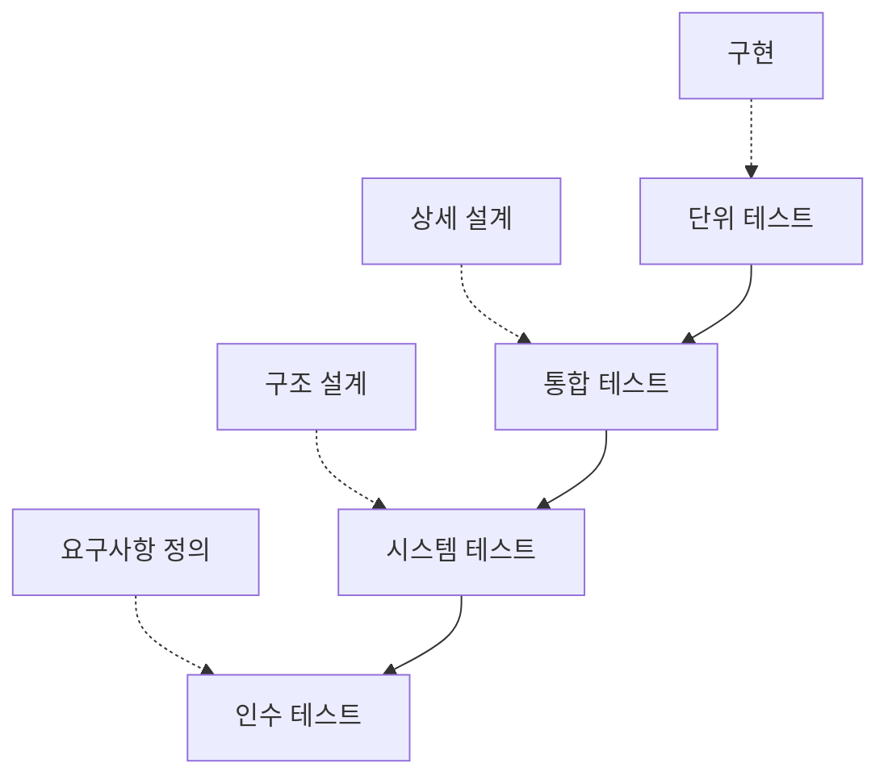

## 지식 로드맵 내 현재 위치

지식 위치: 소프트웨어 공학 → 테스트·검증 → **소프트웨어 테스트 종류·레벨**

## 30초 인출

- 본질: **소프트웨어 테스트 종류·레벨**은 개발 산출물과 품질 요구를 기준에 따라 확인하는 시험 활동
- 메커니즘: V-모델 대응 검증(단위→통합→시스템→인수) + 품질속성별 검증(기능, 성능, 보안, **신뢰성**, **이식성**)
- 효과: 결함 조기 발견 · 기능·비기능 요구 충족 여부 확인

핵심 용어

- **V&V(Verification & Validation)**: 검증(개발 규격 준수 여부)과 확인(사용자 요구 만족 여부)의 테스트 활동
- **Test Level(테스트 레벨)**: 개발 단계에 대응하여 체계적으로 조직된 테스트 계층(단위, 통합, 시스템, 인수)
- **신뢰성 테스트(Reliability Testing)**: 규정된 조건에서 명시된 기간 동안 결함 없이 정상 동작하는지 검증
- **이식성 테스트(Portability Testing)**: 소프트웨어가 다양한 하드웨어, OS, 브라우저 환경으로 전이 가능한지 검증
- **ISO/IEC 25010:2023**: ICT·소프트웨어 제품의 품질 특성을 정의한 제품 품질 모델. 2011판의 8개 특성과 구별되는 2023판의 9개 특성 모델

---

## 1교시 예상문제 (10점)

> 소프트웨어 테스트의 정의와 목적, V-모델에 대응하는 테스트 레벨을 설명하시오. (예상)

---

## 1교시 10점 답안

### Ⅰ. 소프트웨어 테스트 종류·레벨의 개요

| 구분 | 핵심 |
|---|---|
| 정의 | **소프트웨어 테스트 종류·레벨** 은 개발 산출물과 실행 결과가 요구사항·품질 기준에 맞는지 확인하는 시험 활동 |
| 목적 | 결함을 조기에 발견하고 기능·비기능 요구사항의 충족 여부 확인 |

### Ⅱ. 테스트 레벨과 개발 단계의 대응

### Ⅲ. 품질 특성별 시험

- **신뢰성·이식성 통제**: 합의된 품질 요구에 따라 장애 후 복구·환경 간 설치와 실행을 시험
- 한 줄 제언: 품질 요구를 시험 가능한 기준으로 정하고 해당 요구와 시험 결과를 연결
---

## 2~4교시 예상문제 (25점)

> 소프트웨어 테스트의 목적과 기본 원칙을 설명하고, 개발 생명주기와 연계한 테스트 레벨·유형 및 시험 결과의 추적·자동화 방안을 제시하시오. (25점, 예상)

---

## 2~4교시 25점 답안

## Ⅰ. 체계적 결함 발견을 위한 테스트 레벨·종류의 개요

> 테스트는 개발 후반부에 일괄 수행하는 것이 아니며, 단계별 결함 유입을 즉시 차단하는 결함 격리 체계로 판정된다.

| 구분 | 핵심 |
|---|---|
| 정의 | **소프트웨어 테스트 종류·레벨** 은 개발 산출물과 실행 결과가 요구사항·품질 기준에 맞는지 확인하는 시험 활동 |
| 목적 | 결함을 조기에 발견하고 기능·비기능 요구사항의 충족 여부 확인 |

## Ⅱ. V-모델 기반 4단계 테스트 레벨

> 각 테스트 레벨은 검증 기준선(Baseline)과 대상이 명확히 분리되며, 상위 레벨로 갈수록 시스템 전반의 동작을 검증한다.

- 개발 단계 산출물이 검증 기준선, 대응 테스트 레벨이 검증 활동이며 **Shift-Left**(테스트 계획을 설계 시점에 동시 수립)로 결함을 조기 격리함

| 테스트 레벨 | 기준 산출물 | 주요 기법 및 통제점 | 주 담당자 |
|---|---|---|---|
| **단위 테스트** | 상세설계서, 컴포넌트 명세 | 단위 테스트 프레임워크(JUnit), Mocking, 코드 커버리지 | 개발자 |
| **통합 테스트** | 시스템 아키텍처, 인터페이스 정의서 | 인터페이스 결함, 데이터 흐름 검증, 드라이버/스텁 활용 | 개발자·테스터 |
| **시스템 테스트** | 요구사항정의서(SRS), 아키텍처 | 기능/비기능 요구사항 전수 검증, 성능 부하 시험 | 독립 QA팀 |
| **인수 테스트** | 제안요청서(RFP), 계약서, 사용자 요구사항 | 비즈니스 시나리오 검증, 알파/베타 테스트 | 발주자·사용자 |

## Ⅲ. 품질 특성 시험: 신뢰성과 이식성

> 기능 정상 동작을 넘어 극한 환경에서의 연속 운영성과 이기종 환경 적응성을 보장해야 상용화가 가능하다.

| 품질 속성 | 확인할 내용 | 예시 |
|---|---|---|
| 신뢰성·장애 허용성 | 장애 중 서비스 유지와 예비 시스템 절체 | 노드 장애·네트워크 단절 시험 |
| 회복성 | 복구 후 서비스 재개 시간과 데이터 복구 시점이 목표에 맞는지 | 실측 복구시간과 RTO, 복구 데이터 시점과 RPO 비교 |
| 이식성·설치성 | 대상 OS·장비에서 설치·실행 가능한지 | 지원 환경별 설치·기능 시험 |

## Ⅳ. 테스트 수행 문제점·대응책

> 상위 레벨로 갈수록 자동화 비용이 급증하므로, 테스트 피라미드 전략에 따른 비중 조절이 필수적이다.

| 위험 | 대책 | 효과 |
|---|---|---|
| **수작업 E2E 테스트 병목** | 변경 위험에 맞춰 단위·통합·E2E 테스트를 배분하고 반복 검증을 자동화 | 빠른 피드백 확보 |
| **테스트-운영 환경 불일치** | Docker 컨테이너 및 **IaC** 기반 테스트 환경 표준화 | 환경 차이로 인한 배포 후 결함 사전 차단 |
| **코드 변경 시 회귀 결함 누출** | CI 파이프라인 내 스모크/회귀 테스트 자동화 강제 | 기존 정상 기능의 파괴 방지 및 릴리스 신뢰성 보장 |

### Ⅴ. 결론 — 품질 속성 확보 중심의 기술사적 제언

| 문제 | 해결 방안 |
|---|---|
| 개발 후반에만 테스트하면 결함 원인과 요구사항을 거슬러 추적하기 어렵다 | 요구사항·설계 단계부터 대응하는 테스트를 준비하고, 주요 기능과 신뢰성·이식성 결과를 요구사항에 연결해 검증한다 |

## 출제 이력과 검증 출처

- 제133회 정보관리기술사 1교시: 소프트웨어 테스트 레벨 및 V&V
- 제134회 정보관리기술사 2교시: 소프트웨어 비기능 테스트(신뢰성, 이식성)
- 제139회 정보관리기술사 1교시: 통합 테스트 기법(상향식, 하향식)
- ISO/IEC/IEEE 29119 Software Testing Standards
- [ISO/IEC 25010:2023 Product quality model](https://www.iso.org/standard/78176.html)

## 연결 토픽

- 이전 토픽: [DevOps](./002_devops.md)
- 연관 토픽: [블랙박스 테스트](./008_black_box_test.md), [화이트박스 테스트](./013_white_box_test.md)
- 다음 토픽: [디자인 패턴](./005_design_pattern.md)
