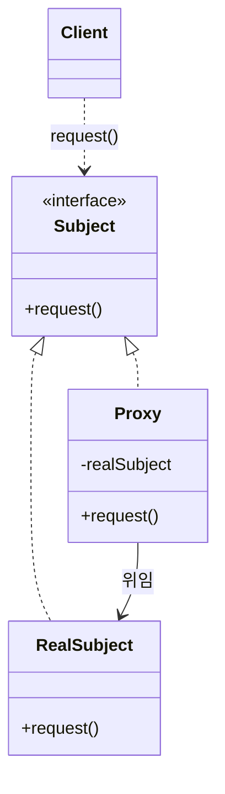

## 지식 로드맵 내 현재 위치

지식 위치: 소프트웨어 공학 → 아키텍처·설계 → **디자인 패턴(프록시 패턴)**

## 30초 인출

- 본질: **프록시 패턴(Proxy Pattern)**은 실제 객체(RealSubject)에 대한 대리 객체(Proxy)를 두어 객체 접근을 제어하고 부가 기능을 투명하게 제공하는 구조 디자인 패턴
- 메커니즘: 동일 인터페이스(Subject) 구현 → 클라이언트는 대리자 호출 → 프록시가 사전/사후 처리(지연로딩, 접근제어, 캐싱) 후 실제 객체 위임
- 효과: 실제 비즈니스 로직과 부가 관심사 분리(AOP 기반) · 성능 최적화 · OCP/SRP 준수

핵심 용어

- **Proxy Pattern**: 특정 객체에 대한 접근을 통제하거나 부가 기능을 부여하기 위해 대리 객체를 제공하는 GoF 디자인 패턴
- **Subject**: Proxy와 RealSubject가 공동으로 구현하는 공통 인터페이스 규격
- **Virtual Proxy(가상 프록시)**: 리소스 소모가 큰 객체의 생성을 실제로 필요한 시점까지 지연(Lazy Initialization)시키는 프록시
- **Protection Proxy(보호 프록시)**: 호출자의 권한에 따라 실제 객체의 메서드 접근 권한을 제어하는 프록시
- **Remote Proxy(원격 프록시)**: 서로 다른 주소 공간에 있는 객체를 로컬 객체처럼 다룰 수 있게 해주는 프록시(RPC/RMI 기반)
- **AOP(Aspect Oriented Programming)**: 핵심 비즈니스 로직과 횡단 관심사(보안, 로깅, 트랜잭션)를 프록시 기반으로 분리하는 기법

---

## 1교시 예상문제 (10점)

> 디자인 패턴(프록시 패턴)의 정의와 목적, 핵심 구조와 작동 원리를 설명하시오. (예상)
---

## 1교시 10점 답안

### 1. 정의·목적

- 정의: **프록시 패턴(Proxy Pattern)**은 실제 객체에 대한 대리 객체를 두어 접근을 제어하고 지연 생성, 권한 검사, 캐싱을 수행하는 구조 패턴
- 목적: 비즈니스 로직과 시스템 인프라 로직(횡단 관심사)을 분리하여 유지보수성 향상

### 2. 구성체계 및 구조

### 3. 핵심 통제

- **가상/보호/원격 프록시**: 리소스 지연 로딩, 보안 인가, 분산 통신 추상화
- **Spring AOP**: 동적 프록시(JDK/CGLIB) 기반 트랜잭션 및 보안 인터셉트
---

## 2~4교시 예상문제 (25점)

> GoF 프록시 패턴의 개념·구조와 가상·보호·원격 프록시의 차이를 설명하고, Spring AOP에서의 활용과 주의점을 제시하시오. (예상)
---

## 2~4교시 25점 답안

### Ⅰ. 객체 접근 제어와 관심사 분리의 핵심, 프록시 패턴의 개요

> 프록시 패턴은 실제 객체의 코드를 변경하지 않고도 접근 제어와 부가 기능을 추가하며, 투명성(Transparency) 확보가 성패를 좌우한다.

| 구분 | 핵심 |
|---|---|
| 정의 | 실제 객체 대신 같은 인터페이스의 대리 객체가 요청을 받아 위임하는 구조 패턴 |
| 목적 | 객체 접근을 제어하고 지연 생성·원격 호출·부가 기능을 분리 |

### Ⅱ. 프록시 패턴의 구조 및 주요 유형

> 프록시와 실제 객체는 동일한 인터페이스를 구현하므로 클라이언트는 프록시 존재 여부를 인식하지 않고 투명하게 사용한다.

- Client는 Subject 규격에만 의존하며, Proxy가 사전 처리(보안·로깅) 후 RealSubject에 위임하므로 프록시 존재는 투명함

| 유형 | 핵심 동작 메커니즘 | 실무 적용 사례 |
|---|---|---|
| **가상 프록시 (Virtual Proxy)** | 대용량 그래픽이나 DB 커넥션을 실제로 사용하는 순간에 생성 | 고화질 이미지 뷰어 썸네일, JPA 지연 로딩 |
| **보호 프록시 (Protection Proxy)** | 클라이언트의 접근 권한을 확인하여 권한 부여 시에만 위임 | 파일/문서 관리 시스템 권한 통제, API 인가 |
| **원격 프록시 (Remote Proxy)** | 네트워크 통신(마샬링/언마샬링)을 숨기고 로컬 객체처럼 인터페이스 제공 | Java RMI, gRPC 스텁(Stub), 분산 RPC |
| **캐싱 프록시 (Caching Proxy)** | 동일한 요청에 대해 연산 결과를 캐싱하여 실제 호출 생략 | 비용이 큰 외부 API 호출 결과 인메모리 캐싱 |

### Ⅲ. 프록시 패턴 vs 유사 패턴 비교

> 구조는 유사하나 도입 의도(Intent)가 명확히 구분되므로 설계 목적에 맞게 선택해야 한다.

| 비교 항목 | 프록시 (Proxy) | 어댑터 (Adapter) | 데코레이터 (Decorator) |
|---|---|---|---|
| **핵심 의도** | 객체에 대한 **접근 제어 및 위임** | 호환되지 않는 **인터페이스 변환** | 객체에 동적으로 **새로운 책임/기능 추가** |
| **인터페이스 변경** | 동일한 인터페이스 유지 | 다른 인터페이스로 변환 | 동일한 인터페이스 유지 또는 확장 |
| **실제 객체 참조** | 프록시가 내부에서 직접 생성/관리 가능 | 클라이언트가 어댑티 객체를 주입 | 클라이언트가 원본 객체를 감싸서 주입 |

### Ⅳ. 프록시 적용 문제점·대응책

> 프록시 패턴은 선언적 트랜잭션과 AOP의 근간이나, 내부 호출 누락과 프록시 제약에 따른 위험을 통제해야 한다.

### Spring AOP 프록시 구현 방식 비교

| 구분 | JDK Dynamic Proxy | CGLIB Proxy |
|---|---|---|
| **기반 메커니즘** | Java 리플렉션, `java.lang.reflect.Proxy` | 바이트코드 조작(ASM), 서브클래싱(Subclassing) |
| **적용 조건** | 타깃 클래스가 **반드시 인터페이스 구현** | 타깃 클래스가 인터페이스 미구현 시에도 가능 |
| **한계점** | 인터페이스가 없는 구체 클래스는 프록시 생성 불가 | 타깃 클래스나 메서드가 `final`인 경우 오버라이딩 불가 |

### 실무 위험 및 거버넌스 대책

| 위험 | 대책 | 효과 |
|---|---|---|
| **Self-Invocation (내부 메서드 호출 시 프록시 우회)** | 자기 호출 메서드를 별도 서비스 컴포넌트로 분리하거나 `AopContext.currentProxy()` 활용 | 트랜잭션 및 보안 AOP 누락 원천 방지 |
| **CGLIB의 final 제약 및 생성자 제약** | `final` 키워드 지양 규칙 및 Objenesis 라이브러리 연계 프록시 생성 | 런타임 프록시 생성 실패 방지 및 호환성 확보 |
| **지연 로딩 시점의 세션 종료 (LazyInitializationException)** | OSIV 패턴 또는 Fetch Join 기반 사전 조회 쿼리 최적화 | N+1 문제 방지 및 지연 로딩 런타임 에러 근절 |

### Ⅴ. 결론 — 투명한 접근 통제 중심의 기술사적 제언

| 문제 | 해결 방안 |
|---|---|
| Spring AOP의 내부 메서드 호출은 프록시를 거치지 않아 트랜잭션·인가 처리가 누락될 수 있음 | 프록시 경계를 명시하고 호출을 별도 서비스로 분리한 뒤 실제 호출 경로에서 동작을 검증 |
---

## 출제 이력과 검증 출처

- 제136회 정보관리기술사 1교시: GoF 디자인 패턴 중 프록시(Proxy) 패턴
- Erich Gamma et al., Design Patterns: Elements of Reusable Object-Oriented Software (GoF)
- Rod Johnson, Expert One-on-One J2EE Design and Development

## 연결 토픽

- 이전 토픽: [소프트웨어 테스트 종류·레벨](./003_sw_test_types_and_levels.md)
- 연관 토픽: [AOP](./074_aop.md), [의존성 주입](./042_dependency_injection.md)
- 다음 토픽: [리팩토링](./006_refactoring.md)
