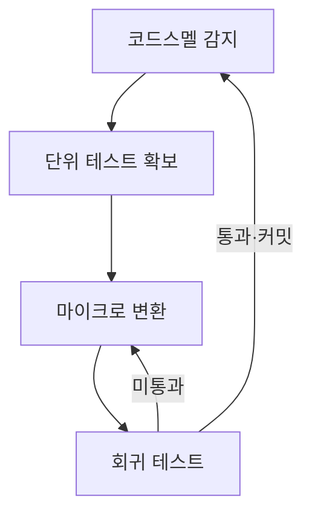

## 지식 로드맵 내 현재 위치

지식 위치: 소프트웨어 공학 → 유지보수·형상관리 → **리팩토링(코드스멜)**

## 30초 인출

- 본질: **리팩토링(Refactoring)**은 소프트웨어의 외부 동작(동등성)을 유지하면서 내부 구조를 개선하여 가독성, 유지보수성, 확장성을 높이는 기법
- 메커니즘: **코드스멜(Code Smell)** 식별 → 자동화 테스트 확보 → 마이크로 단위 단계별 구조 개선 → 회귀테스트 통과 검증
- 효과: 기술 부채 청산 · 복잡도(순환복잡도) 감소 · 신규 기능 추가 생산성 향상

핵심 용어

- **Refactoring**: 소프트웨어의 겉보기 동작은 그대로 유지한 채, 코드를 이해하고 수정하기 쉽도록 내부 구조를 변경하는 기법
- **Code Smell(코드스멜)**: 시스템에 더 심각한 문제가 있음을 암시하는 코드 내부의 나쁜 징후나 패턴
- **Regression Test(회귀 테스트)**: 코드 변경 후 기존 기능이 깨지지 않았음을 증명하는 자동화 테스트 집합
- **Extract Method(메서드 추출)**: 지나치게 길거나 여러 책임을 가진 코드 블록을 별도의 의미 있는 메서드로 분리하는 패턴
- **Clean Code**: 가독성이 높고, 의도가 명확하며, 중복이 없고, 테스트를 통과하는 품질 높은 코드

---

## 1교시 예상문제 (10점)

> 리팩토링(코드스멜)의 정의와 목적, 핵심 구조와 작동 원리를 설명하시오. (예상)

---

## 1교시 10점 답안

### Ⅰ. 리팩토링의 개요

| 구분 | 핵심 |
|---|---|
| 정의 | **리팩토링(Refactoring)** 은 외부 동작을 보존하면서 내부 구조를 개선하는 기법 |
| 목적 | 코드 이해·수정 비용을 낮추고 기술 부채 관리 |

### Ⅱ. 작은 변경과 검증의 반복

### Ⅲ. 안전 통제

- **안전장치**: 변경 전후 동작을 확인할 자동화 시험과 회귀 검증
- **작은 변경**: 구조 변경을 작은 단계로 나누고 각 단계 결과 확인
- 한 줄 제언: 동작을 고정하는 회귀 시험을 먼저 마련한 뒤 작은 변경 단위로 부채를 상환
---

## 2~4교시 예상문제 (25점)

> 리팩토링의 개념과 필요성을 설명하고, 코드스멜 식별부터 작은 변경·회귀 검증까지의 수행 흐름과 안전한 적용 조건을 제시하시오. (25점, 예상)

---

## 2~4교시 25점 답안

## Ⅰ. 외부 동작을 보존하는 구조 개선, 리팩토링의 개요

> 리팩토링은 외부 동작을 유지하며 코드의 내부 구조를 개선하는 작업이다.

| 구분 | 핵심 |
|---|---|
| 정의 | **리팩토링(Refactoring)** 은 외부 동작을 보존하면서 내부 구조를 개선하는 기법 |
| 목적 | 코드 이해·수정 비용을 낮추고 기술 부채 관리 |

### Ⅱ. 대표적 코드스멜과 리팩토링 대응 패턴

> 코드스멜은 당장 오류는 아니지만 미래의 변경 비용을 폭증시키는 주범이므로 발생 즉시 정형화된 패턴으로 제거한다.

- 마이크로 변환 1회마다 회귀 테스트를 통과시켜 **외부 동작 불변**을 입증하며, 다음 코드스멜로 순환 반복함

| 코드스멜 (Code Smell) | 스멜의 본질적 문제 | 적용 리팩토링 기법 |
|---|---|---|
| **Duplicated Code (중복 코드)** | 동일 로직 변경 시 여러 군데 수정 누락 위험 | **Extract Method**, Pull Up Method |
| **Long Method (장대 함수)** | 함수의 응집도가 낮고 가독성 저하 | **Extract Method**, Replace Temp with Query |
| **Large Class (거대 클래스)** | 단일 책임 원칙(SRP) 위반, 과도한 인스턴스 변수 | **Extract Class**, Extract Subclass |
| **Feature Envy (기능 편애)** | 다른 클래스의 데이터와 메서드를 과도하게 호출 | **Move Method**, Move Field |
| **Switch Statements (복잡한 분기문)** | 신규 조건 추가 시마다 분기문 전수 수정 필요 | **Replace Conditional with Polymorphism (다형성 전환)** |

### Ⅲ. 신규 개발 vs 리팩토링 vs 재공학(Re-engineering) 비교

> 개발 단계와 수정 대상에 따라 엔지니어링의 성격과 투입 비용이 완전히 다르다.

| 구분 | 신규 기능 개발 | 리팩토링 (Refactoring) | 재공학 (Re-engineering) |
|---|---|---|---|
| **목적** | 새로운 비즈니스 가치 추가 | 내부 구조 개선 및 가독성 확보 | 레거시 시스템 현대화 및 아키텍처 재구축 |
| **외부 동작 변경** | **변경됨** (신규 동작 추가) | **불변 (완전 동일)** | 일부 변경 또는 전체 개선 |
| **수행 주기** | 스프린트 기능 구현 시 | 기능 추가 직전/직후 상시 수행 (마이크로) | 시스템 수명 한계 도달 시 대규모 프로젝트 |
| **테스트 의존도** | 신규 테스트 작성 | **기존 회귀 테스트 필수 전제** | 시스템 인수 테스트 중심 |

### Ⅳ. 리팩토링 한계·대응책

> 변경 범위를 작게 나누고, 매 단계에서 외부 동작이 유지되는지 확인한다.

| 위험 | 대책 | 효과 |
|---|---|---|
| **회귀 결함** | 변경 전 현재 동작을 재현하는 테스트 확보 | 변경 전후 결과 비교 |
| **한 번에 큰 범위 수정** | 검토 가능한 크기로 나누어 변경·커밋 | 결함 원인 추적과 되돌리기 용이 |
| **구조 개선 지연** | 기능 변경과 구분해 코드스멜을 작은 단위로 개선 | 변경 비용의 누적 억제 |

### Ⅴ. 결론 — 지속적 리팩토링 중심의 기술사적 제언

> 변경 전 동작을 테스트로 확인하고, 코드스멜을 작은 단위로 제거한 뒤 매번 회귀 테스트를 수행한다.

| 한계 | 제언 |
|---|---|
| 개선할 코드가 많을 때 리팩토링 순서를 정하기 어려움 | 변경 빈도와 결함 이력이 높은 모듈을 우선 후보로 삼고 특성화 시험 후 작은 변경 단위로 회귀 여부 확인 |
---

## 출제 이력과 검증 출처

- 제139회 정보관리기술사 1교시: 코드스멜(Code Smell)과 리팩토링
- Martin Fowler, Refactoring: Improving the Design of Existing Code (2nd Edition)
- Robert C. Martin, Clean Code: A Handbook of Agile Software Craftsmanship

## 연결 토픽

- 이전 토픽: [디자인 패턴](./005_design_pattern.md)
- 연관 토픽: [기술 부채](./016_technical_debt.md), [SW 유지보수 3R](./168_maintenance_and_3r.md)
- 다음 토픽: [무중단 배포](./007_zero_downtime_deployment.md)
