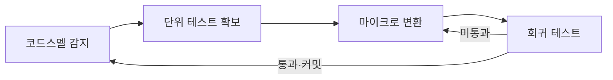

## 지식 로드맵 내 현재 위치

지식 위치: 소프트웨어 공학 → 유지보수·형상관리 → **리팩토링(코드스멜)**

## 30초 인출

- 본질: **리팩토링(Refactoring)**은 소프트웨어의 외부 동작(동등성)을 유지하면서 내부 구조를 개선하여 가독성, 유지보수성, 확장성을 높이는 기법
- 메커니즘: **코드스멜(Code Smell)** 식별 → 자동화 테스트 확보 → 마이크로 단위 단계별 구조 개선 → 회귀테스트 통과 검증
- 효과: 기술 부채 청산 · 복잡도(순환복잡도) 감소 · 신규 기능 추가 생산성 향상

핵심 용어

- **Refactoring**: 소프트웨어의 겉보기 동작은 그대로 유지한 채, 코드를 이해하고 수정하기 쉽도록 내부 구조를 변경하는 기법
- **Code Smell(코드스멜)**: 시스템에 더 심각한 문제가 있음을 암시하는 코드 내부의 나쁜 징후나 패턴
- **Regression Test(회귀 테스트)**: 코드 변경 후 기존 기능이 깨지지 않았음을 증명하는 자동화 테스트 집합
- **Extract Method(메서드 추출)**: 지나치게 길거나 여러 책임을 가진 코드 블록을 별도의 의미 있는 메서드로 분리하는 패턴
- **Clean Code**: 가독성이 높고, 의도가 명확하며, 중복이 없고, 테스트를 통과하는 품질 높은 코드

## 예상문제

> 마틴 파울러(Martin Fowler)의 리팩토링(Refactoring) 개념 및 필요성을 설명하고, 대표적인 코드스멜(Code Smell) 5가지와 이를 제거하기 위한 리팩토링 패턴, 안전한 리팩토링을 위한 전제조건을 제시하시오. (25점)

## Ⅰ. 소프트웨어 내부 품질 혁신, 리팩토링의 개요

> 리팩토링은 기능 추가가 아니라 가독성과 변경 용이성을 확보하는 행위이며, 자동화된 테스트 없이는 리팩토링이 성립하지 않는다.

- 정의: 소프트웨어의 **외부적 동작을 변경하지 않고** 코드를 이해하고 수정하기 쉽게 내부 구조를 재조정하는 **소프트웨어 품질 개선 활동**
- 목적: 소프트웨어 설계 품질 유지, **기술 부채(Technical Debt)** 해소, 코드 가독성 증대 및 버그 조기 발견 용이성 확보

## Ⅱ. 대표적 코드스멜과 리팩토링 대응 패턴

> 코드스멜은 당장 오류는 아니지만 미래의 변경 비용을 폭증시키는 주범이므로 발생 즉시 정형화된 패턴으로 제거한다.

- 마이크로 변환 1회마다 회귀 테스트를 통과시켜 **외부 동작 불변**을 입증하며, 다음 코드스멜로 순환 반복함

| 코드스멜 (Code Smell) | 스멜의 본질적 문제 | 적용 리팩토링 기법 |
|---|---|---|
| **Duplicated Code (중복 코드)** | 동일 로직 변경 시 여러 군데 수정 누락 위험 | **Extract Method**, Pull Up Method |
| **Long Method (장대 함수)** | 함수의 응집도가 낮고 가독성 저하 | **Extract Method**, Replace Temp with Query |
| **Large Class (거대 클래스)** | 단일 책임 원칙(SRP) 위반, 과도한 인스턴스 변수 | **Extract Class**, Extract Subclass |
| **Feature Envy (기능 편애)** | 다른 클래스의 데이터와 메서드를 과도하게 호출 | **Move Method**, Move Field |
| **Switch Statements (복잡한 분기문)** | 신규 조건 추가 시마다 분기문 전수 수정 필요 | **Replace Conditional with Polymorphism (다형성 전환)** |

## Ⅲ. 신규 개발 vs 리팩토링 vs 재공학(Re-engineering) 비교

> 개발 단계와 수정 대상에 따라 엔지니어링의 성격과 투입 비용이 완전히 다르다.

| 구분 | 신규 기능 개발 | 리팩토링 (Refactoring) | 재공학 (Re-engineering) |
|---|---|---|---|
| **목적** | 새로운 비즈니스 가치 추가 | 내부 구조 개선 및 가독성 확보 | 레거시 시스템 현대화 및 아키텍처 재구축 |
| **외부 동작 변경** | **변경됨** (신규 동작 추가) | **불변 (완전 동일)** | 일부 변경 또는 전체 개선 |
| **수행 주기** | 스프린트 기능 구현 시 | 기능 추가 직전/직후 상시 수행 (마이크로) | 시스템 수명 한계 도달 시 대규모 프로젝트 |
| **테스트 의존도** | 신규 테스트 작성 | **기존 회귀 테스트 필수 전제** | 시스템 인수 테스트 중심 |

## Ⅳ. 리팩토링 문제점·대응책

> 테스트 없는 리팩토링은 리팩토링이 아니라 단순한 코드 변작에 불과하며 새로운 버그를 대량 양산한다.

| 위험 | 대책 | 효과 |
|---|---|---|
| **사전 검증 부재로 회귀 결함 발생** | 리팩토링 착수 전 **단위 테스트 커버리지(80% 이상) 확보** 필수화 | 기존 정상 기능 훼손 방지 및 동작 동등성 입증 |
| **빅뱅 리팩토링으로 인한 형상 충돌** | 5분~10분 단위의 **마이크로 커밋(Micro-commit)** 유지 | 충돌(Merge Hell) 방지 및 안전한 롤백 지점 확보 |
| **리팩토링 전용 기간에 따른 일정 반발** | 캠핑장 규칙(Boy Scout Rule) 기반 일상 업무 내 소단위 리팩토링 내재화 | 별도 공기 지연 없이 지속적 기술 부채 상환 |

## Ⅴ. 결론 — 지속적 리팩토링 중심의 기술사적 제언

> 리팩토링은 별도 프로젝트로 몰아서 하는 것이 아니며, 일상 개발 문화와 CI 파이프라인에 완전히 내재화되어야 한다.

### 학습자 통찰 메모 — 답안 밖

- `[핵심 통찰]`: "기능 추가와 리팩토링의 모자를 동시에 쓰지 마라"는 마틴 파울러의 격언처럼, 신규 기능 코딩과 구조 개선을 한 번에 하려다 테스트가 깨지는 실수를 범하기 쉽다. 두 작업은 독립된 단위 커밋으로 엄격히 분리해야 한다.
- `나라면`: 정적 분석 도구(SonarQube)를 CI 파이프라인에 연동하여 신규 PR 생성 시 코드스멜 지수가 증가하거나 순환복잡도가 기준치(10 이상)를 초과하면 머지를 원천 차단하는 Automated Quality Gate를 가동하겠다.

### 실전 답안용 기술사적 제언

- **판정 기준**: 단순 주관적 코드 리뷰가 아니라, 정적 분석 도구(SonarQube) 기반 기술 부채 비율(Technical Debt Ratio < 5%), 순환복잡도($v(G) \le 10$), 중복 코드율(3% 미만) 등 정량적 지표를 기준으로 리팩토링 필요성을 판정함
- **대응 방안**: 기존 기능의 외부 동작 불변성을 검증하는 자동화 단위 테스트 슈트(커버리지 80% 이상)를 안전망으로 확보하고, 메서드 추출(Extract Method) 및 다형성 전환(Polymorphism) 기반의 초소형 마이크로 단위 리팩토링을 수행함
- **검증 체계**: CI 단계별 자동 회귀 테스트 통과율 100%, SonarQube Quality Gate 통과 여부, 그리고 리팩토링 전후 성능 벤치마크(메모리/CPU 프로파일링)를 대사 검증함
- **기대 효과**: 레거시 코드의 스파게티화를 방지하여 소프트웨어 수명주기를 획기적으로 연장하고, 신규 비즈니스 요구사항 추가 시 개발 생산성과 코드 가독성을 극대화함

## 1교시 10점 답안 발췌

### 1. 정의·목적

- 정의: **리팩토링(Refactoring)**은 소프트웨어의 겉보기 동작은 변경하지 않고 내부 구조를 개선하여 가독성과 유지보수성을 향상시키는 기법
- 목적: 코드스멜 제거를 통한 **기술 부채(Technical Debt)** 상환 및 생산성 개선

### 2. 핵심 메커니즘 및 3단계 사이클

### 3. 핵심 통제

- **안전장치**: 완벽히 통과하는 **자동화된 단위 테스트 슈트** 필수
- **스몰 스텝 원칙**: 한 번에 한 가지 스멜만 단계적으로 제거 후 즉시 커밋

## 출제 이력과 검증 출처

- 제139회 정보관리기술사 1교시: 코드스멜(Code Smell)과 리팩토링
- Martin Fowler, Refactoring: Improving the Design of Existing Code (2nd Edition)
- Robert C. Martin, Clean Code: A Handbook of Agile Software Craftsmanship

## 학습 체크

- [ ] 리팩토링의 정의와 외부 동작 불변의 원칙을 설명할 수 있는가?
- [ ] 대표적 코드스멜 5가지와 적용 리팩토링 패턴을 매핑할 수 있는가?
- [ ] 리팩토링 수행 시 단위 테스트가 필수적인 이유를 설명할 수 있는가?

## 연결 토픽

- 이전 토픽: [디자인 패턴](./005_design_pattern.md)
- 연관 토픽: [기술 부채](./016_technical_debt.md), [SW 유지보수 3R](./168_maintenance_and_3r.md)
- 다음 토픽: [무중단 배포](./007_zero_downtime_deployment.md)
