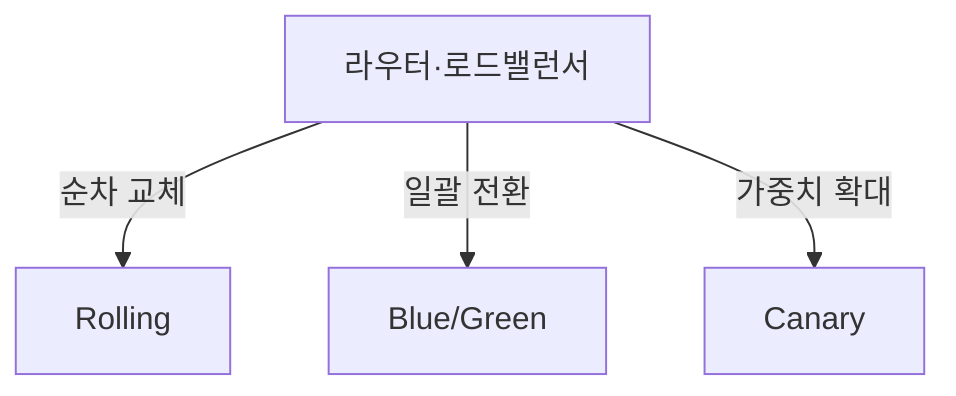
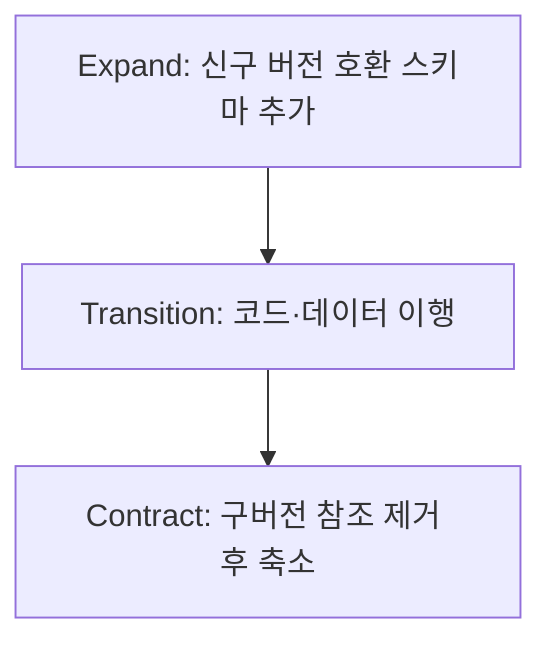

## 지식 로드맵 내 현재 위치

지식 위치: 소프트웨어 공학 → 빌드·배포·DevOps → **무중단 배포·배포 전략**

## 30초 인출

- 본질: **무중단 배포(Zero-Downtime Deployment)**는 서비스 운영 중단(Downtime) 없이 신규 버전을 프로덕션에 배포하고 즉각 롤백을 지원하는 아키텍처 전략
- 메커니즘: **Rolling**(점진 교체) · **Blue/Green**(이중 환경 스위칭) · **Canary**(소규모 카나리 트래픽 검증 후 전면 전환)
- 효과: 가용성(High Availability) 99.999% 유지 · 배포 위험 최소화 · 무중단 사용자 경험 보장

핵심 용어

- **Zero-Downtime Deployment**: 사용자가 서비스 중단을 체감하지 못하도록 트래픽을 제어하며 새 버전을 반영하는 배포 기법
- **Blue/Green Deployment**: 동일한 구성을 가진 Blue(현재 버전)와 Green(신규 버전) 환경을 구축하고 라우터를 통해 트래픽을 한 번에 전환하는 방식
- **Canary Deployment**: 위험을 조기 감지하기 위해 극소수(예: 1~5%)의 사용자 트래픽만 신규 버전에 흘려보내 검증 후 점진 확대하는 방식
- **Rolling Deployment**: 실행 중인 인스턴스를 하나씩 순차적으로 내리고 새 버전으로 교체하여 점진 배포하는 방식
- **Expand/Contract Pattern**: 무중단 배포 시 DB 스키마 호환성을 유지하기 위해 확장(Expand) 후 이전(Transition) 및 축소(Contract)하는 3단계 기법

---

## 1교시 예상문제 (10점)

> 무중단 배포의 개념과 Rolling·Blue/Green·Canary 배포의 트래픽 전환 방식을 설명하시오. (예상)

---

## 1교시 10점 답안

### 1. 정의·목적

- 정의: **무중단 배포**는 구버전에서 신버전으로 전환하는 과정에서 서비스 중단 없이 트래픽을 안전하게 승계하는 배포 전략
- 목적: 배포 중 가용성을 유지하고 장애 발생 시 이전 버전으로 복구

### 2. 3대 배포 전략 요약

### 3. 핵심 통제

- **DB 무중단**: Expand/Contract 패턴으로 하위 호환성 유지 후 구버전 컬럼 제거
- **연결 보장**: Graceful Shutdown 및 Connection Draining으로 인플라이트 요청 보존
---

## 2~4교시 예상문제 (25점)

> 클라우드 네이티브 환경에서 무중단 배포(Zero-Downtime Deployment)의 필요성을 설명하고, 3대 배포 전략(Rolling, Blue/Green, Canary)의 장단점 및 데이터베이스 스키마 변경 시 호환성 확보 방안을 제시하시오. (25점)

> (25점, 예상)

---

## 2~4교시 25점 답안

### Ⅰ. 24/7 무중단 서비스의 필수 조건, 무중단 배포의 개요

> 무중단 배포는 새 버전으로 전환하는 동안에도 사용자 요청을 계속 처리하는 배포 방식이다.

| 구분 | 핵심 |
|---|---|
| 정의 | 새·구 버전의 트래픽을 제어하며 서비스 중단 없이 애플리케이션 갱신 |
| 목적 | 배포 중 가용성을 유지하고 문제 발생 시 이전 버전으로 복구 |

### Ⅱ. 3대 무중단 배포 전략의 메커니즘 및 비교

> Rolling은 순차 교체, Blue/Green은 환경 전환, Canary는 일부 트래픽부터 점진 확대한다.

- 롤백 속도와 추가 자원은 구현·운영 조건에 따라 달라지므로 트래픽 전환과 검증 방법을 함께 비교한다.

| 비교 기준 | Rolling Update | Blue/Green | Canary |
|---|---|---|---|
| **추가 자원** | 순차 교체에 필요한 여유 자원 | 구·신 환경 동시 운영 자원 | 일부 신버전 인스턴스 |
| **검증 범위** | 교체된 인스턴스부터 확인 | 전환 전 신환경 검증 | 일부 사용자 요청으로 실사용 검증 |
| **복구 방식** | 이전 버전을 다시 배포 | 기존 환경으로 트래픽 재전환 | 신버전 유입을 차단하고 이전 버전 유지 |
| **버전 공존** | 배포 중 공존 | 환경 전환 전후 공존 가능 | 트래픽 확대 기간 동안 공존 |

### Ⅲ. 무중단 배포의 핵심 난제: 데이터베이스 호환성 통제

> 애플리케이션 코드는 무중단 배포가 가능하지만, DB 스키마가 하위 호환성을 깨뜨리면 전체 시스템 장애로 이어진다.

- **Expand**: 기존 컬럼을 유지한 상태에서 신규 컬럼만 추가하여 구버전 정상 동작 보장
- **Transition**: 신구 버전이 공존하는 동안 읽기·쓰기 경로와 데이터를 새 스키마로 이행
- **Contract**: 전체 인스턴스 전환 확인 후 구버전 컬럼 삭제로 스키마 정리

### Ⅳ. 무중단 배포 문제점·대응책

> 트래픽 전환만으로 무중단을 보장할 수 없으므로 세션·진행 중 요청·DB 호환성을 함께 확인한다.

| 위험 | 대책 | 효과 |
|---|---|---|
| **배포 중 세션 끊김** | 인스턴스 교체 시 세션을 유지할 저장·라우팅 방식 확인 | 로그인 상태 유지 |
| **진행 중 요청 유실** | **Graceful Shutdown**과 **Connection Draining**을 요청 특성에 맞게 설정 | 처리 중인 요청 완료 후 종료 |
| **준비 전 트래픽 유입** | 준비 상태 검사(`readinessProbe` 등)와 트래픽 연결 | 기동 완료 후 요청 수신 |

### Ⅴ. 결론 — 호환성·복구 중심의 기술사적 제언

> 배포 전략을 고를 때 트래픽 전환, DB 호환성, 진행 중 요청 처리, 되돌리기 절차를 함께 검증한다.

| 문제 | 제언 |
|---|---|
| 버전 공존 중 스키마 충돌 | Expand → Transition → Contract 순서로 변경하고 구버전 의존성 제거를 확인한 뒤 축소 |
| 신버전 오류 발견이 늦음 | 오류율·지연·사용자 영향 지표로 전환 단계를 관찰하고 복구 조건을 미리 정함 |
---

## 출제 이력과 검증 출처

- 제134회 정보관리기술사 1교시: 무중단 배포 전략
- 제139회 정보관리기술사 2교시: 클라우드 네이티브 배포 전략(Rolling, Blue/Green, Canary) 비교
- Sam Newman, Building Microservices (2nd Edition), Deployment Strategies

## 연결 토픽

- 이전 토픽: [리팩토링](./006_refactoring.md)
- 연관 토픽: [DevOps](./002_devops.md), [CI/CD](./095_ci_cd.md)
- 다음 토픽: [블랙박스 테스트](./008_black_box_test.md)
