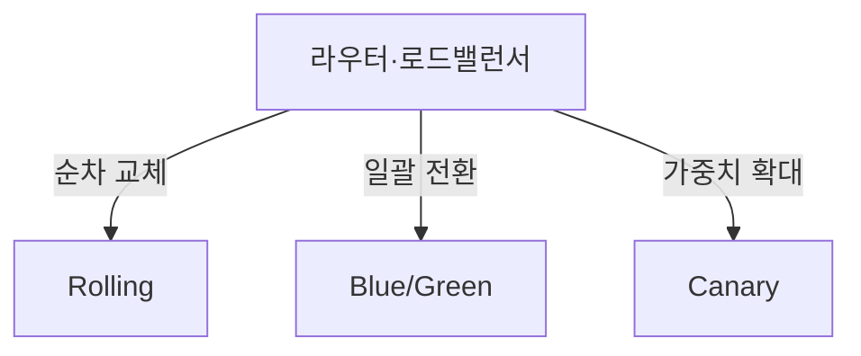
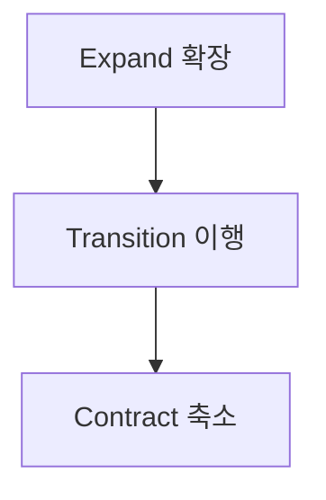

## 지식 로드맵 내 현재 위치

지식 위치: 소프트웨어 공학 → 빌드·배포·DevOps → **무중단 배포·배포 전략**

## 30초 인출

- 본질: **무중단 배포(Zero-Downtime Deployment)**는 서비스 운영 중단(Downtime) 없이 신규 버전을 프로덕션에 배포하고 즉각 롤백을 지원하는 아키텍처 전략
- 메커니즘: **Rolling**(점진 교체) · **Blue/Green**(이중 환경 스위칭) · **Canary**(소규모 카나리 트래픽 검증 후 전면 전환)
- 효과: 가용성(High Availability) 99.999% 유지 · 배포 위험 최소화 · 무중단 사용자 경험 보장

핵심 용어

- **Zero-Downtime Deployment**: 사용자가 서비스 중단을 체감하지 못하도록 트래픽을 제어하며 새 버전을 반영하는 배포 기법
- **Blue/Green Deployment**: 동일한 구성을 가진 Blue(현재 버전)와 Green(신규 버전) 환경을 구축하고 라우터를 통해 트래픽을 한 번에 전환하는 방식
- **Canary Deployment**: 위험을 조기 감지하기 위해 극소수(예: 1~5%)의 사용자 트래픽만 신규 버전에 흘려보내 검증 후 점진 확대하는 방식
- **Rolling Deployment**: 실행 중인 인스턴스를 하나씩 순차적으로 내리고 새 버전으로 교체하여 점진 배포하는 방식
- **Expand/Contract Pattern**: 무중단 배포 시 DB 스키마 호환성을 유지하기 위해 확장(Expand) 후 이전(Transition) 및 축소(Contract)하는 3단계 기법

---

## 1교시 예상문제 (10점)

> 무중단 배포·배포 전략의 정의와 목적, 핵심 구조와 작동 원리를 설명하시오. (예상)
---

## 1교시 10점 답안

### 1. 정의·목적

- 정의: **무중단 배포**는 구버전에서 신버전으로 전환하는 과정에서 서비스 중단 없이 트래픽을 안전하게 승계하는 배포 전략
- 목적: 24/7 서비스 고가용성 유지 및 장애 시 즉각적 롤백 환경 제공

### 2. 3대 배포 전략 요약

### 3. 핵심 통제

- **DB 무중단**: Expand/Contract 패턴으로 하위 호환성 유지 후 구버전 컬럼 제거
- **연결 보장**: Graceful Shutdown 및 Connection Draining으로 인플라이트 요청 보존
---

## 2~4교시 예상문제 (25점)

> 클라우드 네이티브 환경에서 무중단 배포(Zero-Downtime Deployment)의 필요성을 설명하고, 3대 배포 전략(Rolling, Blue/Green, Canary)의 장단점 및 데이터베이스 스키마 변경 시 호환성 확보 방안을 제시하시오. (25점)

> (25점, 예상)
---

## 2~4교시 25점 답안

### Ⅰ. 24/7 무중단 서비스의 필수 조건, 무중단 배포의 개요

> 무중단 배포는 서비스 점검 시간(Maintenance Window)을 없애고, 배포 실패 시 복구 지연을 원천 차단하는 엔지니어링 역량이다.

- 정의: 애플리케이션 업데이트 중에도 시스템 중단 없이 지속적으로 사용자 요청을 처리하도록 트래픽을 동적으로 제어하는 **고가용성 배포 기술**
- 목적: 비즈니스 가용성(24/7/365) 확보, 릴리스 주기 가속화 및 배포 실패 시 **MTTR(복구 시간)** 제로화

### Ⅱ. 3대 무중단 배포 전략의 메커니즘 및 비교

> 인프라 자원 여력, 롤백 속도, 검증 정밀도에 따라 최적의 배포 전략을 선택해야 한다.

- 트래픽을 전환하는 방식이 전략을 가르며, Rolling은 기존 자원 절약, Blue/Green은 즉각 롤백, Canary는 오류 감지 자동 롤백에 강점

| 비교 기준 | Rolling Update | Blue/Green | Canary |
|---|---|---|---|
| **인프라 비용** | 기존 인프라 활용 (낮음) | 2배 인프라 필요 (높음) | 기존 또는 최소 증설 (중간) |
| **배포 위험도** | 중간 (일부 사용자 영향) | 낮음 (사전 검증 완료) | **매우 낮음** (극소수 사용자 격리) |
| **롤백 속도** | 역순 롤링 필요 (느림) | **즉각 롤백 (LB 재스위칭)** | 카나리 트래픽 즉각 차단 (빠름) |
| **버전 공존 여부** | 배포 중 공존 | 순간적 전환 (공존 없음) | 의도적 장시간 공존 |
| **적합한 상황** | 자원 제약이 있는 환경 | 중요 금융·결제 시스템 전면 교체 | 대규모 B2C 서비스, A/B 테스팅 연계 |

### Ⅲ. 무중단 배포의 핵심 난제: 데이터베이스 호환성 통제

> 애플리케이션 코드는 무중단 배포가 가능하지만, DB 스키마가 하위 호환성을 깨뜨리면 전체 시스템 장애로 이어진다.

- **Expand**: 기존 컬럼을 유지한 상태에서 신규 컬럼만 추가하여 구버전 정상 동작 보장
- **Transition**: 신버전 배포 후 신규 컬럼 양방향 읽기·쓰기 및 백그라운드 데이터 마이그레이션
- **Contract**: 전체 인스턴스 전환 확인 후 구버전 컬럼 삭제로 스키마 정리

### Ⅳ. 무중단 배포 문제점·대응책

> 애플리케이션의 세션 유지와 커넥션 드레이닝이 보장되지 않으면 배포 중 사용자의 연결이 끊어진다.

| 위험 | 대책 | 효과 |
|---|---|---|
| **배포 중 세션 끊김 현상** | Redis 기반 외장형 분산 세션 스토어 전환 (Sticky Session 지양) | 인스턴스 교체 시에도 사용자 로그인 유지 |
| **진행 중 요청(In-flight) 유실** | **Graceful Shutdown** 및 **Connection Draining**(30초 유예) 설정 | 강제 종료로 인한 502/504 에러 방지 |
| **헬스체크 실패 및 조기 유입** | Kubernetes `readinessProbe` 및 `livenessProbe` 정밀 구성 | 기동 완료 전 트래픽 유입에 따른 장애 방지 |

### Ⅴ. 결론 — 호환성·복구 중심의 기술사적 제언

> 배포는 단순 스크립트 실행이 아니며, 인프라 라우팅, 관측성, 데이터 호환성이 삼위일체로 작동해야 한다.

### 학습자 통찰 메모 — 답안 밖

- `[핵심 통찰]`: 많은 기업이 쿠버네티스를 도입하면 무중단 배포가 저절로 된다고 착각하지만, 실제 장애의 80%는 DB 스키마 변경 불일치와 우아한 종료(Graceful Shutdown) 부재에서 발생한다. 애플리케이션 배포 주기와 DB 마이그레이션 주기를 반드시 분리해야 한다.
- `나라면`: 서비스 메시(Istio)와 Argo Rollouts를 결합하여 메트릭 기반 자동 카나리 분석(Automated Canary Analysis)을 구축하고, 오류율 1% 초과 시 사람 개입 없이 즉시 자동 롤백되도록 구성하겠다.

### 실전 답안용 기술사적 제언

- **판정 기준**: 서비스 중요도 및 비즈니스 특성에 따라 배포 전략을 명확히 분기(금융/결제 코어: Blue/Green, 대규모 B2C 포털: Canary, 리소스 제한 환경: Rolling)하여 적용함
- **대응 방안**: ArgoCD 및 Istio 가중치 라우팅 기반의 **GitOps 자동화 파이프라인**을 구축하고, DB 변경 시에는 Expand(확장) → Transition(이행) → Contract(축소)의 3단계 스키마 분리 배포 패턴을 제도화함
- **검증 체계**: 배포 과정 중 HTTP 5xx 에러율(0.1% 미만), P99 응답 지연 임계치 초과 여부 자동 감시 및 비정상 감지 시 10초 이내 자동 롤백(Automated Rollback) 실행을 검증함
- **기대 효과**: 심야 야간 배포 및 서비스 점검 공지(Maintenance Window)를 완전히 폐지하고, 주간 업무 시간대 상시 안전 배포를 실현하여 비즈니스 가용성 99.999%를 달성함
---

## 출제 이력과 검증 출처

- 제134회 정보관리기술사 1교시: 무중단 배포 전략
- 제139회 정보관리기술사 2교시: 클라우드 네이티브 배포 전략(Rolling, Blue/Green, Canary) 비교
- Sam Newman, Building Microservices (2nd Edition), Deployment Strategies

## 연결 토픽

- 이전 토픽: [리팩토링](./006_refactoring.md)
- 연관 토픽: [DevOps](./002_devops.md), [CI/CD](./095_ci_cd.md)
- 다음 토픽: [블랙박스 테스트](./008_black_box_test.md)
