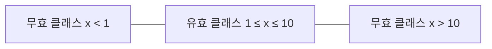

## 지식 로드맵 내 현재 위치

지식 위치: 소프트웨어 공학 → 테스트·검증 → **블랙박스 테스트(명세 기반 기법)**

## 30초 인출

- 본질: **블랙박스 테스트(Black-box Testing)**는 내부 소스코드를 보지 않고 요구사항 명세서를 기반으로 입출력 도메인을 체계적으로 검증하는 기법
- 메커니즘: **동등 분할(Equivalence Partitioning)**(입력 도메인을 동치 클래스로 분할) + **경계값 분석(Boundary Value Analysis)**(경계선 및 인접값 집중 검증)
- 효과: 최소 테스트 케이스로 최대 결함 검출 · 요구사항 불일치 적발 · 경계 결함 집중 격리

핵심 용어

- **Black-box Testing**: 소프트웨어의 내부 논리 구조를 참조하지 않고, 기능 명세서를 바탕으로 입력에 대한 올바른 출력을 검증하는 테스트
- **Equivalence Partitioning(동등 분할)**: 입력 데이터를 동일한 결과를 낼 것으로 예상되는 동치 클래스(유효/무효)로 나누고 대표값을 추출하는 기법
- **Boundary Value Analysis(경계값 분석)**: 대부분의 결함이 경계선 근처에서 발생한다는 경험에 착안하여 경계값과 그 인접값을 테스트 케이스로 선정하는 기법
- **2-Value BVA**: 경계값 바로 위와 경계값을 검증하는 방식
- **3-Value BVA**: 경계값 바로 아래, 경계값, 경계값 바로 위 3개 값을 모두 검증하는 엄격한 방식

## 예상문제

> 블랙박스 테스트(Black-box Test)의 개념과 특징을 설명하고, 명세 기반 테스트의 대표 기법인 동등 분할(Equivalence Partitioning)과 경계값 분석(Boundary Value Analysis, 2-value 및 3-value)의 원리를 입력 예시를 통해 제시하시오. (25점)

## Ⅰ. 명세 충족성 검증의 핵심, 블랙박스 테스트의 개요

> 블랙박스 테스트는 사용자 관점에서 요구명세가 완벽히 구현되었는지를 검증하며, 입력 도메인의 수학적 축약이 핵심이다.

- 정의: 소프트웨어의 **내부 코드를 참조하지 않고** 외부 인터페이스와 요구사항 명세서(SRS)를 기반으로 입출력의 정확성을 검증하는 **명세 기반 테스트 기법**
- 목적: 무한한 입력 도메인에서 결함 검출 확률이 높은 동치 클래스와 경계값을 선별하여 **테스트 비용 절감 및 결함 검출력 극대화**

## Ⅱ. 명세 기반 핵심 기법: 동등 분할과 경계값 분석

> 동등 분할이 도메인의 전반적 대표성을 확보한다면, 경계값 분석은 결함이 집중되는 경계선을 정밀 타격한다.

- 입력 도메인을 유효·무효 동치 클래스로 분할해 대표값을 뽑고, 결함 집중 경계인 1과 10의 인접값을 경계값 분석으로 추가 검증함

### 입력값 설계 예시: 정수 범위 [1, 10]

| 기법 | 클래스 / 경계 | 테스트 케이스 (입력값) | 기대 결과 |
|---|---|---|---|
| **동등 분할** | 유효 클래스 | 5 (대표값) | 정상 승인 |
|  | 무효 클래스 1 (하한 미만) | -2 (대표값) | 오류 처리 |
|  | 무효 클래스 2 (상한 초과) | 15 (대표값) | 오류 처리 |
| **경계값 분석 (2-Value)** | 하한 경계 | 0, 1 | 오류, 정상 |
|  | 상한 경계 | 10, 11 | 정상, 오류 |
| **경계값 분석 (3-Value)** | 하한 경계 정밀 | 0, 1, 2 | 오류, 정상, 정상 |
|  | 상한 경계 정밀 | 9, 10, 11 | 정상, 정상, 오류 |

## Ⅲ. 블랙박스 테스트 vs 화이트박스 테스트 비교

> 두 기법은 상호 배타적인 것이 아니며, V&V 생명주기에서 보완적으로 적용되어야 한다.

| 비교 항목 | 블랙박스 테스트 (Black-box) | 화이트박스 테스트 (White-box) |
|---|---|---|
| **검증 기준** | 요구사항 명세서, 비즈니스 규칙 | 소스코드 내부 논리, 제어/데이터 흐름 |
| **적용 레벨** | **시스템 테스트, 인수 테스트** 중심 | **단위 테스트, 컴포넌트 통합** 중심 |
| **테스트 설계자** | 독립 테스터, QA 엔지니어, 사용자 | 개발자, 화이트박스 전문 테스터 |
| **강점** | 명세 누락 적발, 사용자 관점 검증 | 소스코드 내 데드코드 및 경로 결함 적발 |
| **한계** | 모든 내부 경로 검증 불가 | 명세 자체가 누락된 기능 검출 불가 |

## Ⅳ. 명세 기반 테스트 문제점·대응책

> 복합 조건이나 상태 변화가 수반되는 시스템에서는 다차원 기법을 결합하고 조합 폭발 위험을 통제해야 한다.

### 기타 명세 기반 기법 비교

| 기법명 | 핵심 원리 | 적합 적용 시스템 |
|---|---|---|
| **의사결정 테이블 (Decision Table)** | 논리적 조건(If)과 행위(Then)의 참/거짓 조합 매트릭스 | 금융 대출 심사, 복잡한 비즈니스 룰 엔진 |
| **상태 전이 테스트 (State Transition)** | 이벤트에 따른 시스템 상태 전이와 유효 경로 검증 | 임베디드 기기, 결제 트랜잭션 생명주기 |
| **유스케이스 테스팅 (Use Case Testing)** | 액터와 시스템의 상호작용 시나리오(기본/대안 흐름) | 사용자 인터랙션이 많은 웹/모바일 서비스 |

### 실무 위험 및 통제 대책

| 위험 | 대책 | 효과 |
|---|---|---|
| **Off-by-one 경계선 누락** | 단순 동등분할을 지양하고 **3-Value BVA** 중첩 적용 강제 | 부등호(`>` vs `>=`) 논리 오류 완벽 적발 |
| **다차원 파라미터 조합 폭발** | 전수 조합 대신 **Pairwise(페어와이즈)** 알고리즘 적용 | 테스트 케이스 수 70~80% 감축 및 2인자 상호작용 결함 검출 |
| **명세 모호성으로 인한 오판** | BDD(Given-When-Then) 기반 요구사항 구체화 및 RTM 추적 | 요구사항 해석 왜곡 및 테스트 케이스 누락 방지 |

## Ⅴ. 입력 도메인 대표성 중심의 결론

> 무분별한 조합 테스트는 비용 폭증을 초래하므로, 직교배열 및 페어와이즈(Pairwise) 기법을 통한 최적화가 필수적이다.

### 학습자 통찰 메모 — 답안 밖

- [핵심 통찰]: 프로그래머의 오프바이원(Off-by-one: `<` 대신 `<=`) 오류는 대부분 경계값에서 발생함. 동등 분할만으로는 경계선 결함을 놓칠 위험이 매우 높으므로, 동등 분할로 전체 도메인을 커버한 뒤 반드시 경계값 분석(3-Value)을 중첩 적용해야 함.
- 나라면: 파라미터 조합이 4개 이상인 복합 화면에서는 모든 조합을 테스트하지 않고, 대부분의 결함이 2개 인자의 상호작용에서 발생한다는 점에 착안해 페어와이즈(Pairwise) 조합 도구를 적용하여 테스트 케이스를 80% 감축하겠음.

### 실전 답안용 기술사적 제언

- **판정 기준**: 입력 변수 특성(단일 연속형 vs 복합 이산형)에 따른 기법 계층화 (1차 동등 분할 → 2차 3-Value BVA)
- **대응 방안**: 4개 이상 다차원 파라미터 조합 시 **Pairwise(페어와이즈)** 알고리즘 적용 및 복합 조건의 **의사결정 테이블** 룰 매트릭스화
- **검증 체계**: 요구사항 추적성 매트릭스(RTM) 100% 매핑 및 경계 결함 조기 격리율 기반 회귀 테스트 자동화 파이프라인 구축
- **기대 효과**: 테스트 설계 공수 40% 절감 및 프로덕션 오프바이원(Off-by-one) 경계 결함 누출률 0% 달성

## 1교시 10점 답안 발췌

### 1. 정의·목적

- 정의: **블랙박스 테스트**는 소스코드 내부 구조를 참조하지 않고 요구명세서를 기반으로 입출력의 적합성을 검증하는 테스트
- 목적: 대표 동치 클래스와 경계값을 선별하여 최소 케이스로 최대 결함 검출

### 2. 핵심 메커니즘 (동등분할 vs 경계값)

### 3. 핵심 통제

- **Off-by-one 방어**: `<`와 `<=` 오동작 방지를 위한 경계값 필수 포함
- **RTM 추적**: 모든 요구사항 항목이 최소 1개 이상의 블랙박스 케이스와 매핑 보증

## 출제 이력과 검증 출처

- 제134회 정보관리기술사 1교시: 명세 기반 테스트 설계 기법
- 제137회 정보관리기술사 1교시: 동등 분할과 경계값 분석
- 제139회 정보관리기술사 1교시: 경계값 분석 계산형 문제
- ISO/IEC/IEEE 29119-4 Test Techniques, Specification-based techniques

## 학습 체크

- [ ] 동등 분할의 유효 동치 클래스와 무효 동치 클래스의 도출 원리를 설명할 수 있는가?
- [ ] 2-Value BVA와 3-Value BVA의 차이점을 특정 입력 범위 예시로 설명할 수 있는가?
- [ ] 결정 테이블(Decision Table)과 상태 전이 테스트의 적용 영역을 구분할 수 있는가?

## 연결 토픽

- 이전 토픽: [무중단 배포](./007_zero_downtime_deployment.md)
- 연관 토픽: [소프트웨어 테스트 종류·레벨](./003_sw_test_types_and_levels.md), [화이트박스 테스트](./013_white_box_test.md)
- 다음 토픽: [스택 자료구조](./009_stack.md)
