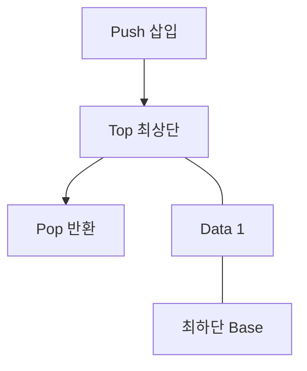

## 지식 로드맵 내 현재 위치

지식 위치: 소프트웨어 공학 → 알고리즘·자료구조 → **스택(Stack) 자료구조**

## 30초 인출

- 본질: **스택(Stack)**은 한쪽 끝에서만 자료의 삽입과 삭제가 일어나는 **후입선출(LIFO: Last In First Out)** 선형 자료구조
- 메커니즘: **Top** 포인터를 통한 **Push**(삽입), **Pop**(삭제), **Peek**(조회) 연산 (모두 **O(1)** 상수 시간)
- 효과: 함수 호출 스택 관리 · 괄호 검사 · 후위 표기법 연산 · DFS(깊이우선탐색) 및 브라우저 뒤로가기 구현

핵심 용어

- **LIFO(Last In First Out)**: 가장 최근에 저장된 항목이 가장 먼저 인출되는 입출력 규칙
- **Top 포인터**: 스택의 가장 위에 있는 자료의 위치를 가리키는 변수 (비어있을 때 -1 또는 null)
- **Push / Pop**: 스택 최상단에 데이터를 삽입하거나, 최상단 데이터를 꺼내 반환하는 연산
- **Stack Overflow**: 고정된 스택 용량을 초과하여 Push를 시도할 때 발생하는 메모리 오류
- **Call Stack(호출 스택)**: 프로그램 실행 중 함수 호출 시 복귀 주소와 지역 변수를 관리하는 런타임 스택

---

## 1교시 예상문제 (10점)

> 스택(Stack) 자료구조의 정의와 목적, 핵심 구조와 작동 원리를 설명하시오. (예상)
---

## 1교시 10점 답안

### 1. 정의·목적

- 정의: **스택(Stack)**은 Top을 통해서만 데이터 삽입과 삭제가 이루어지는 **후입선출(LIFO)** 선형 자료구조
- 목적: 함수 호출 복귀, 상태 역순 복원, 수식 연산을 **O(1)** 시간 복잡도로 수행

### 2. 핵심 메커니즘

### 3. 핵심 통제

- **오버플로우 방어**: 무한 재귀를 반복문으로 치환하고 힙 메모리 기반 커스텀 스택 활용
- **보안 통제**: 스택 버퍼 오버플로우 방지를 위한 Stack Canary 및 경계 검사 강제
---

## 2~4교시 예상문제 (25점)

> 스택(Stack) 자료구조의 개념 및 LIFO 특성을 설명하고, 기본 연산(Push, Pop) 메커니즘, 배열 및 연결리스트 구현 방식 비교, 시스템 소프트웨어 및 알고리즘에서의 대표적 응용 사례 4가지를 제시하시오. (25점)

> (25점, 예상)
---

## 2~4교시 25점 답안

### Ⅰ. 후입선출(LIFO) 원칙의 선형 자료구조, 스택의 개요

> 스택은 접근 지점을 Top 하나로 제한하며 Push·Pop·Peek 연산을 O(1)에 수행함.

- 정의: 데이터의 삽입과 삭제가 **Top이라 불리는 한쪽 끝에서만** 이루어지는 **후입선출(LIFO) 형태의 선형 자료구조**
- 목적: 작업 역순 복원, 상태 저장 및 복귀, 재귀적 호출 흐름 관리를 메모리 오버헤드 없이 **O(1)** 상수 시간에 수행

### Ⅱ. 스택의 핵심 연산 메커니즘 및 구현 방식 비교

> 스택 구현은 고정 크기 배열 방식과 동적 연결 리스트 방식으로 나뉘며 메모리 제약에 따라 선택한다.

- 삽입·삭제가 Top 한 지점에서만 일어나며, Push 전 `isFull()`, Pop·Peek 전 `isEmpty()` 경계 검증으로 Overflow·Underflow를 방지함

| 비교 항목 | 배열(Array) 기반 스택 | 연결 리스트(Linked List) 기반 스택 |
|---|---|---|
| **메모리 할당** | 정적 고정 할당 (컴파일/생성 시점) | 동적 노드 할당 (런타임 필요 시점) |
| **장점** | 구현이 매우 단순, 데이터 접근 속도 빠름 | **Stack Overflow 없음** (메모리 허용 한도 내 무한) |
| **단점** | 크기 제한으로 **Stack Overflow** 위험 | 노드별 포인터 오버헤드 발생 (메모리 추가 소모) |
| **연산 복잡도** | Push: O(1), Pop: O(1) | Push: O(1), Pop: O(1) |

### Ⅲ. 스택의 주요 컴퓨터 시스템 및 알고리즘 응용 분야

> 스택은 단순한 이론적 구조를 넘어 OS 커널부터 컴파일러, 웹 브라우저까지 시스템의 근간을 이룬다.

| 응용 분야 | 스택의 구체적 역할 및 동작 원리 |
|---|---|
| **함수 호출 스택 (Call Stack)** | 함수 호출 시 복귀 주소(Return Address), 매개변수, 지역변수를 **스택 프레임(Stack Frame)**에 Push하고 복귀 시 Pop |
| **컴파일러 수식 파싱** | 중위 표기법(Infix)을 후위 표기법(Postfix)으로 변환하고, 연산자를 스택에 임시 저장하여 우선순위 평가 |
| **문법 괄호 유효성 검사** | 열린 괄호(`(`, `{`, `[`) 발견 시 Push, 닫힌 괄호 발견 시 Pop하여 짝 일치 여부 검증 |
| **실행 취소(Undo) / 브라우저 뒤로가기** | 사용자의 직전 작업 상태를 스택에 기록하여 역순 복원 수행 |
| **그래프 DFS (깊이 우선 탐색)** | 인접 정점 방문 시 역추적(Backtracking)을 위해 방문 경로를 스택에 저장 |

### Ⅳ. 스택 사용 문제점·대응책

> 깊은 재귀는 스택 고갈을, 경계 검사 없는 스택 버퍼 쓰기는 메모리 손상을 일으키므로 서로 다른 위험으로 통제함.

| 위험 | 대책 | 효과 |
|---|---|---|
| **Stack Overflow (스택 고갈)** | 무한 재귀 종료 조건(Base Case) 검증 및 재귀를 **반복문(Iteration)**으로 변환 | 프로세스 비정상 종료(Crash) 원천 방지 |
| **Stack Buffer Overflow (메모리 변조)** | 안전한 문자열 함수(`strncpy`) 사용, **Stack Canary**, ASLR 강제 | 악의적 리턴 주소 변조 및 원격 코드 실행 차단 |
| **Stack Underflow (공백 상태 인출)** | Pop/Peek 실행 전 `isEmpty()` 사전 조건 검증 필수화 | 널 포인터 참조 및 시스템 패닉 방지 |

### Ⅴ. 메모리 경계 통제 중심의 결론

> 시스템의 신뢰성을 확보하기 위해서는 런타임 스택 메모리 한계와 스택 프레임 수명주기에 대한 철저한 통제가 필수적이다.

### 학습자 통찰 메모 — 답안 밖

- [핵심 통찰]: 스택의 O(1) 고속 연산은 '캐시 친화도(Cache Locality)' 덕분임. CPU 레지스터와 L1 캐시가 Top 근처의 스택 메모리를 매우 빠르게 읽을 수 있기 때문임. 그러나 깊은 재귀 호출은 이 캐시를 무너뜨리고 스택 오버플로우를 유발함.
- 나라면: 대용량 데이터 트리 탐색 시 언어 수준의 재귀 호출(콜스택 사용)을 금지하고, 힙 메모리에 명시적인 사용자 정의 스택(Explicit Stack)을 할당하여 OS 스택 한계(보통 1~8MB)를 우회하겠음.

### 실전 답안용 기술사적 제언

- **판정 기준**: 재귀 호출 깊이(Depth)의 결정성 여부 및 콜 스택 임계치(기본 OS 1~8MB) 초과 가능성 판정
- **대응 방안**: 불확실한 재귀를 **반복문(Iteration)**으로 변환하고, 대규모 탐색은 **힙(Heap) 기반 명시적 스택(Explicit Stack)**으로 전환
- **검증 체계**: 컴파일러 보안 옵션(Stack Canary, DEP) 적용 및 정적 분석 도구를 통한 스택 프레임 최대 깊이 프로파일링
- **기대 효과**: 스택 고갈(Stack Overflow) 비정상 종료 예방 및 버퍼 오버플로우 메모리 변조 취약점 원천 차단
---

## 출제 이력과 검증 출처

- 제132회 정보관리기술사 1교시: 스택(Stack)과 큐(Queue) 자료구조 비교
- 제138회 정보관리기술사 1교시: 스택 자료구조와 시스템 호출 스택
- Thomas H. Cormen, Introduction to Algorithms (CLRS), Elementary Data Structures (Stacks and Queues)

## 연결 토픽

- 이전 토픽: [블랙박스 테스트](./008_black_box_test.md)
- 연관 토픽: [선형 자료구조](./053_linear_structure.md), [BST](./001_bst.md)
- 다음 토픽: [형상관리](./011_configuration_management.md)
