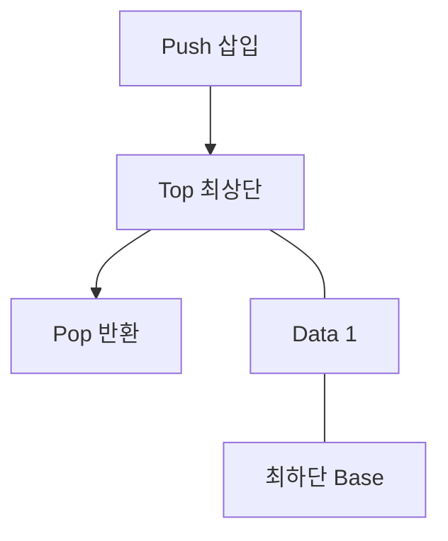

## 지식 로드맵 내 현재 위치

지식 위치: 소프트웨어 공학 → 알고리즘·자료구조 → **스택(Stack) 자료구조**

## 30초 인출

- 본질: **스택(Stack)**은 한쪽 끝에서만 자료의 삽입과 삭제가 일어나는 **후입선출(LIFO: Last In First Out)** 선형 자료구조
- 메커니즘: **Top** 포인터를 통한 **Push**(삽입), **Pop**(삭제), **Peek**(조회) 연산 (모두 **O(1)** 상수 시간)
- 효과: 함수 호출 스택 관리 · 괄호 검사 · 후위 표기법 연산 · DFS(깊이우선탐색) 및 브라우저 뒤로가기 구현

핵심 용어

- **LIFO(Last In First Out)**: 가장 최근에 저장된 항목이 가장 먼저 인출되는 입출력 규칙
- **Top 포인터**: 스택의 가장 위에 있는 자료의 위치를 가리키는 변수 (비어있을 때 -1 또는 null)
- **Push / Pop**: 스택 최상단에 데이터를 삽입하거나, 최상단 데이터를 꺼내 반환하는 연산
- **Stack Overflow**: 고정된 스택 용량을 초과하여 Push를 시도할 때 발생하는 메모리 오류
- **Call Stack(호출 스택)**: 프로그램 실행 중 함수 호출 시 복귀 주소와 지역 변수를 관리하는 런타임 스택

---

## 1교시 예상문제 (10점)

> 스택(Stack) 자료구조의 정의와 목적, 핵심 구조와 작동 원리를 설명하시오. (예상)

---

## 1교시 10점 답안

### 1. 정의·목적

- 정의: **스택(Stack)**은 Top을 통해서만 데이터 삽입과 삭제가 이루어지는 **후입선출(LIFO)** 선형 자료구조
- 목적: 함수 호출 복귀, 상태 역순 복원, 수식 연산을 **O(1)** 시간 복잡도로 수행

### 2. 핵심 메커니즘

### 3. 핵심 통제

- **오버플로우 방어**: 무한 재귀를 반복문으로 치환하고 힙 메모리 기반 커스텀 스택 활용
- **보안 통제**: 스택 버퍼 오버플로우 방지를 위한 Stack Canary 및 경계 검사 강제
---

## 2~4교시 예상문제 (25점)

> 스택(Stack) 자료구조의 개념 및 LIFO 특성을 설명하고, 기본 연산(Push, Pop) 메커니즘, 배열 및 연결리스트 구현 방식 비교, 시스템 소프트웨어 및 알고리즘에서의 대표적 응용 사례 4가지를 제시하시오. (25점)

> (25점, 예상)

---

## 2~4교시 25점 답안

### Ⅰ. 후입선출(LIFO) 원칙의 선형 자료구조, 스택의 개요

> 스택은 한쪽 끝(Top)에서만 넣고 꺼내는 후입선출(LIFO) 자료구조다.

| 구분 | 핵심 |
|---|---|
| 정의 | Top에서 Push·Pop을 수행하므로 마지막에 넣은 값이 먼저 나옴 |
| 용도 | 함수 호출·되돌리기·깊이 우선 탐색처럼 최근 상태부터 처리 |

### Ⅱ. 스택의 핵심 연산 메커니즘 및 구현 방식 비교

> 스택 구현은 고정 크기 배열 방식과 동적 연결 리스트 방식으로 나뉘며 메모리 제약에 따라 선택한다.

- 삽입·삭제가 Top 한 지점에서만 일어나며, Push 전 `isFull()`, Pop·Peek 전 `isEmpty()` 경계 검증으로 Overflow·Underflow를 방지함

| 비교 항목 | 배열(Array) 기반 스택 | 연결 리스트(Linked List) 기반 스택 |
|---|---|---|
| **메모리 할당** | 고정 배열 또는 크기 조절 가능한 배열 사용 | 삽입 시 노드 동적 할당 |
| **장점** | 연속 저장으로 위치·메모리 관리가 단순 | 크기를 미리 정하지 않아도 됨 |
| **단점** | 고정 배열은 용량 한계, 가변 배열은 확장 비용 | 노드별 포인터와 할당 비용 발생 |
| **연산 복잡도** | Push: O(1), Pop: O(1) | Push: O(1), Pop: O(1) |

### Ⅲ. 스택의 주요 컴퓨터 시스템 및 알고리즘 응용 분야

> 최근에 저장한 상태를 먼저 꺼내야 하는 호출·탐색·되돌리기에 적용한다.

| 응용 분야 | 스택의 구체적 역할 및 동작 원리 |
|---|---|
| **함수 호출 스택 (Call Stack)** | 함수 호출 시 복귀 주소(Return Address), 매개변수, 지역변수를 **스택 프레임(Stack Frame)**에 Push하고 복귀 시 Pop |
| **컴파일러 수식 파싱** | 중위 표기법(Infix)을 후위 표기법(Postfix)으로 변환하고, 연산자를 스택에 임시 저장하여 우선순위 평가 |
| **문법 괄호 유효성 검사** | 열린 괄호(`(`, `{`, `[`) 발견 시 Push, 닫힌 괄호 발견 시 Pop하여 짝 일치 여부 검증 |
| **실행 취소(Undo) / 브라우저 뒤로가기** | 사용자의 직전 작업 상태를 스택에 기록하여 역순 복원 수행 |
| **그래프 DFS (깊이 우선 탐색)** | 인접 정점 방문 시 역추적(Backtracking)을 위해 방문 경로를 스택에 저장 |

### Ⅳ. 스택 사용 문제점·대응책

> 깊은 재귀는 스택 고갈을, 경계 검사 없는 스택 버퍼 쓰기는 메모리 손상을 일으키므로 서로 다른 위험으로 통제함.

| 위험 | 대책 | 효과 |
|---|---|---|
| **호출 스택 고갈** | 재귀 종료 조건과 최대 깊이 확인, 필요 시 반복문·명시적 스택 사용 | 과도한 재귀 호출 방지 |
| **스택 버퍼 경계 초과** | 입력 길이 검사와 안전한 메모리 접근, 보호 기법 적용 | 인접 메모리 훼손 위험 감소 |
| **빈 스택 인출** | Pop/Peek 전 `isEmpty()` 확인 | 잘못된 인출 처리 방지 |

### Ⅴ. 메모리 경계 통제 중심의 결론

> 스택 자료구조의 빈 상태·용량과 프로그램 호출 스택의 재귀 깊이는 구분해서 관리한다.

| 문제 | 제언 |
|---|---|
| 구현 방식을 메모리·최대 크기·접근 특성과 무관하게 고정함 | 제언: 크기 상한과 연속 메모리 접근이 중요하면 배열 기반을, 크기 변동이 크고 노드 할당을 감당할 수 있으면 연결 리스트 기반을 검토하고, 재귀 깊이 제한은 별도로 시험한다. |
---

## 출제 이력과 검증 출처

- 제132회 정보관리기술사 1교시: 스택(Stack)과 큐(Queue) 자료구조 비교
- 제138회 정보관리기술사 1교시: 스택 자료구조와 시스템 호출 스택
- Thomas H. Cormen, Introduction to Algorithms (CLRS), Elementary Data Structures (Stacks and Queues)

## 연결 토픽

- 이전 토픽: [블랙박스 테스트](./008_black_box_test.md)
- 연관 토픽: [선형 자료구조](./053_linear_structure.md), [BST](./001_bst.md)
- 다음 토픽: [형상관리](./011_configuration_management.md)
