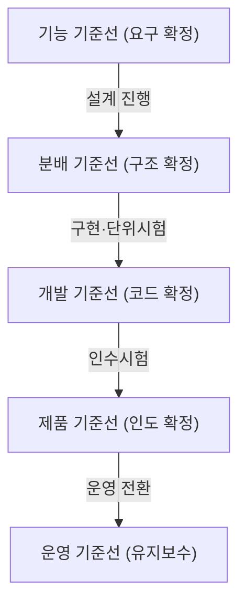
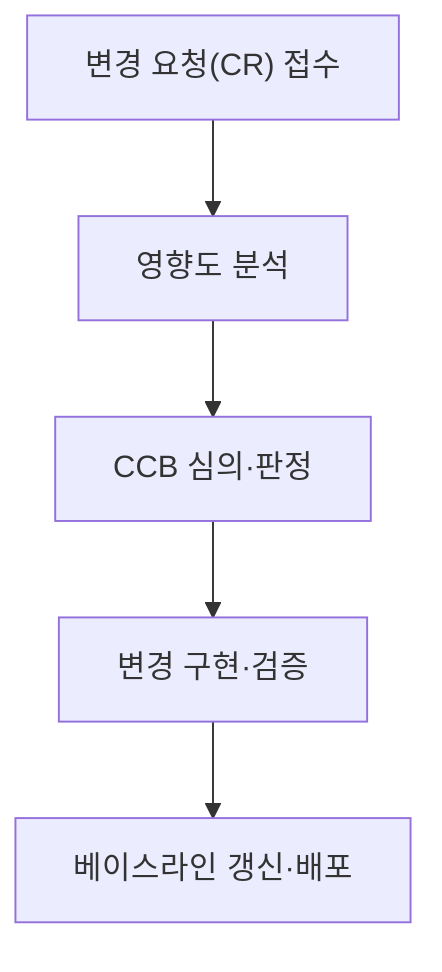

## 지식 로드맵 내 현재 위치

지식 위치: 소프트웨어 공학 → 유지보수·형상관리 → **형상관리(베이스라인)**

## 30초 인출

- 본질: **형상관리(SCM: Software Configuration Management)**는 소프트웨어 생명주기 전반의 산출물 변경을 통제하고 무결성을 보증하는 품질 보증 체계
- 메커니즘: 형상 식별 → 형상 통제(**CCB**, 변경 승인) → 형상 감사(**FCA/PCA**) → 형상 기록 및 보고
- 효과: **베이스라인(Baseline)** 확립 · 무단 변경 차단 · 결함 역추적성 확보 · 산출물 무결성 보장

핵심 용어

- **SCM(Software Configuration Management)**: 소프트웨어 개발 및 유지보수 과정에서 생성되는 모든 형상항목의 변경을 관리하는 활동
- **Baseline(기준선)**: 공식적으로 검토되고 합의되어 이후 변경 시 공식적인 변경 통제 절차를 거쳐야 하는 기준 상태
- **CI(Configuration Item, 형상항목)**: 형상관리의 대상이 되는 하드웨어, 소프트웨어, 문서 등 산출물 단위
- **CCB(Configuration Control Board, 형상통제위원회)**: 변경 요청을 심의, 승인, 기각하는 권한을 가진 공식 의사결정 기구
- **FCA / PCA**: Functional Configuration Audit(기능적 형상감사: 요구명세 일치 확인) / Physical Configuration Audit(물리적 형상감사: 산출물 완비 확인)

## 예상문제

> 소프트웨어 형상관리(SCM)의 정의와 4대 주요 활동(식별, 통제, 감사, 기록)을 설명하고, 생명주기 단계별 5대 베이스라인(Baseline)의 종류 및 CCB(형상통제위원회)의 변경 통제 절차를 제시하시오. (25점)

## Ⅰ. 소프트웨어 산출물 무결성 확보의 근간, 형상관리의 개요

> 형상관리는 단순한 소스코드 버전 관리가 아니며, 생명주기 전반의 요구·설계·코드·시험 산출물의 일관성을 지키는 거버넌스다.

- 정의: 소프트웨어 생명주기 동안 산출물의 변경을 체계적으로 식별, 통제, 감사, 기록하여 **제품의 무결성과 추적성(Traceability)**을 유지하는 활동
- 목적: 비인가된 무단 변경 방지, 변경 영향도 사전 분석, 버전 간 차이 추적 및 프로젝트 가시성 확보

## Ⅱ. 형상관리 4대 활동과 5대 베이스라인 체계

> 베이스라인은 개발 단계의 완료를 선언하는 마일스톤이자, 다음 단계의 신뢰할 수 있는 출발점이 된다.

### 생명주기 5대 베이스라인(Baseline) 진화

| 4대 활동 | 주요 수행 활동 | 산출물 및 통제 도구 |
|---|---|---|
| **형상 식별 (Identification)** | 형상관리 대상(CI) 선정, 명명 규칙, 버전 번호 부여 체계 수립 | 형상관리계획서, CI 목록 |
| **형상 통제 (Control)** | 변경 요청(CR) 접수, CCB 영향 평가, 변경 승인/기각, 베이스라인 갱신 | 변경요청서(CR), CCB 회의록 |
| **형상 상태 보고 (Status Accounting)** | CI의 현재 상태, 변경 이력, 릴리스 현황을 이해관계자에게 공표 | 형상 상태 보고서, 변경 이력부 |
| **형상 감사 (Audit)** | 공식 베이스라인과 실제 산출물의 기능적(FCA)·물리적(PCA) 일치성 검증 | 형상감사보고서 (결함 시정 조치) |

## Ⅲ. CCB(형상통제위원회) 변경 통제 절차

> 변경 요청은 개인적 합의로 처리될 수 없으며, CCB의 공식 심의를 거쳐야만 베이스라인에 반영된다.

- 판정: CCB 심의 결과는 승인(Approved)·기각(Rejected)·보류(Deferred)로 의결됨

## Ⅳ. 형상관리 문제점·대응책

> 분산 환경에서는 중앙집중식 통제에서 GitOps 기반의 선언적 자동화 통제로 진화하고 있다.

### 전통적 SCM vs 현대적 GitOps 비교

| 구분 | 전통적 SCM (Subversion, ClearCase) | 현대적 GitOps / DevOps SCM (Git) |
|---|---|---|
| **저장소 구조** | 중앙 집중형 서버 (Centralized) | 분산 버전 관리 (Distributed, Git) |
| **브랜치 전략** | 긴 수명의 기능 브랜치 (병합 충돌 빈발) | Trunk-based Development, 단기 Feature 브랜치 |
| **변경 통제** | 서면 문서 결재 기반의 무거운 CCB | **Pull Request(PR)** 코드 리뷰 및 CI 자동화 검사 |
| **인프라 형상** | 서버별 수작업 형상 기록 | **IaC(Terraform)**로 인프라 형상도 코드로 일원 관리 |

### 실무 위험 및 거버넌스 대책

| 위험 | 대책 | 효과 |
|---|---|---|
| **비공식 구두 변경(Uncontrolled Change)** | 모든 변경 시 공식 CR(Change Request) 등록 및 CCB 심의 의무화 | 무단 변경 방지 및 베이스라인 무결성 유지 |
| **코드와 문서 간 불일치** | **RTM(요구사항 추적표)** 연동 및 CI 빌드 시 문서 자동 생성 | 역추적성 확보 및 산출물 정합성 보장 |
| **개발 브랜치 오염 및 병합 충돌** | Branch Protection Rule 설정 및 최소 2인 PR 코드 리뷰 강제 | 메인 브랜치 안정성 확보 및 형상 충돌 예방 |

## Ⅴ. 산출물 무결성 중심의 결론

> 형상관리가 부실하면 롤백 불가, 소스코드 유실, 불일치 릴리스 등 치명적인 프로젝트 실패가 발생한다.

### 학습자 통찰 메모 — 답안 밖

- [핵심 통찰]: 형상관리의 본질은 '통제'와 '유연성'의 균형임. 폭포수 시대의 관료적 CCB는 애자일 환경에서 배포 병목을 유발하므로, 현대에는 경미한 변경은 CI 자동 테스트와 피어 리뷰로 위임하고, 아키텍처/비용/계약에 영향을 주는 중대 변경만 공식 CCB를 거치도록 '차등적 형상 통제'를 구현해야 함.
- 나라면: Git 리포지토리의 main 브랜치 직접 Push를 원천 차단(Branch Protection Rule)하고, 최소 2인의 승인과 CI 통과를 필수 조건으로 설정하여 코드 베이스라인의 순수성을 보존하겠음.

### 실전 답안용 기술사적 제언

- **판정 기준**: 변경 영향도(Scope/Cost/Schedule)에 따른 차등 통제 (경미한 변경: PR/CI 자동 검증, 중대 변경: CCB 정식 심의)
- **대응 방안**: **GitOps** 기반 선언적 형상관리(SSOT) 구축 및 **IaC** 연계를 통한 인프라-코드 일원 형상 동기화
- **검증 체계**: 주기적 기능/물리적 형상감사(FCA/PCA) 정례화 및 빌드 재현율(Reproducibility) 100% 검증 파이프라인 수립
- **기대 효과**: 산출물 불일치 제로화, 무단 변경 원천 차단 및 장애 발생 시 특정 베이스라인 시점 즉각 롤백 보장

## 1교시 10점 답안 발췌

### 1. 정의·목적

- 정의: **형상관리(SCM)**는 소프트웨어 생명주기 동안 산출물의 변경을 식별, 통제, 감사, 기록하여 무결성을 유지하는 관리 기법
- 목적: 비인가 변경 방지 및 베이스라인 확립을 통한 추적성과 소프트웨어 품질 보증

### 2. 형상관리 4대 활동 및 핵심 요소

### 3. 핵심 통제

- **Baseline**: 공식 합의된 기준선으로, CCB 승인 없는 변경 금지
- **CCB**: 변경 요청의 타당성과 비용·일정 영향도를 공식 심의하는 통제 기구

## 출제 이력과 검증 출처

- 제134회 정보관리기술사 1교시: 형상관리의 개념 및 베이스라인 종류
- 제140회 정보관리기술사 2교시: 소프트웨어 형상관리 4대 활동과 Git 기반 형상 통제 절차
- IEEE Std 828-2012 Standard for Configuration Management in Systems and Software Engineering

## 학습 체크

- [ ] 형상관리의 4대 활동(식별, 통제, 감사, 기록)을 설명할 수 있는가?
- [ ] 5대 베이스라인(기능, 분배/설계, 개발, 제품, 운영)의 확립 시점을 구분할 수 있는가?
- [ ] FCA(기능적 감사)와 PCA(물리적 감사)의 차이점을 설명할 수 있는가?

## 연결 토픽

- 이전 토픽: [스택 자료구조](./009_stack.md)
- 연관 토픽: [요구사항 추적표](./102_requirement_traceability_matrix.md), [DevOps](./002_devops.md)
- 다음 토픽: [화이트박스 테스트](./013_white_box_test.md)
