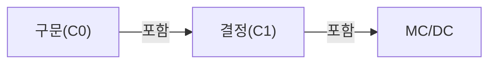
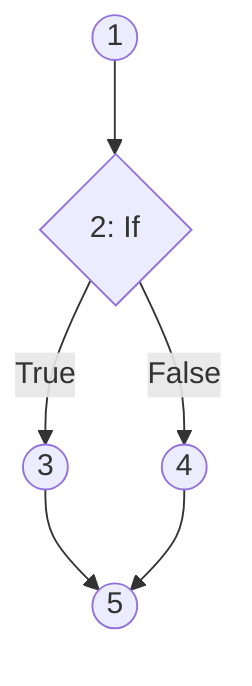

## 지식 로드맵 내 현재 위치

지식 위치: 소프트웨어 공학 → 테스트·검증 → **화이트박스 테스트(White Box Test)**

## 30초 인출

- 본질: **화이트박스 테스트(White-box Testing)**는 소스코드 내부 논리 구조와 제어 흐름을 직접 분석하여 모든 실행 경로의 정확성을 검증하는 구조 기반 테스트
- 메커니즘: **제어 흐름 그래프(CFG)** 도출 → 테스트 커버리지 기준 선정(구문, 결정, 조건, **MC/DC**) → 입력 케이스 생성
- 효과: 미실행 데드코드(Dead Code) 적발 · 내부 로직 오류 및 메모리 누수 격리 · 고신뢰성 안전 등급 보증

핵심 용어

- **White-box Testing**: 소스코드의 내부 구조, 루프, 조건 분기, 데이터 흐름을 직접 관찰하며 테스트 케이스를 설계하는 기법
- **CFG(Control Flow Graph)**: 프로그램의 실행 흐름을 노드(기본 블록)와 엣지(제어 이동)로 표현한 방향 그래프
- **Statement Coverage(구문 커버리지, C0)**: 소스코드의 모든 실행 가능한 문장이 최소 한 번 실행되는 비율
- **Branch/Decision Coverage(결정 커버리지, C1)**: 프로그램 내 모든 조건문의 전체 결과(True/False)가 최소 한 번씩 실행되는 비율
- **MC/DC(Modified Condition/Decision Coverage)**: 복합 조건식 내 각 개별 조건이 다른 조건과 무관하게 전체 결정 결과에 독립적인 영향을 미치는지 검증하는 기법 (항공 DO-178C Level A 표준)

---

## 1교시 예상문제 (10점)

> 화이트박스 테스트(White Box Test)의 정의와 목적, 핵심 구조와 작동 원리를 설명하시오. (예상)
---

## 1교시 10점 답안

### 1. 정의·목적

- 정의: **화이트박스 테스트**는 프로그램의 소스코드 논리 구조를 제어 흐름 그래프로 모델링하여 내부 경로를 검증하는 구조 기반 테스트
- 목적: 미실행 경로 및 데드코드를 제거하고 고신뢰성 제어 무결성 보증

### 2. 주요 커버리지 계층

### 3. 핵심 통제

- **MC/DC 통제**: 다중조건 조합 폭발(2^N)을 N+1개로 최적화하여 안전 기준선 충족
- **Quality Gate**: CI 환경에서 브랜치 커버리지 미달 시 프로덕션 배포 차단
---

## 2~4교시 예상문제 (25점)

> 화이트박스 테스트(White-box Testing)의 개념과 특징을 설명하고, 제어 흐름 기반 커버리지 5단계(구문, 결정, 조건, 조건/결정, MC/DC)의 포함 관계 및 복합 조건식 예제를 통해 MC/DC의 테스트 케이스 도출 원리를 제시하시오. (25점)

> (25점, 예상)
---

## 2~4교시 25점 답안

### Ⅰ. 내부 로직의 무결성을 입증하는 화이트박스 테스트의 개요

> 소스코드를 보지 않는 블랙박스 테스트로는 숨겨진 악성 로직이나 실행 불가능한 데드코드를 결코 찾아낼 수 없다.

- 정의: 소프트웨어 내부 소스코드의 **논리적 구조, 제어 흐름(Control Flow), 데이터 흐름(Data Flow)**을 분석하여 모든 실행 경로의 정확성을 검증하는 **구조 기반 테스트 기법**
- 목적: 미실행 코드(Dead Code) 제거, 무한 루프 등 제어 흐름 결함 적발 및 경계 조건의 논리 오류 조기 차단

### Ⅱ. 제어 흐름 테스트 커버리지 5단계 체계 및 포함 관계

> 커버리지 기준의 포함 관계를 구분하되, 높은 커버리지를 결함 부재의 증거로 오인하지 않아야 함.

### 제어 흐름 그래프(CFG)

| 커버리지 유형 | 핵심 정의 | 최소 필요 케이스 수 | 특징 및 한계 |
|---|---|---|---|
| **구문(C0)** | 실행 문장 1회 실행 | 최소 | 분기문의 반대쪽 경로 미실행 위험 |
| **결정(C1)** | 전체 조건문 True/False 1회 실행 | 중간 | 개별 조건의 결함 간과 가능 |
| **조건(C2)** | 개별 조건 True/False 1회 실행 | 중간 | 전체 조건문 결과가 True/False 둘 다 안 될 수 있음 |
| **조건/결정** | C1과 C2를 동시 만족 | 중간~높음 | 조건 간 독립성 미보증 |
| **다중 조건(MCC)** | 개별 조건의 모든 가능한 조합(2^N) | 2^N (조합 폭발) | 완벽하나 케이스 폭증으로 실무 적용 불가 |
| **MC/DC** | 개별 조건의 독립적 영향력 검증 | **N + 1 개** | 항공(DO-178C), 차량(ISO 26262) 기능안전 표준 채택 |

### Ⅲ. MC/DC 테스트 케이스 도출 원리: `(A OR B) AND C`

> MC/DC는 각 원자 조건이 결정 결과에 독립적으로 영향을 줌을 보이며, 최소 N+1 사례가 가능한 경우에도 식 구조·결합 조건에 따라 추가 사례가 필요함.

### 조건식: `Result = (A OR B) AND C`

1. **A의 독립성 검증 조건**: B는 False, C는 True로 고정하고 A를 True/False로 변경했을 때 Result가 바뀌는지 확인
   - 케이스 1: `A=True, B=False, C=True` → Result = **True**
   - 케이스 2: `A=False, B=False, C=True` → Result = **False** (쌍 {1, 2})
2. **B의 독립성 검증 조건**: A는 False, C는 True로 고정하고 B를 True/False로 변경
   - 케이스 3: `A=False, B=True, C=True` → Result = **True**
   - 케이스 2와 비교: `A=False, B=False, C=True` → Result = **False** (쌍 {3, 2})
3. **C의 독립성 검증 조건**: (A OR B)를 True로 고정하고 C를 True/False로 변경
   - 케이스 4: `A=True, B=False, C=False` → Result = **False**
   - 케이스 1과 비교: `A=True, B=False, C=True` → Result = **True** (쌍 {1, 4})
- **최종 도출된 최소 테스트 슈트**: 케이스 1, 2, 3, 4 (총 4개 = N+1개로 증명 완료)

### Ⅳ. 화이트박스 테스트 문제점·대응책

> 단위 테스트 프레임워크와 정적/동적 분석 도구를 CI/CD 파이프라인에 결합하여 커버리지를 지속 측정한다.

### 화이트박스 도구 분류

| 도구 분류 | 대표 도구 | 주 검증 내용 |
|---|---|---|
| **코드 커버리지 분석** | JaCoCo, Cobertura, Istanbul | 구문(C0), 브랜치(C1) 커버리지 백분율 측정 |
| **정적 코드 분석** | SonarQube, Fortify, Coverity | 코딩 표준 준수, 널 참조, 잠재적 런타임 오류, 보안 취약점 |
| **기능안전 전문 도구** | VectorCAST, LDRA, Cantata | 임베디드 대상 MC/DC 커버리지 자동 측정 및 리포팅 |

### 실무 위험 및 거버넌스 대책

| 위험 | 대책 | 효과 |
|---|---|---|
| **C0(구문) 편중으로 인한 분기 누락** | 단순 구문 측정을 지양하고 **결정 커버리지(C1) 80% 이상** 강제 | `else` 누락 등 미실행 분기 결함 적발 |
| **복합 조건식 조합 폭발(2^N)** | 안전 필수 시스템 대상 **MC/DC(N+1개 케이스)** 검증 적용 | 최소 비용으로 다중조건 수준의 신뢰성 확보 |
| **테스트 코드 유지보수 부채** | 내부 구현 종속적 테스트 지양, 행위 기반 검증 및 Mocking 최소화 | 리팩토링 시 테스트 깨짐 방지 및 유지보수성 향상 |

### Ⅴ. 구조·명세 상호보완 검증의 결론

> 100% 구문 커버리지가 무결함을 의미하지 않으며, 요구사항 명세 검증(블랙박스)과의 결합이 필수적이다.

### 학습자 통찰 메모 — 답안 밖

- [핵심 통찰]: 구문 커버리지(C0) 100%는 단순한 최소 조건일 뿐임. `if (a > 0)`에서 `else` 블록이 누락된 경우 C0는 100%가 나오지만 심각한 분기 누락 버그가 존재함. 따라서 상용 시스템에서는 최소한 결정 커버리지(C1) 80% 이상, 안전 필수(Safety-critical) 시스템에서는 MC/DC를 필히 강제해야 함.
- 나라면: 자율주행, 철도, 의료기기 프로젝트 수행 시 ISO 26262 ASIL-D 수준을 만족하도록 전문 동적 검증 도구(VectorCAST)를 도입하여 단위/통합 테스트에서 MC/DC 100%를 통과 기준선(Quality Gate)으로 설정하겠음.

### 실전 답안용 기술사적 제언

- **판정 기준**: 시스템 위험 등급(기능안전 ASIL, SIL)에 따른 차등 커버리지 목표선 설정 (일반: C1 80%, 안전 필수: MC/DC 100%)
- **대응 방안**: **MC/DC(N+1)** 알고리즘 기반 조합 폭발 통제 및 **정적 분석 도구(SonarQube)** 병행을 통한 데드코드 원천 격리
- **검증 체계**: CI/CD 파이프라인 내 JaCoCo/VectorCAST 연동 Quality Gate 강제 (커버리지 미달 시 배포 빌드 실패 차단)
- **기대 효과**: 제어 경로 및 복합 조건 내부 논리 오류 완전 적발, 기능안전 최고 안전 무결성 등급(DO-178C Level A) 공인 인증 통과
---

## 출제 이력과 검증 출처

- 제134회 정보관리기술사 1교시: 화이트박스 테스트 기법 및 제어 흐름 커버리지
- ISO 26262 Road vehicles - Functional safety, Part 6: Software development
- RTCA DO-178C Software Considerations in Airborne Systems and Equipment

## 연결 토픽

- 이전 토픽: [형상관리](./011_configuration_management.md)
- 연관 토픽: [블랙박스 테스트](./008_black_box_test.md), [McCabe 순환복잡도](./036_mccabe_cyclomatic_complexity.md)
- 다음 토픽: [ATAM](./014_atam.md)
