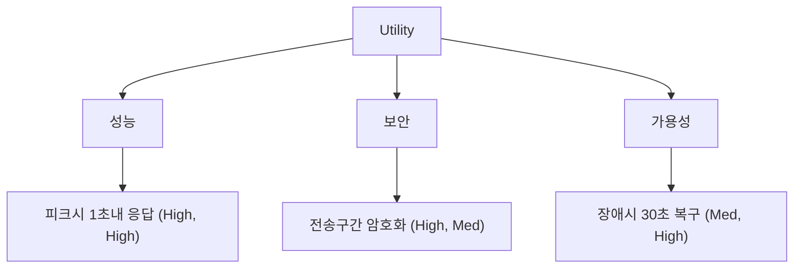

## 지식 로드맵 내 현재 위치

지식 위치: 소프트웨어 공학 → 아키텍처·설계 → **ATAM(Architecture Tradeoff Analysis Method)**

## 30초 인출

- 본질: **ATAM**은 아키텍처가 비즈니스 목표와 상충하는 품질속성 요구사항을 얼마나 만족하는지 시나리오 기반으로 평가·절충하는 SEI의 분석 방법론
- 메커니즘: 파트너십 구축 → **유틸리티 트리(Utility Tree)** 생성 → 아키텍처 접근법 분석 → **민감점/절충점** 식별 → 위험 평가
- 효과: 민감점(Sensitivity Point) · 절충점(Tradeoff Point) · 리스크 테마 도출 · 아키텍처 재설계 의사결정 지원

핵심 용어

- **ATAM(Architecture Tradeoff Analysis Method)**: SEI(Software Engineering Institute)에서 개발한 시나리오 기반 아키텍처 평가 방법론
- **Utility Tree(유틸리티 트리)**: 품질속성(성능, 가용성 등)을 구체적인 품질속성 시나리오로 세분화하고 우선순위(중요도/난이도)를 부여하는 계층형 트리
- **Sensitivity Point(민감점)**: 특정 품질속성에 직접적이고 지대한 영향을 미치는 아키텍처 구성요소 또는 속성
- **Tradeoff Point(절충점)**: 여러 품질속성에 동시에 영향을 주어, 하나를 향상시키면 다른 하나를 저하시키는 아키텍처 결정 사항
- **Risk / Non-Risk**: 비즈니스 목표를 위협할 잠재적 결정(Risk)과 충분한 근거로 타당성이 입증된 결정(Non-Risk)

## 예상문제

> 소프트웨어 아키텍처 평가 방법론인 ATAM(Architecture Tradeoff Analysis Method)의 개념 및 목적을 설명하고, 4단계 9개 세부 프로세스, 유틸리티 트리(Utility Tree)의 역할 및 민감점(Sensitivity Point)과 절충점(Tradeoff Point)의 차이를 제시하시오. (25점)

## Ⅰ. 품질속성 상충을 해결하는 아키텍처 평가, ATAM의 개요

> 아키텍처 평가는 완벽한 설계를 찾는 것이 아니라, 비즈니스 목표 달성을 위해 어떤 품질속성을 타협(Tradeoff)할지 합의하는 과정이다.

- 정의: 소프트웨어 아키텍처가 비즈니스 목표와 다중 품질속성(성능, 보안, 가용성 등)을 충족하는지 평가하고 아키텍처 결정을 검증하는 SEI 표준 방법론
- 목적: 아키텍처 조기 위험 식별, 품질속성 간의 트레이드오프 관계 규명, 이해관계자 간 아키텍처 합의 도출

## Ⅱ. ATAM의 4단계 9개 프로세스

> 평가는 평가팀과 프로젝트 이해관계자가 참여하는 단계적 워크숍 형태로 진행된다.

| 단계 | 세부 프로세스 | 핵심 활동 |
|---|---|---|
| **Phase 1: 소개 (Presentation)** | 1. 방법론 소개 | 평가팀이 ATAM 절차 및 기대 산출물 설명 |
| **Phase 1: 소개** | 2. 비즈니스 동인 소개 | 고객/PM이 사업 목표 및 주요 품질 요구사항 제시 |
| **Phase 1: 소개** | 3. 아키텍처 소개 | 수석 아키텍트가 뷰(View) 및 설계 결정 설명 |
| **Phase 2: 조사 및 분석 (Investigation & Analysis)** | 4. 아키텍처 접근법 식별 | 적용된 패턴(계층형, 마이크로서비스 등) 파악 |
| **Phase 2: 조사 및 분석** | 5. 유틸리티 트리 생성 | 품질속성 시나리오 도출 및 (중요도, 난이도) 우선순위화 |
| **Phase 2: 조사 및 분석** | 6. 아키텍처 접근법 분석 | 우선순위 시나리오 기반 민감점·절충점·위험 판정 |
| **Phase 3: 테스팅 (Testing)** | 7. 시나리오 브레인스토밍 | 이해관계자 참여로 유스케이스·성장 시나리오 발굴 |
| **Phase 3: 테스팅** | 8. 추가 아키텍처 분석 | 투표로 선정된 핵심 시나리오 기반 아키텍처 재검증 |
| **Phase 4: 보고 (Reporting)** | 9. 평가 결과 보고 | 민감점, 절충점, 리스크 테마 및 재설계 권고사항 발표 |

## Ⅲ. 유틸리티 트리와 핵심 평가 지표(민감점 vs 절충점)

> 유틸리티 트리는 모호한 품질 요구사항을 측정 가능한 시나리오로 변환하는 핵심 도구이다.

### 1. 유틸리티 트리(Utility Tree) 구조
- **루트**: Utility
- **품질속성(Quality Attribute)**: 성능, 가용성, 보안성, 변경용이성
- **속성 세분화**: 응답 시간, 장애 탐지, 인가, 모듈 추가
- **품질 시나리오**: `자극(Stimulus) - 환경(Environment) - 응답(Response)` 명세
- **우선순위 표기**: `(비즈니스 중요도, 아키텍처 구현 난이도)` 예: `(High, High)`

### 2. 민감점 vs 절충점 vs 위험 요소 비교

| 구분 | 개념 정의 | 구체적 사례 |
|---|---|---|
| **민감점 (Sensitivity Point)** | 특정 **단일 품질속성**의 달성 여부에 직접 영향을 미치는 아키텍처 요소 | "DB 커넥션 풀 크기는 **성능(응답속도)**에 민감점이다." |
| **절충점 (Tradeoff Point)** | **복수 품질속성**에 걸쳐 한쪽을 높이면 다른 쪽이 낮아지는 상충 요소 | "모든 통신 암호화(HTTPS)는 **보안을 높이지만 성능(지연)을 저하**시키는 절충점이다." |
| **위험 (Risk)** | 비즈니스 목표를 저해할 수 있는 부적절한 아키텍처 결정 | "대량 배치 처리를 단일 스레드 구조로 설계한 것" |
| **비위험 (Non-Risk)** | 충분한 분석과 검증을 통해 타당성이 입증된 아키텍처 결정 | "검증된 오픈소스 캐시(Redis) 클러스터 적용" |

## Ⅳ. ATAM 적용 문제점·대응책

> 평가 목적과 수행 시점에 따라 적절한 방법론을 선택하여 적용한다.

### 1. 아키텍처 평가 방법론 비교

| 비교 항목 | ATAM | CBAM | SAAM |
|---|---|---|---|
| **주요 목적** | **품질속성 간 트레이드오프 분석** | **투자 비용 대비 경제적 편익 평가** | **소프트웨어 변경용이성(Modifiability) 평가** |
| **핵심 기준** | 유틸리티 트리, 시나리오 | ROI(투자수익률), 비용/효익 매트릭스 | 시나리오별 변경 영향도 분석 |
| **개발 기관** | SEI (카네기멜론대) | SEI (카네기멜론대) | SEI (SAAM에서 ATAM으로 발전) |
| **적용 시점** | 아키텍처 설계 완료 직후 | 아키텍처 대안 간 경제적 선택 시점 | 아키텍처 초기 설계 단계 |

### 2. 아키텍처 평가 실무 위험 및 대응 통제

| 위험 | 대책 | 효과 |
|---|---|---|
| 모호한 시나리오 도출 | 6요소(자극원·자극·환경·대상·응답·응답측도) 정량화 | 측정 가능한 품질 평가 기준 확립 |
| 이해관계자 간 품질 대립 | 비즈니스 목표 우선순위 기반 H/M/L 투표제 운영 | 감정적 충돌 방지 및 합의 도출 |
| 절충점 식별 후 후속조치 부재 | CBAM 연계 경제성 평가 및 프로토타입 PoC 검증 | 재설계 비용 최소화 및 아키텍처 확정 |

## Ⅴ. 품질속성 합의 중심의 결론

> ATAM은 단순한 사후 감사 도구가 아니라 아키텍처 리스크를 사전 완화하는 조기 품질게이트로 운영되어야 한다.

### 학습자 통찰 메모 — 답안 밖

- [핵심 통찰]: 아키텍트는 "모든 품질속성을 100% 만족시키는 아키텍처는 없다"는 사실을 인정해야 함. 보안성을 높이면 사용성과 성능이 떨어지고, 고가용성을 높이면 비용이 증가함. ATAM의 진정한 가치는 이해관계자들에게 이 절충점(Tradeoff)을 수치와 시나리오로 가시화하여 납득시키는 데 있음.
- 나라면: 상세설계 착수 전 아키텍처 확정 단계(Design Baseline)에 ATAM 워크숍을 의무화하고, (High, High) 우선순위 시나리오 중 절충점에 해당하는 핵심 영역은 반드시 프로토타입 PoC를 병행하여 검증하겠음.

### 실전 답안용 기술사적 제언

- **판정 기준**: 아키텍처 확정 마일스톤(Design Baseline) 시 ATAM 기반 품질속성 트레이드오프 검증 의무화 판정
- **대응 방안**: **유틸리티 트리** 기반 (High, High) 핵심 시나리오 우선순위화 및 **CBAM** 연계를 통한 경제성(ROI) 분석 병행
- **검증 체계**: 우선순위 시나리오 프로토타입 PoC 100% 검증 및 식별된 아키텍처 리스크 테마별 완화 계획서 승인
- **기대 효과**: 구축 후반 아키텍처 재설계(빅뱅 결함) 비용 원천 차단 및 이해관계자 간 품질 요구사항 합의 보증

## 1교시 10점 답안 발췌

### 1. 정의·목적

- 정의: **ATAM(Architecture Tradeoff Analysis Method)**은 비즈니스 동인과 품질속성 시나리오를 바탕으로 아키텍처를 평가하고 절충점을 도출하는 SEI 방법론
- 목적: 아키텍처 위험 요소 사전 발견 및 품질속성 간 트레이드오프 합의

### 2. 핵심 메커니즘

### 3. 핵심 통제

- **Risk 테마 관리**: 비즈니스 목표를 저해하는 아키텍처 결정을 식별하고 대응책 수립
- **CBAM 연계**: 기술적 절충점 도출 후 비용/효익 관점의 최종 대안 확정

## 출제 이력과 검증 출처

- 제140회 정보관리기술사 1교시: 소프트웨어 아키텍처 평가 방법론 ATAM
- Len Bass, Paul Clements, Rick Kazman, Software Architecture in Practice (SEI Series)
- SEI CMU/SEI-2000-TR-004, ATAM: Method for Architecture Evaluation

## 학습 체크

- [ ] ATAM의 4단계(소개, 조사/분석, 테스팅, 보고)의 핵심 활동을 설명할 수 있는가?
- [ ] 유틸리티 트리의 계층 구조와 우선순위 매트릭스(H/M/L)를 설명할 수 있는가?
- [ ] 민감점(Sensitivity Point)과 절충점(Tradeoff Point)의 차이를 구체적 기술 예시로 구분할 수 있는가?

## 연결 토픽

- 이전 토픽: [화이트박스 테스트](./013_white_box_test.md)
- 연관 토픽: [CBAM](./076_cbam.md), [소프트웨어 아키텍처](./056_software_architecture.md)
- 다음 토픽: [REST](./015_rest.md)
