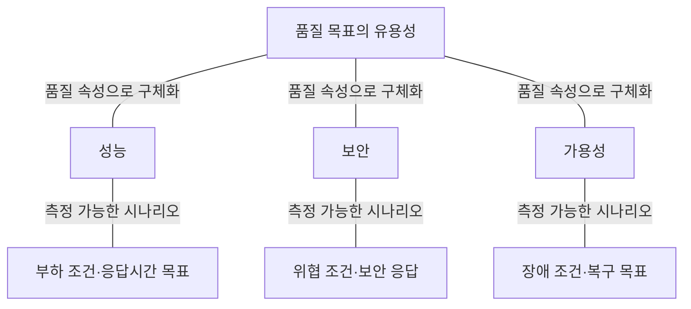
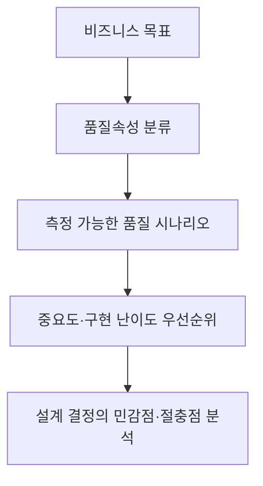

## 지식 로드맵 내 현재 위치

지식 위치: 소프트웨어 공학 → 아키텍처·설계 → **ATAM(Architecture Tradeoff Analysis Method)**

## 30초 인출

- 본질: **ATAM**은 아키텍처가 비즈니스 목표와 상충하는 품질속성 요구사항을 얼마나 만족하는지 시나리오 기반으로 평가·절충하는 SEI의 분석 방법론
- 메커니즘: 파트너십 구축 → **유틸리티 트리(Utility Tree)** 생성 → 아키텍처 접근법 분석 → **민감점/절충점** 식별 → 위험 평가
- 효과: 민감점(Sensitivity Point) · 절충점(Tradeoff Point) · 리스크 테마 도출 · 아키텍처 재설계 의사결정 지원

핵심 용어

- **ATAM(Architecture Tradeoff Analysis Method)**: SEI(Software Engineering Institute)에서 개발한 시나리오 기반 아키텍처 평가 방법론
- **Utility Tree(유틸리티 트리)**: 품질속성(성능, 가용성 등)을 구체적인 품질속성 시나리오로 세분화하고 우선순위(중요도/난이도)를 부여하는 계층형 트리
- **Sensitivity Point(민감점)**: 특정 품질속성에 직접적이고 지대한 영향을 미치는 아키텍처 구성요소 또는 속성
- **Tradeoff Point(절충점)**: 여러 품질속성에 동시에 영향을 주어, 하나를 향상시키면 다른 하나를 저하시키는 아키텍처 결정 사항
- **Risk / Non-Risk**: 비즈니스 목표를 위협할 잠재적 결정(Risk)과 충분한 근거로 타당성이 입증된 결정(Non-Risk)

---

## 1교시 예상문제 (10점)

> ATAM(Architecture Tradeoff Analysis Method)의 정의와 목적, 핵심 구조와 작동 원리를 설명하시오. (예상)

---

## 1교시 10점 답안

### Ⅰ. ATAM의 개요

| 구분 | 핵심 |
|---|---|
| 정의 | **ATAM(Architecture Tradeoff Analysis Method)** 은 품질속성 목표를 기준으로 아키텍처를 평가하는 SEI 방법 |
| 목적 | 품질속성 간 상충과 아키텍처 위험을 찾아 설계 판단 지원 |

### Ⅱ. 유틸리티 트리와 시나리오

### Ⅲ. 평가 결과와 연계

- **Risk 테마 관리**: 비즈니스 목표를 저해하는 아키텍처 결정을 식별하고 대응책 수립
- **CBAM 연계**: 기술적 절충점 도출 후 비용/효익 관점의 최종 대안 확정
- 한 줄 제언: 우선순위가 높은 품질 시나리오를 설계 결정과 연결해 위험·절충 근거 기록
---

## 2~4교시 예상문제 (25점)

> ATAM의 목적과 수행 흐름을 설명하고, 품질 시나리오를 이용한 평가와 위험·민감점·절충점의 식별 및 아키텍처 의사결정 반영 방안을 제시하시오. (25점, 예상)

---

## 2~4교시 25점 답안

## Ⅰ. 품질 목표를 기준으로 아키텍처를 평가하는 ATAM의 개요

> ATAM은 품질속성 시나리오로 아키텍처 결정의 위험과 절충점을 분석하는 평가 방법이다.

| 구분 | 핵심 |
|---|---|
| 정의 | **ATAM(Architecture Tradeoff Analysis Method)** 은 품질속성 목표를 기준으로 아키텍처를 평가하는 SEI 방법 |
| 목적 | 품질속성 간 상충과 아키텍처 위험을 찾아 설계 판단 지원 |

### Ⅱ. ATAM의 4단계 9개 프로세스

> ATAM의 9개 절차는 아키텍처 중심 분석 뒤 이해관계자 시나리오를 확인하고 결과를 공유하는 구성

| 절차 | 핵심 활동 |
|---|---|
| 1. ATAM 소개 | 평가 방법과 기대 결과 설명 |
| 2. 비즈니스 동인 제시 | 목표와 주요 아키텍처 요구 설명 |
| 3. 아키텍처 제시 | 구조와 설계 접근법 설명 |
| 4. 아키텍처 접근법 식별 | 사용한 접근법 확인 |
| 5. 유틸리티 트리 생성 | 품질속성 시나리오 도출·우선순위화 |
| 6. 접근법 분석 | 우선순위 시나리오 기준 위험·민감점·절충점 식별 |
| 7. 시나리오 브레인스토밍·우선순위화 | 이해관계자 시나리오 도출·투표 |
| 8. 접근법 재분석 | 우선 시나리오를 통해 기존 분석을 확인·보완 |
| 9. 결과 제시 | 접근법·시나리오·위험·절충 분석 결과 공유 |

### Ⅲ. 유틸리티 트리와 핵심 평가 지표(민감점 vs 절충점)

> 유틸리티 트리는 모호한 품질 요구사항을 측정 가능한 시나리오로 변환하는 핵심 도구이다.

### 1. 유틸리티 트리(Utility Tree) 구조
- **루트**: Utility
- **품질속성(Quality Attribute)**: 성능, 가용성, 보안성, 변경용이성
- **속성 세분화**: 응답 시간, 장애 탐지, 인가, 모듈 추가
- **품질 시나리오**: `자극(Stimulus) - 환경(Environment) - 응답(Response)` 명세
- **우선순위 표기**: `(비즈니스 중요도, 아키텍처 구현 난이도)` 예: `(High, High)`

### 2. 민감점 vs 절충점 vs 위험 요소 비교

| 구분 | 개념 정의 | 구체적 사례 |
|---|---|---|
| **민감점 (Sensitivity Point)** | 품질속성의 달성 정도에 큰 영향을 주는 아키텍처 결정 | "DB 커넥션 풀 크기는 응답시간에 민감하다." |
| **절충점 (Tradeoff Point)** | **복수 품질속성**에 걸쳐 한쪽을 높이면 다른 쪽이 낮아지는 상충 요소 | "모든 통신 암호화(HTTPS)는 **보안을 높이지만 성능(지연)을 저하**시키는 절충점이다." |
| **위험 (Risk)** | 비즈니스 목표를 저해할 수 있는 부적절한 아키텍처 결정 | "대량 배치 처리를 단일 스레드 구조로 설계한 것" |
| **비위험 (Non-Risk)** | 분석한 시나리오에서 허용 가능한 것으로 확인된 결정 | "요구 부하에서 응답시간 기준을 충족한 캐시 구성" |

### Ⅳ. ATAM 적용 문제점·대응책

> 평가 목적과 수행 시점에 따라 적절한 방법론을 선택하여 적용한다.

### 1. 아키텍처 평가 방법론 비교

| 비교 항목 | ATAM | CBAM | SAAM |
|---|---|---|---|
| **주요 목적** | **품질속성 간 트레이드오프 분석** | **투자 비용 대비 경제적 편익 평가** | **소프트웨어 변경용이성(Modifiability) 평가** |
| **핵심 기준** | 유틸리티 트리, 시나리오 | ROI(투자수익률), 비용/효익 매트릭스 | 시나리오별 변경 영향도 분석 |
| **개발 기관** | SEI (카네기멜론대) | SEI (카네기멜론대) | SEI (SAAM에서 ATAM으로 발전) |
| **적용 시점** | 아키텍처 설계 완료 직후 | 아키텍처 대안 간 경제적 선택 시점 | 아키텍처 초기 설계 단계 |

### 2. 아키텍처 평가 실무 위험 및 대응 통제

| 위험 | 대책 | 효과 |
|---|---|---|
| 모호한 시나리오 도출 | 6요소(자극원·자극·환경·대상·응답·응답측도) 정량화 | 측정 가능한 품질 평가 기준 확립 |
| 이해관계자 간 품질 대립 | 비즈니스 목표 우선순위 기반 H/M/L 투표제 운영 | 감정적 충돌 방지 및 합의 도출 |
| 절충점 식별 후 후속조치 부재 | CBAM 연계 경제성 평가 및 프로토타입 PoC 검증 | 재설계 비용 최소화 및 아키텍처 확정 |

### Ⅴ. 품질 시나리오 기반 설계 판단 제언

> 우선순위가 높은 품질 시나리오를 설계 결정에 대입해 위험과 절충점을 확인하고 대응 과제를 남긴다.

| 문제 | 해결 방안 |
|---|---|
| 평가 결과가 문서에만 남고 실제 설계 선택으로 이어지지 않음 | 영향이 큰 품질 시나리오를 설계 기준으로 지정하고 대안·절충점·선정 근거를 결정 기록 및 후속 시험에 연결 |
---

## 출제 이력과 검증 출처

- 제140회 정보관리기술사 1교시: 소프트웨어 아키텍처 평가 방법론 ATAM
- [SEI, Architecture Tradeoff Analysis Method® Collection](https://www.sei.cmu.edu/library/architecture-tradeoff-analysis-method-collection/)
- Len Bass, Paul Clements, Rick Kazman, Software Architecture in Practice (SEI Series)
- SEI CMU/SEI-2000-TR-004, ATAM: Method for Architecture Evaluation

## 연결 토픽

- 이전 토픽: [화이트박스 테스트](./013_white_box_test.md)
- 연관 토픽: [CBAM](./076_cbam.md), [소프트웨어 아키텍처](./056_software_architecture.md)
- 다음 토픽: [REST](./015_rest.md)
