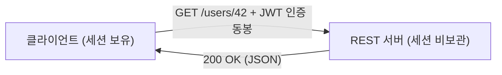
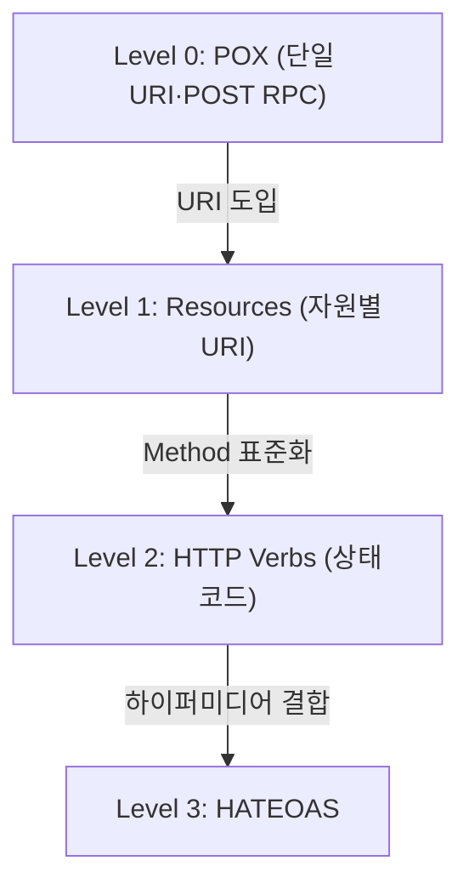
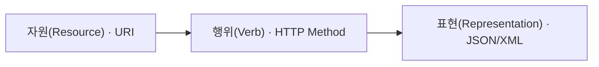

## 지식 로드맵 내 현재 위치

지식 위치: 소프트웨어 공학 → 구현·객체지향·API → **REST**

## 30초 인출

- 본질: **REST(Representational State Transfer)**는 웹(Web)의 기존 HTTP 인프라와 표준을 그대로 활용하여 자원(Resource) 중심의 상태 전송을 정의하는 분산 하이퍼미디어 아키텍처 스타일
- 메커니즘: **자원(URI)** + **행위(HTTP Method)** + **표현(Representation, JSON/XML)** + **무상태(Stateless)**
- 효과: 시스템 간 느슨한 결합(Loose Coupling) · 높은 확장성(Scalability) · 플랫폼 독립적 연계

핵심 용어

- **REST(Representational State Transfer)**: Roy Fielding이 제안한 웹 아키텍처의 장점을 극대화하기 위한 네트워크 기반 소프트웨어 아키텍처 스타일
- **Stateless(무상태성)**: 각 요청은 서버에 이전 요청의 컨텍스트를 저장하지 않고 독립적으로 처리되어야 한다는 제약
- **Uniform Interface**: 자원 식별, 표현을 통한 자원 조작, 자기기술적 메시지, HATEOAS의 4대 인터페이스 규칙
- **HATEOAS(Hypermedia As The Engine Of Application State)**: 응답 본문에 다음 가능한 상태 전이를 위한 하이퍼링크를 포함하는 원칙
- **Idempotency(멱등성)**: 동일한 요청을 여러 번 수행해도 서버의 최종 상태가 동일하게 유지되는 특성(GET, PUT, DELETE 등)

## 예상문제

> Roy Fielding이 제안한 REST(Representational State Transfer) 아키텍처 스타일의 개념과 6대 제약조건을 설명하고, HTTP Method의 멱등성(Idempotency) 및 리차드슨 성숙도 모델(Richardson Maturity Model) 4단계를 제시하시오. (25점)

## Ⅰ. 웹 표준 기반 분산 인터페이스, REST의 개요

> REST는 새로운 프로토콜이 아니라 이미 성공한 웹(HTTP)의 기본 설계 철학을 올바르게 활용하자는 아키텍처 스타일이다.

- 정의: 웹의 기존 HTTP 표준을 활용하여 자원(Resource)을 고유한 URI로 식별하고, 자원의 상태(State)를 표준화된 HTTP 메서드로 주고받는 아키텍처 스타일
- 목적: 구성요소의 단순성(Simplicity), 계층 간 독립성, 변경 용이성, **무상태성에 기반한 대규모 확장성(Scalability)** 확보

## Ⅱ. REST 아키텍처 스타일의 6대 기본 제약조건

> 6대 제약조건을 온전히 준수해야만 진정한 RESTful 시스템으로 인정받을 수 있다.

| 제약조건 | 요구 내용 |
|---|---|
| **1. Client-Server (클라이언트-서버 분리)** | UI/사용자 관심사와 데이터 저장 관심사를 엄격히 분리하여 독립적 진화 |
| **2. Stateless (무상태성)** | 클라이언트의 세션 상태를 서버에 저장하지 않음 · 모든 요청은 완전한 정보를 포함 |
| **3. Cacheable (캐시 가능성)** | 모든 HTTP 응답은 캐시 가능 여부를 명시 · 대역폭 절감 및 성능 향상 |
| **4. Uniform Interface (일관된 인터페이스)** | 자원 식별, 표현 조작, 자기서술적 메시지, HATEOAS |
| **5. Layered System (계층화 시스템)** | 프록시, 게이트웨이, 방화벽 등 중간 매개체를 자유롭게 배치 가능 |
| **6. Code on Demand (선택적)** | 자바스크립트 등 실행 코드를 클라이언트에 전송하여 기능 확장 |

### REST 아키텍처 상호작용 및 무상태(Stateless) 메커니즘

## Ⅲ. HTTP Method의 안전성(Safety)과 멱등성(Idempotency)

> 메서드의 멱등성을 올바르게 설계해야 네트워크 장애 시 안전한 자동 재시도(Retry)가 가능하다.

| HTTP Method | 주 목적 및 행위 | 안전성 (Safe) | 멱등성 (Idempotent) | 캐시 가능 (Cacheable) |
|---|---|---|---|---|
| **GET** | 자원 상태 조회 | **O** (서버 변경 없음) | **O** (동일 결과) | **O** |
| **POST** | 신규 자원 생성 또는 처리 | X (서버 상태 변경) | **X** (매번 신규 생성) | 제한적 가능 |
| **PUT** | 자원의 전체 교체(치환) | X | **O** (여러 번 해도 동일 상태) | X |
| **PATCH** | 자원의 부분 수정 | X | **X / O** (설계에 따라 다름) | X |
| **DELETE** | 자원 삭제 | X | **O** (이미 삭제된 상태 유지) | X |

## Ⅳ. REST 적용 문제점·대응책

> REST 도입 수준을 4단계로 정의하여 점진적 RESTful API 진화를 안내한다.

### 1. 리차드슨 성숙도 모델(Richardson Maturity Model, RMM)

### 2. REST API 설계 실무 위험 및 대응 통제

| 위험 | 대책 | 효과 |
|---|---|---|
| 비표준 URI 및 동사 남용 | 복수형 명사 기반 자원 URI 및 HTTP 표준 Method 매핑 | 직관적 API 규격 확립 및 가독성 향상 |
| 재시도 시 중복 결제·데이터 생성 | 고유 Idempotency-Key 헤더 도입 및 멱등성 검증 로직 구현 | 네트워크 장애 시 안전한 재시도 보장 |
| 제각각의 에러 응답 포맷 | RFC 7807 (Problem Details) 표준 에러 규격 적용 | 클라이언트 예외 처리 일관성 및 디버깅 가속화 |

## Ⅴ. 일관된 인터페이스 중심의 결론

> HATEOAS의 교조적 적용보다는 실용적 일관성과 OAS(OpenAPI Specification) 표준화가 현대 아키텍처의 핵심이다.

### 학습자 통찰 메모 — 답안 밖

- [핵심 통찰]: 로이 필딩은 "HATEOAS가 없으면 REST가 아니다"라고 엄격히 규정했으나, 실제 산업계는 Level 2 수준(URI 자원화 + HTTP 동사 + 상태코드)에 OpenAPI(Swagger) 명세서를 결합하는 실용주의적 REST API를 표준으로 정착시킴. HATEOAS의 구현 복잡도를 API 카탈로그로 대체한 셈임.
- 나라면: 엔터프라이즈 MSA 구축 시 REST API 명명 규칙(URI는 소문자 복수형 명사, 행위는 HTTP Method 위임)을 가이드라인으로 수립하고, API 게이트웨이에서 일관된 에러 응답 규격(RFC 7807 Problem Details)을 강제하겠음.

### 실전 답안용 기술사적 제언

- **판정 기준**: RMM(리차드슨 성숙도 모델) Level 2 기반 실용적 표준화 및 OpenAPI 3.0(OAS) 명세서 준수 판정
- **대응 방안**: **API Gateway** 연계 통합 인증(OAuth 2.0/JWT) 및 **RFC 7807(Problem Details)** 표준 에러 응답 체계 정립
- **검증 체계**: CI 파이프라인 내 Spectral API Linting 자동화 및 HTTP Method별 멱등성(Idempotency) 계약 검증 테스트 수행
- **기대 효과**: 엔터프라이즈 시스템 간 상호운용성 극대화, 클라이언트 연계 비용 50% 절감 및 클라우드 오토스케일링 무상태 확장성 보증

## 1교시 10점 답안 발췌

### 1. 정의·목적

- 정의: **REST(Representational State Transfer)**는 URI를 통해 자원을 명시하고 HTTP Method로 자원의 상태를 주고받는 네트워크 아키텍처 스타일
- 목적: 무상태성과 웹 표준 인프라 활용을 통한 시스템 간 결합도 완화 및 대규모 확장성 확보

### 2. 핵심 3대 구성요소

### 3. 핵심 통제

- **멱등성(Idempotency)**: GET/PUT/DELETE의 멱등성을 보장하여 네트워크 재시도 안전성 확보
- **Stateless**: 서버 세션 제거로 클러스터 오토스케일링 확장성 극대화

## 출제 이력과 검증 출처

- 제133회 정보관리기술사 1교시: RESTful 웹 서비스와 HATEOAS
- 제134회 정보관리기술사 2교시: REST의 제약조건과 SOAP과의 비교
- Roy Thomas Fielding, Architectural Styles and the Design of Network-based Software Architectures (Doctoral dissertation)

## 학습 체크

- [ ] REST의 6대 제약조건 중 무상태성과 일관된 인터페이스를 설명할 수 있는가?
- [ ] HTTP Method별 안전성(Safe)과 멱등성(Idempotent)의 차이를 설명할 수 있는가?
- [ ] 리차드슨 성숙도 모델(RMM)의 4단계를 단계별 진화 기준으로 구분할 수 있는가?

## 연결 토픽

- 이전 토픽: [ATAM](./014_atam.md)
- 연관 토픽: [SOAP](./037_soap.md), [Open API](./022_open_api.md)
- 다음 토픽: [기술 부채](./016_technical_debt.md)
