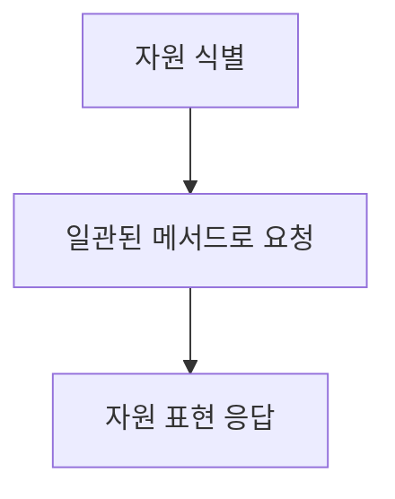
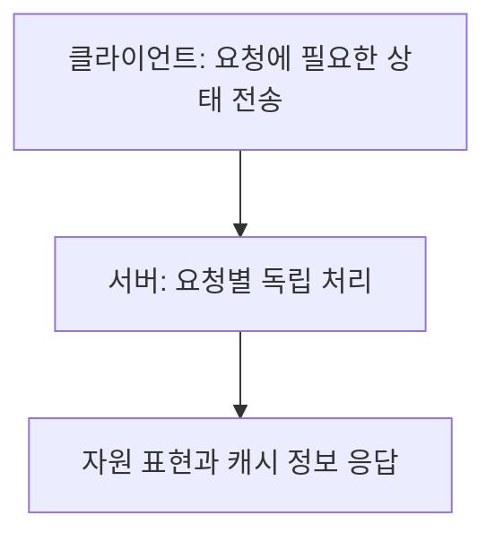
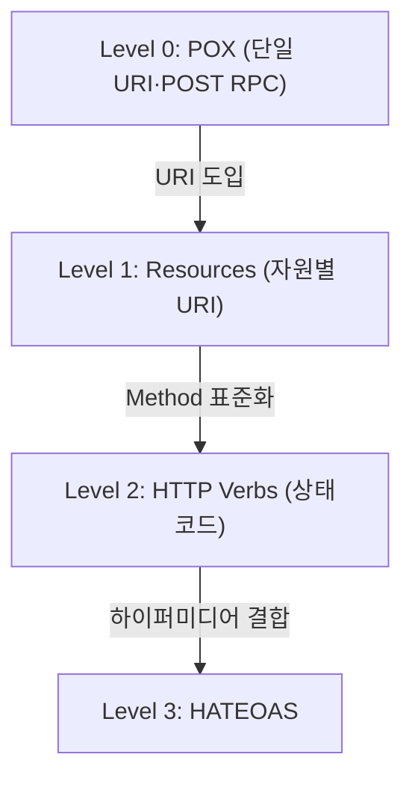

## 지식 로드맵 내 현재 위치

지식 위치: 소프트웨어 공학 → 구현·객체지향·API → **REST**

## 30초 인출

- 본질: **REST(Representational State Transfer)**는 웹(Web)의 기존 HTTP 인프라와 표준을 그대로 활용하여 자원(Resource) 중심의 상태 전송을 정의하는 분산 하이퍼미디어 아키텍처 스타일
- 메커니즘: **자원(URI)** + **행위(HTTP Method)** + **표현(Representation, JSON/XML)** + **무상태(Stateless)**
- 효과: 시스템 간 느슨한 결합(Loose Coupling) · 높은 확장성(Scalability) · 플랫폼 독립적 연계

핵심 용어

- **REST(Representational State Transfer)**: Roy Fielding이 제안한 웹 아키텍처의 장점을 극대화하기 위한 네트워크 기반 소프트웨어 아키텍처 스타일
- **Stateless(무상태성)**: 각 요청은 서버에 이전 요청의 컨텍스트를 저장하지 않고 독립적으로 처리되어야 한다는 제약
- **Uniform Interface**: 자원 식별, 표현을 통한 자원 조작, 자기기술적 메시지, HATEOAS의 4대 인터페이스 규칙
- **HATEOAS(Hypermedia As The Engine Of Application State)**: 응답 본문에 다음 가능한 상태 전이를 위한 하이퍼링크를 포함하는 원칙
- **Idempotency(멱등성)**: 동일한 요청을 반복해도 서버에 의도한 효과가 한 번 수행한 것과 같은 성질(GET, PUT, DELETE 등)

---

## 1교시 예상문제 (10점)

> REST의 개념과 주요 제약조건, HTTP 메서드의 멱등성을 설명하시오. (예상)

---

## 1교시 10점 답안

### 1. 정의·목적

- 정의: **REST(Representational State Transfer)**는 자원·표현과 일관된 인터페이스 등을 제약으로 삼는 분산 시스템 아키텍처 스타일
- 목적: 구성요소의 독립성과 캐시·계층을 통한 확장성을 높임

### 2. 핵심 3대 구성요소

### 3. 핵심 통제

- **멱등성(Idempotency)**: GET·PUT·DELETE는 반복 요청의 의도한 효과가 같음
- **Stateless**: 요청 처리에 필요한 상태를 요청 자체에 담아 서버가 이전 요청의 세션 상태에 의존하지 않음

제언: 중복 작업이 위험한 POST 처리에는 요청 식별과 중복 방지 절차를 둔다.
---

## 2~4교시 예상문제 (25점)

> Roy Fielding이 제안한 REST(Representational State Transfer) 아키텍처 스타일의 개념과 6대 제약조건을 설명하고, HTTP Method의 멱등성(Idempotency) 및 리차드슨 성숙도 모델(Richardson Maturity Model) 4단계를 제시하시오. (25점)

> (25점, 예상)

---

## 2~4교시 25점 답안

### Ⅰ. 웹 표준 기반 분산 인터페이스, REST의 개요

> REST는 자원과 표현을 일관된 인터페이스로 다루는 분산 시스템 아키텍처 스타일이다.

| 구분 | 핵심 |
|---|---|
| 정의 | 자원 식별·표현·표준 메서드와 무상태성 등 제약을 조합한 아키텍처 스타일 |
| 목적 | 클라이언트·서버의 독립성과 중간 계층·캐시를 통한 확장성 확보 |

### Ⅱ. REST 아키텍처 스타일의 6대 기본 제약조건

> REST는 다섯 가지 필수 제약과 한 가지 선택적 제약(Code on Demand)으로 설명한다.

| 제약조건 | 요구 내용 |
|---|---|
| **1. Client-Server (클라이언트-서버 분리)** | UI/사용자 관심사와 데이터 저장 관심사를 엄격히 분리하여 독립적 진화 |
| **2. Stateless (무상태성)** | 클라이언트의 세션 상태를 서버에 저장하지 않음 · 모든 요청은 완전한 정보를 포함 |
| **3. Cacheable (캐시 가능성)** | 모든 HTTP 응답은 캐시 가능 여부를 명시 · 대역폭 절감 및 성능 향상 |
| **4. Uniform Interface (일관된 인터페이스)** | 자원 식별, 표현 조작, 자기서술적 메시지, HATEOAS |
| **5. Layered System (계층화 시스템)** | 프록시, 게이트웨이, 방화벽 등 중간 매개체를 자유롭게 배치 가능 |
| **6. Code on Demand (선택적)** | 자바스크립트 등 실행 코드를 클라이언트에 전송하여 기능 확장 |

### REST 아키텍처 상호작용 및 무상태(Stateless) 메커니즘

### Ⅲ. HTTP Method의 안전성(Safety)과 멱등성(Idempotency)

> 멱등성은 같은 요청을 반복해도 서버에 의도한 효과가 한 번 수행한 것과 같다는 뜻이다.

| HTTP Method | 주 목적 및 행위 | 안전성 (Safe) | 멱등성 (Idempotent) | 캐시 가능 (Cacheable) |
|---|---|---|---|---|
| **GET** | 자원 표현 조회 | **O** (의도한 상태 변경 없음) | **O** (의도한 효과 동일) | 조건에 따라 가능 |
| **POST** | 대상 자원이 정한 처리 수행 | X | 기본적으로 보장되지 않음 | 조건에 따라 가능 |
| **PUT** | 자원의 전체 교체(치환) | X | **O** (여러 번 해도 동일 상태) | X |
| **PATCH** | 자원 부분 수정 | X | 요청 내용에 따라 다름 | 제한적으로 가능 |
| **DELETE** | 자원 삭제 | X | **O** (이미 삭제된 상태 유지) | X |

### Ⅳ. REST 적용 문제점·대응책

> REST 도입 수준을 4단계로 정의하여 점진적 RESTful API 진화를 안내한다.

### 1. 리차드슨 성숙도 모델(Richardson Maturity Model, RMM)

### 2. REST API 설계 실무 위험 및 대응 통제

| 위험 | 대책 | 효과 |
|---|---|---|
| 비표준 URI 및 동사 남용 | 복수형 명사 기반 자원 URI 및 HTTP 표준 Method 매핑 | 직관적 API 규격 확립 및 가독성 향상 |
| 재시도 시 중복 결제·데이터 생성 | 중복 요청을 식별하는 키와 서버 측 처리 결과 저장 | 동일 작업의 중복 수행 방지 |
| 제각각의 에러 응답 포맷 | RFC 9457 Problem Details 등 일관된 오류 표현 적용 | 클라이언트 오류 처리 단순화 |

### Ⅴ. 중복 요청과 오류 표현에 대한 제언

> 자원·메서드·응답의 의미를 API 계약에 명확히 적고, 중복 요청과 오류 응답을 일관되게 처리한다.

| 문제 | 해결 방안 |
|---|---|
| POST 재시도로 동일 작업이 중복 실행됨 | 작업 식별 키와 처리 결과 기록으로 중복 요청을 판별 |
| URI·상태코드·오류 표현이 제각각임 | 자원별 메서드와 응답 계약을 정의하고 RFC 9457 형식 등으로 오류를 통일 |
---

## 출제 이력과 검증 출처

- 제133회 정보관리기술사 1교시: RESTful 웹 서비스와 HATEOAS
- 제134회 정보관리기술사 2교시: REST의 제약조건과 SOAP과의 비교
- Roy Thomas Fielding, Architectural Styles and the Design of Network-based Software Architectures (Doctoral dissertation)
- [RFC 9110 — HTTP Semantics](https://www.rfc-editor.org/rfc/rfc9110.html)
- [RFC 9457 — Problem Details for HTTP APIs](https://www.rfc-editor.org/rfc/rfc9457.html)

## 연결 토픽

- 이전 토픽: [ATAM](./014_atam.md)
- 연관 토픽: [SOAP](./037_soap.md), [Open API](./022_open_api.md)
- 다음 토픽: [기술 부채](./016_technical_debt.md)
