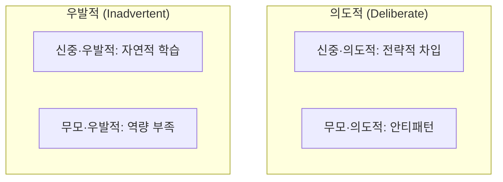
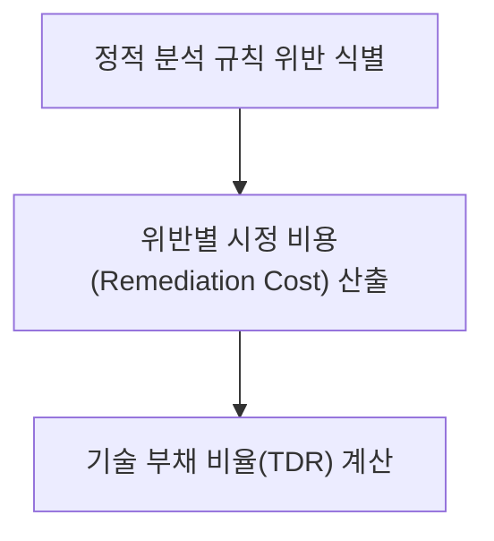

## 지식 로드맵 내 현재 위치

지식 위치: 소프트웨어 공학 → 유지보수·형상관리 → **기술 부채(불명확한 요구사항과 품질 저하)**

## 30초 인출

- 본질: **기술 부채(Technical Debt)**는 단기적 출시 속도를 위해 채택한 임시방편적 설계·코딩이 장기적으로 이자(유지보수 비용 폭증, 개발 생산성 급감)를 발생시키는 현상
- 메커니즘: 불명확한 요구사항 / 무리한 일정 압박 → 아키텍처 타협 및 품질 부채 차입 → 복잡도 누적 → 시스템 경직
- 효과: SQALE 기반 기술 부채 측정 · 정기적 리팩토링 및 아키텍처 리팩토링으로 부채 상환

핵심 용어

- **Technical Debt(기술 부채)**: Ward Cunningham이 도입한 개념으로, 완벽한 설계 대신 빠른 배포를 위해 타협한 공학적 결함의 누적
- **Debt Principal(부채 원금)**: 향후 올바른 구조로 재작성하는 데 소요되는 직접적인 리팩토링 공수
- **Debt Interest(부채 이자)**: 부채를 방치함으로써 매 스프린트마다 발생하는 추가적인 결함 수정 및 생산성 저하 비용
- **SQALE(Software Quality Assessment based on Lifecycle Expectations)**: 소스코드 분석을 통해 기술 부채를 시간/비용으로 정량화하는 평가 모델
- **Technical Bankruptcy(기술적 파산)**: 부채 이자가 개발팀의 전체 개발 용량을 초과하여 신규 기능 개발이 완전히 마비된 상태

---

## 1교시 예상문제 (10점)

> 기술 부채(불명확한 요구사항과 품질 저하)의 정의와 목적, 핵심 구조와 작동 원리를 설명하시오. (예상)
---

## 1교시 10점 답안

### 1. 정의·목적

- 정의: **기술 부채(Technical Debt)**는 단기적 출시를 위해 타협한 임시방편적 코딩이 미래에 유지보수 비용과 생산성 저하라는 이자를 발생시키는 현상
- 목적: 부채 원금과 이자를 정량화하여 의도적 차입과 체계적 상환을 통제

### 2. 기술 부채 사분면 (Martin Fowler)

### 3. 핵심 통제

- **SQALE 정량화**: 소스코드 결함을 복구 소요 시간 및 TDR 비율로 환산
- **20% 예산 할당**: 매 스프린트 일정의 20%를 부채 상환에 공식 배정
---

## 2~4교시 예상문제 (25점)

> 소프트웨어 공학에서 기술 부채(Technical Debt)의 정의 및 발생 원인을 마틴 파울러의 기술 부채 사분면(Quadrant)을 기반으로 설명하고, 불명확한 요구사항이 품질 저하로 이어지는 인과관계와 기술 부채를 정량 측정하고 상환하기 위한 거버넌스 방안을 제시하시오. (25점)

> (25점, 예상)
---

## 2~4교시 25점 답안

### Ⅰ. 단기 속도와 장기 품질의 트레이드오프, 기술 부채의 개요

> 기술 부채는 금융 부채와 같아서, 제어된 상태에서의 차입은 전략적 이점이 될 수 있으나 방치하면 시스템을 파산으로 몰고 간다.

- 정의: 현재 더 나은 설계를 채택하는 대신 쉬운 방법을 선택함으로써 발생하는 소프트웨어 공학적 지연 비용의 총합
- 목적: 단기적 시장 선점(Time-to-Market)을 위한 의도적 차입 전략 수립 및 체계적 상환 관리를 통한 시스템 수명 연장

### Ⅱ. 마틴 파울러의 기술 부채 사분면과 발생 원인

> 기술 부채는 의도성(Deliberate vs Inadvertent)과 신중함(Prudent vs Reckless)의 두 축으로 분류된다.

### 마틴 파울러의 기술 부채 사분면(Technical Debt Quadrant)

### 불명확한 요구사항이 품질 저하로 이어지는 인과관계
1. **요구사항 모호성**: 비즈니스 요구사항이 명확하지 않아 도메인 모델링 실패
2. **잦은 요구 변경**: 개발 도중 땜질식 조건문(`if-else`) 누적, 스파게티 코드 양산
3. **아키텍처 부패**: 관심사 분리가 무너지고 모듈 간 결합도(Coupling) 급증
4. **품질 저하 및 파산**: 사소한 수정이 엉뚱한 결함(Side-effect)을 유발하며 생산성 급락

### Ⅲ. 기술 부채의 정량적 측정: SQALE 모델

> 기술 부채를 비즈니스 이해관계자에게 설득하기 위해서는 기술적 결함을 '시간 및 금액'으로 환산해야 한다.

- 산식: `TDR = (총 시정 비용 ÷ 시스템 신규 재구축 비용) × 100%`

| TDR 등급 | SQALE 비율 기준선 | 시스템 상태 판정 |
|---|---|---|
| **A 등급** | TDR ≤ 5% | 극히 건전한 상태, 신규 기능 개발 최적 |
| **B 등급** | 6% ≤ TDR ≤ 10% | 양호하나 일부 리팩토링 필요 |
| **C 등급** | 11% ≤ TDR ≤ 20% | 주의 상태, 이자 부담이 개발 속도를 갉아먹음 |
| **D/E 등급** | TDR > 20% | **기술적 파산 위험**, 신규 개발 중단 및 대대적 부채 상환 필수 |

### Ⅳ. 기술 부채 관리 문제점·대응책

> 부채 상환을 개발자 개인의 양심에 맡기면 안 되며, 스프린트 계획과 아키텍처 관리에 공식 할당해야 한다.

### 1. 기술 부채 거버넌스 프레임워크

| 관리 프레임워크 | 구체적 실천 방안 |
|---|---|
| **20% 룰 (Debt Budget)** | 매 스프린트 스토리 포인트의 20%를 기술 부채 상환(리팩토링)에 강제 배정 |
| **Boy Scout Rule** | "캠핑장을 떠날 때는 처음 왔을 때보다 깨끗하게" 일상적 코드 개선 |
| **품질 게이트 (Quality Gate)** | 신규 코드에 대해 신규 기술 부채 허용치 0% 유지 (새 부채는 유입 차단) |
| **Architecture Runway** | 향후 기능 요구사항을 수용할 수 있는 아키텍처 여유분을 사전에 구축 |

### 2. 기술 부채 누적 위험 및 대응 통제

| 위험 | 대책 | 효과 |
|---|---|---|
| 부채 상환 일정 미확보 및 기능 개발 우선시 | 스프린트 내 20% Debt Budget 공식 배정 및 백로그 등록 | 부채 누적으로 인한 생산성 고갈 방지 |
| 신규 코드의 부채 유입 방치 | CI/CD 파이프라인 내 SonarQube Quality Gate 통과 의무화 | 신규 부채 유입 원천 차단 (TDR ≤ 5%) |
| 모호한 요구사항으로 인한 임시 땜질 코딩 | RTM(요구사항 추적표) 및 명확한 DoD(완료의 정의) 수립 | 설계 결함 사전 예방 및 아키텍처 부패 차단 |

### Ⅴ. 지속 가능한 상환 중심의 결론

> 기술 부채는 기술 문제가 아니라 경영진과 소통해야 할 비즈니스 리스크이다.

### 학습자 통찰 메모 — 답안 밖

- [핵심 통찰]: 경영진은 '코드스멜'에는 관심이 없지만 '출시 리드타임 2배 증가'와 '유지보수 인건비 30% 증가'에는 민감함. 기술 부채를 소스코드 수준의 불평으로 표현하지 말고, SQALE 지표를 활용해 "지금 부채를 갚지 않으면 다음 분기 기능 개발 속도가 절반으로 떨어집니다"라는 재무적 언어로 환산해 보고해야 함.
- 나라면: 요구사항 분석 단계에서 요구사항 추적표(RTM)와 인수 기준(DoD: Definition of Done)을 엄격히 수립하여 불명확한 요구사항에 의한 땜질식 코딩을 사전 차단하고, 매 릴리스마다 기술 부채 지수 추이를 대시보드로 공개하겠음.

### 실전 답안용 기술사적 제언

- **판정 기준**: SQALE 모델 기반 기술 부채 비율(TDR) 5% 초과 여부 및 스프린트당 결함 수정 공수 증가율 판정
- **대응 방안**: 스프린트 계획 시 **20% 부채 예산(Debt Budget)** 공식 배정 및 SonarQube Quality Gate 통과 의무화
- **검증 체계**: CI 파이프라인 내 신규 기술 부채 유입 0건 통제 및 릴리스별 TDR 지수 추이 경영진 대시보드 공표
- **기대 효과**: 아키텍처 부패 및 기술적 파산 원천 방지, 개발 생산성 30% 향상 및 엔터프라이즈 소프트웨어 자산 수명 극대화
---

## 출제 이력과 검증 출처

- 제135회 정보관리기술사 1교시: 기술 부채(Technical Debt)의 개념 및 관리 방안
- 제139회 정보관리기술사 2교시: 불명확한 요구사항으로 인한 기술 부채 누적과 해결 전략
- Ward Cunningham, The WyCash Portfolio Management System (OOPSLA '92 Experience Report)
- Martin Fowler, Technical Debt Quadrant

## 연결 토픽

- 이전 토픽: [REST](./015_rest.md)
- 연관 토픽: [리팩토링](./006_refactoring.md), [요구공학](./040_requirements_engineering.md)
- 다음 토픽: [오픈소스 라이선스](./018_open_source_license.md)
