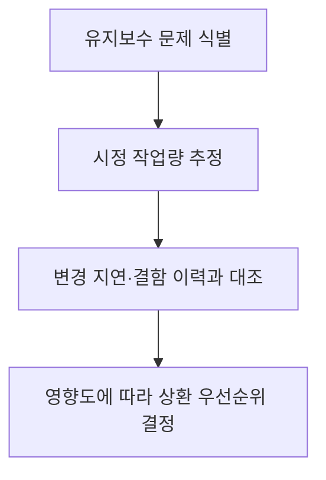

## 지식 로드맵 내 현재 위치

지식 위치: 소프트웨어 공학 → 유지보수·형상관리 → **기술 부채(불명확한 요구사항과 품질 저하)**

## 30초 인출

- 본질: **기술 부채(Technical Debt)**는 현재의 설계 타협이나 뒤늦게 드러난 설계 문제로 향후 변경 비용이 늘어나는 현상이다.
- 메커니즘: 설계 타협·학습 부족·모호한 요구 → 변경 때마다 추가 비용 발생 → 영향과 상환 우선순위 판단

핵심 용어

- **Technical Debt(기술 부채)**: 설계 결정을 고치거나 보완할 때 드는 비용이 향후 변경을 어렵게 하는 상태를 설명하는 비유
- **Debt Principal(부채 원금)**: 향후 올바른 구조로 재작성하는 데 소요되는 직접적인 리팩토링 공수
- **Debt Interest(부채 이자)**: 부채를 방치함으로써 매 스프린트마다 발생하는 추가적인 결함 수정 및 생산성 저하 비용
- **SQALE(Software Quality Assessment based on Lifecycle Expectations)**: 소스코드 분석을 통해 기술 부채를 시간/비용으로 정량화하는 평가 모델
- **기술 부채 비율(TDR)**: 분석 도구가 추정한 시정 비용을 해당 도구의 개발 비용 추정치와 비교한 지표

---

## 1교시 예상문제 (10점)

> 기술 부채의 의미와 의도적·우발적 발생 유형, 관리 방안을 설명하시오. (예상)
---

## 1교시 10점 답안

### 1. 정의·목적

- 정의: **기술 부채(Technical Debt)**는 현재 설계의 한계 때문에 이후 변경에서 추가 비용이 생기는 상태를 설명하는 비유다.
- 목적: 변경을 어렵게 하는 원인을 드러내고 상환 시점과 우선순위를 정한다.

### 2. 기술 부채 사분면 (Martin Fowler)

| 발생 | 신중한 선택 | 무모한 선택 |
|---|---|---|
| 의도적 | 출시 이익과 상환 비용을 비교해 타협 | 나중에 고치겠다며 품질을 희생 |
| 우발적 | 개발 과정에서 더 나은 설계를 뒤늦게 발견 | 설계 원칙을 몰라 복잡도 누적 |

### 3. 핵심 통제

- **측정**: 정적 분석의 시정 비용 추정과 실제 변경 지연·결함 이력을 함께 확인
- **상환**: 영향이 큰 부채를 백로그에 넣고 기능 개발 일정과 함께 우선순위를 정함

제언: 변경 지연이나 반복 결함을 일으키는 부채부터 검증 가능한 단위로 상환한다.
---

## 2~4교시 예상문제 (25점)

> 소프트웨어 공학에서 기술 부채(Technical Debt)의 정의 및 발생 원인을 마틴 파울러의 기술 부채 사분면(Quadrant)을 기반으로 설명하고, 불명확한 요구사항이 품질 저하로 이어지는 인과관계와 기술 부채를 정량 측정하고 상환하기 위한 거버넌스 방안을 제시하시오. (25점)

> (25점, 예상)
---

## 2~4교시 25점 답안

### Ⅰ. 단기 속도와 장기 품질의 트레이드오프, 기술 부채의 개요

> 기술 부채는 현재의 설계가 이후 기능 추가·수정에 추가 비용을 낳는 상태를 설명하는 비유다.

| 구분 | 핵심 |
|---|---|
| 발생 | 의도적 타협뿐 아니라 개발 과정에서 더 나은 설계를 뒤늦게 발견한 경우도 포함 |
| 관리 | 변경 비용과 영향 범위를 확인해 유지·상환·재설계 중 선택 |

### Ⅱ. 마틴 파울러의 기술 부채 사분면과 발생 원인

> 기술 부채는 의도성(Deliberate vs Inadvertent)과 신중함(Prudent vs Reckless)의 두 축으로 분류된다.

### 마틴 파울러의 기술 부채 사분면(Technical Debt Quadrant)

| 발생 | 신중한 선택 | 무모한 선택 |
|---|---|---|
| 의도적 | 출시 이익과 상환 비용을 비교해 타협 | 상환 계획 없이 품질 희생 |
| 우발적 | 학습을 통해 더 나은 설계 발견 | 설계 원칙 부족으로 복잡도 누적 |

### 불명확한 요구사항이 품질 저하로 이어지는 인과관계
모호한 요구를 확인하지 않은 채 구현하면 수정 때 설계 가정을 반복해서 바꿔야 한다. 변경 이력과 반복 결함을 살펴 그 영향이 실제로 누적되는지 확인한다.

### Ⅲ. 기술 부채의 측정과 해석

> 정적 분석의 시정 비용 추정은 우선순위를 정하는 자료이며 실제 변경 비용과 함께 해석해야 한다.

- SonarQube의 기술 부채 비율은 `시정 비용 ÷ 추정 개발 비용`으로 계산한다. 도구 설정에 따른 추정치이므로 시스템의 파산 여부나 일정 지연을 직접 증명하지 않는다.

| 측정 대상 | 해석 |
|---|---|
| 정적 분석의 시정 비용·비율 | 도구 규칙으로 포착된 유지보수 문제의 추정 작업량 |
| 변경 리드타임·반복 결함 | 부채가 실제 작업에 미치는 영향 확인 |
| 모듈별 변경 빈도·중요도 | 자주 바뀌는 핵심 영역부터 상환 우선순위 부여 |

### Ⅳ. 기술 부채 관리 문제점·대응책

> 부채를 백로그에서 관리하고, 변경 영향과 상환 비용을 기능 개발 계획과 함께 비교한다.

### 1. 기술 부채 거버넌스 프레임워크

| 관리 프레임워크 | 구체적 실천 방안 |
|---|---|
| **부채 백로그** | 위치·원인·변경 영향·상환 작업을 기록하고 우선순위 부여 |
| **작은 구조 개선** | 기능 변경 때 관련 코드스멜을 테스트와 함께 점진적으로 개선 |
| **품질 검사** | 신규 변경의 문제를 정적 분석·코드 리뷰·테스트로 확인 |
| **설계 검토** | 반복 결함이나 변경 지연이 큰 영역의 구조를 재평가 |

### 2. 기술 부채 누적 위험 및 대응 통제

| 위험 | 대책 | 효과 |
|---|---|---|
| 상환 작업이 계속 밀림 | 부채를 백로그에 등록하고 영향·비용을 기능 일정과 함께 검토 | 중요한 영역의 상환 시점 결정 |
| 신규 변경으로 복잡도 증가 | 정적 분석 결과와 리뷰·테스트를 함께 확인 | 새 결함·유지보수 문제 발견 |
| 모호한 요구사항을 임시 처리 | 수락기준과 설계 가정을 확인하고 변경 시 함께 갱신 | 같은 영역의 반복 수정 감소 |

### Ⅴ. 변경 영향에 따른 상환 제언

> 정적 분석의 추정치와 실제 변경 지연을 함께 보고 상환 범위를 정한다.

| 문제 | 해결 방안 |
|---|---|
| 복잡한 핵심 모듈의 변경마다 결함이 반복됨 | 변경 빈도와 결함 이력으로 영향 범위를 확인하고 테스트를 확보한 뒤 단계적으로 구조 개선 |
| 도구의 기술 부채 비율만으로 상환 순서를 정함 | 업무 중요도·변경 빈도·시정 비용을 함께 비교해 백로그 우선순위 결정 |
---

## 출제 이력과 검증 출처

- 제135회 정보관리기술사 1교시: 기술 부채(Technical Debt)의 개념 및 관리 방안
- 제139회 정보관리기술사 2교시: 불명확한 요구사항으로 인한 기술 부채 누적과 해결 전략
- Ward Cunningham, The WyCash Portfolio Management System (OOPSLA '92 Experience Report)
- [Martin Fowler, Technical Debt Quadrant](https://martinfowler.com/bliki/TechnicalDebtQuadrant.html)
- [SonarQube, Understanding measures and metrics](https://docs.sonarsource.com/sonarqube-server/2026.1/user-guide/code-metrics/metrics-definition/)

## 연결 토픽

- 이전 토픽: [REST](./015_rest.md)
- 연관 토픽: [리팩토링](./006_refactoring.md), [요구공학](./040_requirements_engineering.md)
- 다음 토픽: [오픈소스 라이선스](./018_open_source_license.md)
