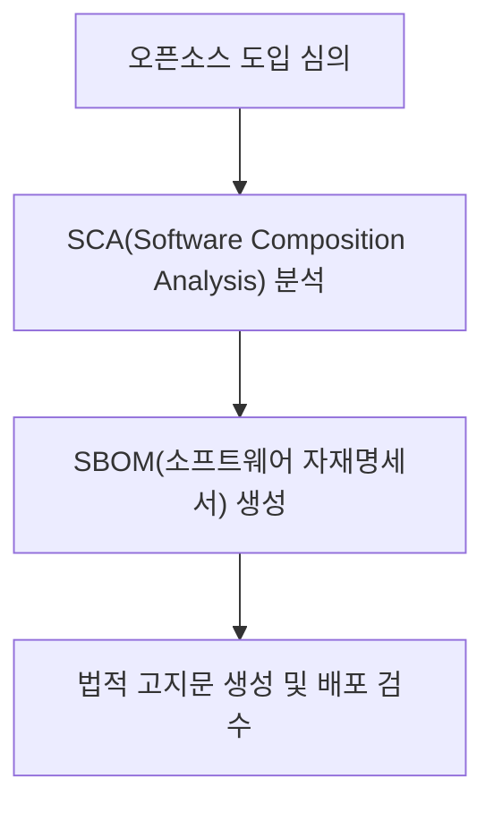

## 지식 로드맵 내 현재 위치

지식 위치: 소프트웨어 공학 → 공공 SW·거버넌스 → **오픈소스 라이선스**

## 30초 인출

- 본질: **오픈소스 라이선스(OSS License)**는 오픈소스 소프트웨어의 사용, 복제, 수정, 재배포 시 준수해야 하는 법적 권리와 의무(저작권 고지, 소스코드 공개 등)를 규정한 계약
- 메커니즘: **Permissive**(최소 조건) · **Copyleft**(동일 조건 제공) · **Source-Available**(용도 제한 가능)을 구분
- 효과: 라이선스 위반 소송 방지 · 기업 지식재산권(IP) 보호 · **SBOM** 기반 컴플라이언스 체계 확립

핵심 용어

- **Open Source License**: 저작권자가 소프트웨어 소스코드를 무상 공개하며 사용자에게 부과하는 법적 라이선스 규약
- **Permissive License(허용적 라이선스)**: 소스코드 공개 의무가 없으며, 저작권 및 라이선스 고지만 유지하면 상용 독점 소프트웨어에 자유롭게 결합 가능한 라이선스 (MIT, Apache 2.0)
- **Copyleft(카피레프트)**: 지식재산권을 공유하기 위해 이를 수정한 2차적 저작물도 동일한 라이선스로 소스코드를 공개하도록 강제하는 원칙 (GPL)
- **AGPL(Affero GPL)**: 배포(Distribution)되지 않고 네트워크 서버(SaaS) 형태로만 서비스되는 경우에도 소스코드 공개 의무를 강제하는 라이선스
- **SSPL / BSL**: 소스는 열람할 수 있으나 용도 제한이 있어 Open Source Initiative(OSI) 승인 오픈소스와 구분되는 라이선스

---

## 1교시 예상문제 (10점)

> 오픈소스 라이선스(Permissive·Copyleft)와 Source-Available 라이선스의 정의와 목적, 핵심 구조와 작동 원리를 설명하시오. (예상)

---

## 1교시 10점 답안

### Ⅰ. 정의·목적

- 정의: **오픈소스 라이선스**는 소스코드 사용, 수정, 배포 시 준수해야 할 저작권 고지 및 소스코드 공개 의무를 규정한 법적 계약
- 목적: 지식재산권 보호, 라이선스 전염 방지, 안전한 상용 소프트웨어 개발

### Ⅱ. 라이선스 조건 확인

### Ⅲ. 핵심 통제

- **SBOM 관리**: SPDX/CycloneDX 기반 오픈소스 자재명세서 작성
- **SCA 자동화**: 구성요소와 라이선스를 식별하고, 조직의 검토 정책에 따라 담당자 확인을 요청
---

## 2~4교시 예상문제 (25점)

> 오픈소스 소프트웨어(OSS) 라이선스의 개념과 법적 효력을 설명하고, 허용적(Permissive) 라이선스와 카피레프트(Copyleft) 라이선스의 특징 비교, AGPL 및 최신 클라우드 대응 라이선스(SSPL, BSL)의 등장 배경과 기업의 오픈소스 컴플라이언스(SBOM) 거버넌스 방안을 제시하시오. (25점)

> (25점, 예상)

---

## 2~4교시 25점 답안

### Ⅰ. 소프트웨어 자산 보호와 준법의 핵심, 오픈소스 라이선스의 개요

> 오픈소스는 "공짜 소프트웨어"가 아니며, 라이선스 조건을 위반하면 저작권 침해로 소스코드 강제 공개와 판매 금지 소송에 직면한다.

- 정의: 오픈소스 소프트웨어 개발자가 이용자에게 소스코드의 사용, 수정, 배포 권한을 부여하면서 일정한 의무사항을 준수하도록 규정한 법적 계약
- 목적: 소프트웨어 공유 생태계 발전, 지식재산권(IP) 보호, 기업 상용화 시 라이선스 충돌 및 **독점 코드 강제 공개 리스크** 방어

### Ⅱ. 오픈소스 라이선스 유형별 의무 범위 비교

> 의무 범위는 라이선스 원문·결합 방식·배포 형태에 따라 달라지므로 개별 조건을 판정해야 한다.

### 오픈소스 라이선스 스펙트럼 및 의무 강도 비교

| 라이선스 계열 | 대표 라이선스 | 소스코드 공개 의무 범위 | 특허 조항 | 상용 소프트웨어 결합 위험도 |
|---|---|---|---|---|
| **Permissive** | MIT, BSD, Apache 2.0 | **공개 의무 없음** (고지만 유지) | Apache 2.0(특허권 명시) | **극히 낮음** (기업 친화적) |
| **Weak Copyleft** | LGPL 2.1/3.0, MPL | 적용 대상 구성요소·수정·결합 방식에 따라 조건 확인 | 버전별 조항 확인 | 결합 방식과 배포 계획에 따라 검토 |
| **Strong Copyleft** | GPL 2.0/3.0 | 배포하는 적용 대상 저작물에 대한 해당 버전의 라이선스·대응 소스 조건 확인 | GPL 3.0(특허 조항 포함) | 결합 방식과 배포 계획에 따라 검토 |
| **Network Copyleft**| AGPL 3.0 | 수정 프로그램과 원격 상호작용하는 이용자에 대한 제13조 조건 확인 | AGPL 3.0(특허 조항 포함) | 서비스·수정 범위와 라이선스 원문 검토 |

### Ⅲ. 오픈소스와 구분할 Source-Available 라이선스: SSPL·BSL

> 일부 저작권자는 클라우드 서비스 제공 조건을 두기 위해 OSI 오픈소스 라이선스와 다른 Source-Available 라이선스를 사용한다.

### 1. 등장 배경
- 일부 저작권자는 기존 오픈소스 라이선스 대신 클라우드 서비스 제공에 별도 조건을 두는 라이선스를 채택
- Source-Available 라이선스는 소스 열람을 허용하더라도 사용 분야 등 제한을 둘 수 있어 오픈소스 라이선스와 구분

### 2. SSPL vs BSL 비교

| 구분 | SSPL (Server Side Public License) | BSL (Business Source License) |
|---|---|---|
| **확인 항목** | SSPL | BSL |
| **주요 조건** | 네트워크 서비스 제공 시 적용되는 소스 제공 조건을 해당 버전의 라이선스 원문에서 확인 | 허용된 추가 권한, 제한 사항, 변경 라이선스와 전환일을 해당 버전의 고지에서 확인 |
| **분류** | OSI 오픈소스 라이선스 목록에 포함되지 않음 | 사용 제한이 있는 Source-Available 형태로, OSI 오픈소스 정의와 구분해 검토 |
| **도입 전 검토** | 서비스 구성과 제공 방식이 의무 범위에 드는지 검토 | 계획한 사용이 허용 범위·기간·전환 조건에 맞는지 검토 |

### Ⅳ. 오픈소스 컴플라이언스 문제점·대응책

> 엔터프라이즈 환경에서는 개발 전 과정에서 오픈소스 라이선스 오염을 감시하는 SBOM 기반 거버넌스가 필수적이다.

### 1. 오픈소스 컴플라이언스 절차

### 2. 오픈소스 라이선스 실무 위험 및 대응 통제

| 위험 | 대책 | 효과 |
|---|---|---|
| 구성요소의 라이선스 조건을 확인하지 않고 배포 | SCA 결과를 구성요소·버전·사용 방식과 연결해 공개 전 검토 | 해당 배포에서 이행할 조건과 고지 항목 확인 |
| 오픈소스 고지 의무 누락 | SPDX/CycloneDX 기반 SBOM 및 라이선스 고지문 자동 생성 | 저작권 침해 분쟁 및 법적 제재 예방 |
| AI 코딩 도구가 제안한 코드의 출처·조건이 불명확함 | 도구의 출처 표시 기능과 코드 검토 절차를 적용하고, 확인이 필요한 제안은 공개 전 검토 | 코드 출처와 사용 조건을 추적 가능하게 관리 |

### Ⅴ. 라이선스 원문 판정 중심의 결론

> 오픈소스 관리는 개발팀의 자율에만 맡길 수 없는 전사적 법무·보안·엔지니어링 통합 거버넌스 영역이다.

### 실전 답안용 기술사적 제언

| 문제 | 해결 방안 |
|---|---|
| 라이선스 이름만으로 배포 의무를 일괄 판정하면 결합 방식·수정 여부·배포 형태를 놓칠 수 있음 | 제언: 공개 전 구성요소별 라이선스 원문과 사용·수정·배포 방식을 함께 검토하고, 적용 의무·고지·소스 제공 여부를 SBOM 및 릴리스 자료에 연결한다. |
---

## 출제 이력과 검증 출처

- 제134회 정보관리기술사 1교시: 오픈소스 라이선스(GPL, LGPL, Apache, MIT) 비교
- 제140회 정보관리기술사 2교시: 오픈소스 컴플라이언스 체계와 SBOM 및 AI 생성코드 라이선스 이슈
- Open Source Initiative (OSI), The Open Source Definition
- Free Software Foundation, [Frequently Asked Questions about the GNU Licenses](https://www.gnu.org/licenses/gpl-faq.en.html): 결합·배포 방식에 따라 GPL 조건을 판정해야 함을 확인.

## 연결 토픽

- 이전 토픽: [기술 부채](./016_technical_debt.md)
- 연관 토픽: [오픈소스 거버넌스](./112_open_source.md), [형상관리](./011_configuration_management.md)
- 다음 토픽: [UML 다이어그램 체계](./020_uml_diagrams.md)
